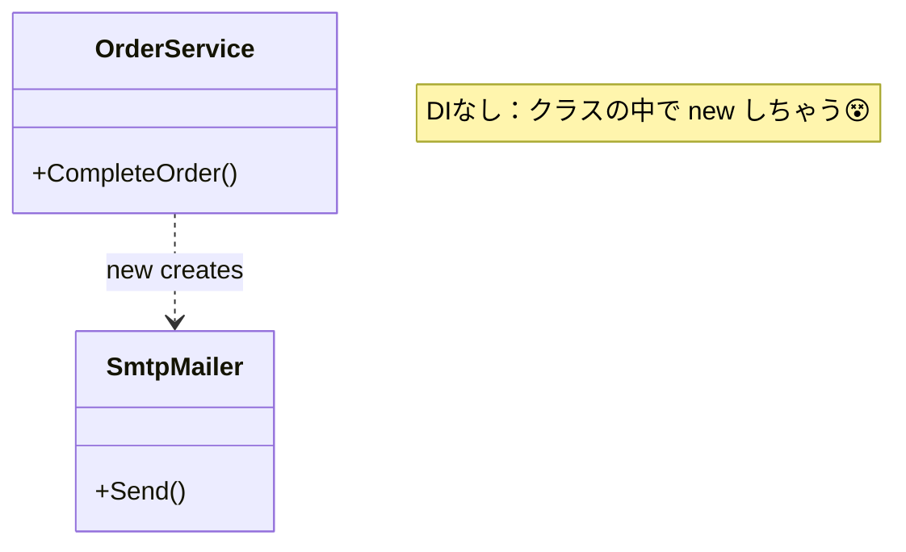
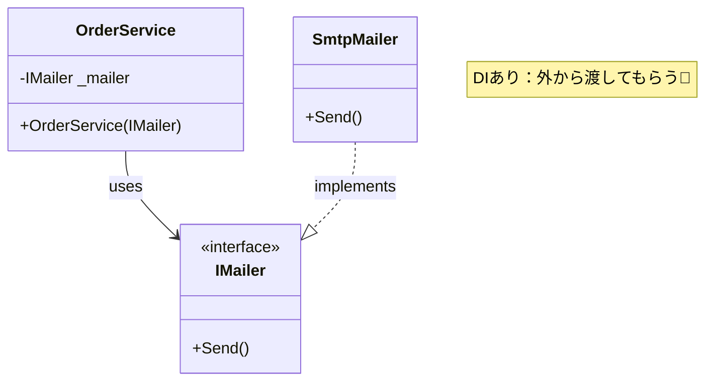

# 第01章：はじめに：DIって結局なにが嬉しいの？🌈

この章は「DI／IoCって言葉がこわい😵‍💫」を、**“ごほうびが分かる状態”**に変えるのがゴールだよ〜😊🍀
（ちなみに今どきのC#は、.NET 10系＋C# 14が中心で進んでるよ🆕✨ ([Microsoft][1])）

---

## 1) まず結論：DIの“ごほうび”はこの3つ🎁💕

### ごほうび①：差し替えがラクになる🔁✨


「メール送信」を **Gmail→SendGrid** に変えたい、みたいな時に
コードのあちこちを掘らなくてよくなるよ🧹✨

### ごほうび②：テストが一気にラクになる🧪💖


外部（DB・Web・メール）に触れずに、**動作チェックできる**ようになるよ😊
「本番っぽいものに触らないで試せる」って安心感すごい💕

### ごほうび③：変更が“怖くない”設計になる🛡️✨


「変更したら別の場所が壊れた…😱」が減る！
なぜなら、部品がゆるくつながってる（＝絡まりにくい）から🍝➡️🧩✨

---

## 2) DI／IoCを“日常のたとえ”でつかむ🍩🔌

### たとえ：スマホの充電器📱⚡


* **DIなし**：スマホ本体に「充電器が固定で内蔵」されてるイメージ
  → 充電器が壊れたらスマホごと修理…つらい😭
* **DIあり**：スマホは「USB-Cの差し口」だけ持ってて、
  充電器（部品）は**外から挿す**
  → 壊れたら充電器だけ交換でOK😊🔁

この「外から渡す（差し替える）」感じがDIの気持ちよさだよ〜💉✨

---

## 3) DIとIoC、超やさしく言うとこう🌀💡

### DI（依存性注入）💉

**「必要な部品を、外から渡す」**こと。

### IoC（制御の反転）🌀

**「部品を自分で取りに行く」のをやめて、外側が用意する**こと。
（主導権が “中”→“外” に移る感じ！）

.NETでも「DIはフレームワークに組み込みで用意されてる」って説明されてるよ🧰✨ ([Microsoft Learn][2])

---

## 4) “DIがないと何がつらい？”を1分で体感😵➡️😊

たとえば「注文完了メールを送る」みたいな処理があるとして…

### ❌ DIなし：クラスの中で new しちゃうパターン


```csharp
public class OrderService
{
    public void CompleteOrder()
    {
        var mailer = new SmtpMailer(); // ← ここで固定しちゃってる😵
        mailer.Send("thanks!");
    }
}
```

この状態だと…

* メール方式を変えたい時に、**OrderServiceを直接いじる**ことになりがち😖
* テストでメール送信が走っちゃって、つらい（止めたいのに…）📮💥

---

### ✅ DIあり：外から“メール係”を渡すパターン


```csharp
public interface IMailer
{
    void Send(string message);
}

public class OrderService
{
    private readonly IMailer _mailer;

    public OrderService(IMailer mailer) // ← 外から渡してもらう💉
    {
        _mailer = mailer;
    }

    public void CompleteOrder()
    {
        _mailer.Send("thanks!");
    }
}
```

こうすると…

* 本番は `SmtpMailer` を渡す📮
* テストは `FakeMailer` を渡す🧪（送ったフリだけ）

って **自由に差し替え**できるようになるよ〜😊🔁✨





---

## 5) ミニ演習（5分）📝🌸：「差し替えたいもの」を3つ見つけよう🔎


あなたのコードやアプリを思い出して、次の中から **“差し替えたい候補”**を3つ書いてみてね😊

* 時刻（現在日時）⏰
* ログ出力🧾
* ファイル読み書き📁
* DBアクセス🗄️
* HTTP通信🌐
* メール送信📮
* 設定値（APIキーとか）🎛️

✨コツ：**外部と話すものほど、差し替えたくなる**よ！

---

## 6) AI活用（この章のおすすめ）🤖💗

コピペで使えるよ〜✨

* 「DIのメリットを中学生にも分かるように、たとえ話で説明して🥺📚」
* 「このクラスが依存しているもの（差し替え候補）を列挙して🔎」
* 「newが多くて変更が怖い。DIにする最初の一手を3つ出して💡」

---

## 7) 章末チェック✅（ここだけできたらOK！）

* DIは「外から渡す」💉って言える😊
* 差し替えできると、変更とテストがラク🧪✨ってイメージできる
* 「DI = コンテナ」じゃなくて、まずは**考え方**だと分かった🧠🌸
  （コンテナは後の章で出てくるよ。ちなみに.NETには標準の仕組みがあるよ🧰 ([Microsoft Learn][2])）

---

## 次章予告👀✨

次の第2章は、「そもそも“依存”ってなに？」をやさしく言葉にしていくよ🧩💕
ここが分かると、DIが一気にスッキリするから楽しみにしててね😊🌷

[1]: https://dotnet.microsoft.com/en-US/download/dotnet/10.0 "Download .NET 10.0 (Linux, macOS, and Windows) | .NET"
[2]: https://learn.microsoft.com/en-us/dotnet/core/extensions/dependency-injection "Dependency injection - .NET | Microsoft Learn"
