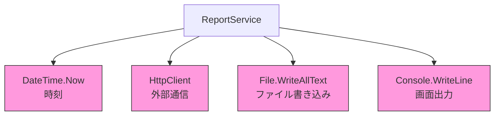

# 第02章：“依存”ってなに？まず言葉を怖くなくする🧩

### この章のゴール🎯✨

読み終わったら、こんなふうに言えるようになります👇

* 「依存って、**それがないと困る相手**のことだよね」
* コードの中から「依存っぽいもの」を**見つけて列挙**できる🔎
* 依存には「テストを難しくするやつ」がいる、って気づける🧪💦

---

## 1) まず結論：依存＝「そのクラスが頼ってる相手」🤝💡

“依存”ってむずかしそうだけど、超ざっくり言うとこれだけ👇

> **依存 = その子（クラス）が、自力だけではできなくて、誰かの力を借りてる相手**✨

Microsoftの公式ドキュメントでも「依存＝あるオブジェクトが別のオブジェクトに依存していること」って説明されています。([Microsoft Learn][1])

たとえばこんな感じ👇

* 時刻が欲しい → **時計（今の時間）に依存**⏰
* ログを出したい → **ログ出力に依存**🧾
* DBに保存したい → **DBに依存**🗄️
* APIにアクセスしたい → **HTTP通信に依存**🌐

---

## 2) “依存”って2種類あると思うとラク🍰✨

初心者さんがつまずきやすいので、ここは分けちゃおう😊

### A. 設計の話の「依存」🧩（今回の主役）

「このクラス、**何がないと仕事できない？**」っていう話。

### B. ツールの話の「依存」📦（NuGetとか）

「このプロジェクト、どのライブラリ入れてる？」っていう話。

どっちも“依存”だけど、この教材（DI/Ioc）で中心になるのは **Aのほう（設計の依存）** だよ〜😊🌸

---

## 3) 依存があると何が困るの？（まだDIの解決策は出さないよ😌）


依存が悪いわけじゃないです🙆‍♀️
ただ、**依存の置き方**でつらくなる…って感じ💦

よくある「つらさ」トップ3👇

1. **差し替えできない**（本番DBに繋がっちゃう😱）
2. **テストしにくい**（時間・乱数・通信が混ざると不安定🧪）
3. **変更が連鎖する**（AいじったらBもCも…🌀）

DIはこの「つらさ」を減らすテクニックで、.NETでも“DIはIoCを実現するための手法”として整理されています。([Microsoft Learn][2])

---

## 4) “依存っぽい匂い”を嗅ぎ分けるチェックリスト🐶🔍

コードから依存を見つけるとき、まずここを見ると早いよ✨

### よく出る依存マーカー（見つけやすいやつ）✅

* `new` してる（その場で作ってる）🧱
* `DateTime.Now` / `DateTime.UtcNow`（今の時刻）⏰
* `Guid.NewGuid()` / `Random`（毎回変わる）🎲
* `HttpClient` / API呼び出し（外部通信）🌐
* `File.*`（ファイルI/O）📁
* `Console.*`（入出力）⌨️
* `Environment.*`（マシン環境）🖥️
* `Thread.Sleep` / `Task.Delay`（時間待ち）😴
* DBアクセス（`DbContext` とか）🗄️

このへんは、DIと相性がめっちゃ良い「外の世界」たちです🌍✨
（次章で「newだらけコードのつらさ」を体験するから、今は“嗅ぎ分け”だけでOK😊）

---

## 5) ミニ例でやってみよ〜✍️😊「依存を列挙する」練習

下のコード、**依存を探す**だけやってみよう（まだ直さない！）

```csharp
using System;
using System.IO;
using System.Net.Http;

public class ReportService
{
    public void Run()
    {
        var now = DateTime.Now;
        using var client = new HttpClient();

        var json = client.GetStringAsync("https://example.com/api/report").Result;

        File.WriteAllText("report.txt", $"[{now}] {json}");
        Console.WriteLine("done!");
    }
}
```

### 依存はどれ？🔎✨

* `DateTime.Now` → **時刻に依存**⏰
* `HttpClient` → **外部通信に依存**🌐
* `File.WriteAllText` → **ファイルI/Oに依存**📁
* `Console.WriteLine` → **画面出力に依存**⌨️



ここで超大事な感覚👇

> **依存は「クラスの外の事情」ほど、テストや変更を難しくしがち**🧪💦

---

## 6) 今日のメイン課題🎒✨「あなたの過去コードから依存3つ探す」

やることはシンプルだよ😊🌸

### 手順（Visual Studioで）🪟🔎

1. 自分の過去プロジェクトを開く
2. ざっくり次を検索（プロジェクト全体検索）

   * `new `（末尾スペースがポイント）
   * `DateTime.`
   * `HttpClient`
   * `File.`
   * `Console.`
3. 「依存っぽいの」を3つ見つけたら、メモする✍️

メモの書き方はこれでOK👇

* 依存①：〇〇（例：DateTime.Now）… 何のため？（例：タイムスタンプ）
* 依存②：〇〇
* 依存③：〇〇

---

## 7) AI活用🤖✨（コピペで使えるプロンプト）

ここ、AIめっちゃ強いところ！💪😆
コードを貼って、こう聞くと一瞬で整理してくれます👇

### 依存を列挙してもらう🧩

* 「このコードの**依存（外部に頼ってるもの）**を箇条書きで列挙して。`DateTime.Now` みたいな“変わるもの”も含めてね」

### 依存を “I/O系” と “純粋ロジック” に分けてもらう🍱

* 「このコードを **I/O（外部）** と **純粋ロジック（内部）** に分類して。境界になってる行も教えて」

### “テストを難しくする依存” を指摘してもらう🧪

* 「このコードで、**テストを不安定にする依存**はどれ？理由も添えて」

---

## 8) 章末チェック✅（5問クイズ🎯）

1. 依存って一言で言うと？
2. `DateTime.Now` は依存？（YES/NO）
3. `new HttpClient()` は何に依存してる？（ざっくりでOK）
4. 依存が“見えにくい”と何が起きがち？（テスト/変更の観点で）
5. 「設計の依存」と「NuGetの依存」、今回の主役はどっち？

---

## まとめ🌷✨

* 依存＝「そのクラスが頼ってる相手」🤝
* とくに **外の世界（時刻・通信・ファイル・DB・環境）** は依存になりやすい🌍
* まずは直さなくてOK！この章は **見つけて言語化できれば勝ち**🏆😊

---

## 次章予告👀💥

次は **「newだらけコードの“つらさ”」をわざと体験**します😵✨
「え、これテスト無理じゃん…」ってなったら大成功だよ〜🧪😂

（この章の課題で見つけた「依存3つ」、次章でめっちゃ使うよ！）

[1]: https://learn.microsoft.com/en-us/dotnet/core/extensions/dependency-injection?utm_source=chatgpt.com "Dependency injection - .NET"
[2]: https://learn.microsoft.com/en-us/dotnet/core/extensions/dependency-injection-basics?utm_source=chatgpt.com "Understand dependency injection basics in .NET"
