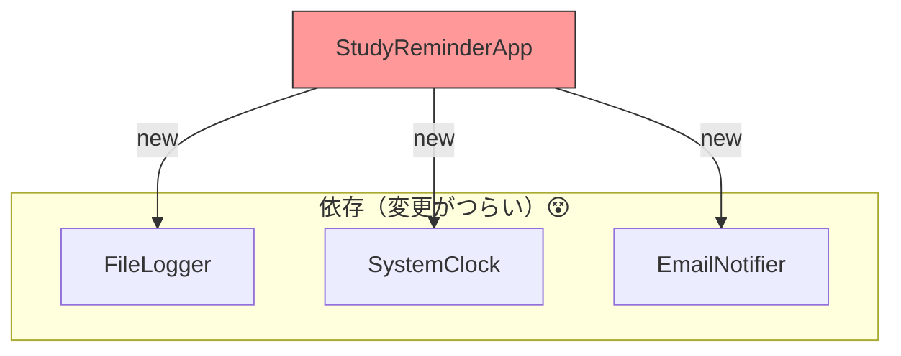

# 第03章：失敗例：newだらけコードの“つらさ”を体験😵

この章は、**まだDIで直しません**🙅‍♀️（直したくなる気持ちを育てる章だよ🌱）
まずは「何がつらいのか」を、**手を動かして体感**しようね✋✨

ちなみに今どきの最新前提だと、**.NET 10（LTS）＋C# 14**世代で進めてOKだよ〜😊（.NET 10は2025/11/11リリースのLTS） ([Microsoft for Developers][1])
IDEも **Visual Studio 2026** が出てる世代だね🧠⚡ ([Microsoft Learn][2])

---

## この章のゴール🎯💖

章末にこう言えるようになったら勝ち✨

* 「`new` が悪じゃないけど、**“中に埋め込まれすぎる”と地獄**になる😵」
* 「**変更が連鎖**して、直す場所が増える📌」
* 「**テストがほぼ不可能**（または超つらい）になる🧪💥」
* 「依存が**見えない**から、読むだけで疲れる📚😇」

---

## まずは“newだらけ”のミニアプリを作るよ🛠️✨

題材は「20時になったら勉強リマインドを送る」アプリ📣🌙
（女子大生向けの学習リマインド、って感じでいこ〜😊🎀）

### 1) プロジェクト作成（Console）🖥️✨

* Consoleアプリを1つ作って、以下のクラスを追加してね📁

---

## “ダメな例”のコード（わざと！）😈🧱

ポイントはこれ👇
**メインの処理（中心ロジック）の中に `new` が生えてる**🌵

```csharp
using System;

public class StudyReminderApp
{
    public void Run()
    {
        // 中心ロジックが全部 “自分で new” してる 😵‍💫
        var logger = new FileLogger("app.log");
        var clock = new SystemClock();
        var notifier = new EmailNotifier("smtp.example.com", 587);

        logger.Info("起動しました✨");

        var now = clock.Now();
        if (now.Hour == 20)
        {
            notifier.Send("komiyanma@example.com", "勉強タイムだよ〜📚✨");
            logger.Info("リマインド送信✅");
        }
        else
        {
            logger.Info($"今は {now:HH:mm} なので送信しないよ〜🕒");
        }
    }
}

public class SystemClock
{
    public DateTime Now() => DateTime.Now; // 外の世界（時間）にベッタリ⏰
}

public class FileLogger
{
    private readonly string _path;
    public FileLogger(string path) => _path = path;

    public void Info(string message)
    {
        // 実ファイルI/Oにベッタリ🗂️
        System.IO.File.AppendAllText(_path, $"{DateTime.Now:O} INFO {message}\n");
    }
}

public class EmailNotifier
{
    private readonly string _host;
    private readonly int _port;

    public EmailNotifier(string host, int port)
    {
        _host = host;
        _port = port;
    }

    public void Send(string to, string body)
    {
        // ここは「メール送ったことにする」だけ（本物SMTPは今は不要👌）
        Console.WriteLine($"[EMAIL {_host}:{_port}] to={to} body={body}");
    }
}

// Program
new StudyReminderApp().Run();
```



---

## つらさ①：仕様変更が“連鎖”する😵‍💫🔁

### お題：メールじゃなくて「アプリ通知（Console通知）」に変えたい📣

…って言われたら、どこを直す？👀

いまの設計だと👇

* `StudyReminderApp` の中の `new EmailNotifier(...)` を直す
* そして `Send(...)` の使い方も変わるかも
* さらに「通知の実装」が増えると、`Run()` がどんどん太る🍖😇

たとえば「Console通知」クラス追加して差し替えたい場合👇

```csharp
public class ConsoleNotifier
{
    public void Send(string body)
        => Console.WriteLine($"[PUSH] {body} 📣✨");
}
```

でも今は**差し替え口が無い**から、`StudyReminderApp` を直接編集するしかないの😵‍💫✂️
（“中心ロジック”が「通知の種類」に引きずられていく〜💦）

---

## つらさ②：テストが“ほぼ無理ゲー”になる🧪💥

### やりたいテスト（気持ち）🥺

* 「20時なら送る」
* 「20時じゃないなら送らない」

でも今のコードだと、時間は `DateTime.Now`（今この瞬間）に依存⏰
つまりテストがこうなる👇

* 20時にテスト実行しないと通らない😇（現実ムリ〜！）
* テスト中にファイルへ書き込みが走る🗂️💥（後片付けも地獄）
* 通知も実送信に近いものが混ざると事故る（今回はConsoleで済ませてるけど本来は怖い😱）

### “無理やり”テストしようとした結果（イメージ）😵‍💫

```csharp
// これだと「今が20時かどうか」で結果が変わる…🫠
var app = new StudyReminderApp();
app.Run();

// 「送った？」を確認する手段がない（Console出力とファイルを見るしかない）😭
```

**中心ロジックが、外の世界（時間・ファイル・通知）と直結**してると、
テストは「観測しづらい」「固定しづらい」になって崩壊するよ〜💣😇

---

## つらさ③：依存が“見えない”から読むのが疲れる📚😵

この `Run()` を読むだけで、頭の中でこう思うはず👇

* 「ログってファイル？どこ？」🗂️
* 「時間ってどこ由来？」⏰
* 「通知って将来増える？」📣
* 「設定値（smtp host/port）どこで管理？」⚙️

つまり、**設計の情報がコードの奥に隠れてる**の😭
（この後の章で「依存を“見える形”にする」が効いてくるよ✨）

---

## 観察ポイント（この章で覚える“危険信号”🚨）


次のサインが出たら、今日の“new地獄”が始まってる合図だよ😵‍💫

* 中心ロジックに `new` がいっぱい🌵🌵🌵
* `DateTime.Now` / `File.*` / `HttpClient` / `SqlConnection` みたいな **外部要素が直書き**🌐🗂️
* ちょっとした変更で、**複数ファイルに修正が飛び火**🔥
* テストが「実行タイミング」「実ファイル」「実通信」に左右される🧪💥

---

## AIに手伝ってもらう（でも“根本解決じゃない”を体感🤖🧠）

ここ、めっちゃ大事✨
AIは便利だけど、**設計が辛い状態だと、AIも辛い提案になりがち**😇

おすすめの聞き方👇（そのまま貼ってOK💬）

* 「このコードの依存（外部I/O、時間、ファイル、通知）を列挙して🧾」
* 「仕様変更（メール→Push通知）に必要な修正箇所を全部出して🔎」
* 「“20時なら送信”をテストしたい。今の設計で何が邪魔？🤔」

きっと返ってくる答えはこうなるはず👇
「時間を差し替えたい」「通知を差し替えたい」「ログを差し替えたい」…
つまり **“差し替えたい欲”が生まれる**💉✨（これが次章以降の入口！）

---

## 章末ミニ課題🎒✨（10〜15分）

### 課題A：仕様変更シミュレーション🔁

* 「通知をConsoleに変える」ために、修正が必要な場所をメモしてね📝
* できれば、直したファイル数も数えてみて👀

### 課題B：テストの壁を言語化🧪

* 「なぜテストしづらいのか」を **3行で**書いてみて✍️💖
  例：

  1. 時間が固定できない
  2. ファイルに書いちゃう
  3. 送ったかどうか確認しづらい

---

## この章のまとめ🍀😊

* `new` 自体は悪くない🙆‍♀️
* でも **中心ロジックの中に依存が埋まる**と、

  * 変更が連鎖🔥
  * テストが崩壊🧪💥
  * 読むだけで疲れる📚😵
    が起きるよ〜！

次の章からは、いよいよ「混ぜると壊れる、分けると楽になる🍱✨」へ進むよ😊🌸

[1]: https://devblogs.microsoft.com/dotnet/announcing-dotnet-10/?utm_source=chatgpt.com "Announcing .NET 10"
[2]: https://learn.microsoft.com/en-us/lifecycle/products/visual-studio-2026?utm_source=chatgpt.com "Visual Studio 2026 - Microsoft Lifecycle"
