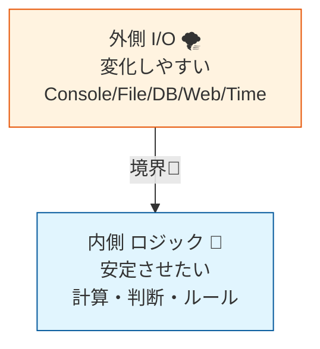
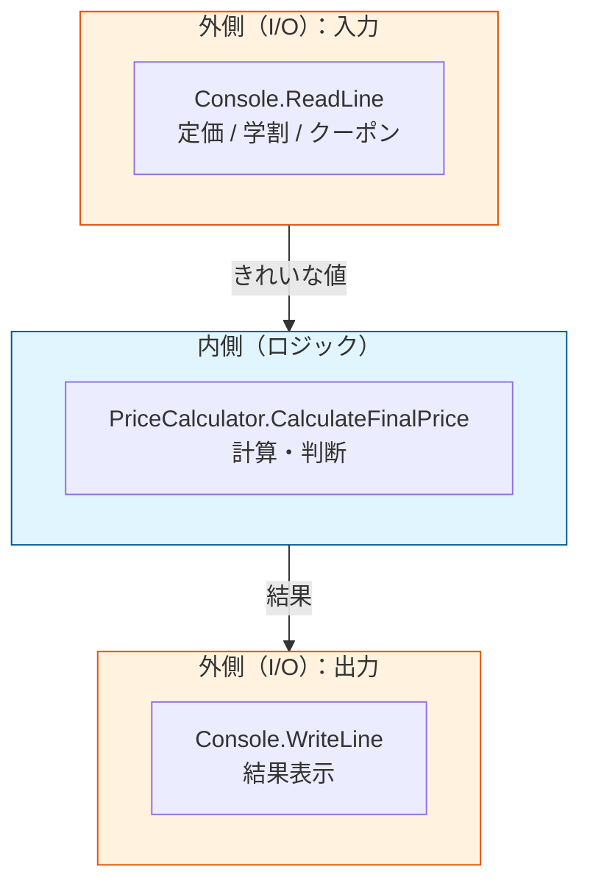

# 第04章：SoCの入口：混ぜると壊れる、分けると楽になる🍱

（関心の分離：ロジック vs I/O）

---

## この章のゴール🎯💗

この章が終わったら、こんなことができるようになります😊✨

* 「このコード、**ロジック**と**I/O**が混ざってるな〜」を見抜ける👀
* ロジック（計算・判断）を **“外の世界” から引っこ抜く** ことができる🧲
* DI（依存性注入）に進むための「下地」を作れる🌱💉

---

## 今日のキーワード📌🌸

* **SoC（Separation of Concerns）**：関心ごとを分けること🍱
* **I/O（外部とのやりとり）**：Console / ファイル / DB / ネット / 時刻 / 乱数 など🌐🗄️⏰🎲
* **純粋ロジック（内側）**：計算・ルール・判断（外に触らない）🧠✨
* **境界（Boundary）**：内側（ロジック）と外側（I/O）の境目🚧

---

## まずは超ざっくり図で理解しよ〜🧁✨


* **外側（I/O）**：変化しやすい＆環境に依存しやすい

  * 例：Console、ファイル、DB、HTTP、ログ、現在時刻…
* **内側（ロジック）**：仕様（ルール）そのもの。できれば安定しててほしい

  * 例：割引計算、合計算出、判定（合格/不合格）…

イメージはこんな感じ👇



ここを分けると何が嬉しいかというと…

* ロジックが **どこでも動く**（ConsoleでもWebでもOK）🚀
* ロジックが **テストしやすい**（DIの旨みが出る）🧪💕
* 変更があっても **壊れにくい**（修正範囲が小さい）🛡️

---

## “混ざってるコード” のつらさを体験😵‍💫💦（Before）

題材：**学割＋クーポンの最終価格**を計算するミニアプリ🍔🎫

```csharp
using System;

class Program
{
    static void Main()
    {
        Console.Write("定価を入力してね: ");
        var priceText = Console.ReadLine();

        Console.Write("学割ある？ (y/n): ");
        var studentText = Console.ReadLine();

        Console.Write("クーポン割引率(0-100): ");
        var couponText = Console.ReadLine();

        int price = int.Parse(priceText ?? "0");
        bool isStudent = (studentText ?? "").Trim().ToLower() == "y";
        int coupon = int.Parse(couponText ?? "0");

        // --- ここからロジックっぽい ---
        decimal result = price;

        if (isStudent) result *= 0.9m;      // 学割10%
        result *= (100 - coupon) / 100m;    // クーポン

        // 端数は切り上げ（例）
        result = Math.Ceiling(result);
        // --- ここまでロジックっぽい ---

        Console.WriteLine($"最終価格は {result} 円だよ〜✨");
    }
}
```

これ、動くけど…つらいポイントがあるの🥲

* 入力がConsole前提で、他（Web/GUI）へ持っていきにくい😵
* ロジックが `Main()` にベタっといて、読みづらい＆直しづらい🌀
* テストしようとしても、Console入力が邪魔する🧪🚫

---

## SoCの第一歩：I/O と ロジック を “分離” しよう✂️✨（After）

### ✅ ステップ1：色分けして境界を見つける🎨

コメントで **I/O** と **Logic** を印つけるだけでも、超効果あるよ😊

* `Console.ReadLine()` / `Console.WriteLine()` → **I/O**
* `int.Parse` / `if` / `計算` → **ロジック寄り**（※Parseは境界側）

### ✅ ステップ2：ロジックを “別クラス” に引っこ抜く🧲💗

ロジック側を「入力を受け取って結果を返す」形にするのがコツ✨

```csharp
using System;

public static class PriceCalculator
{
    // ✅ 内側（ロジック）：外の世界に触らない
    public static decimal CalculateFinalPrice(int basePrice, bool isStudent, int couponPercent)
    {
        decimal result = basePrice;

        if (isStudent) result *= 0.9m;                 // 学割10%
        result *= (100 - couponPercent) / 100m;        // クーポン

        return Math.Ceiling(result);                   // 端数切り上げ
    }
}
```

### ✅ ステップ3：Mainは “外側（I/O）” に徹する🎤✨

```csharp
using System;

class Program
{
    static void Main()
    {
        // ✅ 外側（I/O）：入力を集める
        Console.Write("定価を入力してね: ");
        var priceText = Console.ReadLine();

        Console.Write("学割ある？ (y/n): ");
        var studentText = Console.ReadLine();

        Console.Write("クーポン割引率(0-100): ");
        var couponText = Console.ReadLine();

        // ✅ 境界：入力を型に直す（ここは外側寄り）
        int basePrice = int.TryParse(priceText, out var p) ? p : 0;
        bool isStudent = (studentText ?? "").Trim().ToLower() == "y";
        int coupon = int.TryParse(couponText, out var c) ? c : 0;

        // ✅ 内側（ロジック）を呼ぶだけにする
        var finalPrice = PriceCalculator.CalculateFinalPrice(basePrice, isStudent, coupon);

        // ✅ 外側（I/O）：出力する
        Console.WriteLine($"最終価格は {finalPrice} 円だよ〜✨");
    }
}
```




---

## ここが大事ポイント💡💖（ロジックは“質問に答える関数”にする）

ロジックを分ける時の合言葉はこれ👇

* ロジック：「**入力**をくれたら、**出力**を返すよ」🎁
* I/O：「入力集める＆出力するよ」📥📤

こうなると、ロジックは **Consoleがなくても動く**✨
つまり「Webに移植」「テスト」「差し替え」がしやすくなるの〜😊💕

---

## ミニ演習①：色分けチャレンジ🎨📝

次のうち **I/O** はどれ？ **ロジック** はどれ？（混ざるのもあるよ！）👀✨

* `Console.ReadLine()`
* `File.ReadAllText("data.txt")`
* `DateTime.Now`
* `Math.Ceiling(x)`
* `if (score >= 60)`
* `HttpClient.GetStringAsync(...)`

答え（ざっくり）👇

* **I/O**：Console / File / Http / Now（外部や環境に依存）
* **ロジック**：Math、if判定（入力→判断/計算）
  ※ `DateTime.Now` や `Random` は「ロジックに見えて実は外部」って覚えると強いよ⏰🎲✨

---

## ミニ演習②：テストっぽく動かしてみよ🧪✨（いまは超かんたんでOK）

ロジックが分かれてると、Consoleなしでもこうやって確認できるよ👇

```csharp
using System;

class QuickCheck
{
    static void Main()
    {
        // 学割あり + クーポン20% の例
        var price = PriceCalculator.CalculateFinalPrice(1000, true, 20);

        Console.WriteLine(price == 720 ? "OK🎉" : $"NG😢 -> {price}");
        // 1000 * 0.9 = 900、そこから20%引きで720、切り上げでも720✨
    }
}
```

「えっ、これだけ？」って思うかもだけど、これが **“テストしやすい形” の第一歩** だよ〜🥰🧪

---

## よくあるつまずきポイント🙈💦

### つまずき①：Parseまでロジックに入れちゃう

`TryParse` とか入力の整形は、だいたい **境界側（外側寄り）** に置くとラク✨
ロジックはできるだけ「型が整った値」をもらうのが気持ちいい😊

### つまずき②：ロジックが“外部”に触っちゃう

ロジックの中にこれが出たら黄色信号🚥💦

* `Console` / `File` / `HttpClient` / `DateTime.Now` / `Random`

（このへんをどうするかは、あとでDIでめっちゃ気持ちよく解決するよ💉✨）

---

## AI活用🤖✨（この章でめちゃ使えるプロンプト例）

Copilot Chat や Codex系に、こんな感じで投げると強いよ〜😊

* 「このコードを **I/O と純粋ロジック** に分けて。境界も説明して」
* 「ロジック部分を **staticメソッド** に抽出して、入力→出力の形にして」
* 「抽出したロジックに対して、**テストケース**を5個作って（境界値も！）」
* 「“混ざって壊れやすい点” を指摘して、分離の手順を箇条書きにして」

---

## 章末まとめ🎀✅

この章でいちばん大事なのはコレだよ〜😊💕

* **I/O（外側）とロジック（内側）を分ける** 🍱✨
* ロジックは **入力→出力** の形にする🎁
* 外部に触るのは外側へ（Console/ファイル/HTTP/時刻/乱数…）🌐⏰🎲
* これができると、次の章で **“差し替え口（interface）”** を作る準備が整う🧷💗

ちなみに、C# 14 は .NET 10 上での最新リリースとして案内されていて、Visual Studio 2026 には .NET 10 SDK が含まれるよ〜✨ ([Microsoft Learn][1])
（そして .NET のDIはフレームワークの基本機能として整理されてるよ💉） ([Microsoft Learn][2])

---

## 次章への予告👀✨

次は「**インターフェース（差し替え口）**」で、
外側（I/O）を **“交換できる部品”** にしていくよ〜🧷🔁💕

「今日の分離」ができてると、DIが **いきなり気持ちよく** なります😌💉✨

[1]: https://learn.microsoft.com/en-us/dotnet/csharp/whats-new/csharp-14?utm_source=chatgpt.com "What's new in C# 14"
[2]: https://learn.microsoft.com/en-us/dotnet/core/extensions/dependency-injection?utm_source=chatgpt.com "Dependency injection - .NET"
