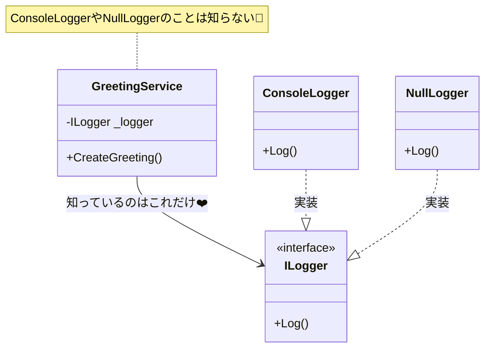

# 第05章：インターフェース超入門：差し替え口を作ろう🧷

この章はひとことで言うと――
**「“取り替え可能な差し込み口（口＝くち）”をコードに作る回」**だよ😊🔁

いま（2026-01-16時点）の最新だと、**C# 14 は .NET 10 でサポート**されてるよ〜📌✨ ([Microsoft Learn][1])
（Visual Studio 2026 も .NET 10 と一緒に来てる流れだね🧡）([Microsoft for Developers][2])

---

## 1) インターフェースってなに？🧩


**interface =「約束（ルール）」**だよ🤝
「この形の差し込み口なら、これができるよね？」っていう**能力の宣言**✨

たとえばスマホの充電で言うと…📱🔌

* USB-C **という口の形**（規格）＝ **interface**
* 充電器A・充電器B（メーカー違い）＝ **実装クラス**

つまり、使う側は「USB-C ならOK！」って思っていればよくて、メーカーを気にしなくていい😊💕

> **ポイント**：使う側は「具体的なモノ」じゃなくて「約束（interface）」を見よう👀✨

---

## 2) なんで必要なの？（DIの前準備）💡

インターフェースがあると、こうなるよ👇

* 実装を**差し替え**できる🔁
* 変更が来ても、影響範囲が小さい🌱
* テストのときだけ**ダミー**にできる🧪✨

そして次章（DI）でやる「外から渡す💉」が気持ちよく決まる土台になるよ〜！

---

## 3) まずは最小で作ろう：ILogger を自作🧾✨

本物の .NET には **Microsoft.Extensions.Logging の ILogger** があるけど（後で触ると最高に便利✨）([Microsoft Learn][3])、
この章は理解が目的だから、**超ミニの ILogger を自分で作る**よ😊🌸

### 3-1) プロジェクト作成（コンソールアプリ）▶️

Visual Studio で **Console App** を作って、プロジェクト名を `DiIoc.Ch05` とかにしておくと分かりやすいよ〜😊

---

## 4) コードを書こう✍️（差し替え体験つき🔁）

### 4-1) interface を作る（差し替え口🧷）

```csharp
namespace DiIoc.Ch05;

public interface ILogger
{
    void Log(string message);
}
```

ここで決めたのは **「Logできる」**っていう約束だけ😊
「どこに出すか（Console？ファイル？）」はまだ決めないよ〜✨

---

### 4-2) 実装その1：Consoleに出すやつ🖥️

```csharp
namespace DiIoc.Ch05;

public sealed class ConsoleLogger : ILogger
{
    public void Log(string message)
        => Console.WriteLine($"[LOG] {DateTime.Now:HH:mm:ss} {message}");
}
```

---

### 4-3) 実装その2：何もしないダミー🙈（テストで大活躍）

```csharp
namespace DiIoc.Ch05;

public sealed class NullLogger : ILogger
{
    public void Log(string message)
    {
        // 何もしない（でも「ILoggerとしてはOK」）
    }
}
```

---

### 4-4) 使う側（ビジネス側）は interface だけを見る👀✨

```csharp
namespace DiIoc.Ch05;

public sealed class GreetingService
{
    private readonly ILogger _logger;

    public GreetingService(ILogger logger)
    {
        _logger = logger;
    }

    public string CreateGreeting(string name)
    {
        _logger.Log($"CreateGreeting called. name={name}");
        return $"こんにちは、{name}さん！";
    }
}
```

ここが超大事💖
`GreetingService` は **ConsoleLogger を知らない**の！
知ってるのは **ILogger だけ**😊



---

### 4-5) 差し替え！🔁（Program.cs）

```csharp
using DiIoc.Ch05;

ILogger logger = new ConsoleLogger();
// ILogger logger = new NullLogger(); // ←こっちに変えるだけでログ消える😳✨

var service = new GreetingService(logger);

Console.WriteLine(service.CreateGreeting("こみやんま"));
```

✅ これで体験できること

* `ConsoleLogger` にするとログが出る🧾
* `NullLogger` にするとログが消える🙈
* **GreetingService側のコードは一切変えない**🎉

この「差し替え気持ちいい〜😍」が、DIの入口だよ💉✨

---

## 5) 命名のお作法：I を付けるのは定番だよ〜🅸

`.NET` のガイドラインでも、interface は **I を付けよう**ってなってるよ😊 ([Microsoft Learn][4])
だから `ILogger` / `IClock` / `IEmailSender` みたいになる✨

---

## 6) よくあるつまずきポイント集😵‍💫➡️😊

* **interfaceに詰め込みすぎる**
  → まずは「1つの責務（できること）」に絞るのがコツ🍰

* **“データ入れ物”みたいにinterfaceを使い始める**
  → interface は基本「ふるまい（メソッド）」の約束に向くよ🧠✨

* **「interfaceって抽象クラスと何が違うの？」**
  → 今は超ざっくりでOK！
  「interface＝約束」「class＝実装」って区別できれば勝ち🏆

※ちなみに C# 8 以降は interface にデフォルト実装も書けるけど、この教材の序盤では混乱しやすいから封印でOK🙆‍♀️（あとで必要になったら触れよう）([Microsoft Learn][5])

---

## 7) ミニ課題（手を動かすと一気に定着🧠✨）📝

### 課題A：FileLogger を追加してみよう📁

* `FileLogger : ILogger` を作って、`Log` をファイル追記にする
* `Program.cs` で `ConsoleLogger` ↔ `FileLogger` を差し替え🔁

### 課題B：MemoryLogger を作ってみよう🧪

* `List<string>` にログを溜める logger を作る
* `GreetingService` を呼んだ後、溜まったログ件数を確認✅
  （テストの心が分かってくるよ〜！）

---

## 8) AI（Copilot/Codex）活用プロンプト例🤖✨

そのままコピペでOKだよ〜🧡

* 「C#で `ILogger` インターフェースと `ConsoleLogger` / `NullLogger` を最小コードで作って」
* 「`GreetingService` が `ILogger` だけに依存する形にリファクタして」
* 「`FileLogger` を `Path.GetTempPath()` に安全に追記する実装案を出して」
* 「interfaceに責務を詰め込みすぎてないかレビューして」👀✨

---

## 9) 章末チェック✅（3つ言えたら合格💮）

* interface は **「約束」**って言える？🤝
* 実装を **差し替え**できるのを体験した？🔁
* 使う側のクラスが **具体クラスを知らない**形になってる？👀✨

---

## 次章予告📣💉

次はついに **DI（外から渡す）**に入るよ〜！
今日作った「差し替え口」があるから、**new を中から追い出す**のが気持ちよくできるはず😊✨

---

もしよければ、いまの理解度に合わせて👇のどれかも作ってあげるよ😊🧡

* 課題Aの `FileLogger` の完成版コード📁
* 課題Bの `MemoryLogger` ＋軽いテストっぽい確認コード🧪
* 「interfaceと抽象クラスの違い」を“怖くない言葉”だけで整理した図解🎨

[1]: https://learn.microsoft.com/en-us/dotnet/csharp/whats-new/csharp-14?utm_source=chatgpt.com "What's new in C# 14"
[2]: https://devblogs.microsoft.com/dotnet/dotnet-conf-2025-recap/?utm_source=chatgpt.com "Celebrating .NET 10, Visual Studio 2026, AI, Community, & ..."
[3]: https://learn.microsoft.com/en-us/dotnet/core/extensions/logging?utm_source=chatgpt.com "Logging in C# - .NET"
[4]: https://learn.microsoft.com/en-us/dotnet/standard/design-guidelines/names-of-classes-structs-and-interfaces?utm_source=chatgpt.com "Names of Classes, Structs, and Interfaces"
[5]: https://learn.microsoft.com/en-us/dotnet/csharp/fundamentals/types/interfaces?utm_source=chatgpt.com "Interfaces - define behavior for multiple types - C#"
