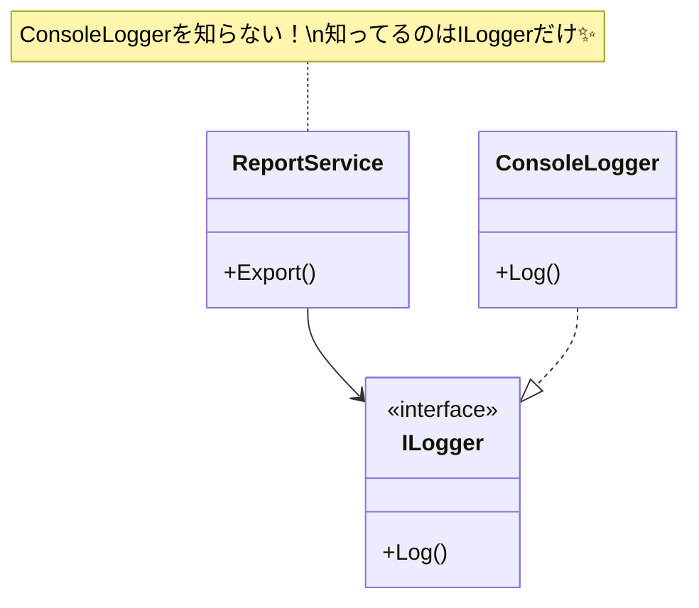
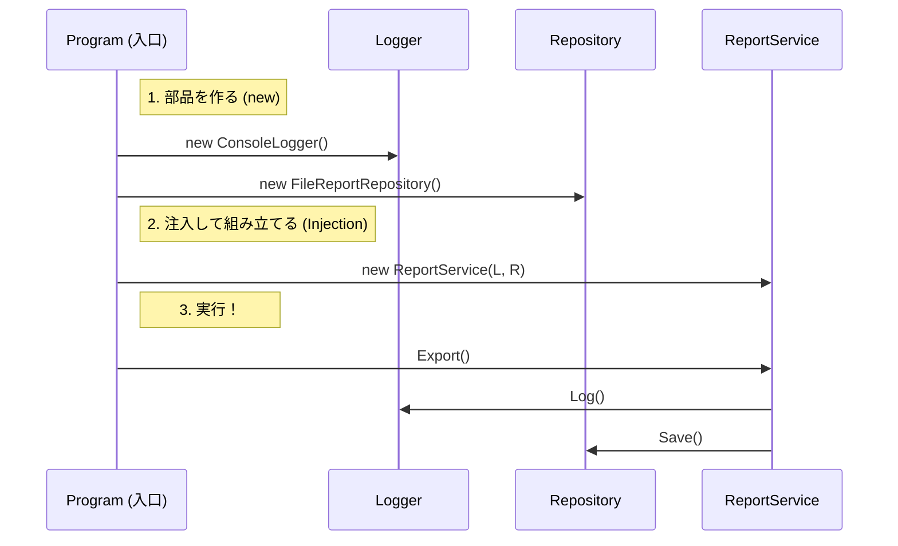

# 第06章：DIの本体：外から渡す（注入）ってこれ！💉

## この章のゴール🎯

この章が終わったら、次の3つができればOKだよ〜😊🌸

* **DI＝「必要なものを、外から渡す」**って一言で言える💬💉
* クラスの中の `new` を減らして、**差し替えできる形**にできる🔁✨
* 「`new` を完全禁止」じゃなくて、**`new` の置き場所を“外側”へ移す**感覚がつかめる📦➡️

---

## まず結論！DIって何？💡


DI（依存性注入）は、ほんとにシンプルで…

**「クラスが必要とする部品（依存）を、クラスの外で作って、渡してあげる」**
これだけ！💉😊

.NET でも DI はフレームワークの基本機能として整理されていて、IoC を実現する代表的な手段として説明されてるよ📚✨。 ([Microsoft Learn][1])

---

## “よくある失敗”から入ろう😵‍💫（newが中にある）

例えば、こんな「クラスの中で全部 new する」コード、見覚えあるかも…👀💦

```csharp
public class ReportService
{
    public void Export()
    {
        var logger = new ConsoleLogger();
        var repo = new FileReportRepository("reports");
        
        logger.Log("Export start");
        repo.Save("...report data...");
        logger.Log("Export done");
    }
}

public class ConsoleLogger
{
    public void Log(string message) => Console.WriteLine(message);
}

public class FileReportRepository
{
    private readonly string _dir;
    public FileReportRepository(string dir) => _dir = dir;

    public void Save(string data)
    {
        Directory.CreateDirectory(_dir);
        File.WriteAllText(Path.Combine(_dir, "report.txt"), data);
    }
}
```

### これの何がつらいの？😭

* **差し替えできない**：ログを別の仕組みに変えたい、保存先をDBにしたい…が大変😇
* **テストしづらい**：`File.WriteAllText` が動いちゃう（テストでファイル作られる）📁💥
* **変更が連鎖しやすい**：Exportの中が “全部入り” になって太りがち🍔💦

---

## DI化の手順はこれだけ！3ステップ🍡✨



ここから「外から渡す」形にしていくよ💉😊


### ✅ ステップ1：依存を“引数で受け取れる形”にする（入口を作る）🚪

まず「差し替え口」を作る（前の章の interface の復習だね🧷）

```csharp
public interface ILogger
{
    void Log(string message);
}

public interface IReportRepository
{
    void Save(string data);
}
```

---

### ✅ ステップ2：クラスの中の `new` をやめて、受け取る（注入）💉

`ReportService` が **「自分で作る」**のをやめて、**「渡される」**にするよ✨

```csharp
public class ReportService
{
    private readonly ILogger _logger;
    private readonly IReportRepository _repo;

    public ReportService(ILogger logger, IReportRepository repo)
    {
        _logger = logger;
        _repo = repo;
    }

    public void Export()
    {
        _logger.Log("Export start");
        _repo.Save("...report data...");
        _logger.Log("Export done");
    }
}
```

ここがDIの核心！😍
**「必要な部品が、コンストラクタ引数に“見えてる”」**のが超大事だよ👀✨
（あとでテストが爆速で楽になる伏線🧪💖）

---

### ✅ ステップ3：外側（Program側）で組み立てて渡す📦➡️


「じゃあ誰が作るの？」ってなるよね😊
答えは **外側（アプリ起動側）** だよ〜✨

```csharp
ILogger logger = new ConsoleLogger();
IReportRepository repo = new FileReportRepository("reports");

var service = new ReportService(logger, repo);
service.Export();
```



> これが **“手動DI”**（DIコンテナ無し）🎉
> この章ではまずこれで十分！🫶
> （コンテナは後の章で「必要になったら」入れる感じでOK🙆‍♀️）

---

## 「差し替えできる」ってこういうこと🔁✨

例えばログを「何もしない版」に変えたいだけなら…

```csharp
public class NullLogger : ILogger
{
    public void Log(string message) { /* 何もしない */ }
}
```

組み立て側で差し替えるだけ！

```csharp
ILogger logger = new NullLogger(); // ←差し替え！
IReportRepository repo = new FileReportRepository("reports");

var service = new ReportService(logger, repo);
service.Export();
```

**ReportServiceの中身は一切変更なし**で差し替えできる😍💖
これがDIの気持ちよさだよ〜🎀

---

## ここ大事！「newが悪」じゃないよ😌🍵

DIって「new禁止」じゃなくて、

* ✅ **newしていい場所**：アプリの外側（組み立て担当）📦
* ⚠️ **newを避けたい場所**：中心ロジックの中（サービスの中）🍱

っていう **置き場所の話**なんだよね😊✨

.NET の世界でも、DIはフレームワークの基本として整理されていて（構成・ログ・Optionsと並ぶ柱みたいな扱い）、中で抱え込まずに外から渡す設計が推されてるよ📚。 ([Microsoft Learn][1])

---

## ミニ演習✍️（手を動かそ〜！）😊💉

### 演習1：`new` を探して“外に追い出す”🔎➡️

次のどれが「外に追い出し候補」っぽい？（複数OK）✨

* `new HttpClient()` 🌐
* `new SqlConnection()` 🗄️
* `new DateTime()`（現在時刻取得）⏰
* `new Random()` 🎲
* `new StringBuilder()` 🧱

**ヒント**：外部I/O寄り・差し替えたい・テストで困るやつが候補だよ😉

---

### 演習2：あなたの過去コードをDIっぽくしてみよう🧰✨

1つ小さめのクラスでいいから、次の手順でやってみてね😊

1. 「中で new してる相手」を2つ書き出す📝
2. interface を作る🧷
3. コンストラクタで受け取る💉
4. Program側で組み立てる📦

---

## AI活用（Copilot / Codex）プロンプト例🤖✨

そのまま貼って使える系だよ〜😊🌸

* 「このクラス内で `new` してる依存を列挙して、DI化の手順を提案して」🔎💉
* 「interface 抽出して、コンストラクタ注入にリファクタして。差し替え例もつけて」🧷➡️💉
* 「“組み立て側（Program）”に new を集めた完成形を出して」📦✨

---

## 章末チェック✅（これ言えたら勝ち！🎉）

* DIって何？→ **「必要なものを外から渡すこと」**って言える💬💉
* `ReportService` の依存はどこで分かる？→ **コンストラクタ引数**👀
* `new` はどこへ移す？→ **外側（組み立て担当）**📦

---

## おまけ：2026年の環境感（超短く）🧁

いまは .NET 10 が LTS で、SDKの最新パッチも 2026-01-13 に出てるよ📅✨。 ([Microsoft][2])
さらに .NET 10 のダウンロード情報には **C# 14.0** と **Visual Studio 2026** のサポートが明記されてるよ〜🛠️✨。 ([Microsoft][3])

---

次の第7章では、いよいよ **IoC（主導権が逆になる）** を、今日のコードを使って「なるほど〜！」ってなる形でつなげるよ🌀😊💖

[1]: https://learn.microsoft.com/en-us/dotnet/core/extensions/dependency-injection?utm_source=chatgpt.com "Dependency injection - .NET"
[2]: https://dotnet.microsoft.com/en-US/download/dotnet/10.0?utm_source=chatgpt.com "Download .NET 10.0 (Linux, macOS, and Windows) | .NET"
[3]: https://dotnet.microsoft.com/ja-JP/download/dotnet/10.0?utm_source=chatgpt.com ".NET 10.0 (Linux、macOS、Windows) のダウンロード | .NET"
