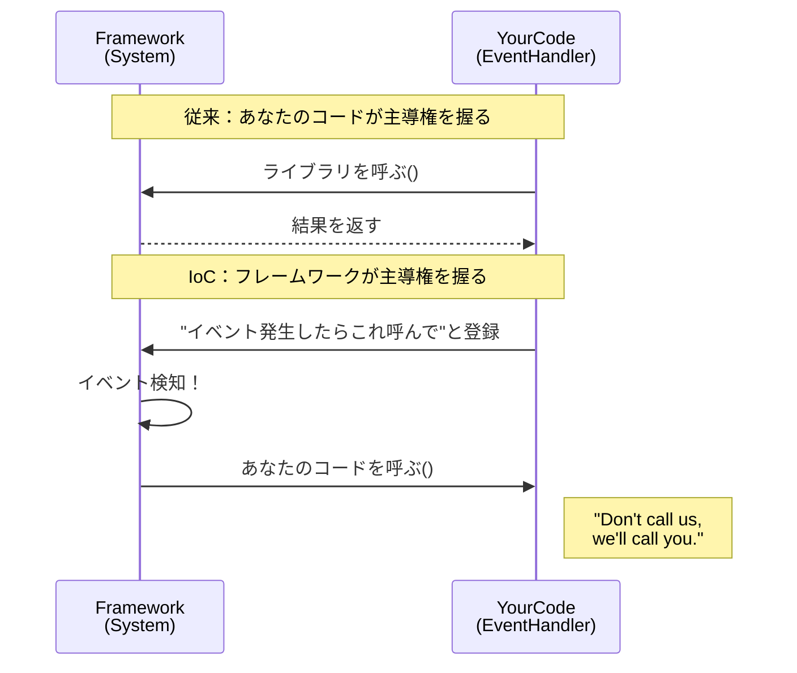
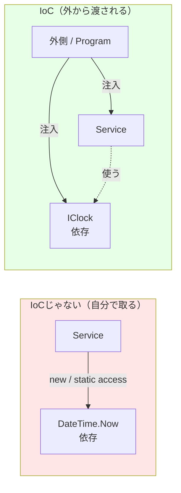

# 第07章：IoCの本体：主導権が逆になるってどういうこと？🌀

この章は、「DIって便利そうだけど…**IoCって何？**」を“ふわっと”じゃなく、**手触りでわかる**ようにする回だよ😊✨
（ここが腑に落ちると、DIの理解が一気に楽になるよ〜！）

---

## 1) 今日のゴール🎯🌸

章末までに、これができたら勝ち🏆✨

* **IoC = 主導権（コントロール）が逆になる**って言葉で説明できる🗣️🌀
* 「自分で取りに行く設計」と「外から渡される設計」の違いを見抜ける👀
* IoCの代表例として **DI（依存性注入）** を“位置づけ”できる💉
* 「IoCっぽいのに事故るコード」の匂いを嗅げる🐶💦

IoCはフレームワークの特徴として語られることが多く、DIはその具体例のひとつ…という関係だよ📚✨ ([martinfowler.com][1])

---

## 2) IoCって一言でいうと？🌀✨

### ✅ IoC（Inversion of Control）＝「呼び出しの主導権が、アプリから“外側”へ移る」こと

イメージはこれ👇

* **ふつうのプログラム**：自分のコードが、必要なものを呼び出して進める
* **IoCな世界**：外側（フレームワーク/ランタイム/起動コード）が、あなたのコードを呼び出す

Martin Fowlerも「IoCはフレームワークを拡張するときに頻出する特徴」って説明してるよ📌 ([martinfowler.com][1])

---

## 3) まず“超わかりやすいIoC”から：イベント🖱️🎉


IoCって、実はDIより前にもう体験してる人が多いよ😊

たとえばボタン押下（イベント）ってこう👇

* あなた：`button.Click += ...` って登録する
* その後：**あなたはClickを呼ばない**
* 代わりに：UIフレームワークが「押されたよ！」ってあなたの処理を呼ぶ

これがまさに **“Don't call us, we'll call you”**（呼ぶのはそっち）ってやつ🌀
IoCは「Hollywood Principle」って説明されることもあるよ🎬 ([ウィキペディア][2])




---

## 4) じゃあDIはIoCとどう関係するの？💉🌀

### ✅ DIは「IoCを実現する代表的なやり方のひとつ」だよ

Martin Fowlerの解説では、軽量コンテナがやってる“配線（wiring）”の思想を IoC と呼び、そこでの具体的なやり方として DI を掘り下げてるよ📌 ([martinfowler.com][3])

---

## 5) “主導権が逆”をコードで体感しよう👀✨（ミニ比較）

題材：時刻を使う処理（ありがち！）⏰

### ❌ IoCじゃない側（自分で取りに行く）

```csharp
public sealed class GreetingService
{
    public string BuildMessage()
    {
        // 自分で取りに行く（主導権がクラス側）
        var now = DateTime.Now;

        return now.Hour < 12 ? "おはよう☀️" : "こんにちは🌤️";
    }
}
```

* `DateTime.Now` は外界（時刻）＝I/Oっぽい依存
* テストしたい時に「朝のケース」「午後のケース」を作りにくい😵‍💫

---

### ✅ IoCな側（外から渡される：DIの形で）

```csharp
public interface IClock
{
    DateTime Now { get; }
}

public sealed class SystemClock : IClock
{
    public DateTime Now => DateTime.Now;
}

public sealed class GreetingService
{
    private readonly IClock _clock;

    // 外から渡される（主導権が外側へ移る）
    public GreetingService(IClock clock) => _clock = clock;

    public string BuildMessage()
    {
        var now = _clock.Now;
        return now.Hour < 12 ? "おはよう☀️" : "こんにちは🌤️";
    }
}
```

ここで起きてること🌀✨

* `GreetingService` は「時計を**取りに行かない**」
* 代わりに「時計を**渡される**」
* **組み立て（どの時計を使うか）の主導権は外側へ**📦

これが “IoCの感覚” だよ😊💕



---

## 6) “外側で組み立てる”ってどこ？📍（Composition Rootの予告）

今はまだ第13章で本格的にやるけど、先に雰囲気だけ！

```csharp
// Program.cs（外側：起動する側）
IClock clock = new SystemClock();
var service = new GreetingService(clock);

Console.WriteLine(service.BuildMessage());
```

* アプリの「入口側（起動側）」が組み立てて
* 中心ロジックは「渡されたものを使うだけ」✨

この「入口でまとめて組み立てる」思想は、.NETのDIでも基本は同じだよ（IServiceCollection/IServiceProvider など）📌 ([Microsoft Learn][4])

---

## 7) ミニ演習🧪✨（10〜20分）

### 演習A：Before→Afterで“主導権逆転”を体感🌀

1. `GreetingService` の中に `DateTime.Now` がある版を作る
2. `IClock` を作って、`SystemClock` を実装
3. コンストラクタで `IClock` を受け取る形に直す
4. `Program.cs` で組み立てる

🌟チェック：`GreetingService` の中から **new が減った？**
🌟チェック：依存が **引数に見える形**になった？

---

### 演習B：Fakeでテストできる喜び💖

```csharp
public sealed class FakeClock : IClock
{
    public DateTime Now { get; set; }
}
```

* `FakeClock.Now` を朝にして「おはよう」を確認
* 午後にして「こんにちは」を確認

この“差し替えの気持ちよさ”がDIのご褒美だよ🍰✨

---

## 8) よくある勘違い＆つまずきポイント🥺🧯

### ❗勘違い1：IoC＝DIコンテナのこと？

ちがうよ〜！🙅‍♀️
IoCはもっと広い概念で、**イベントもフレームワークもIoC**。DIはその中の有名な手段のひとつだよ📌 ([martinfowler.com][1])

### ❗勘違い2：「渡される」って、結局どこかでnewしてるじゃん？

うん、してる！😊
でも大事なのは「**中心ロジックの中でnewしない**」こと。
“組み立て”を外に追い出すと、変更やテストが楽になるよ✨

---

## 9) AI（Copilot/Codex等）に頼ると超早い🤖💨

そのままコピペで使えるプロンプト例だよ🌸

* 「このクラスの隠れた依存（new / DateTime.Now / Console / HTTPなど）を列挙して、DI向けに分離案を出して」
* 「このコードを**コンストラクタ注入**に直して。インターフェースも作って」
* 「Fake実装を作って、朝/昼のテストケースを2本作って」
* 「この設計で“主導権がどこにあるか”を図（箇条書き）で説明して」

---

## 10) 章末ミニクイズ🎯✨（答えつき）

**Q1. IoCの超ざっくり説明として正しいのは？**
A. 依存を全部interfaceにすること
B. 呼び出しの主導権が外側に移ること
C. newを禁止すること

✅答え：**B** 🌀

**Q2. イベントハンドラはIoC？**
✅答え：**Yes**（自分が呼ぶんじゃなくて、フレームワークが呼ぶから） ([ウィキペディア][2])

**Q3. DIはIoCの…？**
✅答え：**IoCを実現する代表的な手段のひとつ** ([martinfowler.com][3])

---

## まとめ🍀✨

* IoCは「主導権が逆になる」こと🌀
* その“逆転”をコードで作る代表手段がDI💉
* 中心ロジックは「取りに行かず、渡されて使う」だけにすると強い💪✨
* 次の章（第8章）で、いよいよ **コンストラクタ注入（最重要）🥇** を固めて、DIを“型”にするよ〜😊🎉

---

続けて「第7章の内容を、演習付きの1ファイル完結サンプル（Console）にして」みたいに言ってくれたら、そのままコピペで動く教材コードも作るよ💖

[1]: https://martinfowler.com/bliki/InversionOfControl.html?utm_source=chatgpt.com "Inversion Of Control"
[2]: https://en.wikipedia.org/wiki/Inversion_of_control?utm_source=chatgpt.com "Inversion of control"
[3]: https://martinfowler.com/articles/injection.html?utm_source=chatgpt.com "Inversion of Control Containers and the Dependency ..."
[4]: https://learn.microsoft.com/ja-jp/dotnet/core/extensions/dependency-injection?utm_source=chatgpt.com "NET での依存関係の挿入"
