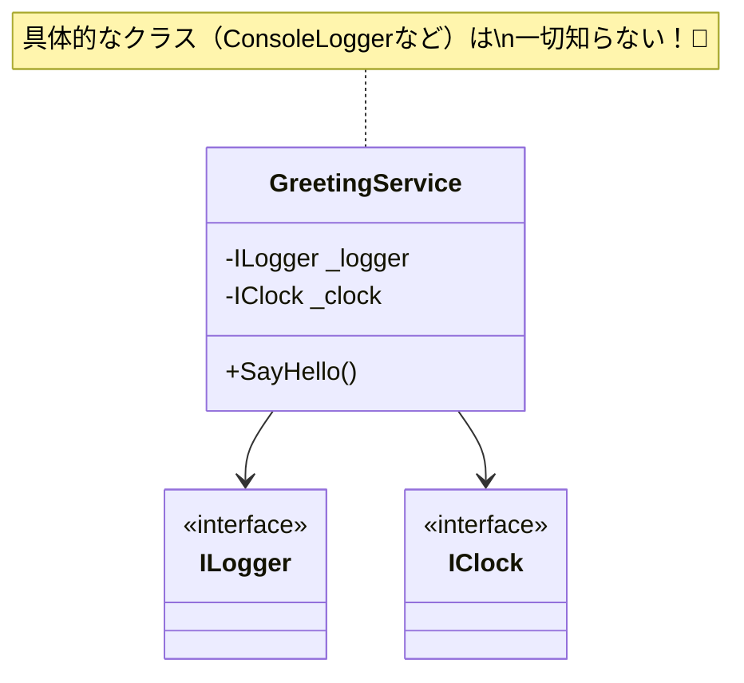

# 第08章：コンストラクタ注入（最重要）：まずはこれだけでOK🥇

この章は、DIの「ど真ん中」だよ〜😊
**コンストラクタ注入**さえ気持ちよく使えれば、DI／IoCは一気に“怖くない”になる🌸

（ちなみに、2026年1月中旬の時点で最新LTSは **.NET 10（2025/11/11 リリース）**で、パッチは **10.0.2（2026/1/13）**だよ🧡 ([Microsoft][1])
.NET の DI はフレームワーク標準機能の一部として整理されてるよ📦✨ ([Microsoft Learn][2])）

---

## 1) 今日のゴール🎯💕

読み終わったら、これができる状態にするよ〜✅

* **「必須の依存はコンストラクタで受け取る」**が言える＆書ける💉
* クラスの中の `new` を減らして、**差し替え可能**にできる🔁
* 「依存が引数に見える」＝**設計が透明になる**感覚がわかる👀✨
* **テストが簡単になる下準備**までできる🧪🌟

---

## 2) コンストラクタ注入って一言で？📝


**「このクラスが生きていくのに必要な道具は、誕生日（生成時）に渡してね」**🎁😊

* クラスは「自分で道具を買いに行かない（= `new` しない）」🏃‍♀️💦
* 代わりに「外から渡される」📦
* だから、あとで **本物 → ダミー** に差し替えやすい🔁✨

---

## 3) “必須依存”だけをコンストラクタに置く📌✨

ここ超大事〜〜〜〜‼️😳💥

### ✅ 依存の種類を3つに分けて考える

* **必須依存（絶対ないと動けない）** → コンストラクタ注入🥇
  例：ログ、時計、リポジトリ、外部APIクライアントなど
* **一時的依存（そのメソッドの間だけ使う）** → メソッド引数🧤
* **任意依存（なくても動く…は危険が多い）** → なるべく作らない🙈⚠️

> “必須なのにプロパティで後から入れる” は事故りやすいよ〜😵‍💫
> 「入れ忘れ」や「null」が起きやすい💥

---

## 4) 変換レシピ：`new` から卒業する手順🍀🧩

「DI化」って聞くと難しそうだけど、やることはほぼこれだけ👇✨

### ステップ0：まず“依存”を見つける🔎

* そのクラスが使ってる「外部っぽいもの」を探す
  例：日時、ログ、ファイル、DB、HTTP、乱数、環境変数…

### ステップ1：依存を“抽象（interface）”にする🧷

* 直接 `Console` や `DateTime.Now` を使わないで
  **`IClock`** とか **`ILogger`** みたいな“差し替え口”にする✨

### ステップ2：コンストラクタで受け取る💉

* `private readonly` に保存する（逃げ道をなくす）🔒

### ステップ3：`new` は外に追い出す🚚

* 組み立て（`new`）は **外側** でやる（後で第13章の Composition Root に繋がる📍）

---

## 5) Before → After で一気に体感しよ☺️✨

題材：**あいさつ通知**アプリ（小さくて気持ちいいやつ）🌸

### ❌ Before：クラスの中が `new` だらけ😵

```csharp
public sealed class GreetingService
{
    public void SayHello()
    {
        var logger = new ConsoleLogger();
        var clock = new SystemClock();

        logger.Log($"Hello! Now: {clock.Now:HH:mm:ss}");
    }
}

public sealed class ConsoleLogger
{
    public void Log(string message) => Console.WriteLine(message);
}

public sealed class SystemClock
{
    public DateTime Now => DateTime.Now;
}
```

**つらいところ😢**

* テストで「時刻」を固定できない⏰💦
* ログを差し替えられない🧾
* 変更したら影響範囲が広がる🌪️

---

### ✅ After：依存をコンストラクタで注入💉✨

```csharp
public interface ILogger
{
    void Log(string message);
}

public interface IClock
{
    DateTime Now { get; }
}

public sealed class GreetingService
{
    private readonly ILogger _logger;
    private readonly IClock _clock;

    public GreetingService(ILogger logger, IClock clock)
    {
        ArgumentNullException.ThrowIfNull(logger);
        ArgumentNullException.ThrowIfNull(clock);

        _logger = logger;
        _clock = clock;
    }

    public void SayHello()
    {
        _logger.Log($"Hello! Now: {_clock.Now:HH:mm:ss}");
    }
}

public sealed class ConsoleLogger : ILogger
{
    public void Log(string message) => Console.WriteLine(message);
}

public sealed class SystemClock : IClock
{
    public DateTime Now => DateTime.Now;
}
```

そして「外側」で組み立てる👇（これが超大事📍✨）

```csharp
var logger = new ConsoleLogger();
var clock  = new SystemClock();

var service = new GreetingService(logger, clock);
service.SayHello();
```

### ここが“気持ちいいポイント”😍💖

* `GreetingService` は **Console も DateTime.Now も知らない**
* でも動く！✨
* しかも差し替えできる！🔁



---

## 6) “できてるかチェック”✅👀✨

次の3つがYESなら、コンストラクタ注入として合格〜〜〜🥳🎉

1. 依存が **コンストラクタ引数に見えてる？** 👀
2. クラスの中心ロジックに **`new` が残ってない？** 🚫
3. 依存フィールドが **`readonly`** になってる？🔒

---

## 7) よくある事故ポイント集🚑💦（先に潰そ！）

### 🚫 事故1：必須依存なのに nullable / 後からセット

* 例：`ILogger? Logger { get; set; }` とか
  → 使う時に `null` で爆発💥🙈
  ✅ 必須はコンストラクタで固定！

### 🚫 事故2：コンストラクタ引数が増えすぎる（7個以上とか）📣

* それはだいたい **責務がデカすぎ** のサイン😳
  ✅ 「分割できない？」って疑ってOK（第29章にも繋がる✨）

### 🚫 事故3：クラス内で `IServiceProvider` を注入して取り出す

* いわゆる Service Locator 寄りになりがちで、依存が見えなくなる😵‍💫
  ✅ 依存は“必要なものをそのまま引数に”が基本💡

---

## 8) ハンズオン課題（手を動かすパート）🧪💪✨

### 演習A：`new` を追い出してコンストラクタ注入にしてね💉

次のコードを DI 化してみよ👇（完成形は「差し替え可能」になってればOK！）

```csharp
public sealed class ReportService
{
    public string Create()
    {
        var clock = new SystemClock();
        return $"Report created at {clock.Now:yyyy-MM-dd HH:mm:ss}";
    }
}
```

**やること✅**

* `IClock` を作る
* `ReportService` のコンストラクタで `IClock` を受け取る
* 外側で `new SystemClock()` して注入する

---

### 演習B：ダミー時計で時刻を固定してみよう⏰✨

```csharp
public sealed class FakeClock : IClock
{
    public FakeClock(DateTime now) => Now = now;
    public DateTime Now { get; }
}
```

**狙い😍**

* 「テストしやすさ」が目に見えるようになる💖

---

### 演習C：依存の“必須度”を仕分けしよう🗂️

次の依存、コンストラクタ注入にするならどれ？（自分の言葉で理由も✨）

* ログ🧾
* 乱数🎲
* 画像保存のファイルパス📁
* そのメソッドだけで使う Formatter🧤
* DBアクセス🗄️
* 現在時刻⏰

---

## 9) AI（Copilot/Codex/ChatGPT）使いどころ🤖✨

### 💡 変換を手伝わせるプロンプト例

* 「このクラスの依存を列挙して、コンストラクタ注入に直す手順を出して💉」
* 「`new` を中心ロジックから追い出したい。抽象（interface）案を3つ出して🧷」
* 「このコンストラクタ引数、多すぎ？責務分割の候補を提案して✂️」

### ⚠️ 1つだけ注意（超大事！）

AIが“勢いで”設計を盛りすぎることがあるので、
この章は **「最小でOK」** が正解だよ😊🌱

---

## 10) 章末まとめ🍓✨（今日の持ち帰り）

* **必須依存はコンストラクタ注入**で固定💉
* 依存が引数に見えると、設計が透明になる👀✨
* `new` は外へ🚚（組み立て担当に任せる）
* 次の章で、Before/After をもっとガッツリ体感して「うわ、ラク！」ってなるよ〜🥳🎉

---

必要なら、この第8章の内容をそのまま使って、
「章末の答え例（演習A〜Cの模範解答コード）」まで一気に出すよ〜😊💖

[1]: https://dotnet.microsoft.com/ja-jp/platform/support/policy/dotnet-core?utm_source=chatgpt.com ".NET および .NET Core の公式サポート ポリシー"
[2]: https://learn.microsoft.com/en-us/dotnet/core/extensions/dependency-injection?utm_source=chatgpt.com "Dependency injection - .NET"
