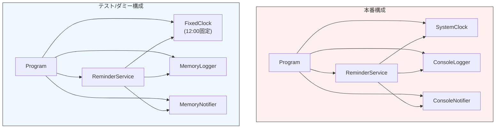

# 第09章：手を動かす①：Consoleアプリで“DI前→DI後”を体感⌨️✨

この章は **「DIって、結局なにが嬉しいの？」** を、理屈じゃなくて **手触りで分かる** ようにする回だよ〜😊🌸
（ちなみに本日時点だと、**C# 14 が最新**で、**.NET 10** で動くよ〜💡 ([Microsoft Learn][1])）

---

### この章のゴール🎯💖

できたら勝ち！な到達点はこれ👇

* ✅ **“newだらけ” だと差し替えできなくてツラい** が分かる😵‍💫
* ✅ **依存（時計・通知・ログ）を外から渡す** ができる💉✨
* ✅ **差し替え（本物→ダミー）** を自分の手でできる🔁😆
* ✅ 「**newは入口（Program）に寄せる**」感覚がつかめる📍

---

## まず作る題材：リマインダーアプリ🔔💌


やることはシンプル！

> 「いま何時か（時計）を見て、メッセージを作って、通知（コンソール出力）する」

ここで、わざと **差し替えしたくなる依存** を3つ用意するよ👇

* ⏰ 時計（いまの時刻）


* 🧾 ログ（動いた記録）
* 🔔 通知（出力先）

---

## 0) プロジェクト作成（Console）🛠️✨

```bash
dotnet new console -n DiChapter9
cd DiChapter9
```

---

# 1) DI前（Before）：newだらけ版😵


まずは「よくある素朴な書き方」をわざと作るよ〜。

## Beforeのコード例（そのまま貼ってOK）📄

**Program.cs**

```csharp
using System;

class ReminderService
{
    public void Send()
    {
        // 依存が中に埋まってる（差し替えできない）😵
        var logger = new ConsoleLogger();
        var notifier = new ConsoleNotifier();

        var now = DateTime.Now; // 時計も直書き⏰
        var message = $"[{now:HH:mm:ss}] お水の時間だよ〜🥤✨";

        logger.Log("Send() start");
        notifier.Notify(message);
        logger.Log("Send() end");
    }
}

class ConsoleLogger
{
    public void Log(string message)
        => Console.WriteLine($"[LOG] {message}");
}

class ConsoleNotifier
{
    public void Notify(string message)
        => Console.WriteLine($"[NOTIFY] {message}");
}

class Program
{
    static void Main()
    {
        var service = new ReminderService();
        service.Send();

        Console.WriteLine("Enterで終了〜😊");
        Console.ReadLine();
    }
}
```

## ここで “困るポイント” を体感しよ🧠💥


たとえば、こんな要求が来たら…👇

* 「テストで時刻を固定したい（常に 12:00 にしたい）」⏰
* 「通知先をコンソールじゃなくて、将来は別のものにしたい」🔁
* 「ログをファイルにしたい」🧾

でも今のコードって…

* `DateTime.Now` が中に埋まってて固定できない😵
* `new ConsoleNotifier()` が中にあるから差し替えが面倒😵
* 変更のたびに `ReminderService` を直接いじりがち😵

---

# 2) DI後（After）：外から渡す版💉✨

ここからが本番！
「時計・ログ・通知」を **インターフェースにして、コンストラクタで受け取る** ようにするよ😊

> .NETではDIはフレームワークに組み込みの考え方として扱われてるよ（DIはIoCを実現するテクニックの1つ） ([Microsoft Learn][2])
> この章ではコンテナはまだ使わず、**手動でDI** するよ〜🙆‍♀️✨（気持ちが分かるのが大事！）

---

## Step A：インターフェースを作る🧷✨

```csharp
using System;

public interface IClock
{
    DateTime Now { get; }
}

public interface ILogger
{
    void Log(string message);
}

public interface INotifier
{
    void Notify(string message);
}
```

---

## Step B：本物の実装（プロダクション用）を作る🧰✨

```csharp
using System;

public sealed class SystemClock : IClock
{
    public DateTime Now => DateTime.Now;
}

public sealed class ConsoleLogger : ILogger
{
    public void Log(string message)
        => Console.WriteLine($"[LOG] {message}");
}

public sealed class ConsoleNotifier : INotifier
{
    public void Notify(string message)
        => Console.WriteLine($"[NOTIFY] {message}");
}
```

---

## Step C：ReminderService を “注入される側” にする💉

```csharp
using System;

public sealed class ReminderService
{
    private readonly IClock _clock;
    private readonly ILogger _logger;
    private readonly INotifier _notifier;

    // ✅ 必須の依存はコンストラクタで受け取る（超重要）🥇
    public ReminderService(IClock clock, ILogger logger, INotifier notifier)
    {
        _clock = clock;
        _logger = logger;
        _notifier = notifier;
    }

    public void Send()
    {
        var now = _clock.Now; // ← 直書きをやめた！⏰✨
        var message = $"[{now:HH:mm:ss}] お水の時間だよ〜🥤✨";

        _logger.Log("Send() start");
        _notifier.Notify(message);
        _logger.Log("Send() end");
    }
}
```

---

## Step D：組み立ては Program（入口）でやる📍✨


ここが **Composition Root の超ミニ版** だよ！

**Program.cs**

```csharp
using System;

class Program
{
    static void Main()
    {
        // ✅ new は “入口” に寄せる📍
        IClock clock = new SystemClock();
        ILogger logger = new ConsoleLogger();
        INotifier notifier = new ConsoleNotifier();

        var service = new ReminderService(clock, logger, notifier);
        service.Send();

        Console.WriteLine("Enterで終了〜😊");
        Console.ReadLine();
    }
}
```

---

# 3) “差し替えが気持ちいい” をやろう🔁💖


ここがこの章のクライマックス😆✨
**時計を固定**して、**通知をメモリに溜める**「ダミー実装」を作るよ！

## ダミー実装（テスト用っぽい子たち）🧪


```csharp
using System;
using System.Collections.Generic;

public sealed class FixedClock : IClock
{
    public FixedClock(DateTime fixedNow) => Now = fixedNow;
    public DateTime Now { get; }
}

public sealed class MemoryNotifier : INotifier
{
    public List<string> Sent { get; } = new();
    public void Notify(string message) => Sent.Add(message);
}

public sealed class MemoryLogger : ILogger
{
    public List<string> Logs { get; } = new();
    public void Log(string message) => Logs.Add(message);
}
```

## Programで差し替えて動かす🔁✨

```csharp
using System;

class Program
{
    static void Main()
    {
        // 👇 ここで「本物」じゃなく「ダミー」を注入するだけ！
        IClock clock = new FixedClock(new DateTime(2026, 1, 16, 12, 0, 0));
        var logger = new MemoryLogger();
        var notifier = new MemoryNotifier();

        var service = new ReminderService(clock, logger, notifier);
        service.Send();

        Console.WriteLine("=== MemoryNotifier に溜まった通知 ===");
        foreach (var msg in notifier.Sent)
            Console.WriteLine(msg);

        Console.WriteLine("=== MemoryLogger に溜まったログ ===");
        foreach (var log in logger.Logs)
            Console.WriteLine(log);

        Console.WriteLine("Enterで終了〜😊");
        Console.ReadLine();
    }
}
```



✅ これで「**時刻固定で再現できる**」「**通知が外に漏れない**」が一気にできたね！🎉
DIの嬉しさは、ほんとこれなのよ〜💉💖

---

# 4) まとめ：Before と After の違い🧠✨

* Before：

  * `ReminderService` の中に `new` と `DateTime.Now` がいて、差し替えがつらい😵
* After：

  * `ReminderService` は **インターフェース相手に仕事だけ**する✨
  * **差し替えは入口（Program）で一発**🔁
  * テストっぽいことも、めっちゃやりやすい🧪

---

# 5) ミニ課題（やると定着するよ）🎓💖

## 課題A：通知先をもう1個増やす🔔➕

* `INotifier` の実装をもう1つ作ってみてね
  例：`DebugNotifier`（Consoleに別フォーマットで出すだけでもOK）😊

## 課題B：メッセージ文面を差し替えられるようにする💬🔁

* `IMessageFormatter` を作って、文面生成を別クラスにしてみよ〜✨
  （「責務を分ける」感覚が身につくよ🍱）

---

# 6) つまずきポイント集（先に潰す）🧯😆

* ❌ 「インターフェース作りすぎて訳わからん」
  → まずは **時計・ログ・通知** みたいな “差し替えたくなる外部っぽいもの” だけでOK🙆‍♀️✨
* ❌ 「Program以外にもnewが残る」
  → まずは **中心ロジック（ReminderService）から new を追い出す** のが勝ち筋💪
* ❌ 「static便利で使っちゃう」
  → staticは差し替えが難しくなりやすいから、この教材では一旦封印が安全〜🧊

---

# 7) AI拡張の使いどころ🤖✨（超おすすめ）

Copilot / Codex系がある前提なら、ここめっちゃ楽になるよ〜😊

使える指示の例👇

* 「このクラスの依存（newしてるもの／DateTime.Now等）を列挙して」🔎
* 「このコードをコンストラクタ注入にリファクタして。インターフェース名も提案して」💉
* 「テスト用のFake/Stub実装を作って（FixedClock, MemoryLoggerみたいな）」🧪
* 「newが残ってる場所を探して、Composition Rootに寄せる案を出して」📍

⚠️ ただし！最後は自分の目で「依存が引数に見えてるか」をチェックね👀✨

---

## おまけ：次の章への伏線🧵

次は「メソッド注入」とか「プロパティ注入」も出てくるけど、
**基本はコンストラクタ注入が最優先**だよ🥇💖

そして、.NETには **標準のDIコンテナ（IServiceProvider / IServiceCollection）** も用意されてる（この先でやるやつ！） ([Microsoft Learn][2])
`Microsoft.Extensions.DependencyInjection` も .NET 10 系で提供されてるよ〜🧰✨ ([NuGet][3])

---


[1]: https://learn.microsoft.com/en-us/dotnet/csharp/whats-new/csharp-14 "What's new in C# 14 | Microsoft Learn"
[2]: https://learn.microsoft.com/en-us/dotnet/core/extensions/dependency-injection "Dependency injection - .NET | Microsoft Learn"
[3]: https://www.nuget.org/packages/microsoft.extensions.dependencyinjection "
        NuGet Gallery
        \| Microsoft.Extensions.DependencyInjection 10.0.2
    "
