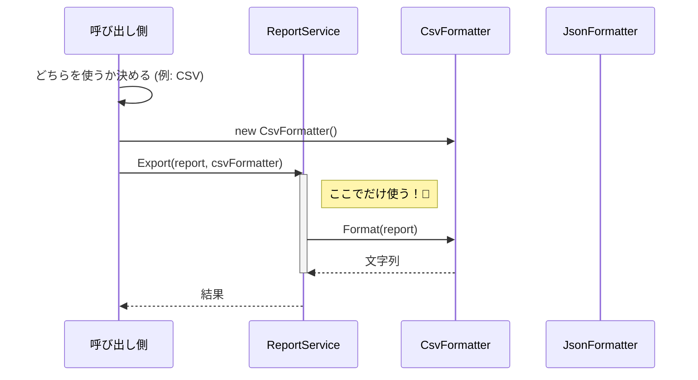

# 第10章：メソッド注入：一時的に必要な依存だけ渡す🧤

この章は「**コンストラクタ注入が基本**」って分かったうえで、
「でも…これは毎回違うし、クラスの必須メンバーじゃなくない？」みたいな時に使える **メソッド注入**を学ぶ回だよ〜😊💉

---

### この章のゴール🎯✨

* メソッド注入が **“いつ使うのか / いつ使わないのか”** を言える😊
* 「必須依存はコンストラクタ注入」「その場だけはメソッド注入」って使い分けできる💡
* 実例（Console / Web）で「あ、こういう時ね！」が腹落ちする👍

---

## 1) メソッド注入ってなに？🧤


**メソッド注入**は超シンプルで、

> **その処理（そのメソッド）を実行するときだけ必要なものを、引数で渡す**
> …これだけ！😊✨

たとえば👇

* エクスポートする時だけ必要な `IFormatter`（CSV / JSON とか）📄
* その処理だけで使う「通知方法」📩
* “今回の実行だけ” のルール（並び替え、丸め、フィルタ条件）🧩

---

## 2) 使い分けルール（ここ超大事）📌✨

### ✅ メソッド注入が向いてるとき🧤

* **毎回違うもの**を渡したい（CSV/JSON、戦略の差し替え）🔁
* **そのメソッドでしか使わない**（クラス全体の必須じゃない）🧼
* 「必須依存」じゃなく、**“オプション扱い”**にしたい🌿

### ❌ メソッド注入にしない方がいいとき⚠️

* クラスのいろんなメソッドで使う（＝実質必須）👉 **コンストラクタ注入**へ💉
* 渡し忘れると壊れる（＝必須）👉 **コンストラクタ注入**へ💉
* 引数が増えすぎて「何の処理か分からん」状態😵（責務過多サイン📣）

---

## 3) 例題：Export時だけフォーマッタが必要📄✨（Consoleでも分かるやつ）

ここでは「レポート本文は作れるけど、**出力形式（CSV/JSON）はその場で選びたい**」ってケースにするよ😊

### 3-1) フォーマッタを“差し替え口”にする🧷

```csharp
public interface IReportFormatter
{
    string Format(Report report);
}

public sealed class CsvReportFormatter : IReportFormatter
{
    public string Format(Report report)
        => $"title,body\n\"{report.Title}\",\"{report.Body}\"";
}

public sealed class JsonReportFormatter : IReportFormatter
{
    public string Format(Report report)
        => $$"""{"title":"{{report.Title}}","body":"{{report.Body}}"}""";
}

public sealed record Report(string Title, string Body);
```

ポイント👉

* CSV/JSONは**“毎回違うかも”**だから、クラスの必須依存として固定しないでOK👌
* だから **メソッド注入**が気持ちいいやつ😆✨

### 3-2) サービス本体：Exportメソッドだけ引数で受け取る🧤

```csharp
public sealed class ReportService
{
    // 例として「必須依存」はコンストラクタ注入（ここでは省略気味でもOK）
    // private readonly IClock _clock; など

    public Report CreateMonthlyReport()
        => new("Monthly", "Sales are up!");

    // ⭐ここがメソッド注入！
    public string Export(Report report, IReportFormatter formatter)
        => formatter.Format(report);
}
```

### 3-3) 呼び出し側で「今回のフォーマッタ」を決めて渡す🎮

```csharp
var service = new ReportService();

var report = service.CreateMonthlyReport();

Console.Write("format? (csv/json): ");
var input = Console.ReadLine()?.Trim().ToLowerInvariant();

IReportFormatter formatter = input switch
{
    "json" => new JsonReportFormatter(),
    _      => new CsvReportFormatter(),
};

var output = service.Export(report, formatter);
Console.WriteLine(output);
```

ここが気持ちいいポイント💖

* `ReportService` は「出力形式」を知らない（責務が軽い）🧼
* 呼び出し側が「今回はこれ！」って決められる（差し替え楽）🔁
* テストもしやすい（ダミーformatter渡すだけ）🧪✨



---

## 4) Webだと“メソッド注入っぽい”のが超よく出る🌐✨

### 4-1) Controllerのアクション引数にDI注入できる（Action injection）🧤

ASP.NET Core では、アクションメソッドの引数に `[FromServices]` を付けて、**そのメソッドだけ**サービスを受け取れるよ〜！ ([Microsoft Learn][1])

```csharp
using Microsoft.AspNetCore.Mvc;

public interface IDateTime
{
    DateTime Now { get; }
}

[ApiController]
[Route("[controller]")]
public class DemoController : ControllerBase
{
    [HttpGet("now")]
    public string Now([FromServices] IDateTime dateTime)
        => $"Now: {dateTime.Now:O}";
}
```

「このController全体で使うわけじゃないんだよね〜」って時に便利😊
（ただし乱用すると依存が見えにくくなるから、使い所は選ぼうね⚠️）

### 4-2) Minimal APIは“引数でDI注入”が標準っぽい🎣✨

Minimal API は、ハンドラの引数にサービス型を書くだけで **DIから供給**される（＝メソッド注入っぽい！） ([Microsoft Learn][2])

```csharp
var builder = WebApplication.CreateBuilder(args);
builder.Services.AddSingleton<GreetingService>();

var app = builder.Build();

app.MapGet("/hello", (GreetingService service) => service.Hello("Komiyamma"));

app.Run();

public sealed class GreetingService
{
    public string Hello(string name) => $"Hello, {name}!";
}
```

この「必要な時に、メソッド引数で受け取る」感覚がそのまま学びになるよ😊✨

---

## 5) （ちょい上級）Key付きサービスを“メソッド引数で”選ぶ🗝️

「CSV/JSON」みたいに複数実装がある時、Keyで選べる仕組みもあるよ〜（ASP.NET Core側の例） ([Microsoft Learn][1])

* `[FromKeyedServices]` で「このKeyのやつちょうだい」ってできる✨
  （ここは“へぇ〜便利〜”くらいでOK👌）

---

## 6) よくある失敗と、回避のコツ😵➡️😊

### 失敗①：必須依存までメソッド注入にしちゃう💥

* 「渡し忘れたら落ちる」なら、それは必須依存💉
* **コンストラクタ注入に戻す**のが正解✨

### 失敗②：引数が増えすぎて読めない📣

* `Do(x, y, z, a, b, c...)` みたいになったら
  だいたい **責務が大きすぎ**か、設計の分割チャンス✂️

### 失敗③：クラス内でDIコンテナを引き回す（Service Locator化）🚫

* 「必要になったら都度 `IServiceProvider` で取る」は依存が隠れて事故りやすい🙈
* “渡す”を基本にしよ〜✨

---

## 7) 演習（手を動かそう）🧪✨

### 演習A：フォーマッタを1個増やす🎁

* `MarkdownReportFormatter` を追加して
* 入力が `md` の時にそれを使うようにしてみてね📝

### 演習B：テストがラクになるのを体験🧪

* `IReportFormatter` のダミー実装を作って
* `Export` がそのダミーを呼んでるだけ…ってテストを書いてみよう✨
  （「差し替えできる＝テストしやすい」を体で覚える回😊）

---

## 8) AI（Copilot / Codex）に頼むと捗るプロンプト例🤖✨

* 「このクラスの必須依存と一時依存を分類して、コンストラクタ注入とメソッド注入に分けて」
* 「`Export` を Strategy パターン（formatter差し替え）として整理して、最小の例にして」
* 「引数が増えすぎてるので責務分割案を3つ出して。分割後のクラス名も提案して」

👉 出てきた案は **“依存が必須かどうか”** を自分の目で最終判断してね😊（ここが設計力💪）

---

## 9) まとめ🧁✨

* **必須依存**：クラスが生きるのに必要 👉 **コンストラクタ注入**💉
* **一時的 / 毎回違う依存**：その処理だけで必要 👉 **メソッド注入**🧤
* Webでは `[FromServices]` や Minimal API の「引数DI」が、そのままメソッド注入の実例になるよ〜 ([Microsoft Learn][1])
* そして本日時点の最新だと、C# 14 / .NET 10 の流れで学べばOKだよ😊✨ ([Microsoft Learn][3])

---

次の章（第11章）は「プロパティ注入」の“便利そうで怖いところ”を、わざと事故らせて覚える回になるはず😈🕳️
続けて作る？😊

[1]: https://learn.microsoft.com/en-us/aspnet/core/mvc/controllers/dependency-injection?view=aspnetcore-10.0&utm_source=chatgpt.com "Dependency injection into controllers in ASP.NET Core"
[2]: https://learn.microsoft.com/en-us/aspnet/core/fundamentals/minimal-apis/parameter-binding?view=aspnetcore-10.0&utm_source=chatgpt.com "Parameter binding in Minimal API applications"
[3]: https://learn.microsoft.com/en-us/dotnet/csharp/whats-new/csharp-14?utm_source=chatgpt.com "What's new in C# 14"
