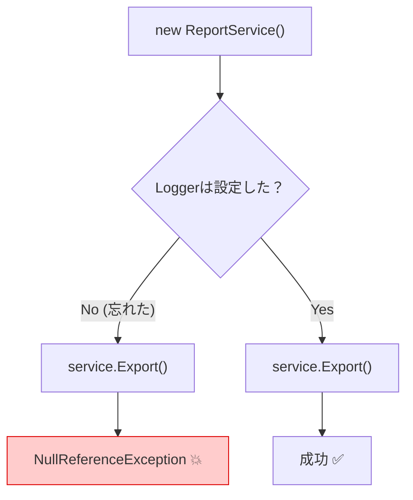

# 第11章：プロパティ注入：便利そうに見えるけど落とし穴も🕳️

## この章のゴール🎯✨

* **プロパティ注入（Property Injection）**が何かを説明できる😊
* 「なんか便利そう…」の裏にある **事故ポイント（null・見えない依存・不完全な初期化）**がわかる😱
* 基本方針として **「必須の依存はコンストラクタ注入」**に戻せる💉🥇
* 例外的に“使っていい場面”を、ちゃんと線引きできる🧠🫶

---

## 1) プロパティ注入ってなに？🧩

ざっくり言うと👇
**「コンストラクタでは渡さず、あとから set できるプロパティに依存を入れる」**やり方だよ〜🧷

たとえばこんな感じ👇（※わざと危ない例）

```csharp
public interface ILogger
{
    void Log(string message);
}

public class ReportService
{
    // 後から入れてね！方式（＝プロパティ注入）
    public ILogger? Logger { get; set; }

    public void Export()
    {
        Logger!.Log("レポートを出力します"); // ← 入ってなかったら…😇
        // 何か出力処理…
    }
}
```

一見「コンストラクタ引数が増えなくてスッキリ〜😍」って見えるんだけど…
ここから落とし穴の始まり🕳️💥

---

## 2) なにが危ないの？（プロパティ注入の事故あるある）😵‍💫💣


### ✅ 事故①：nullで落ちる（入れ忘れ）🙈

「セットするのを忘れた」だけで **実行時に突然死**しがち💥
コンストラクタ注入なら「渡さないと作れない」ので、事故が起きにくいんだよね😊

### ✅ 事故②：必須の依存が“見えない”👻

`Export()` が `ILogger` 必須なのに、クラスの表面（コンストラクタ）から分からない😱
読む人が「このクラス、何が必要なの？」って迷子になるよ〜🧭

### ✅ 事故③：途中まで作れちゃう（不完全なオブジェクト）🧟‍♀️

「作れたけど、動かしたら落ちる」状態になりやすい💦
設計的にはこれ、かなりストレス源…😵‍💫

---

## 3) 実験：わざと null 事故を起こして学ぼう🙈⚡

### ❌ Before：プロパティ注入で事故る例

```csharp
public class ConsoleLogger : ILogger
{
    public void Log(string message) => Console.WriteLine(message);
}

public static class Program
{
    public static void Main()
    {
        var service = new ReportService();

        // Logger をセットし忘れた…😇
        service.Export(); // 実行時に落ちる可能性大💥
    }
}
```




### ✅ After：コンストラクタ注入に直す（王道🥇）

```csharp
public class ReportService
{
    private readonly ILogger _logger;

    public ReportService(ILogger logger) // 必須が“見える”✨
    {
        _logger = logger;
    }

    public void Export()
    {
        _logger.Log("レポートを出力します");
        // 何か出力処理…
    }
}

public static class Program
{
    public static void Main()
    {
        var service = new ReportService(new ConsoleLogger());
        service.Export(); // 安心😊✨
    }
}
```

**ポイント💡**

* 「必要なものはコンストラクタで受け取る」→ **依存が見える & 入れ忘れない**🎉

---

## 4) じゃあプロパティ注入って“完全にダメ”なの？🤔

完全禁止！というより、**“基本は避ける”**が正解だよ〜😊🌿

### 例外的に出てきがちな場面👇

* **Blazor コンポーネント**は、コンポーネント内で **プロパティ注入もサポート**してる（`@inject` や `[Inject]`）✨ ([Microsoft Learn][1])
* それ以外の一般的なクラスでは、基本は **コンストラクタ注入が主役**になりやすいよ😊

---

## 5) 超重要：標準DIコンテナは「プロパティ注入」を標準サポートしない🧰🚫

いま主流の **.NET 10 / C# 14** 環境でも、.NET のガイドライン上、標準のDIコンテナがサポートしない機能の例として **Property injection** が挙げられてるよ📌 ([Microsoft for Developers][2])

つまり👇
「標準DIでプロパティ注入したい！」となったら、**そもそも筋が悪い**サインになりがち😵‍💫

### どうしても必要なら？（上級者向けの分岐🚧）

サードパーティDI（例：Autofac）だと、プロパティ注入の仕組みが用意されてたりするよ🧰 ([autofac.readthedocs.io][3])
ただし…教材のこの段階では **おすすめしない**よ〜🙅‍♀️（事故りやすさが勝つ💦）

---

## 6) 「プロパティ注入っぽいことしたい」時の代替案💡✨

### ✅ 代替①：必須ならコンストラクタ注入（最強🥇）

迷ったらまずこれ💉✨

### ✅ 代替②：そのメソッドだけ必要なら“メソッド注入”🧤

ASP.NET Core MVC だと、アクション引数に `[FromServices]` を付けて注入できるよ（＝その場だけ使う）✨ ([Microsoft Learn][4])

```csharp
public IActionResult About([FromServices] IDateTime dateTime)
{
    return Content($"Now: {dateTime.Now}");
}
```

### ✅ 代替③：Minimal API は引数にサービス型を書くだけでDIされる（便利✨）

Minimal API のパラメータは、DIコンテナのサービスもバインド対象だよ〜🧩 ([Microsoft Learn][5])

---

## 7) 章末まとめ：この章の“合言葉”🧡

* 必須の依存 👉 **コンストラクタ注入**💉🥇
* 一時的にだけ必要 👉 **メソッド注入**🧤
* プロパティ注入 👉 **事故りやすいので基本避ける**🕳️💥
* フレームワーク都合（Blazor等）で出る時だけ、仕組みを理解して使う😊✨ ([Microsoft Learn][1])

---

## 8) ミニ演習✍️🌸（手を動かそう！）

### 演習A：null事故を再現してから直す🙈➡️😊

1. `ReportService` をプロパティ注入で作る
2. 注入を忘れて落とす💥
3. コンストラクタ注入に直す💉
4. 「依存が見えるって安心〜🥹」を体感する✨

### 演習B：“依存が増えたらどうする？”を考える🧠

* コンストラクタ引数が増えそうになったら

  * 「このクラス、責務多すぎない？😵」
  * 「分割できない？✂️」
    をチェック✅（次章以降につながる大事ポイントだよ〜📍）

---

## 9) 理解度チェッククイズ🎯✨（サクッと！）

1. プロパティ注入が事故りやすい最大の理由は？🙈
2. 必須依存はどの注入方法が基本？💉
3. “そのメソッドだけ必要”な依存に向くのは？🧤
4. 標準DIコンテナでプロパティ注入が欲しくなった時、まず疑うべきことは？🧠
5. Blazor でプロパティ注入が出てくるのはなぜ？✨ ([Microsoft Learn][1])

---

## 10) AI活用（Copilot / Codex など）🤖💞

コピペで使えるやつ置いとくね🎁

* 「このクラスの依存（必須/任意）を列挙して、コンストラクタ注入にリファクタ案を出して」
* 「プロパティ注入になってる箇所を探して、null事故が起きるケースをテストで再現して」🧪
* 「引数が増えすぎてるクラスを、責務分割して3つに分ける案を出して」✂️✨

---

次の章（第12章）は **「DIとDIP（依存性逆転の原則）」の混同をほどく回**だよ〜🤝🌀
ここがスッキリすると、DIが一気に気持ちよくなる😍✨

[1]: https://learn.microsoft.com/en-us/aspnet/core/blazor/fundamentals/dependency-injection?view=aspnetcore-10.0&utm_source=chatgpt.com "ASP.NET Core Blazor dependency injection"
[2]: https://devblogs.microsoft.com/dotnet/announcing-dotnet-10/?utm_source=chatgpt.com "Announcing .NET 10"
[3]: https://autofac.readthedocs.io/en/latest/register/prop-method-injection.html?utm_source=chatgpt.com "Property and Method Injection — Autofac 7.0.0 documentation"
[4]: https://learn.microsoft.com/en-us/aspnet/core/mvc/controllers/dependency-injection?view=aspnetcore-10.0&utm_source=chatgpt.com "Dependency injection into controllers in ASP.NET Core"
[5]: https://learn.microsoft.com/en-us/aspnet/core/fundamentals/minimal-apis/parameter-binding?view=aspnetcore-10.0&utm_source=chatgpt.com "Parameter binding in Minimal API applications"
