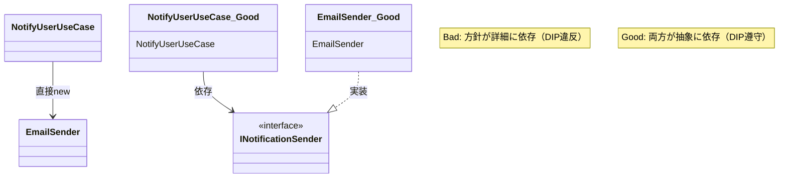

# 第12章：DIとDIPの関係：似てるけど別物だよ🤝

この章は**「DI（依存性注入）」と「DIP（依存関係逆転の原則）」をゴッチャにしない**のがゴールだよ〜😊✨
（ここで混ざると、あとで設計が一気に難しく感じちゃうの🥺）

---

## この章のゴール 🎯

読み終わったら、次をサラッと言えるようになろう〜🌸

* **DIPは“設計の方針”**（どう依存すべきか）📏
* **DIは“実装のやり方”**（どう渡すか）🔧
* **DIはDIPを実現しやすくする手段の1つ**（でも同じじゃない！）💡
* .NET では DI がフレームワークの中心機能として用意されてるよ 🧩 ([Microsoft Learn][1])
* ちなみに今の最新は **.NET 10（LTS）**＆**C# 14**だよ〜🆕 ([Microsoft][2])

---

## まずは超ざっくり区別しよう 🧁


| 用語      | ざっくり言うと                    | 例え                       |
| ------- | -------------------------- | ------------------------ |
| **DIP** | 依存の方向をこうしよう！という**設計ルール**📏 | 「上の方針が下の詳細に振り回されないようにする」 |
| **DI**  | 依存する相手を**外から渡す**やり方💉      | 「充電器を自分で買いに行かず、渡してもらう」   |
| **IoC** | 主導権が逆になる考え方🌀              | 「呼ぶ側が組み立てる」              |

DIPの有名な言い方はこれ👇

* **高レベルは低レベルに依存しない。両者は抽象に依存する**
* **抽象は詳細に依存しない。詳細が抽象に依存する** ([Stackify][3])

---

## ありがちな勘違い 😵‍💫（ここでスッキリ！）

### ❌「DIやってる＝DIPできてる」

➡️ **ちがうよ〜！**
DI で “渡してる” だけで、**渡してる相手が具体クラス**だと DIP は守れてないことがあるの🥺

### ❌「インターフェース作った＝DIPできてる」

➡️ これも注意⚠️
**“どこが方針（上）で、どこが詳細（下）か”**が大事。
ただ interface を増やすゲームじゃないよ〜😂

---

## ミニ例：通知アプリで理解しよう 📣✨

### ❌ ダメな例：DIPもDIも弱い（方針が詳細にべったり）💦

* 「通知する」という方針クラスが
  「メール送信（詳細）」に直結してる…😵

```csharp
public sealed class EmailSender
{
    public void Send(string to, string message)
    {
        Console.WriteLine($"[EMAIL] to={to} msg={message}");
    }
}

public sealed class NotifyUserUseCase
{
    private readonly EmailSender _sender = new(); // ← 詳細を自分でnew

    public void Execute(string userEmail)
    {
        _sender.Send(userEmail, "こんにちは！🎉");
    }
}
```

**何がツラい？😢**

* 送信手段を LINE に変えたい→このクラスを直に改造😵
* テストで「送ったこと」だけ確認したい→本物メール送信が走りそうで怖い（例ではConsoleだけど、実務だと外部I/O）💦
* “方針”が “詳細”に引きずられる＝DIP違反になりがち 😭

---

### ✅ 良い例：DIP（方針）＋DI（渡し方）で気持ちよくする 💖

ポイントはこれ👇

* **方針側**（UseCase）は **抽象（インターフェース）** に依存する
* **詳細側**（EmailSender）は 抽象を実装する
* **DI**で実装を外から渡す💉

```csharp
public interface INotificationSender
{
    void Send(string to, string message);
}

// 詳細（メール）だけど、抽象に合わせる
public sealed class EmailSender : INotificationSender
{
    public void Send(string to, string message)
        => Console.WriteLine($"[EMAIL] to={to} msg={message}");
}

// 方針（ユースケース）は抽象に依存する
public sealed class NotifyUserUseCase
{
    private readonly INotificationSender _sender;

    public NotifyUserUseCase(INotificationSender sender) // ← DI（注入）
        => _sender = sender;

    public void Execute(string userEmail)
        => _sender.Send(userEmail, "こんにちは！🎉");
}
```

**これの嬉しさ😍**

* 送信手段が増えてもOK（Push/LINE/SMS…）📱✨
* テストで差し替え簡単（Fakeを注入）🧪
* “方針”が “詳細”から自由＝DIPの狙いに近づく🕊️



---

## ここが超大事：DIPとDIの“関係”を一言で 🎀

* **DIP**：依存の方向を「抽象」に向けよう（設計のルール）📏 ([Stackify][3])
* **DI**：その依存（実装）は「外から渡そう」（実装のテク）💉
* .NET は DI を標準機能として支えてるよ 🧩 ([Microsoft Learn][1])

---

## 「どっちの話？」ミニクイズ5問 🎯✨

1. 「ユースケースが `EmailSender` に直接依存してるのが怖い」
   👉 **DIP**（依存の向きの話）📏

2. 「コンストラクタ引数で `INotificationSender` を受け取る」
   👉 **DI**（渡し方の話）💉

3. 「抽象は詳細に依存しない。詳細が抽象に依存する」
   👉 **DIP** 📏 ([Stackify][3])

4. 「DIコンテナを入れた」
   👉 **DI**（ただし、入れただけでDIPが達成されるとは限らない😇）

5. 「上位の方針クラスを、DBやHTTPみたいな詳細から独立させたい」
   👉 **DIP** 📏

---

## 手を動かすミニ演習 ✍️🌸（15〜25分）

### お題：支払い方法を差し替えたい 💳✨

1. `PaymentUseCase` が `CreditCardPayment` を `new` してるコードを用意
2. **DIP**：`IPaymentGateway` を作る
3. **DI**：`PaymentUseCase(IPaymentGateway gateway)` にする
4. `CreditCardPayment : IPaymentGateway` にする
5. Fake実装 `FakePaymentGateway` を作って “呼ばれたか” を確認する 🧪

---

## よくある落とし穴まとめ 🕳️😇

* **落とし穴①：抽象にせず、具体クラスを注入して満足する**
  → DIはしててもDIPが弱いかも🥺

* **落とし穴②：何でもinterface化して疲れる**
  → “差し替えたい詳細（I/O）” を中心にやると幸せ🍀

* **落とし穴③：DIコンテナを使ってるのに Service Locator っぽくなる**
  → 依存が見えなくなって逆にツラい方向へ…🚫（これは後半章でしっかりやるよ！）

---

## 仕上げチェックリスト ✅💖

* 方針クラス（UseCase）が **具体クラス**に直接依存してない？👀
* 依存先は **抽象（interface）** になってる？🧷
* 実装は **外から渡す**形になってる？💉
* 差し替え（Fake）でテストできそう？🧪✨

---

## AI拡張の使い方（この章向け）🤖✨

コピペで使えるよ〜💌

* 「このコードの **高レベル（方針）** と **低レベル（詳細）** を分類して、DIP違反っぽい点を指摘して」
* 「このクラスを **DIPに寄せる**ためのインターフェース案を3つ出して。やりすぎ注意で」
* 「DIはしてるけどDIPが弱い例を作って、どこが弱いか説明して」
* 「“DI / DIP / IoC” の3択クイズを10問作って（初心者向け、短文で）」

---


[1]: https://learn.microsoft.com/en-us/dotnet/core/extensions/dependency-injection?utm_source=chatgpt.com "Dependency injection - .NET"
[2]: https://dotnet.microsoft.com/en-us/platform/support/policy/dotnet-core?utm_source=chatgpt.com "NET and .NET Core official support policy"
[3]: https://stackify.com/dependency-inversion-principle/?utm_source=chatgpt.com "SOLID Design Principles Explained: Dependency Inversion"
