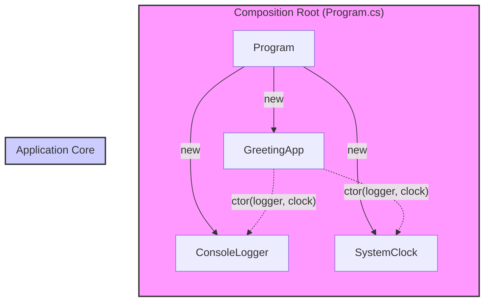

# 第13章：Composition Root：組み立て場所を1か所に集める📍

## この章のゴール🎯

この章を終えると…👇😊

* 「**どこに `new` を置くべきか**」がハッキリ言える📍
* 依存（ILoggerとかIClockとか）を**アプリの入口でまとめて組み立て**できる🧩
* 「DIコンテナ使う／使わない」どっちでも、**依存が散らからない形**にできる💪✨
* ついでに **Service Locator（`GetService()` 乱用）**の地雷を避けられる💣🚫（公式にも回避推奨があるよ） ([Microsoft Learn][1])

---

## 1) Composition Rootってなに？🧁


めちゃやさしく言うと…👇

> **アプリで必要な部品（オブジェクト）を“全部組み立てる場所”を、1か所に決めようね**
> その場所が **Composition Root** だよ〜📍✨

この考え方は「アプリの入口（エントリポイント）に近いところに置く」のが基本だよ、って説明されてるよ📌 ([Ploeh Blog][2])

### たとえ話🍱

* **アプリ本体（ロジック）**＝お弁当の中身
* **Composition Root**＝キッチンでお弁当を詰める場所🍳✨
  お弁当の中で「フライパン出して揚げ物始める」みたいなこと（＝ロジックの中で `new` しまくる）をやると、ぐちゃぐちゃになっちゃうの🥲

---

## 2) どこがComposition Rootになるの？🗺️

アプリの種類で「入口」がちょっと違うよ〜👇

### Consoleアプリ / バッチ / Windowsサービス🖥️

* だいたい **`Program.cs` の `Main`** が入口＝Composition Root📍✨

### ASP.NET Core（Web APIとか）🌐

* だいたい **`Program.cs`**（`builder.Services...` とか）あたりが入口📍
  ASP.NET Core のDIは標準機能として用意されてるよ〜 ([Microsoft Learn][3])

### ユニットテスト🧪

* **各テストメソッドが入口**みたいな扱いになるよ（だからテストではテスト用の組み立てをしてOK） ([Ploeh Blog][4])

---

## 3) Composition Rootがないと起きる「あるある事故」😵‍💫

### 事故①：`new` があちこちに散らばる🌀

* 「ログをファイル出力に変えたい」だけなのに、10ファイル修正…みたいなやつ🥲

### 事故②：依存が“見えない”状態になる🙈

* クラスの中でこっそり `new` したり、`IServiceProvider.GetService()` で取ったりすると、
  「このクラス何に依存してるの？」が外から見えないの😭

Microsoftのガイドでも、**Service Locator（`GetService` で取るやつ）を避けよう**って書かれてるよ🚫 ([Microsoft Learn][1])

---

## 4) 手を動かそう：まずは「手動DI（Poor Man’s DI）」でComposition Root💉✨

ここではDIコンテナを使わずに、**Program.csで組み立てる**練習をするよ😊
（コンテナは後の章でOK👌）

### 例題：あいさつアプリ（ログ＋時刻つき）🕰️🧾

#### つくりたい構造（イメージ）🧩

* ロジック側：`GreetingApp`（あいさつする）
* 外部依存：`ILogger`（ログ） / `IClock`（時刻）

---

### ✅ コード例（Composition Rootあり）📍

```csharp
// ILogger.cs
public interface ILogger
{
    void Info(string message);
}

// ConsoleLogger.cs
public sealed class ConsoleLogger : ILogger
{
    public void Info(string message) => Console.WriteLine($"[INFO] {message}");
}

// IClock.cs
public interface IClock
{
    DateTimeOffset Now { get; }
}

// SystemClock.cs
public sealed class SystemClock : IClock
{
    public DateTimeOffset Now => DateTimeOffset.Now;
}

// GreetingApp.cs（アプリの中心ロジック）
public sealed class GreetingApp
{
    private readonly ILogger _logger;
    private readonly IClock _clock;

    public GreetingApp(ILogger logger, IClock clock)
    {
        _logger = logger;
        _clock = clock;
    }

    public void Run(string name)
    {
        var now = _clock.Now;
        _logger.Info($"Hello, {name}! 🥳 いまは {now:yyyy-MM-dd HH:mm:ss} だよ〜");
    }
}

// Program.cs（←ここがComposition Root📍）
public static class Program
{
    public static void Main()
    {
        // ✅ 依存の「組み立て」をここ1か所に集める
        ILogger logger = new ConsoleLogger();
        IClock clock = new SystemClock();

        var app = new GreetingApp(logger, clock);
        app.Run("こみやんま");
    }
}
```

### ここが大事ポイント💡✨

* `GreetingApp` の中に `new ConsoleLogger()` が **無い**🎉
* 依存は **コンストラクタ引数で見える**👀
* `new` は **Program.cs（入口）に集中**📍

これがComposition Rootの超基本だよ〜😊💕




---

## 5) 「散らばったnew」をComposition Rootへ引っ越す手順🚚📦

既存コードを直すときのおすすめ手順はこれ👇✨

1. **中心ロジック（重要なクラス）**を決める🎯
2. そのクラスの中にある `new` を探す🔎
3. `new` してる相手を **interface化**（または差し替え可能な形に）🧷
4. `new` を消して、**コンストラクタ引数で受け取る**💉
5. `Program.cs`（Composition Root）で **まとめてnewして渡す**📍

---

## 6) よくある落とし穴⚠️（ここ超大事〜！）

### 落とし穴①：`IServiceProvider` を注入して `GetService()` しまくる🎣💥

一見「DIしてるっぽい」けど、実態は **Service Locator** になりがち😵
公式ガイドでも避けようねって書いてあるよ🚫 ([Microsoft Learn][1])

> ルール：**依存は“取りに行く”んじゃなくて、“引数で渡される”**💉✨

（※インフラ層など一部の特殊ケースで必要になる議論もあるけど、まずは「アプリの中心ロジックではやらない」でOKだよ🙆‍♀️） ([Jimmy Bogard][5])

### 落とし穴②：Composition Rootが複数に増殖する🧟‍♀️

* あちこちで「組み立て処理」を始めると、結局散らかる😭
* 例：画面ごとに `new` の山、Controllerごとに `new` の山…みたいな

### 落とし穴③：静的クラス／グローバル状態でごまかす🧊

* その場は楽でも、テストや差し替えが地獄になりやすいよ🥲

---

## 7) セルフチェック✅（コードレビューでも使えるよ✨）

次の質問に「うん！」って言えたら勝ち🏆🥳

* ✅ **中心ロジックに `new` が残ってない？**
* ✅ **依存がコンストラクタ引数に出てる？（見える？）** 👀
* ✅ **組み立ては入口（Program.cs等）に集まってる？** 📍
* ✅ **IServiceProvider / GetService に逃げてない？** 🚫 ([Microsoft Learn][1])

---

## 8) 練習問題（ミニ）🧪🌸

### 問1：new探しゲーム🔎

自分の小さめのプロジェクトで、中心ロジックっぽいクラスを1つ選んで
**「クラス内部の `new` を3つ見つける」**→リスト化してね📝

### 問2：1個だけ引っ越し🚚

見つけた `new` のうち1つを、
**interface + コンストラクタ注入 + Program.csで組み立て** に直してみよう💉✨

### 問3：依存関係マップ🗺️

「どのクラスがどれに依存してるか」を紙でもテキストでもいいから書いてみてね✍️
（ここが見えると設計が急にラクになるよ😊）

---

## 9) Copilot / Codex に頼るときのプロンプト例🤖✨

コピペして使えるやつ置いとくね〜💕

* 「このクラスの依存（newしてる相手）を列挙して、差し替え可能にする手順を提案して」
* 「このコードを“Composition Rootにnewを集約”する形にリファクタして。変更ステップも」
* 「中心ロジックからI/Oを追い出したい。interface設計案を出して」
* 「依存関係を図にして（MermaidでもOK）、循環が起きそうなところを指摘して」

---

## 章末まとめ🌷

* **Composition Root = 組み立て場所は1か所📍**
* **ロジックは組み立てない、受け取るだけ💉**
* `new` は入口へお引っ越し🚚✨
* `GetService()` で取りに行くのは基本やめとこね🚫 ([Microsoft Learn][1])

次の章（第14章）では、この「手動DI」を**きれいに保つコツ**（Factory化、読みやすい分割、引数地獄の避け方🍰）を一緒にやろうね😊🧹✨

[1]: https://learn.microsoft.com/en-us/dotnet/core/extensions/dependency-injection-guidelines?utm_source=chatgpt.com "Dependency injection guidelines - .NET"
[2]: https://blog.ploeh.dk/2011/07/28/CompositionRoot/?utm_source=chatgpt.com "Composition Root - ploeh blog"
[3]: https://learn.microsoft.com/en-us/aspnet/core/fundamentals/dependency-injection?view=aspnetcore-10.0&utm_source=chatgpt.com "Dependency injection in ASP.NET Core"
[4]: https://blog.ploeh.dk/2019/06/17/composition-root-location/?utm_source=chatgpt.com "Composition Root location by Mark Seemann - ploeh blog"
[5]: https://www.jimmybogard.com/service-locator-is-not-an-anti-pattern/?utm_source=chatgpt.com "Service Locator is not an Anti-Pattern"
