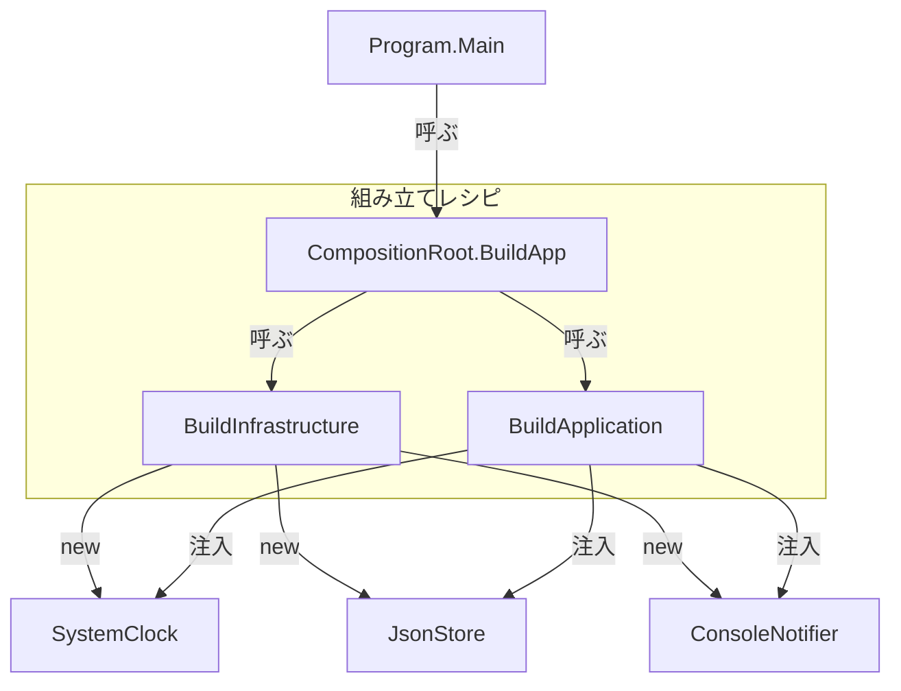

# 第14章：手を動かす②：手動DIを“きれいに”保つコツ🧹

この章は「**DIコンテナを入れずに**、手動DI（= `new` で組み立てる）を**読みやすく・壊れにくく**保つコツ」を体で覚える回だよ〜😊🌸
（ちなみに今の最新環境だと **.NET 10（10.0.2 / 2026-01-13）** が “latest” で、**C# 14** は .NET 10 対応だよ✨ ([Microsoft][1])
Visual Studio も **Visual Studio 2026** が出てて、2026-01-13 に 18.2.0 更新が来てるよ🆕 ([Microsoft Learn][2])）

---

## この章のゴール🎯

できるようになったら勝ち🏆✨

* 手動DIの「`Program.cs` がごちゃごちゃ問題」をスッキリできる🧼
* 依存が増えても「読むのがツライ…😵」にならない形にできる📚
* 「Factory化」「組み立て分割」を使い分けできる🧰
* 依存が多すぎるときに「設計のSOS」を見抜ける📣

---

## まず結論：手動DIを綺麗にする“3つの合言葉”💡✨

1. **`new` は “組み立て場所” に集める**📍
2. **組み立てを “レシピ化” して分割する**🍳


3. **依存が増えすぎたら、クラスの責務を疑う**🔍
   （公式ガイドラインでも「依存が多いのは SRP 違反のサインかも」って明言してるよ✅ ([Microsoft Learn][3])）

---

## ありがちな地獄👹：「手動DIはOK、でも Program が読めない」


例として、**学習記録ミニアプリ**を作るね📒✨
依存は3つだけにするよ（時計・保存・通知）⏰💾🔔

### ❌ Before：`new` がネストして “読めない”

```csharp
using System.Text.Json;

var app =
    new StudyLogApp(
        new SystemClock(),
        new JsonFileStudyLogStore(
            Path.Combine(Environment.GetFolderPath(Environment.SpecialFolder.LocalApplicationData), "studylog.json"),
            new JsonSerializerOptions { WriteIndented = true }
        ),
        new ConsoleNotifier()
    );

await app.RunAsync();
```

これ、たった3依存でも「うっ…」ってなるよね😵‍💫
依存が増えると **ネスト地獄**＋**引数地獄**が始まる…💥

---

## ✅ Step1：Composition Root を “レシピ” にする🍳📍


ポイントは **「まず分解して、名前をつける」** ことだよ😊✨

```csharp
using System.Text.Json;

var settings = AppSettings.Load();

var app = CompositionRoot.BuildApp(settings);
await app.RunAsync();

static class CompositionRoot
{
    public static StudyLogApp BuildApp(AppSettings settings)
    {
        // 1) 部品を “先に” 変数化（ネストを消す）✨
        var clock = new SystemClock();

        var jsonOptions = new JsonSerializerOptions
        {
            WriteIndented = settings.PrettyJson
        };

        var store = new JsonFileStudyLogStore(settings.DataFilePath, jsonOptions);
        var notifier = new ConsoleNotifier();

        // 2) 最後に “組み立て” だけを書く（見通し最高）🌈
        return new StudyLogApp(clock, store, notifier);
    }
}

sealed record AppSettings(string DataFilePath, bool PrettyJson)
{
    public static AppSettings Load()
    {
        var path = Path.Combine(
            Environment.GetFolderPath(Environment.SpecialFolder.LocalApplicationData),
            "studylog.json"
        );
        return new AppSettings(path, PrettyJson: true);
    }
}
```

**効き目**💊✨

* ネストが消えて「何を作ってるか」が見える👀
* `BuildApp` が **レシピ**になって、読みやすい📖

---

## ✅ Step2：依存が増えたら “組み立てを分割” する🍰


`BuildApp` も長くなってきたら、**分割してもOK**🙆‍♀️
ただしルールはこれ👇

* **分割しても “組み立て場所” の外に `new` を漏らさない**📍✨
* 返すのは「完成品」か「小さな部品」だけ🧩

```csharp
static class CompositionRoot
{
    public static StudyLogApp BuildApp(AppSettings settings)
    {
        var infra = BuildInfrastructure(settings);
        return BuildApplication(infra);
    }

    private static Infra BuildInfrastructure(AppSettings settings)
    {
        var clock = new SystemClock();
        var jsonOptions = new System.Text.Json.JsonSerializerOptions
        {
            WriteIndented = settings.PrettyJson
        };
        var store = new JsonFileStudyLogStore(settings.DataFilePath, jsonOptions);
        var notifier = new ConsoleNotifier();
        return new Infra(clock, store, notifier);
    }

    private static StudyLogApp BuildApplication(Infra infra)
        => new StudyLogApp(infra.Clock, infra.Store, infra.Notifier);

    private sealed record Infra(IClock Clock, IStudyLogStore Store, INotifier Notifier);
}
```

### ⚠️ 小ワナ：`Infra` みたいな “束ねる型” は Composition Root 限定で使おうね🙂

アプリ本体まで渡し始めると「依存が見えにくい」方向に行きがち💦
（束ねるのは **組み立ての都合**、ドメインの都合じゃないからね🧠✨）



---

## ✅ Step3：Factory化（＝作り方だけを別メソッドにする）🏭✨


「設定が絡む」「ちょっと複雑」なやつは **Factory化**が超効くよ😊

### よくある対象🎯

* ファイルパスや接続文字列など **設定**が必要🧷
* 生成手順が長い（オプション多い）📦
* 何種類かの実装を選びたい（開発・本番で切替）🔁

```csharp
static class CompositionRoot
{
    public static StudyLogApp BuildApp(AppSettings settings)
    {
        var clock = new SystemClock();
        var store = CreateStore(settings);
        var notifier = new ConsoleNotifier();
        return new StudyLogApp(clock, store, notifier);
    }

    private static IStudyLogStore CreateStore(AppSettings settings)
    {
        var jsonOptions = new System.Text.Json.JsonSerializerOptions
        {
            WriteIndented = settings.PrettyJson
        };
        return new JsonFileStudyLogStore(settings.DataFilePath, jsonOptions);
    }
}
```

**コツ**💡
Factoryは「便利だから全部Factoryにしよ！」じゃなくて、
**“複雑なやつだけ”** に使うと気持ちいいよ〜😇✨

---

## ✅ Step4：引数地獄になったら「Factory化」より先にやること🧠


ここ超大事📣✨
コンストラクタ引数が増えてきたとき、ありがちな誤解👇

* ❌「引数が多い…Factoryで隠そう！」
* ✅「引数が多い…そのクラス、責務多すぎない？」

公式ガイドラインでも「依存が多いのは SRP 違反のサインかも。責務を分けてね」って言ってるよ🔍 ([Microsoft Learn][3])

### チェックリスト✅（7個以上なら黄色信号🚥）

* そのクラス、**“やること” を3行で説明できる？**🤔
* “ついで処理” が混ざってない？（ログ整形・保存形式・通知文言など）🧂
* 「手順」をやってるだけなら、**UseCase（アプリ層）**に寄せられない？🎬
* 「細かい詳細」を握ってるなら、**Infra（外側）**に押し出せない？🧱

---

## アンチパターン注意⚠️（手動DIでもやりがち）


### 1) ❌ “God Factory” 🦖

巨大Factoryが「全部の作り方」を知ってると、結局読めない😵‍💫
→ **分割**して “レイヤーごとのレシピ” にしよ🍰

### 2) ❌ “隠れ Service Locator” 🕳️

`IServiceProvider` みたいなのをアプリ内部に持ち込むと、依存が見えなくなる🙈
（依存は **引数で見える** のが正義👑）

---

## ミニ演習🧪✨（15〜30分）

次の順でやってみてね😊🌸

1. いま書いてる小プロジェクト（ConsoleでもOK）を1つ選ぶ📌
2. `new` が散ってる場所を探す🔎
3. `CompositionRoot.BuildApp()` を作って `new` を集める📍
4. ネストしてる `new` を変数に分解する🧩
5. 生成が長い部品だけ `CreateXxx()` に切り出す🏭
6. もし引数が増えすぎたら **責務分割**を1回やってみる✂️

---

## Copilot / Codex でのおすすめ使い方🤖✨（そのままコピペOK）

* 「この `Program.cs` の new ネストを解消して、Composition Root に分割して。**挙動は変えないで**」🧹
* 「依存関係を **矢印（A → B）** で箇条書きにして、組み立て順のレシピを提案して」🗺️
* 「このクラスのコンストラクタ引数が多い。**責務分割案を3つ**（メリット/デメリット付き）出して」✂️

（VS 2026 は Copilot 統合がより深くなってるよ〜🤖✨ ([Microsoft Learn][2])）

---

## 章末まとめ🌷

* 手動DIはまだ全然戦える💪✨
* コツは「`new` を集めて、レシピ化して、分割する」📍🍳
* 引数が増えすぎたら **Factoryで隠す前に SRP を疑う**🔍（公式にもそう書いてある✅ ([Microsoft Learn][3])）

---

必要なら、この章の演習用に「あなたの既存コード（短めでOK）」を貼ってくれたら、**第14章のルールに沿って**“手動DIを綺麗にするリファクタ案”を一緒に作るよ〜😊💉✨

[1]: https://dotnet.microsoft.com/en-us/download/dotnet "Browse all .NET versions to download | .NET"
[2]: https://learn.microsoft.com/en-us/visualstudio/releases/2026/release-notes "Visual Studio 2026 Release Notes | Microsoft Learn"
[3]: https://learn.microsoft.com/en-us/dotnet/core/extensions/dependency-injection-guidelines "Dependency injection guidelines - .NET | Microsoft Learn"
