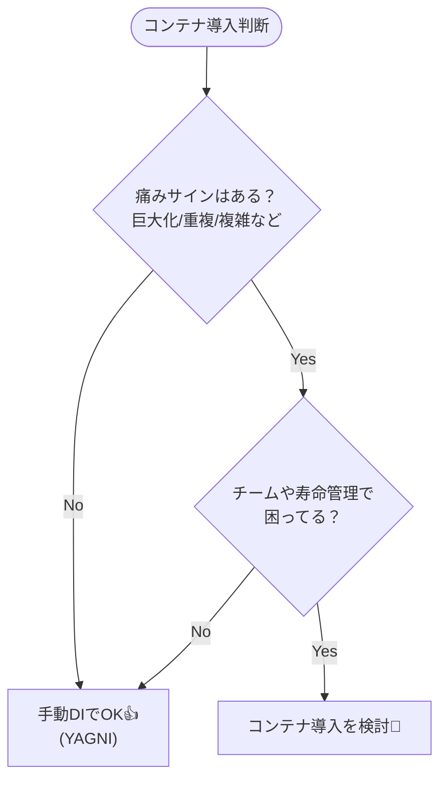

# 第15章：DIコンテナはいつ必要？YAGNIで判断しよう🧰

この章はね、「DIは分かった！でも…DIコンテナ（IoCコンテナ）って、いつ入れるのが正解なの？🤔」を、迷わず判断できるようにする回だよ〜😊💉

※2026年1月16日時点だと、最新の安定版としては **.NET 10（LTS）** が“サポート対象バージョン表”に載ってるよ（最新パッチ 10.0.2 が 2026年1月13日）📅✨ ([Microsoft][1])
（DIの仕組み自体は .NET の標準機能として整備されてる感じだよ〜🧩 ([Microsoft Learn][2])）

---

## 0. 今日の結論（先に安心させるやつ）😌💡

* **DIは「やり方」**（外から渡す）
* **DIコンテナは「道具」**（組み立て・寿命管理を楽にする）
* だから、基本はこれ👇
  **「まず手動DI（Composition Root）で始めて、つらくなったらコンテナ」** 👍🌸
  （Composition Root に閉じ込められてるなら、後から切り替えも比較的ラクだよ〜🧠✨ ([InfoQ][3])）

この発想が **YAGNI（You Aren’t Gonna Need It）** ね！
「必要になる“その日”まで余計な複雑さを増やさない」って考え方😊✨


---

## 1. 「DI」と「DIコンテナ」を混ぜないで！🧃🧊


### DI（依存性注入）💉

* クラスが **依存（ILoggerとかDBとか）を自分で new しない**
* 代わりに **外から渡してもらう**（主にコンストラクタ注入）

### DIコンテナ（IoCコンテナ）🧰

* 「new の順番」や「どれを渡すか」を **自動で解決してくれる道具**
* さらに **ライフタイム（Singleton/Scoped/Transient）** みたいな寿命も面倒見てくれる ([Microsoft Learn][2])

---

## 2. 手動DIがいちばん強い場面（まずここからでOK）🥇✨


第13〜14章でやった「Composition Root に new を集める」スタイルね📍

手動DIのいいところ😊

* 依存の流れが **目で追える** 👀
* デバッグが **超ラク** 🐞✨
* “魔法”が少なくて **初心者に優しい** 🌷
* コンテナの設定ミス（ライフタイム地獄😇）が起きにくい

つまり、**小さめのアプリ / 入口が少ない / 依存が少ない**うちは
**手動DIが正解になりやすい**よ〜🙆‍♀️✨

---

## 3. じゃあ、いつ「コンテナ必要かも…」になるの？🥺🧰


ここからが本題！
「つらさ（痛み）が出てきたら」っていうのを、具体的なサインにするよ📣✨

### ✅ コンテナ導入を考え始める “痛みサイン” 8つ😵‍💫

1. **Composition Root が巨大化して読めない**📚💥

* new が増えすぎて「何作ってるのこれ？」になる

2. **同じ組み立てコードを何度も書いてる**🔁

* Console と バッチ と テスト起動で、毎回ほぼ同じ new 地獄

3. **依存グラフが深くなって、組み立て順がパズル**🧩

* AがBを要り、BがCを要り…「順番あってる？」で疲れる

4. **破棄（Dispose/DisposeAsync）を真面目に管理しないと危ない**🗑️⚠️

* リソース持つもの（DB接続、HTTP関連など）が増えると、寿命管理が難しくなる
* .NET の DI は寿命（ライフタイム）概念で扱うのが基本になってるよ ([Microsoft Learn][2])

5. **「スコープ」みたいな“範囲”の概念が欲しくなる**🧺

* 例：1回の処理単位だけ同じインスタンスを使いたい、など
* Webだと特に Scoped が大事になりがちだよね ([Microsoft Learn][4])

6. **実装の差し替えが増えた（環境別・用途別）**🔁🌍

* 開発用・本番用・テスト用…で差し替えが多い
* さらに最近の .NET は “key つき”で複数実装を扱う仕組みも用意されてる（.NET 8〜）🔑 ([Microsoft Learn][2])

7. **「登録」しておけば勝手につながってほしい欲が出た**🪄

* “一覧に書いとけば自動で配線”が欲しくなる

8. **チーム開発で「組み立ての流儀」を統一したい**👥📏

* 手動DIだと人によって書き方がブレやすい
* コンテナがあると「登録はここ」みたいにルール化しやすい

---

## 4. 逆に「まだ入れなくてOK」サインもあるよ🙆‍♀️🌿

* 依存が少なくて、Composition Root が短い（目で読める）👀
* アプリの入口（起動パターン）が1つだけ（Mainだけ）🚪
* 破棄や寿命管理で困ってない🧹
* 差し替えは少なくて、if や Factory で十分整理できる🍰

こういう時は **「手動DIで十分」** が多いよ〜😊✨

---

## 5. 判断のための “超かんたん診断” 🩺✨


下の質問に「はい」が増えるほど、コンテナ導入が近いよ🧰

* Q1: Composition Root を見て **“うっ…”** ってなる？😇
* Q2: 組み立てコードのコピペが増えてきた？📄📄📄
* Q3: Dispose/寿命/スコープを意識しないと事故りそう？⚠️
* Q4: 差し替えが増えてきた？（開発/本番/テスト）🔁
* Q5: 依存が深くて、組み立て順のミスが増えた？🧩
* Q6: チームで“組み立て方のルール”を統一したい？👥

**目安**：

* 「はい」0〜2個 → まだ手動DIでOK🙆‍♀️
* 「はい」3〜4個 → 迷いどころ（小さく試す価値あり）🤔
* 「はい」5個以上 → コンテナ導入でラクになる可能性大🧰✨



---

## 6. ミニ体験：手動DIがつらくなる瞬間を見てみよ😵➡️😊

### いま（手動DIが余裕）😌

依存が3つくらいなら、こんな感じでスッキリだよね👇

```csharp
// Composition Root（例：Program.cs）
var clock = new SystemClock();
var logger = new ConsoleLogger();
var repo = new FileTodoRepository("todo.json", logger);

var app = new TodoApp(clock, logger, repo);
app.Run();
```

これ、めっちゃ読みやすい😊✨
**この段階でコンテナ入れる理由、あんまりない**のよ（YAGNI👍）

---

### そのうち（増えた…😇）

* Repoが増える
* 設定が増える
* ログの出し先が増える
* バリデーションが増える
* 1回の処理単位の寿命（スコープ）を持ちたくなる

すると Composition Root が“配線作業場”じゃなくて“巨大工場”になって
**読むだけで疲れる**やつになるの🥺💦

ここが、コンテナの出番になりやすいよ🧰✨

---

## 7. コンテナ導入の「最小の成功パターン」🌱✨


この章では実装は次章（第16章）でガッツリやるとして、
**“導入判断”としてのコツ**だけ先に押さえるよ😊

### ✅ 成功しやすい導入の仕方

* **導入しても「Resolve（取り出し）」は外側だけ**

  * つまり **Composition Root から出さない**（クラス内で ServiceProvider を触らない）🚫
* まずは **登録が単純なところから**（ILogger とか）🧾
* ライフタイムは最初は慎重に（よく分からないのに Singleton 多用は危険👑⚠️）

  * .NET のDIは Transient/Scoped/Singleton の概念が基礎だよ ([Microsoft Learn][2])

---

## 8. 章末演習（やさしめ）✍️🌸

### 演習A：あなたのコードで「痛みサイン」数えてみよ🔎

1. 過去の小さめプロジェクトを1つ開く
2. `new` を検索して、**どこに散ってるか**見る
3. “組み立てっぽい場所”が何カ所あるか数える
4. さっきの「8つの痛みサイン」チェック✅

👉 結果をこう書く（メモでOK）

* 痛みサイン：何個
* 今は「手動DIでOK / そろそろコンテナ」どっち？
* 理由は1行で😊

### 演習B：超ミニ ADR（意思決定メモ）を書こう📝✨

* タイトル：「DIコンテナを今は入れない（or 入れる）」
* 理由：痛みサインの結果
* いつ見直す？：「Composition Root が◯行超えたら」とか📏

（Composition Root がちゃんとしてれば、後で方針変えても移行しやすいよ〜 ([InfoQ][3])）

---

## 9. ありがちミス（ここだけ注意してね）⚠️😇

### ❌ ミス1：コンテナを入れた途端に「全部魔法」にする🪄💥

* 依存が見えなくなって、初心者ほど混乱するやつ！

### ❌ ミス2：クラスの中で ServiceProvider を使い始める🎣🚫

* 「必要な時に取りに行く」は、**依存が隠れてテストもしにくくなる**
* これはアンチパターン側に寄っていくので、次の章以降でしっかり避けようね😊

---

## 10. AI（Copilot / Codex）活用テンプレ🤖✨

コピペして使えるやつ置いとくね💕

### ① コンテナ必要か診断してもらう

「このプロジェクトの Composition Root（組み立てコード）を貼るので、
痛みサイン（巨大化・重複・寿命管理・差し替え増など）に照らして、
DIコンテナ導入が有益かどうか、理由付きで判断して。」

### ② “手動DIのまま綺麗にする”案を出してもらう

「コンテナ導入はまだ避けたいです。
手動DIのまま Composition Root を読みやすく保つための分割案（Factory化など）を提案して。」

### ③ 導入するなら“最小ステップ”を作ってもらう

「DIコンテナ導入の最小ステップだけ提案して。
Resolveは外側限定、登録はILoggerとRepoだけ、みたいに小さく始めたい。」

---

## まとめ🎀✨

* **DIは必須スキル**だけど、**DIコンテナは“必要になったら使う道具”**だよ🧰
* まずは **手動DI + Composition Root** で超OK😊
* **痛みサイン**が増えたら、YAGNI的にコンテナ導入を検討しよう👍
* 今どきの .NET は DI が標準機能として整ってる（ライフタイムや複数実装の扱いも含めて）🧩 ([Microsoft Learn][2])
* そして、Composition Root に閉じ込めておけば、コンテナ導入/差し替えも現実的になるよ✨ ([InfoQ][3])

次の第16章で、いよいよ **Microsoft標準のDIコンテナ**を“最小構成”で触っていこうね〜😊🧩💉

[1]: https://dotnet.microsoft.com/en-us/platform/support/policy/dotnet-core?utm_source=chatgpt.com "NET and .NET Core official support policy"
[2]: https://learn.microsoft.com/en-us/dotnet/core/extensions/dependency-injection?utm_source=chatgpt.com "Dependency injection - .NET"
[3]: https://www.infoq.com/articles/DI-Mark-Seemann/?utm_source=chatgpt.com "Dependency Injection with Mark Seemann"
[4]: https://learn.microsoft.com/en-us/aspnet/core/fundamentals/dependency-injection?view=aspnetcore-10.0&utm_source=chatgpt.com "Dependency injection in ASP.NET Core"
