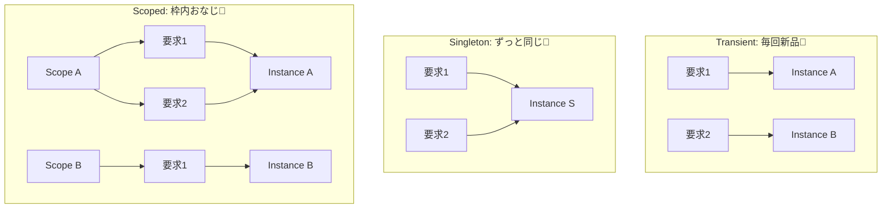

# 第17章：登録の基本：AddTransient / AddSingleton / AddScoped を覚える📝

この章は「DIコンテナに “どう作ってね” ってお願いする」回だよ〜😊
**AddTransient / AddSingleton / AddScoped** の3つを、**まずは雰囲気でOK**レベルまで持っていこう〜🌷

---

## 1) まずは超ざっくり：登録ってなに？📛✨

DIコンテナに対して、

* 「`ILogger` が欲しいって言われたら、`ConsoleLogger` を作って渡してね！」
* 「それ、毎回新品？ それとも共有？ どの範囲で共有？」

みたいな **ルールを登録（register）**するんだよ〜🧾🪄
この“共有のしかた”が **ライフタイム（生存期間）**で、3種類あるよ😊
（.NET のDIはこの3つが基本だよ〜）([Microsoft Learn][1])

---

## 2) 3つの暗記：まずはイメージだけ掴もう🧠✨

### ✅ AddTransient：毎回新品🧼✨


* **解決（Resolve）されるたびに新しいインスタンス**
* 「状態を持たない、軽い処理」向き

### ✅ AddSingleton：アプリで1個を共有👑

* **アプリ全体で1個**（同じものを使い回す）
* 共有＝便利だけど、**状態**を持たせると事故りやすい⚠️
  （スレッドとか同時実行とか…💦）

### ✅ AddScoped：スコープの中で共有🧺

* **ある“範囲（Scope）”の中では同じもの**
* Webだとだいたい「**1リクエスト＝1スコープ**」のイメージだよ🌐([Microsoft Learn][2])

> 覚え方の語感でいくね😆
> **Transient＝一瞬**、**Singleton＝単独**、**Scoped＝範囲内** ✨

---

## 3) ミニ実験で体に入れる：GUIDで寿命チェック🧪✨

ここからは、**同じサービスを2回取り出したら同一か？**を見ていくよ👀
（Scopedは「スコープを作る」がポイント！）

### 3-1) プロジェクト準備（超シンプル）🛠️

Microsoft の公式サンプルでも、コンソールで `ServiceCollection` を作って `ServiceProvider` を作る流れが紹介されてるよ😊([Microsoft Learn][3])

* NuGetで **Microsoft.Extensions.DependencyInjection** を入れる（必要なら）
  ※公式の基礎記事もこのパッケージ前提だよ〜([Microsoft Learn][3])

---

## 4) 実験コード（コピペOK）📎✨

> まずは **どれか1つ**（Transient/Singleton/Scoped）だけ試して、結果を見てね😊
> そのあと登録行を差し替えて、挙動の違いを楽しもう〜🎮💕

```csharp
using Microsoft.Extensions.DependencyInjection;

var services = new ServiceCollection();

// ★ここを差し替えて遊ぶ！👇
// services.AddTransient<CounterService>();
// services.AddSingleton<CounterService>();
services.AddScoped<CounterService>();

using var provider = services.BuildServiceProvider();

Console.WriteLine("=== root provider から直接2回取る ===");
var r1 = provider.GetRequiredService<CounterService>();
var r2 = provider.GetRequiredService<CounterService>();
Console.WriteLine($"root-1: {r1.Id}");
Console.WriteLine($"root-2: {r2.Id}");
Console.WriteLine($"same?  {ReferenceEquals(r1, r2)}");
Console.WriteLine();

Console.WriteLine("=== scope A の中で2回取る ===");
using (var scopeA = provider.CreateScope())
{
    var a1 = scopeA.ServiceProvider.GetRequiredService<CounterService>();
    var a2 = scopeA.ServiceProvider.GetRequiredService<CounterService>();
    Console.WriteLine($"A-1: {a1.Id}");
    Console.WriteLine($"A-2: {a2.Id}");
    Console.WriteLine($"same? {ReferenceEquals(a1, a2)}");
}
Console.WriteLine();

Console.WriteLine("=== scope B の中で2回取る（別スコープ） ===");
using (var scopeB = provider.CreateScope())
{
    var b1 = scopeB.ServiceProvider.GetRequiredService<CounterService>();
    var b2 = scopeB.ServiceProvider.GetRequiredService<CounterService>();
    Console.WriteLine($"B-1: {b1.Id}");
    Console.WriteLine($"B-2: {b2.Id}");
    Console.WriteLine($"same? {ReferenceEquals(b1, b2)}");
}

public sealed class CounterService
{
    public Guid Id { get; } = Guid.NewGuid();
}
```

### 4-1) 期待される結果（ざっくり）🎯

* **Transient**：だいたい全部 `same? False` になりがち🧼
* **Singleton**：だいたい全部 `same? True` になりがち👑
* **Scoped**：

  * scope Aの中は `True` 🧺
  * scope Bとは別物になる（AとBでGuidが変わる）🔁

> ちなみに `.NET` のDIでは “ライフタイム（有効期間）” の考え方が公式ドキュメントにまとまってるよ😊([Microsoft Learn][1])



---

## 5) ここでつまずきやすいポイント集（超大事）⚠️💡

### ⚠️ Scopedを「rootから直接取る」と混乱しやすい😵

コンソールだと「リクエスト」が無いから、**自分で `CreateScope()` を作る**必要があるよ🧺
（Webはリクエストがスコープになってくれるイメージ！）([Microsoft Learn][2])

### ⚠️ Singletonに“状態”を持たせると爆発しやすい💥

「みんなで1個を共有」＝
誰かが書き換えると、別の誰かも影響受ける…みたいなことが起きがち🥲
なので最初は **Singletonは“基本ステートレス”**寄りで考えると安全🌿

---

## 6) 迷ったらコレ：ライフタイム選びの超ざっくり指針🧭✨

* とりあえず迷ったら **Transient**（状態を持たないならだいたい平和）🧼
* 「重くて共有したい」「アプリ全体で同じでいい」→ **Singleton**👑
* 「ある処理のまとまりの間は同じでいてほしい」→ **Scoped**🧺
  （Webだと“1リクエスト中同じ”のことが多いよ）([Microsoft Learn][2])

---

## 7) ミニ課題（10〜15分）✍️✨

### 課題A：3つ全部試して、結果をメモしよ📝

1. `AddTransient` にして実行
2. `AddSingleton` にして実行
3. `AddScoped` にして実行
4. 「どこが True/False になった？」を一言でまとめる😊

### 課題B：サービスを2個に増やす🎛️

* `CounterService` と `MessageService` を作って、片方だけSingletonにしてみてね👑✨
  「混ぜたらどうなる？」が分かると一気に強くなるよ💪

---

## 8) AI活用（コピペで使える）🤖💬✨

### ✅ 自分の設計に合わせて“寿命”を提案してもらう

* 「このサービス一覧を見て、**Transient/Scoped/Singleton** のおすすめを理由つきで提案して。Web前提なら“1リクエスト=1スコープ”として考えて。状態を持つなら注意点も書いて。」

### ✅ 既存コードをDI登録に落とし込む

* 「このクラスたちをDI登録にしたい。**インターフェース案**と **AddXxx の登録例**を出して。迷ったら安全側（Transient寄り）で！」

---

## 9) 本日時点の“いま”メモ（さらっと）🗓️✨

C#の最新機能は **C# 13** として整理されていて、最新SDK側で試せるよ😊([Microsoft Learn][4])
.NET SDKも最新版が更新されてるので、学習中は“最新SDK”でOKだよ〜🧁([Microsoft][5])

---

次の章（第18章）は、「**Resolve（取り出す）をどこでやるべき？**」っていう超重要ルールに入るよ🎣🚫
ここが分かると、DIが一気に“綺麗”になるので楽しみにしててね😊✨

[1]: https://learn.microsoft.com/ja-jp/dotnet/core/extensions/dependency-injection?utm_source=chatgpt.com "NET での依存関係の挿入"
[2]: https://learn.microsoft.com/en-us/aspnet/core/fundamentals/dependency-injection?view=aspnetcore-10.0&utm_source=chatgpt.com "Dependency injection in ASP.NET Core"
[3]: https://learn.microsoft.com/ja-jp/dotnet/core/extensions/dependency-injection-basics?utm_source=chatgpt.com "依存関係の挿入の基礎 - .NET"
[4]: https://learn.microsoft.com/en-us/dotnet/csharp/whats-new/csharp-13?utm_source=chatgpt.com "What's new in C# 13"
[5]: https://dotnet.microsoft.com/en-us/download?utm_source=chatgpt.com "Download .NET (Linux, macOS, and Windows) | .NET"
