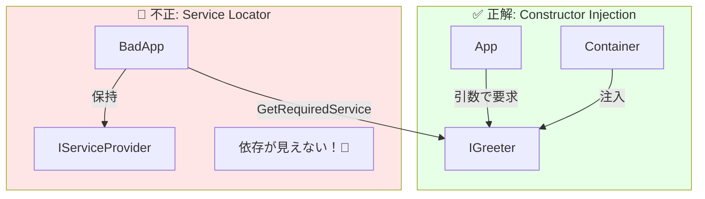

# 第18章：解決（Resolve）の基本：どこで取り出すの？🎣

この章はズバリ、**「DIコンテナから“取り出す（Resolve）”は、どこでやるのが正解？」**を、迷わないようにする回だよ〜☺️🧭

---

### 1) 今日のゴール🎯🌸

読み終わったら、これができるようになるよ👇✨

* **Resolve（取り出し）**が何か説明できる🐣
* **Resolveは“基本、外側でだけやる”**って言い切れる💪
* **クラスの中で `IServiceProvider` を使い始める危険**がわかる🚫😵
* Consoleアプリでも、**キレイなResolveの置き方**ができる🎀

---

### 2) Resolveってなに？🧩🎣


DIコンテナの世界では、

* **登録（Register）**：`builder.Services.Add...` で「こう作ってね」を覚えさせる📝
* **解決（Resolve）**：`GetRequiredService<T>()` とかで「じゃあ作って〜！」って取り出す🎣

この **Resolveをきっかけに、依存関係（オブジェクトグラフ）が“連鎖的に組み立てられる”** のがDIの気持ちいいところだよ〜🥰✨

`.NET` のチュートリアルでも、`IHost` が `IServiceProvider`（登録済みサービスを持つ“箱”）を公開してるよ、って説明されてるよ📦✨ ([Microsoft Learn][1])

---

### 3) いちばん大事な結論🎯（テストにも設計にも効くやつ）


**Resolveは、基本“最外周（Composition Root）だけ”でやる！**📍✨
中のクラス（ビジネスロジック）では **Resolveしない** のがコツだよ🙅‍♀️🚫

Microsoftのガイドラインでも、**Service Locator（必要なときにコンテナから取り出すやり方）を避けてね**ってはっきり言ってるよ✋⚠️ ([Microsoft Learn][2])

---

### 4) まずは正解例：Resolveは「起動場所」で1回だけ▶️✨

Consoleアプリでも、**起動地点（Program.cs）＝Composition Root**に寄せるとスッキリするよ☺️🌷

#### 例：最小の「正しいResolve」構成✅

* `App` がアプリの入口（ユースケース実行役）🎮
* `App` は `IGreeter` に依存（でも `new` しない）💉
* `Program.cs` が **登録して→Buildして→AppをResolveして→実行** 🎣▶️

```csharp
// Program.cs
using Microsoft.Extensions.DependencyInjection;
using Microsoft.Extensions.Hosting;

var builder = Host.CreateApplicationBuilder(args);

// Register（登録）📝
builder.Services.AddTransient<IGreeter, ConsoleGreeter>();
builder.Services.AddTransient<App>();

using IHost host = builder.Build();

// Resolve（解決）🎣 ここは“外側”だけ！
var app = host.Services.GetRequiredService<App>();

await app.RunAsync();
await host.RunAsync(); // ホストのライフサイクルも回す（ログや終了処理のため）
```

```csharp
public interface IGreeter
{
    void Hello(string name);
}

public sealed class ConsoleGreeter : IGreeter
{
    public void Hello(string name) => Console.WriteLine($"Hello, {name}!");
}

public sealed class App(IGreeter greeter)
{
    public Task RunAsync()
    {
        greeter.Hello("DI");
        return Task.CompletedTask;
    }
}
```

この形、Microsoft Learn の例でも `Host.CreateApplicationBuilder` → `Build()` → `host.Services` を使う流れが出てくるよ🧩✨ ([Microsoft Learn][1])

---

### 5) “やっちゃダメ”例：クラス内Resolve（Service Locator）🚫🕳️


次みたいに、クラスが `IServiceProvider` を握って、必要になったら取り出す…は **超ありがちだけど危険**😵‍💫

```csharp
public sealed class BadApp(IServiceProvider sp)
{
    public void Run()
    {
        // うわ〜！中でResolveし始めた！🚫
        var greeter = sp.GetRequiredService<IGreeter>();
        greeter.Hello("DI");
    }
}
```

これの何がイヤかというと…👇😭

* **依存が見えない**（コンストラクタを見ると `IServiceProvider` しかない）🙈
* テストで「何を差し替えればいいの？」が分かりにくい🧪💦
* 依存が増えても気づきにくく、設計が太っていく🍔📈

だからガイドラインでも「Service Locator を避けてね」って言ってるんだよ〜⚠️ ([Microsoft Learn][2])

✅直し方は簡単：**必要な依存は“引数に出す”**（＝コンストラクタ注入）💉✨
つまり、さっきの `App(IGreeter greeter)` みたいにするのが正解だよ☺️🎀



---

### 6) 「でもScoped使うとき、どこでResolveするの？」🧺🤔


いい質問〜！✨
**Scopedは“スコープ境界”が必要**だから、Consoleだと自分でスコープを作ることがあるよ🧺

Microsoft Learn の例でも、`CreateScope()` して、その `ServiceProvider` から `GetRequiredService` してるよ📌 ([Microsoft Learn][1])

#### 例：1回の処理（1ユースケース）ごとにスコープを作る🧺✨

```csharp
using var scope = host.Services.CreateScope();
var app = scope.ServiceProvider.GetRequiredService<App>();
await app.RunAsync();
```

ポイントはここ👇🌟

* **スコープを作るのも“外側”**（Composition Root側）🧭
* 内側のクラスは、相変わらず **依存を引数でもらうだけ**💉

---

### 7) ついでに超重要⚠️：「BuildServiceProvider」を途中で呼ばないで！🙅‍♀️


登録中に `services.BuildServiceProvider()` を呼んで「ちょっと取り出して確認…」みたいなの、やりがちなんだけど…
ガイドラインで **避けてね**って明言されてるよ⚠️ ([Microsoft Learn][2])

ざっくり言うと👇😵

* **“別の箱”ができちゃう**ことがあって、Singletonの扱いなどがややこしくなる💥
* 依存の組み立てや破棄（Dispose）が読みにくくなる🧨

「どうしても登録時に何か必要」なら、**`IServiceProvider` を受け取れるオーバーロード（factory）**を使う方向が安全だよ〜🛡️✨ ([Microsoft Learn][2])

---

### 8) 章末まとめ📌✨（この章の“暗記”はこれだけでOK！）


**Resolveの3ルール**だよ〜🧁💕

1. **Resolveは外側（Composition Root）でだけ**🎣📍
2. 中のクラスは **依存を引数で受け取る（見える化）**💉👀
3. クラス内で `IServiceProvider` 使い始めたら **黄色信号**🚦💦（Service Locator になりやすい） ([Microsoft Learn][2])

---

### 9) ミニ練習問題✍️🧠✨

**Q1**：次のうち “良い” のはどれ？（理由も一言で😊）

A) `new HttpClient()` をサービスの中で毎回やる
B) `Program.cs` で `host.Services.GetRequiredService<App>()` して `app.Run()`
C) `class X(IServiceProvider sp)` が必要に応じて `sp.GetRequiredService<Y>()`

**Q2**：`IServiceProvider` をアプリ中に持ち回し始めたとき、困ることを2つ言ってみて〜🙈

---

### 10) AI活用コーナー🤖✨（Copilot/Codex向けの使い方）

そのまま貼って使えるよ〜💌🌸

* 「このコード、**Service Locator っぽい箇所**を指摘して、**コンストラクタ注入に直して**」🕵️‍♀️🔧
* 「`GetRequiredService` を **Program.cs以外で呼んでる場所**を見つけて、改善案を出して」🔎✨
* 「このアプリの **Composition Root をどこに置くべきか**提案して」📍🧭
* 「依存関係を **矢印図（A→B→C）** で説明して」➡️➡️➡️

---

次の第19章では、いよいよ **Transient（毎回新品）** を“体感で理解”していくよ〜🧼✨

[1]: https://learn.microsoft.com/en-us/dotnet/core/extensions/dependency-injection-usage "Use dependency injection - .NET | Microsoft Learn"
[2]: https://learn.microsoft.com/en-us/dotnet/core/extensions/dependency-injection-guidelines "Dependency injection guidelines - .NET | Microsoft Learn"
