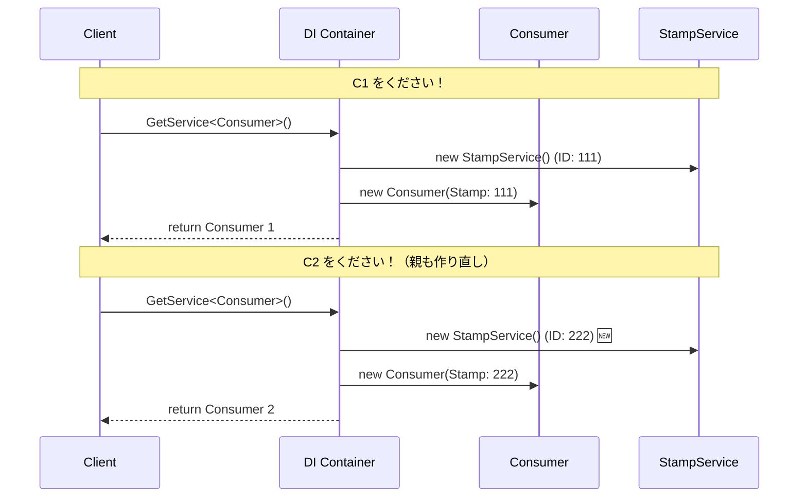
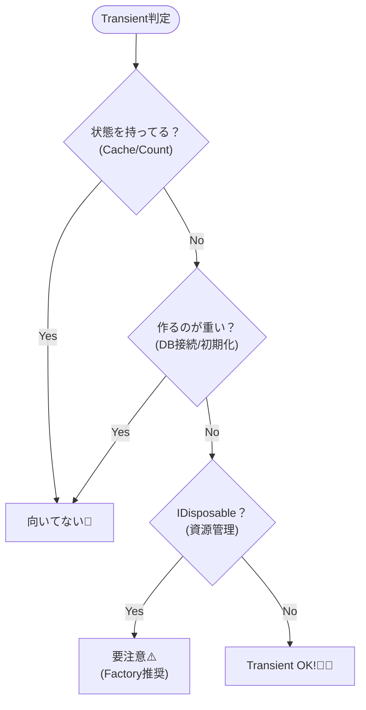

# 第19章：ライフタイム①：Transient（毎回新品）🧼

## この章のゴール🎯

* 「Transient＝**呼ばれるたびに新しいインスタンス**」を説明できる😊
* 「どんなサービスがTransient向きか」を**3秒で判断**できるようになる🧠⚡
* Transientの**落とし穴（特に IDisposable ）**を避けられるようになる🕳️🚫

（2026/01/16時点の最新版メモ：.NET は **.NET 10.0（10.0.2 / 2026-01-13）**が “latest” 扱いだよ🆕✨） ([Microsoft][1])

---

## 1) そもそも「ライフタイム」って何？⏳

DIコンテナに登録するとき、サービスに「寿命」を決めるんだけど、その1つが **Transient** だよ💡
Microsoftの公式説明だと、Transientはこう👇

* **コンテナから要求されるたびに作られる**
* リクエストを処理するタイプのアプリ（Webなど）では、**リクエストの最後で破棄される**
  ([Microsoft Learn][2])

---

## 2) Transient って結局なに？一言で🧼

**Transient＝「毎回新品」**✨


コンテナに「これお願い」って言うたびに、新しいインスタンスがポンッと作られる感じだよ😊 ([Microsoft Learn][2])

たとえば…

* 使い捨ての紙コップ🥤（毎回新しい）
* 使い捨ての付箋📝（毎回新しい）
  みたいなノリ！

---

## 3) 体感しよう：本当に毎回別物？👀✨（ミニ実験）

「同じ型を2回取り出したら、IDが違う！」を見てみよう💨

```csharp
using Microsoft.Extensions.DependencyInjection;

var services = new ServiceCollection();

// Transient登録（毎回新品）
services.AddTransient<StampService>();

using var provider = services.BuildServiceProvider();

var a = provider.GetRequiredService<StampService>();
var b = provider.GetRequiredService<StampService>();

Console.WriteLine($"A: {a.InstanceId}");
Console.WriteLine($"B: {b.InstanceId}");

public sealed class StampService
{
    public Guid InstanceId { get; } = Guid.NewGuid();
}
```

✅ 期待する結果：A と B の Guid が **別** になる🎉
（＝毎回 new されてるのと同じ感覚！）

---

## 4) 「要求されるたび」って、どのタイミング？🎣


Transient が作られるのは、だいたいこの2パターン👇

### パターンA：自分で GetRequiredService したとき

さっきの実験みたいに、取り出すたびに新品🧼

### パターンB：誰かのコンストラクタ引数として必要になったとき

「このクラスを作るために、この依存が必要だよね？」ってなった瞬間に、新品が用意される感じ✨

---

## 5) もう一段だけ理解：同じクラスを作り直すとどうなる？🔁


「親」も「子」も Transient にすると、親を作るたびに子も新品！になるよ😊

```csharp
using Microsoft.Extensions.DependencyInjection;

var services = new ServiceCollection();
services.AddTransient<StampService>();
services.AddTransient<Consumer>();

using var provider = services.BuildServiceProvider();

var c1 = provider.GetRequiredService<Consumer>();
var c2 = provider.GetRequiredService<Consumer>();

Console.WriteLine($"C1 -> {c1.Stamp.InstanceId}");
Console.WriteLine($"C2 -> {c2.Stamp.InstanceId}");

public sealed class Consumer
{
    public StampService Stamp { get; }
    public Consumer(StampService stamp) => Stamp = stamp;
}

public sealed class StampService
{
    public Guid InstanceId { get; } = Guid.NewGuid();
}
```

✅ 期待：C1 と C2 の Stamp が別IDになる✨
（親を作り直した＝依存も作り直されがち、って感覚ね）




---

## 6) Transient が得意なもの🧁✨（使いどころ）


Transientが似合うのは、だいたいこういう子たち👇

* **状態を持たない**（Stateless）計算・判定・変換系
  例：価格計算、フォーマッター、バリデーター、マッパー、文字列整形など🧮🧾
* **軽い**（作るコストが小さい）
* **毎回作り直してOK**（共有する必要がない）

覚え方はこれ👇
**「軽い・状態なし・使い捨て」＝Transient** 🧼✨

---

## 7) 注意ポイント⚠️：Transientは“毎回作る”ぶんコストがある💸

公式にも「毎回解決＆構築されるので、リクエストごとに割り当て（アロケーション）が増えるよ」って書いてあるよ📌 ([Microsoft Learn][2])
だから、**重いもの・頻繁に作るとつらいもの**は、他ライフタイムの方が合うことがあるよ（次章以降でやるよ😉）

---

## 8) いちばん大事な落とし穴：IDisposable × Transient 🧨

ここ、超大事！🧯💦


### ありがちな事故😵

* Transient で IDisposable（ファイル/ソケット/DB接続みたいな資源）を登録
* さらにそれを **ルート（root scope）**で解決しちゃう
  → 破棄タイミングがズレて「資源が残る」系のトラブルになりやすい🫠

Microsoftのガイドラインでは、ざっくりこう言ってるよ👇

* **IDisposable を Transient で登録しない**（基本はファクトリで手動破棄できる形にする）
* **Transient/Scoped の IDisposable を root scope で解決しない**（例外はあるけど理想ではない）
  ([Microsoft Learn][3])

✅ 今日の結論（この章の安全ルール）
**「IDisposableっぽい資源は、Transientで雑に扱わない」** 🧯✨
（どう扱うのが良いかは、ガイドラインにある “factory pattern” 方向が基本だよ） ([Microsoft Learn][3])

---

## 9) 3秒で決める！Transient 判定ミニフロー🧠⚡


次の質問に「うん！」が多いほど Transient 向きだよ😊

* 状態を持たない？🧼
* 軽い？🪶
* 共有しなくていい？🔁
* 毎回作っても困らない？👌

逆に、こんな匂いがしたら Transient は要注意👃⚠️

* 何かを保持してる（キャッシュ/セッション/カウントなど）📦
* 作るのが重い（初期化が高い）🏋️
* IDisposable（資源）っぽい🧨 ([Microsoft Learn][3])



---

## 10) ミニ演習（手を動かそう）✍️💖

### 演習1：Transient向き/不向きを分類してみよう🗂️

次を「Transient向き」「違うかも」に分けてみてね😊

* 日付取得サービス（時計）⏰
* 文字列フォーマッター📝
* DBアクセス（DbContextとか）🗄️
* HTTPで外部API叩くクライアント🌐
* 住所の正規化（文字整形）🏠

（ヒント：DbContext は “短い単位で使い捨て” 前提で語られることが多いよ） ([Microsoft Learn][4])

### 演習2：Consumer の中で2つ同じ依存を受け取ったら？🧪

Consumer のコンストラクタを「StampService を2個」受け取る形にして、IDがどうなるか見てみてね👀✨
（同じ型2回＝2回要求＝2回新品、になりやすいよ🧼）

---

## 11) 章末チェッククイズ✅🎯（5問）

1. Transient は「いつ」インスタンスが作られる？🧼
2. Webみたいな “リクエストを処理するアプリ” では、Transient はだいたい「いつ」破棄される？🧹 ([Microsoft Learn][2])
3. Stateless なフォーマッターは Transient 向き？😊
4. IDisposable を Transient で登録するのは、原則おすすめ？🧨 ([Microsoft Learn][3])
5. 「重い初期化があるサービス」を Transient にしたら、何が起きやすい？💸

---

## 12) AI（Copilot/Codex）活用プロンプト例🤖✨

そのままコピペでOKだよ😊

* 「このクラス、状態を持ってる？Transient向きか判定して、理由も短く教えて」
* 「AddTransient の挙動が分かる最小の Console サンプルを作って（Guidで比較して）」
* 「このサービスを Stateless に寄せるリファクタ案を3つ出して（責務分割も含めて）」
* 「IDisposable を Transient で扱うときの注意点と、factory pattern の簡単例を出して」 ([Microsoft Learn][3])

---

次の第20章は **Singleton（1個共有）👑** に進むよ〜！
Transientと真逆の“長生きさん”だから、比較するとめっちゃ理解が深まるよ😊✨

[1]: https://dotnet.microsoft.com/en-us/download/dotnet "Browse all .NET versions to download | .NET"
[2]: https://learn.microsoft.com/en-us/dotnet/core/extensions/dependency-injection "Dependency injection - .NET | Microsoft Learn"
[3]: https://learn.microsoft.com/en-us/dotnet/core/extensions/dependency-injection-guidelines "Dependency injection guidelines - .NET | Microsoft Learn"
[4]: https://learn.microsoft.com/en-us/ef/core/dbcontext-configuration/?utm_source=chatgpt.com "DbContext Lifetime, Configuration, and Initialization"
