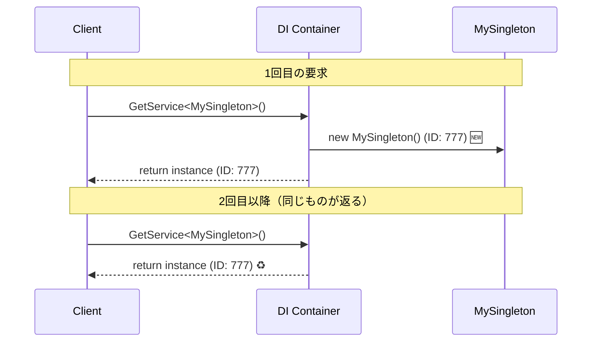
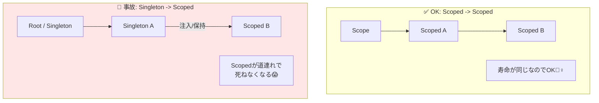

# 第20章：ライフタイム②：Singleton（1個共有）👑

〜便利だけど、扱いミスると“地雷”になりがち編💣〜

---

### この章のゴール🎯✨

* Singleton が「アプリ全体で1個だけ共有される」って腹落ちする😊
* **Singletonに向くもの／向かないもの**が判断できる🧠
* **ありがちな事故（状態・スレッド・スコープ）**を避けられるようになる🚧

---

## 1) Singletonって、いったい何？👀

**Singleton = “そのDIコンテナの中で、ずーっと同じインスタンスを使い回す”** って意味だよ♻️✨


つまり、同じアプリの中で **何回 Resolve しても同一人物（同一インスタンス）** が出てくる感じ👤👤👤➡️👤

ポイントはここ👇

* Singleton は **「DIコンテナ（root service provider）」にぶら下がる**
* root service provider は **アプリ起動〜終了まで生きる**（アプリ終了時に破棄される）([Microsoft Learn][1])

---

## 2) まずは体感！「本当に同じ？」実験しよ🧪✨

“同じインスタンス感”は **Guid（ID）** を出すと一発でわかるよ😆

### 手順（コンソールでOK）🎮

* `Microsoft.Extensions.Hosting` を使って Host を作る（いまどきの例だと `net10.0` で進められる）([Microsoft Learn][2])

#### サンプル（Singletonの同一性チェック）✅

```csharp
using Microsoft.Extensions.DependencyInjection;
using Microsoft.Extensions.Hosting;

var host = Host.CreateDefaultBuilder(args)
    .ConfigureServices(services =>
    {
        services.AddSingleton<MySingleton>();
    })
    .Build();

// どこで取っても同じ？
var a = host.Services.GetRequiredService<MySingleton>();
var b = host.Services.GetRequiredService<MySingleton>();

Console.WriteLine($"a.Id = {a.Id}");
Console.WriteLine($"b.Id = {b.Id}");

// スコープ作って取っても同じ？
using (var scope = host.Services.CreateScope())
{
    var c = scope.ServiceProvider.GetRequiredService<MySingleton>();
    Console.WriteLine($"c.Id = {c.Id}");
}

await host.StopAsync();

public class MySingleton
{
    public Guid Id { get; } = Guid.NewGuid();
}
```

期待する結果💡

* `a.Id` と `b.Id` と `c.Id` が **全部同じ** になったら成功🎉




---

## 3) Singletonが“めちゃ便利”な典型パターン🌟


Singletonは **「状態を持たない」or「状態を持っても安全」** なものに向くよ👍✨

### 向いてる例🍀

* **設定の読み取り役**（基本読み取り専用）📘
* **軽いキャッシュ**（スレッドセーフ前提）🧊
* **正規表現のコンパイル済み**みたいな“再利用したい重いもの”⚡
* **HTTP通信**：作り直しを避けたい（ただしやり方は後述！）🌐

特に HttpClient は「毎回 new して捨てる」のが危険になりがちで、**再利用**が推奨されてるよ（接続プールやポート枯渇の話）([Microsoft Learn][3])

---

## 4) Singletonの“事故りポイント”💥（ここ超大事）

Singletonは便利だけど、事故の代表格がこの3つ👇

### 事故①：状態（mutable）を持たせてぐちゃぐちゃ😵‍💫


Singletonはみんなで共有するから、**誰かが値を変えると全員に影響**するよ🌀

たとえば「回数カウンタ」をSingletonに入れると…

* どこから呼ばれた回数なのか混ざる
* テスト順で結果が変わる
* Webだと同時アクセスで壊れやすい

#### ダメになりやすい例（スレッドで壊れるかも）⚠️

```csharp
public class CounterSingleton
{
    public int Count { get; private set; }
    public int Next()
    {
        Count++;              // ← 同時に来ると壊れやすい
        return Count;
    }
}
```

**対策**（初心者向けの結論）🧸

* まずは **Singletonに状態を持たせない** のが最強🌿
* どうしても必要なら **lock / Interlocked / Concurrentコレクション** を検討🔒

---

### 事故②：SingletonにScopedを入れてしまう（スコープ違反）🚫


これ、DI初心者が一番踏む地雷かも💣

.NET の既定DIは、開発環境（Development）だとチェックしてくれて👇

* **Scoped を root から Resolve してない？**
* **Scoped を Singleton に注入してない？**
  を検証してくれるよ([Microsoft Learn][1])

さらに怖い話：
Scoped が root で作られると、**実質Singleton化（アプリ終了まで破棄されない）**しちゃう…って明記されてる😱([Microsoft Learn][1])

✅ 超シンプルな直し方

* 「リクエストごと・処理ごとに変わるもの」なら **Singletonじゃなくて Scoped にする**🧺
* 「毎回新規でいいもの」は Transient🧼



---

### 事故③：Singletonの中で “new” しまくってDIの意味が消える🫥


Singletonにすると「一回だけnewだしOK」って気持ちになりやすいんだけど…
そこで **new を抱え込む**と、差し替えができなくなるよ😢

✅ ルール（覚えやすい版）

* Singletonでも **依存はコンストラクタで受け取る**💉✨
* new は **Composition Root 側に寄せる**（第13章でやったやつ📍）

---

## 5) HttpClientとSingleton、どう考える？🌐🧠


結論：**“毎回 new HttpClient()” は避けたい**。
で、推奨ルートは大きく2つあるよ👇

1. **長生きHttpClient（static / Singleton）＋ PooledConnectionLifetime**
2. **IHttpClientFactory で短命Clientを作る（中身のHandlerはプールされる）**([Microsoft Learn][3])

初心者はまず「AddHttpClient を使う」ほうが事故りにくいことが多い☺️

```csharp
services.AddHttpClient(); // IHttpClientFactory を使えるようにする
```

---

## 6) 章末ミニまとめ📝✨（ここだけ覚えても勝てる）

* Singleton = **アプリ全体で同一インスタンスを共有**👑
* Singletonは **状態を持たない**が基本（持つならスレッドセーフ必須）🔒
* **ScopedをSingletonに混ぜない！**（開発環境では検出される）([Microsoft Learn][1])
* HttpClientは **再利用が推奨**（Factory or 長生きClient）([Microsoft Learn][3])

---

## 7) チェック問題（5問）🎯😺

1. Singletonは「どの範囲」で1個？（メソッド内？クラス内？アプリ内？）
2. Singletonに「Listを持たせてログを溜める」…何が怖い？
3. Scopedをrootで作ると、何が起きうる？([Microsoft Learn][1])
4. 開発環境で「Scoped→Singleton注入」を検出する仕組み、何がチェックしてる？([Microsoft Learn][1])
5. HttpClientを毎回 new/dispose すると何が起きうる？([Microsoft Learn][3])

---

## 8) AI拡張（Copilot / Codex）に投げると強いプロンプト集🤖✨

* 「このクラスをSingletonにして安全？“状態”と“スレッドセーフ”観点でレビューして」
* 「この登録、ScopedをSingletonに注入してない？危険ポイントを指摘して」
* 「このSingletonが保持していいデータ／ダメなデータを分類して」
* 「HttpClientの実装、推奨（Factory or 長生きClient）に寄せて修正案出して」([Microsoft Learn][3])

---

必要なら次で、**“SingletonにScopedが必要になったときの正しい逃がし方（IServiceScopeFactoryでスコープ作る）”**も、超やさしく実演するよ🧺✨（背景処理やバッチでめっちゃ使うやつ！）

[1]: https://learn.microsoft.com/en-us/dotnet/core/extensions/dependency-injection "Dependency injection - .NET | Microsoft Learn"
[2]: https://learn.microsoft.com/ja-jp/dotnet/core/extensions/dependency-injection-usage "依存関係の挿入を使用する - .NET | Microsoft Learn"
[3]: https://learn.microsoft.com/en-us/dotnet/fundamentals/networking/http/httpclient-guidelines "HttpClient guidelines for .NET - .NET | Microsoft Learn"
