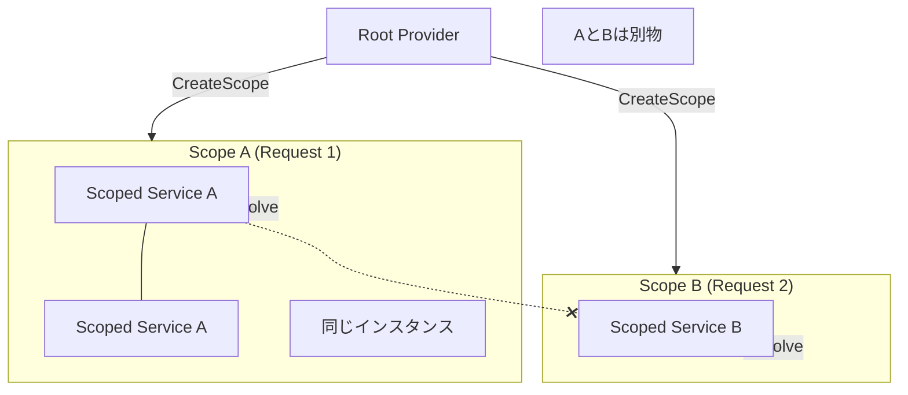

# 第21章：ライフタイム③：Scoped（範囲内で共有）🧺

## この章のゴール🎯

* **Scoped＝「ある範囲（スコープ）の中では同じインスタンス」**って説明できる😊
* 「どの“範囲”？」を **Web（1リクエスト）** と **Console（自分で作る）** でイメージできる🌐⌨️
* **事故りやすいポイント（Singleton×Scoped）** を避けられるようになる🚧⚠️

---

## 1) Scopedってなに？超ざっくり言うと…🧠💡

**Scoped は「スコープ（範囲）ごとに1個」**だよ🧺

* **同じスコープ内**で何回取り出しても👉 **同じインスタンス**
* **別スコープ**になると👉 **別インスタンス**に切り替わる

公式ドキュメントでも、Scoped は「スコープごとに作られる」って説明されてるよ📘✨ ([Microsoft Learn][1])

---

## 2) “スコープ（範囲）”ってどこ？🌐⌨️

### 🌐 Web（ASP.NET Core）だと


**だいたい「1リクエスト＝1スコープ」**のイメージでOK😊
`AddScoped` は **「1リクエストの寿命」**として紹介されてるよ📘 ([Microsoft Learn][2])
さらに、Webアプリでは scoped サービスは **リクエストの終わりで Dispose される**（片付けられる）って説明もあるよ🧹 ([Microsoft Learn][3])

### ⌨️ Consoleアプリだと

リクエストが無いから、**自分でスコープを作る**よ！
`CreateScope()` を使って「今からこの範囲ね〜」って箱を作る感じ🧺✨



---

## 3) Scopedの“挙動”を手で触って理解しよう🧪✨（ConsoleでOK）


### やりたいこと🎯

* 同じスコープで2回解決👉同じインスタンス？
* スコープを分けたら👉別インスタンス？
* スコープが終わると👉Disposeされる？

#### サンプルコード（そのまま貼ってOK）📎💕

```csharp
using Microsoft.Extensions.DependencyInjection;

var services = new ServiceCollection();

services.AddScoped<IStamp, Stamp>();

// 事故検知をON（おすすめ）✨
using var provider = services.BuildServiceProvider(new ServiceProviderOptions
{
    ValidateScopes = true,
    ValidateOnBuild = true,
});

Console.WriteLine("---- Scope A ----");
using (var scopeA = provider.CreateScope())
{
    var a1 = scopeA.ServiceProvider.GetRequiredService<IStamp>();
    var a2 = scopeA.ServiceProvider.GetRequiredService<IStamp>();

    Console.WriteLine($"A1 Id = {a1.Id}");
    Console.WriteLine($"A2 Id = {a2.Id}");
    Console.WriteLine($"Same instance in Scope A? {ReferenceEquals(a1, a2)}");
}

Console.WriteLine("---- Scope B ----");
using (var scopeB = provider.CreateScope())
{
    var b1 = scopeB.ServiceProvider.GetRequiredService<IStamp>();
    Console.WriteLine($"B1 Id = {b1.Id}");
}

Console.WriteLine("Done!");

public interface IStamp
{
    Guid Id { get; }
}

public sealed class Stamp : IStamp, IDisposable
{
    public Guid Id { get; } = Guid.NewGuid();

    public void Dispose()
    {
        Console.WriteLine($"[Dispose] Stamp {Id}");
    }
}
```

### 期待する動き👀✨

* Scope A の `a1` と `a2` は **同じId**（＝同じインスタンス）になりやすい✅
* Scope B の `b1` は **別Id**（＝別インスタンス）になる✅
* Scope A/B を抜けたタイミングで **[Dispose]** が出る🧹✨

---

## 4) Scopedがちょうどいい場面💝

### 「その範囲の中だけ、ちょっと状態を共有したい」系🧺

* **DBアクセス（DbContext）**：1リクエスト中は同じコンテキストを使いたい
* **Unit of Work**：1リクエスト（or 1処理）をひとまとまりに扱いたい
* **リクエスト内キャッシュ**：同じ計算を何回もしたくない
* **ユーザーコンテキスト（認証情報など）**：リクエスト中だけ共有したい

特に `AddDbContext` は **DbContext を scoped で登録するのがデフォルト**って明記されてるよ📘 ([Microsoft Learn][4])

---

## 5) Scopedで事故りがちなところ⚠️（ここ超大事！）

### 🚫 事故①：Singleton が Scoped を握りしめる（捕まえる）


例）Singletonサービスのコンストラクタで scoped を受け取る
👉 すると scoped が **実質ずっと生き続ける**（or 破綻）みたいな変な状態に😱

公式ガイドでも **「scoped を捕まえる singleton を検出するために scope validation を有効にしてね」**って方針が書かれてるよ🔍 ([Microsoft Learn][5])

### 🚫 事故②：スコープ無しで scoped を root から解決しちゃう

Console で `provider.GetRequiredService<ScopedService>()` を雑にやると、意図せず「ルートの寿命」で扱われてしまってややこしくなりがち😵
👉 だからさっきのサンプルみたいに **ValidateScopes をON**がおすすめ✨ ([Microsoft Learn][5])

---

## 6) 「でも…Singleton（BackgroundService）から scoped 使いたい時あるよね？」🤔💭

ある！ぜんぜんある！
そのときは **IServiceScopeFactory で都度スコープを作る**のが公式のやり方だよ🧺✨
（HostedService/BackgroundService にはデフォでスコープが無いので、自分で作る必要があるって説明されてるよ） ([Microsoft Learn][6])

イメージ👇

* ループ1回＝1スコープ
* その中で DbContext など scoped を解決して使う
* スコープ終了で Dispose 🧹✨

---

## 7) 覚え方（暗記じゃなくてイメージ）🧠💞


* **Transient**：呼ぶたび新品🧼
* **Scoped**：**“この箱（範囲）”の中だけ同じ**🧺
* **Singleton**：アプリ全体で1個👑

Scopedは「**セッションのトレー**」みたいに思うとラクだよ🍽️
同じトレーの上では同じ調味料（同じインスタンス）を使うけど、トレーが変われば別の調味料になる、みたいな😊✨

---

## 8) AI拡張（Copilot / Codex等）での学び方🤖💖

そのまま使えるプロンプト例👇

* 「このクラスは Transient / Scoped / Singleton のどれが適切？理由も3つ」
* 「この依存関係で “Singleton が Scoped を掴んでる” 事故が起きる可能性ある？図で説明して」
* 「Consoleアプリで scoped の挙動が分かる最小サンプル作って」

---

## 章末チェック✅（3つ言えたら勝ち！🎉）

* Scoped は **スコープごとに1個**🧺
* Webではだいたい **1リクエスト＝1スコープ**🌐 ([Microsoft Learn][2])
* Singleton から scoped が必要なら **IServiceScopeFactory で CreateScope**🧺✨ ([Microsoft Learn][6])

---

## ミニクイズ🎯💗

1. `DbContext` はだいたいどのライフタイムが向いてる？（理由も）
2. 同じスコープ内で `GetRequiredService<T>()` を2回呼ぶとどうなる？
3. `BackgroundService` で scoped を使う時、まず何を作る？

---

次の章（第22章）が「設定（Options）をDIで扱う」なら、Scoped とめちゃ相性いいので、ここで掴んだ“箱（スコープ）感”がそのまま効いてくるよ〜🎛️💞

[1]: https://learn.microsoft.com/en-us/dotnet/api/microsoft.extensions.dependencyinjection.servicelifetime?view=net-10.0-pp&utm_source=chatgpt.com "ServiceLifetime Enum"
[2]: https://learn.microsoft.com/en-us/aspnet/core/fundamentals/dependency-injection?view=aspnetcore-10.0&utm_source=chatgpt.com "Dependency injection in ASP.NET Core"
[3]: https://learn.microsoft.com/en-us/dotnet/core/extensions/dependency-injection?utm_source=chatgpt.com "Dependency injection - .NET"
[4]: https://learn.microsoft.com/en-us/ef/core/dbcontext-configuration/?utm_source=chatgpt.com "DbContext Lifetime, Configuration, and Initialization"
[5]: https://learn.microsoft.com/en-us/dotnet/core/extensions/dependency-injection-guidelines?utm_source=chatgpt.com "Dependency injection guidelines - .NET"
[6]: https://learn.microsoft.com/en-us/dotnet/core/extensions/scoped-service?utm_source=chatgpt.com "Use scoped services within a BackgroundService - .NET"
