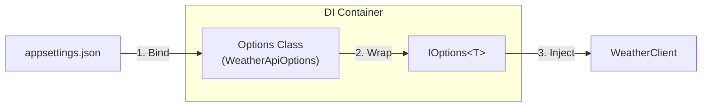

# 第22章：設定（Options）をDIで扱う：ハードコード卒業🎛️

この章は「設定値」も**立派な依存（Dependency）**として扱って、コードをスッキリ＆安全にする回だよ〜😊💉
（最近の .NET では Options パターンが“標準の型安全なやり方”として整理されてるよ）([Microsoft Learn][1])

---

## この章のゴール🎯🌸

* `appsettings.json` の設定を **クラスにして** 受け取れる（型安全）✨([Microsoft Learn][1])
* `IOptions<T>` / `IOptionsSnapshot<T>` / `IOptionsMonitor<T>` の使い分けがわかる👀([Microsoft Learn][1])
* 起動時に設定ミスを検知して、**早めに落とせる**（ValidateOnStart）✅([Microsoft Learn][2])
* 「設定が変わったら追従したい」もできる（Monitor）🔁([Microsoft Learn][1])

---

## 1) まず“ハードコード地獄”を卒業しよ😵➡️😊

### こういうの、見覚えある？🧩

* APIのURLがコードに直書き🌐
* タイムアウトが謎の数字でベタ書き⏱️
* 開発と本番で値が違うのに、if文だらけ🙈

**つらい理由**はこれ👇

* 値を変えるたびにビルド＆デプロイが必要😇
* どこに設定があるか探すのが大変🔎
* テスト時に設定差し替えが面倒🧪

そこで登場するのが **Options パターン**だよ🎛️✨([Microsoft Learn][1])

---

## 2) Options パターンってなに？（超ざっくり）🍰


**「設定のまとまり」＝「C#のクラス」**にして、DIで受け取るやり方だよ😊
たとえば「天気API設定」を `WeatherApiOptions` みたいにする感じ🌤️

* 設定：`appsettings.json`（セクションでグルーピング）
* 受け皿：`WeatherApiOptions`（型付き）
* 受け取り：`IOptions<WeatherApiOptions>` など



---

## 3) ミニ実装で体に入れよ💪✨（天気APIの例🌤️）

### (A) appsettings.json を作る📝

```json
{
  "WeatherApi": {
    "BaseUrl": "https://example.com/",
    "TimeoutSeconds": 5
  }
}
```

### (B) Optionsクラス（設定の“入れ物”）を作る🎁

```csharp
using System.ComponentModel.DataAnnotations;

public sealed class WeatherApiOptions
{
    public const string SectionName = "WeatherApi";

    [Required]
    [Url]
    public string BaseUrl { get; init; } = "";

    [Range(1, 60)]
    public int TimeoutSeconds { get; init; } = 5;
}
```

ポイント😊

* `SectionName` を置くと、紐づけが迷子になりにくいよ🧭
* `[Required]` `[Range]` みたいに **バリデーション**も書ける✅（あとで起動時チェックするよ）

### (C) Program.cs で「設定→Options」へBindしてDI登録💉

（.NET 10 世代の書き方でOKだよ〜）([Microsoft][3])

```csharp
using Microsoft.Extensions.DependencyInjection;
using Microsoft.Extensions.Hosting;

var builder = Host.CreateApplicationBuilder(args);

// Options登録：設定セクションをクラスへバインド🎛️
builder.Services
    .AddOptions<WeatherApiOptions>()
    .Bind(builder.Configuration.GetSection(WeatherApiOptions.SectionName))
    .ValidateDataAnnotations()
    .ValidateOnStart(); // 起動時に設定ミスを検出して落とす✅

builder.Services.AddSingleton<WeatherClient>();
builder.Services.AddHostedService<DemoHostedService>();

using var host = builder.Build();
await host.RunAsync();
```

`ValidateOnStart()` は「実行してから爆発💥」じゃなくて「起動時に気づく✅」にできる機能だよ〜！([Microsoft Learn][2])

### (D) 使う側：IOptionsで受け取る🎣

```csharp
using Microsoft.Extensions.Options;

public sealed class WeatherClient
{
    private readonly WeatherApiOptions _opt;

    public WeatherClient(IOptions<WeatherApiOptions> options)
    {
        _opt = options.Value;
    }

    public string Describe()
        => $"BaseUrl={_opt.BaseUrl}, Timeout={_opt.TimeoutSeconds}s";
}
```

### (E) 動かす（HostedServiceで確認）▶️

```csharp
using Microsoft.Extensions.Hosting;
using System.Threading;
using System.Threading.Tasks;

public sealed class DemoHostedService : IHostedService
{
    private readonly WeatherClient _client;

    public DemoHostedService(WeatherClient client) => _client = client;

    public Task StartAsync(CancellationToken cancellationToken)
    {
        Console.WriteLine(_client.Describe());
        return Task.CompletedTask;
    }

    public Task StopAsync(CancellationToken cancellationToken) => Task.CompletedTask;
}
```

---

## 4) IOptions / Snapshot / Monitor の使い分け🍱✨

ここが一番大事かも👀
「設定が変わる可能性ある？」で選ぶと迷いにくいよ〜！

### ✅ IOptions<T>

* 基本の読み取り
* **起動後に設定ファイルが変わっても反映されない**（固定でOKな設定向き）([Microsoft Learn][1])

### ✅ IOptionsSnapshot<T>

* Webアプリなどで「**リクエストごと**に取り直したい」向き
* **Scoped**（スコープ単位）([Microsoft Learn][4])

### ✅ IOptionsMonitor<T>

* 「動いてる最中に設定が変わったら追従したい」向き🔁
* **Singletonでも使いやすい**（いつでも最新を取れる）([Microsoft Learn][4])
* `OnChange` で変更イベントも取れる🎉

---

## 5) “設定変更に追従”してみる（IOptionsMonitor）🔁✨

```csharp
using Microsoft.Extensions.Options;

public sealed class WeatherClient
{
    private readonly IOptionsMonitor<WeatherApiOptions> _monitor;

    public WeatherClient(IOptionsMonitor<WeatherApiOptions> monitor)
    {
        _monitor = monitor;

        _monitor.OnChange(opt =>
        {
            Console.WriteLine($"🎛️ 設定変わったよ！ BaseUrl={opt.BaseUrl}");
        });
    }

    public string Describe()
    {
        var opt = _monitor.CurrentValue;
        return $"BaseUrl={opt.BaseUrl}, Timeout={opt.TimeoutSeconds}s";
    }
}
```

「起動後の変更を読みたいなら Snapshot / Monitor を使う」っていうのが公式の整理だよ🧠✨([Microsoft Learn][1])

---

## 6) よくある事故と対策🚧🙈

### 事故①：セクション名がズレて、全部デフォルト値😇

* `"WeatherApi"` と `SectionName` が合ってるかチェック✅
* 対策：`ValidateOnStart()`＋`ValidateDataAnnotations()` が超効く🛡️([Microsoft Learn][2])

### 事故②：設定ミスに気づくのが“実行中”💥

* 対策：やっぱり `ValidateOnStart()` ✅（起動時に落としてくれる）([Microsoft Learn][2])

### 事故③：サービスに `IConfiguration` を直接注入しがち

* できるけど、乱用すると「どこで何を読んでるか」が見えにくいよ〜🙈
* 対策：基本は Options に寄せる（セクション単位で“意味のある設定の塊”にする）🎛️([Microsoft Learn][1])

---

## 7) テストがめっちゃ楽になる裏ワザ🧪💖

Options は **テストで差し替えやすい**のが最高ポイント✨

```csharp
using Microsoft.Extensions.Options;
using Xunit;

public class WeatherClientTests
{
    [Fact]
    public void Describe_includes_values()
    {
        var opt = Options.Create(new WeatherApiOptions
        {
            BaseUrl = "https://test/",
            TimeoutSeconds = 9
        });

        var client = new WeatherClient(opt);

        Assert.Contains("https://test/", client.Describe());
    }
}
```

「設定は外から渡せる＝テストが楽」って、DIの気持ちよさが出るところだよ〜🥰

---

## 8) ちょい上級：設定バインドを“生成コード”で速く＆安全に（おまけ）⚡🤖

.NET 8 から **Configuration binding source generator** が入ってて、反射ベースのバインドを避けたいときに使えるよ（AOT/トリミングにも嬉しい）([Microsoft Learn][5])
必要なら csproj にこれ👇

```xml
<PropertyGroup>
  <EnableConfigurationBindingGenerator>true</EnableConfigurationBindingGenerator>
</PropertyGroup>
```

「普段の開発で必須！」ってほどじゃないけど、“最新の流れ”として知っておくと強い💪✨

---

## 9) 演習（手を動かすコーナー）✍️🌷

### 演習1：ハードコードをOptionsへ引っ越し🚚

* `TimeoutSeconds = 5` みたいな直書きを探して、`appsettings.json`へ
* `XxxOptions` を作って `Bind()` して、サービスは `IOptions<XxxOptions>` で受け取る💉

### 演習2：わざと壊して ValidateOnStart で守る🛡️

* `BaseUrl` を空にして起動してみる
* 「ちゃんと起動時に止まる？」を確認✅([Microsoft Learn][2])

### 演習3：IOptionsMonitor で変更通知🔁

* 実行中に `appsettings.json` の `TimeoutSeconds` を変えてみて、`OnChange` が動くか確認🎉([Microsoft Learn][1])

---

## 10) Copilot / AI拡張の使いどころ🤖✨（そのままコピペOK）

* 「このコード内のハードコード設定っぽい値を列挙して、Optionsにまとめる案を出して」
* 「appsettings.json のセクション設計を提案して。将来項目が増えても破綻しない形で」
* 「Optionsクラスに DataAnnotations のバリデーションを付けて、起動時検証も入れた Program.cs を生成して」
* 「IOptions / Snapshot / Monitor のどれが適切か、私の要件（設定が実行中に変わる/変わらない）から判断して理由も説明して」

---

## まとめ🎀🏁

* 設定値も依存！だから **Optionsで型安全にDI**が気持ちいい🎛️💉([Microsoft Learn][1])
* 起動時に設定ミスを潰すなら `ValidateOnStart()` ✅([Microsoft Learn][2])
* 実行中に変わるなら `IOptionsMonitor`、リクエスト単位なら `IOptionsSnapshot`🔁([Microsoft Learn][4])

次の章（第23章）は、同じ“外部寄りの依存”である **ログ（ILogger）** をDIで気持ちよく扱うよ〜🧾✨

[1]: https://learn.microsoft.com/en-us/dotnet/core/extensions/options?utm_source=chatgpt.com "Options pattern - .NET"
[2]: https://learn.microsoft.com/ja-jp/dotnet/api/microsoft.extensions.dependencyinjection.optionsbuilderextensions.validateonstart?view=net-9.0-pp&viewFallbackFrom=net-8.0&utm_source=chatgpt.com "OptionsBuilderExtensions.ValidateOnStart<TOptions ..."
[3]: https://dotnet.microsoft.com/en-us/download/dotnet?utm_source=chatgpt.com "Browse all .NET versions to download | .NET"
[4]: https://learn.microsoft.com/en-us/aspnet/core/fundamentals/configuration/options?view=aspnetcore-10.0&utm_source=chatgpt.com "Options pattern in ASP.NET Core"
[5]: https://learn.microsoft.com/en-us/dotnet/core/extensions/configuration-generator?utm_source=chatgpt.com "Compile-time configuration source generation - .NET"
