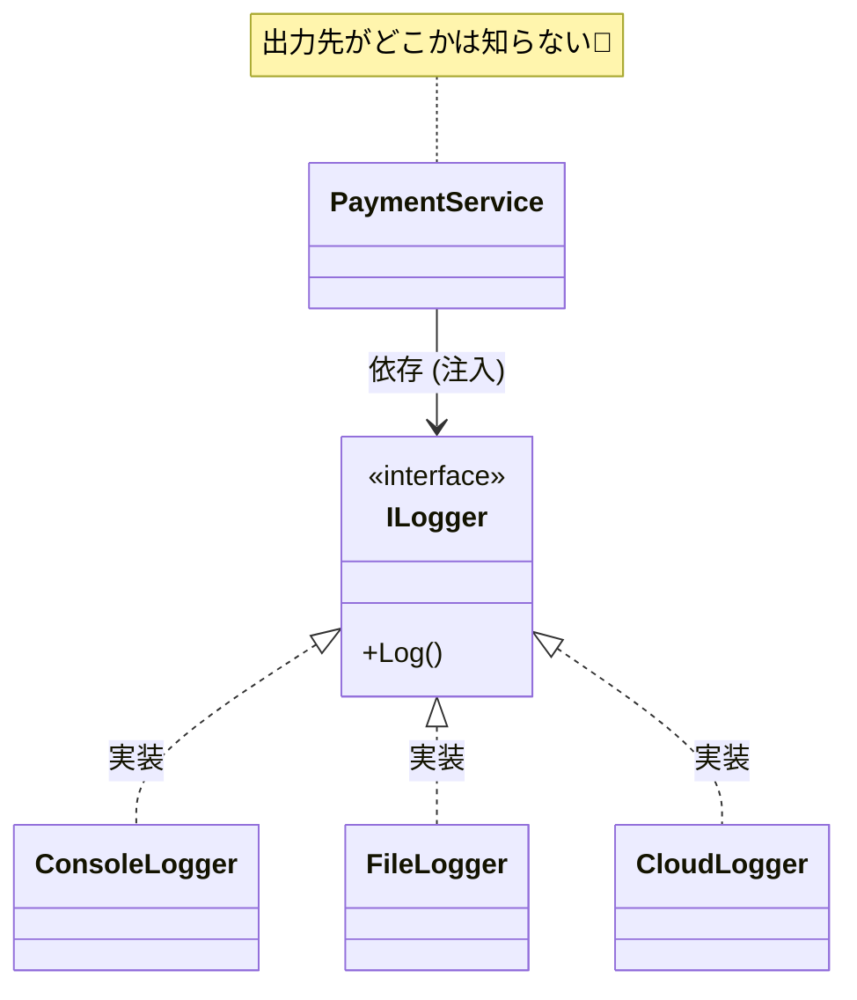

# 第23章：ログをDIで扱う：ILoggerの気持ち良さ🧾✨

この章のテーマはズバリ👇
**「ログも “外部I/O” だから、DIで差し替えできるようにすると超ラク」** です😊✨

([Past chat][1])([Past chat][2])([Past chat][3])([Past chat][4])

---

## 1) この章でできるようになること🎯

* `ILogger<T>` を **コンストラクタ注入**で受け取ってログを出せる💉
* **ログレベル**（Information / Warning / Error…）を使い分けできる🚦
* `{UserId}` みたいな **構造化ログ**（あとで検索しやすいログ）を書ける🔍✨
* **テストでログを検査**できる（ダミーLoggerでOK）🧪💕

---

## 2) なんで「ログ」をDIで扱うの？🤔🧾


ログって、アプリの外に出る情報だよね（コンソール、デバッグ出力、Windowsイベントログ、クラウド監視…）🌍
つまりログは **外部I/O寄り**で、状況によって出し先や粒度が変わりがち。

DIにしておくと👇

* 開発中：コンソール＋デバッグに出す👩‍💻
* 本番：監視基盤に送る📡
* テスト：メモリに貯めて検査する🧪

みたいに、**中身のロジックを変えずに差し替え**できるのが最高なんだよね😊✨



---

## 3) `ILogger<T>` の基本（ここだけ押さえればOK）💡

### ✅ `ILogger<T>` ってなに？

* `T` は「このクラスのログですよ〜」っていう **カテゴリ名**になる🏷️
* DIコンテナが **適切なカテゴリのLoggerを自動で用意して注入**してくれる✨（なければ `ILoggerFactory` から作ってくれる） ([Microsoft Learn][5])
* カテゴリ名は「ログがどのクラスから出たか」を追いやすくするのが目的😊
  → 公式も「クラス名（完全修飾名）をカテゴリにするのがおすすめ」って言ってるよ ([Microsoft Learn][5])

---

## 4) まずは動かそう！3分ハンズオン⌛✨（Generic Host版）

`Host.CreateApplicationBuilder()` は、最初から **標準のログプロバイダ**が入ってるのが便利〜！
（Workerテンプレだと、Console / Debug / EventSource / EventLog(Windowsのみ) が最初から追加されるよ） ([Microsoft Learn][6])

### ✅ 最小サンプル：`ILogger<T>` を注入してログ出力🧾

**Program.cs（1ファイルでもOK）**👇

```csharp
using Microsoft.Extensions.DependencyInjection;
using Microsoft.Extensions.Hosting;
using Microsoft.Extensions.Logging;

var builder = Host.CreateApplicationBuilder(args);

// いったんログの出し先を「分かりやすいコンソール」に寄せる✨
builder.Logging.ClearProviders();
builder.Logging.AddConsole();

builder.Services.AddTransient<PaymentService>();

using var host = builder.Build();

var svc = host.Services.GetRequiredService<PaymentService>();
svc.Pay(userId: 42, amountYen: 1200);

public sealed class PaymentService
{
    private readonly ILogger<PaymentService> _logger;

    public PaymentService(ILogger<PaymentService> logger)
        => _logger = logger;

    public void Pay(int userId, int amountYen)
    {
        _logger.LogInformation("Pay start: UserId={UserId}, AmountYen={AmountYen}", userId, amountYen);

        if (amountYen <= 0)
        {
            _logger.LogWarning("Invalid amount: UserId={UserId}, AmountYen={AmountYen}", userId, amountYen);
            return;
        }

        // ここに本当の支払い処理がある想定✨
        _logger.LogInformation("Pay success: UserId={UserId}", userId);
    }
}
```

### 🌟ポイント

* `"Pay start: ... {UserId} ..."` の `{UserId}` は **構造化ログ**（あとで検索・集計しやすい）🔍✨
* `ClearProviders()`→`AddConsole()` で「どこに出るか」を明確にできる（デバッグでも追いやすい）🧭 ([Microsoft Learn][6])

---

## 5) ログレベルの使い分け🚦✨（超ざっくりルール）

* `LogTrace`：細かすぎる追跡（普段はOFF）🧵
* `LogDebug`：開発中に便利（本番は抑えがち）🔧
* `LogInformation`：通常の流れ（開始・終了・重要な状態）📝
* `LogWarning`：ちょい危険（想定外だけど継続できる）⚠️
* `LogError`：失敗（例外・処理失敗）💥
* `LogCritical`：致命的（サービス継続が危ない）🚨

---

## 6) 例外をログに残す基本形💥🧾

例外は **例外オブジェクトも一緒に渡す**のがコツだよ👇

```csharp
try
{
    // 何かの処理
}
catch (Exception ex)
{
    _logger.LogError(ex, "Payment failed: UserId={UserId}", userId);
    throw; // 必要なら再スロー
}
```

✅ これで「メッセージ」＋「スタックトレース」も追いやすくなる✨

---

## 7) スコープで「関連するログ」をひとまとまりにする🧺✨

「このリクエストのログ全部に `TraceId` つけたい〜！」みたいな時に便利😊

```csharp
using (_logger.BeginScope("TraceId={TraceId}", traceId))
{
    _logger.LogInformation("Step1");
    _logger.LogInformation("Step2");
}
```

---

## 8) 章末課題：ログをテストで確認しよう🧪💖（ダミーLogger）

「ログが出たか」をテストしたいとき、**本物のログ出力先は使わず**、メモリに貯めるダミーでOK🙆‍♀️✨

### ✅ すごく小さい `TestLogger<T>`（最低限）

```csharp
using Microsoft.Extensions.Logging;
using System.Collections.Concurrent;

public sealed class TestLogger<T> : ILogger<T>
{
    public ConcurrentQueue<(LogLevel Level, string Message, Exception? Exception)> Entries { get; } = new();

    public IDisposable BeginScope<TState>(TState state) => NullScope.Instance;
    public bool IsEnabled(LogLevel logLevel) => true;

    public void Log<TState>(LogLevel logLevel, EventId eventId,
        TState state, Exception? exception, Func<TState, Exception?, string> formatter)
    {
        Entries.Enqueue((logLevel, formatter(state, exception), exception));
    }

    private sealed class NullScope : IDisposable
    {
        public static readonly NullScope Instance = new();
        public void Dispose() { }
    }
}
```

### ✅ テスト例（超ミニ）

（xUnit想定。雰囲気だけでもOKだよ😊）

```csharp
using Xunit;

public class PaymentServiceTests
{
    [Fact]
    public void Pay_amount_is_invalid_logs_warning()
    {
        var logger = new TestLogger<PaymentService>();
        var svc = new PaymentService(logger);

        svc.Pay(userId: 1, amountYen: 0);

        Assert.Contains(logger.Entries, x => x.Level == Microsoft.Extensions.Logging.LogLevel.Warning
            && x.Message.Contains("Invalid amount"));
    }
}
```

---

## 9) よくある落とし穴🕳️（ここだけ注意！）

* ❌ **ログに個人情報・秘密情報をそのまま出す**（パスワード、トークン等）🙅‍♀️
* ❌ なんでも `Information` にして **ログが洪水**🌊
* ❌ 例外を握りつぶして「ログだけ出してOK」にしちゃう（境界で方針を決めよ）🧭
* ✅ 基本は `ILogger<T>` を注入（Factoryを握るのは必要な時だけ）💉 ([Microsoft Learn][5])

---

## 10) AI（Copilot / Codex）活用プロンプト🤖✨

* 「このクラスに `ILogger<T>` を注入して、開始・終了・失敗のログを追加して」🧾
* 「このログを構造化ログ（`{Name}` プレースホルダ）に直して」🔍
* 「Warningにすべき条件と、Errorにすべき条件を提案して」🚦
* 「このテスト用に、ログを収集できる簡単な `ILogger` を実装して」🧪

---

## 11) まとめチェック✅💕

* [ ] ログは “外部I/O寄り” だからDIで差し替えると楽✨
* [ ] `ILogger<T>` はコンストラクタ注入で受け取れる💉 ([Microsoft Learn][5])
* [ ] `{UserId}` みたいな構造化ログが書ける🔍
* [ ] テストではダミーLoggerでログを検査できる🧪

---

次の章（第24章）は「HTTPをDIで扱う」だったよね🌐✨
ログと同じく外部I/Oだから、今回の感覚がそのまま効いてくるよ〜😊

[1]: https://chatgpt.com/c/6969c593-bd70-8320-8507-2aa653405665 "設計優先度教材整理"
[2]: https://chatgpt.com/c/69690ad9-0ce4-832e-a944-8fb4ea2c503d "DIの最小（コンストラクタ注入）"
[3]: https://chatgpt.com/c/69687554-3ab4-8322-9e87-cb627a09f60b "DIコンテナ入門"
[4]: https://chatgpt.com/c/6960a009-4138-8323-824c-797f1f7af76e "DIとComposition Root■■■"
[5]: https://learn.microsoft.com/en-us/dotnet/core/extensions/logging "Logging in C# - .NET | Microsoft Learn"
[6]: https://learn.microsoft.com/ja-jp/dotnet/core/extensions/logging-providers "ログ記録提供者 - .NET | Microsoft Learn"
