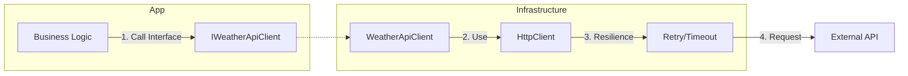

# 第24章：HTTPをDIで扱う：外部APIとの付き合い方🌐

外部APIって便利だけど、**失敗しやすいポイント**も多いの…！😵‍💫
この章では、HTTP通信を「外の世界（I/O）」としてキレイに隔離して、**差し替え可能＆テストしやすい**形にしていくよ〜🧪💖

---

## 1. 今日のゴール🎯✨

章末でこうなれたら勝ち〜！🏁😆

* ✅ `HttpClient` を **直接 new しない**理由が分かる
* ✅ `IHttpClientFactory`（`AddHttpClient`）で **安全にHttpClientをDI**できる
* ✅ 外部API呼び出しを **インターフェース（口）で包んで**、差し替えできる
* ✅ “リトライ・タイムアウト”などの **回復力（resilience）**を付けられる🌟
* ✅ “外部通信があるのにテストできる”を体験できる🧪✨

※ちなみに 2026-01-16 時点だと .NET 10 が最新LTSで、10.0.2 が最新パッチだよ〜📌 ([Microsoft][1])

---

## 2. まず知っておく「HTTPあるある地雷」💣😇

### 地雷①：毎回 `new HttpClient()` しちゃう🙈

`HttpClient` は内部で接続（コネクション）をプールしてるから、**使い捨てを繰り返すとポート枯渇**みたいな事故が起きやすいの💥
（だから「使い回せ」って話になる） ([Microsoft Learn][2])

### 地雷②：DNS変更に弱い（気づきにくい）🫠

`HttpClient` は「接続を作るとき」にDNS解決するので、DNSが変わっても追従しないことがあるよ〜。
対策として `PooledConnectionLifetime` で接続の寿命を区切る、という話が出てくる🌿 ([Microsoft Learn][2])

### 地雷③：外部API直呼びがロジックに混ざる🍱⚡

ロジックの中にHTTPが入り込むと、

* テストがつらい😵
* 仕様変更で巻き込まれる😵‍💫
* 例外処理が散らかる😇
  …ってなる！

---

## 3. 今日の設計の型：Port & Adapter（差し替え口＋外側の実装）🧩🔌


イメージはこう👇✨

* **内側（アプリのロジック）**：`IWeatherApiClient` みたいな **インターフェースだけを見る**👀
* **外側（HTTP実装）**：`WeatherApiClient` が `HttpClient` を使って通信する🌐
* **組み立て（Composition Root）**：`AddHttpClient` で登録して注入する💉

「内側は外部APIの都合を知らない」状態が作れたら超えらい！🥳



---

## 4. 実装してみよう（小さめ題材）☁️📡✨

題材：`WeatherService` が `IWeatherApiClient` を使って天気を取る（風）🌤️
※外部APIのURLは例だよ〜（雰囲気重視！）😊

---

### 4.1 まずは“差し替え口”を作る（インターフェース）🧷✨

```csharp
public interface IWeatherApiClient
{
    Task<WeatherDto> GetCurrentAsync(string city, CancellationToken ct);
}

public sealed record WeatherDto(string City, double TemperatureC);
```

ポイント📌

* `CancellationToken` を **必ず受け取る**のが大人っぽい✨（タイムアウトや中断に強くなる）

---

### 4.2 HTTPの実装（Adapter）を書く🌐🧱

typed client 方式（クラスのコンストラクタで `HttpClient` を受け取る）にするよ〜💉

```csharp
using System.Net.Http.Json;
using Microsoft.Extensions.Logging;

public sealed class WeatherApiClient : IWeatherApiClient
{
    private readonly HttpClient _http;
    private readonly ILogger<WeatherApiClient> _logger;

    public WeatherApiClient(HttpClient http, ILogger<WeatherApiClient> logger)
    {
        _http = http;
        _logger = logger;
    }

    public async Task<WeatherDto> GetCurrentAsync(string city, CancellationToken ct)
    {
        // 例：/weather/current?city=Tokyo みたいなAPIを想定
        var path = $"/weather/current?city={Uri.EscapeDataString(city)}";

        try
        {
            var dto = await _http.GetFromJsonAsync<WeatherDto>(path, ct);

            if (dto is null)
                throw new InvalidOperationException("API response was empty.");

            return dto;
        }
        catch (OperationCanceledException)
        {
            _logger.LogWarning("Weather API request was canceled (timeout or user cancel). City={City}", city);
            throw;
        }
        catch (HttpRequestException ex)
        {
            _logger.LogWarning(ex, "Weather API request failed. City={City}", city);
            throw;
        }
    }
}
```

ポイント🌸

* `HttpRequestException` / `OperationCanceledException` を分けてログに残すと、あとでデバッグが楽🕵️‍♀️✨
* ここ（外側）で例外が起きるのはOK。**内側のロジックにHTTPの事情を持ち込まない**のが目的だよ🧁

---

### 4.3 DI登録：`AddHttpClient` で安全に注入する🧰💉

`IHttpClientFactory` を使うと、ハンドラのプールやDNSまわりを面倒みてくれて、ログも乗せやすいよ〜✨ ([Microsoft Learn][3])

```csharp
using Microsoft.Extensions.DependencyInjection;

var services = new ServiceCollection();

services.AddLogging();

// typed client（インターフェース + 実装）をAddHttpClientで登録
services.AddHttpClient<IWeatherApiClient, WeatherApiClient>(client =>
{
    client.BaseAddress = new Uri("https://api.example.com"); // 例
    client.Timeout = TimeSpan.FromSeconds(10);
    client.DefaultRequestHeaders.UserAgent.ParseAdd("MyApp/1.0");
});
```

さらに一歩👣✨
.NET の “標準回復力” を付けられるよ！（リトライ・タイムアウト・サーキットブレーカなど）🛡️
`AddStandardResilienceHandler()` が公式で案内されてる✨ ([Microsoft Learn][4])

```csharp
services.AddHttpClient<IWeatherApiClient, WeatherApiClient>(client =>
{
    client.BaseAddress = new Uri("https://api.example.com");
})
.AddStandardResilienceHandler(options =>
{
    // 重要：POSTなどはリトライすると二重登録事故の可能性があるよ😱
    options.Retry.DisableForUnsafeHttpMethods();
});
```

この「POSTは危ないからリトライ止めよう」って注意、公式にもはっきり書いてあるよ🧯 ([Microsoft Learn][4])

（※標準回復力のデフォルトが何を積むか、まで載ってるよ：レート制限・総タイムアウト・リトライ・サーキットブレーカ・試行タイムアウト、みたいな順番！） ([Microsoft Learn][4])

---

### 4.4 ロジック側（内側）は“口だけ見る”🧁✨

```csharp
public sealed class WeatherService
{
    private readonly IWeatherApiClient _api;

    public WeatherService(IWeatherApiClient api)
    {
        _api = api;
    }

    public async Task<string> GetMessageAsync(string city, CancellationToken ct)
    {
        var weather = await _api.GetCurrentAsync(city, ct);
        return $"{weather.City} は {weather.TemperatureC:0.#}℃ だよ〜🌡️✨";
    }
}
```

登録して、Composition Root で起動！

```csharp
services.AddTransient<WeatherService>();

using var provider = services.BuildServiceProvider();

var svc = provider.GetRequiredService<WeatherService>();
Console.WriteLine(await svc.GetMessageAsync("Tokyo", CancellationToken.None));
```

---

## 5. テストが“差し替えだけ”でできる🧪💖（ここがDIの気持ちよさ！）

外部APIを呼ばない Fake を作って差し替えるだけ〜🥳

```csharp
public sealed class FakeWeatherApiClient : IWeatherApiClient
{
    public Task<WeatherDto> GetCurrentAsync(string city, CancellationToken ct)
        => Task.FromResult(new WeatherDto(city, 25.0));
}
```

```csharp
// ざっくりテスト例（雰囲気）
var svc = new WeatherService(new FakeWeatherApiClient());
var msg = await svc.GetMessageAsync("Tokyo", CancellationToken.None);

if (!msg.Contains("25"))
    throw new Exception("Expected temperature in message!");
```

「HTTPがあるのにテストできる」って最高だよね〜🧁🧪✨

---

## 6. ありがちな落とし穴まとめ🚧😵‍💫

### ❌ “factoryで作ったHttpClientを長期間握りしめる”問題🤝🧊

`IHttpClientFactory` で作ったクライアントは **短命で使う想定**で、作った後は工場側が制御できないよ、って注意があるの📝 ([Microsoft Learn][2])
（＝どこかにずっと保持すると、ハンドラ更新やDNS追従のメリットが薄れることがある）

### ❌ Cookie が必要な用途で雑に使う🍪😇

Cookie を使うアプリだと、ハンドラのプールで `CookieContainer` が共有されたり、寿命でCookieが消えたり…みたいな注意があるよ⚠️ ([Microsoft Learn][5])

### ❌ “とりあえずリトライ”で事故る🔁💥

POST/PUT/DELETE をリトライすると二重処理になる可能性…！
標準回復力でも「危険メソッドは止めよう」が用意されてるよ🧯 ([Microsoft Learn][4])

---

## 7. AI活用（Copilot / Codex）おすすめの使い方🤖✨

### ① まず“設計の骨”を作らせる🦴

* 「`IWeatherApiClient` と `WeatherApiClient` の雛形を作って」
* 「`CancellationToken` を全部に通して」

### ② “落とし穴チェック”をさせる🕵️‍♀️

* 「このHttpClientの使い方、地雷ある？」
* 「リトライが危ないHTTPメソッドは？」（→ POST系の注意が出るはず）

### ③ “テスト用Fake”を自動生成🧪

* 「このインターフェースのFakeを作って」
* 「WeatherServiceのユニットテスト3ケース出して」

コツは、**AIに全部を任せず**「部品」と「レビュー」に使うことだよ〜😊🔧✨

---

## 8. 章末ミニ課題🎒✨

### 課題A（基本）🌟

* `IBookApiClient` を作って、`GetBookAsync(isbn)` を実装してみて📚
* `BookService` から呼んで、文字列を組み立てて返す✍️

### 課題B（ちょい上）🛡️

* `AddStandardResilienceHandler()` を付けてみる
* unsafe HTTP method のリトライを無効化する（ワンポイントでOK） ([Microsoft Learn][4])

### 課題C（テスト）🧪

* `FakeBookApiClient` を作って `BookService` をテスト！

---

## 9. まとめ🎀✨（ここだけ覚えて帰ってOK！）

* HTTPは **外の世界（I/O）** 🌐
* 内側は **インターフェースだけを見る** 👀
* 外側に `HttpClient` 実装（Adapter）を置く🧱
* `AddHttpClient` でDIすると、プールやDNS問題に強くなる✨ ([Microsoft Learn][3])
* 標準回復力（resilience）も公式ルートで付けられる🛡️ ([Microsoft Learn][4])

---

次の章（第25章）は「DIがあるとテストがラクになる」をもっと本格的に体験するところだよ〜🧪💖
もしこの章の例を「Web API版（Minimal API）」に寄せたサンプルにしたいなら、その形でも作れるよ😊✨

[1]: https://dotnet.microsoft.com/en-us/platform/support/policy "The official .NET support policy | .NET"
[2]: https://learn.microsoft.com/en-us/dotnet/fundamentals/networking/http/httpclient-guidelines "HttpClient guidelines for .NET - .NET | Microsoft Learn"
[3]: https://learn.microsoft.com/en-us/aspnet/core/fundamentals/http-requests?view=aspnetcore-10.0 "Make HTTP requests using IHttpClientFactory in ASP.NET Core | Microsoft Learn"
[4]: https://learn.microsoft.com/en-us/dotnet/core/resilience/http-resilience "Build resilient HTTP apps: Key development patterns - .NET | Microsoft Learn"
[5]: https://learn.microsoft.com/en-us/dotnet/core/extensions/httpclient-factory "Use the IHttpClientFactory - .NET | Microsoft Learn"
