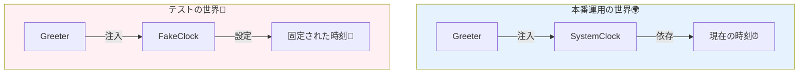

# 第25章：テストの入口：DIがあるとテストがラクになる🧪💖

ここからは「DIって、テストで本領発揮するんだ…！」を体験する章だよ〜😊✨
DIができると、**本物（外部）を使わずに、テスト用の偽物（Fake/Stub）に差し替え**できるから、テストが一気にやりやすくなるの💉🧸

ちなみに本日時点だと、.NET は **.NET 10（LTS）**が現行で、2026/01/13時点で 10.0.2 が出てるよ📦✨ ([Microsoft][1])
C# も **C# 14** の新機能がまとまってる（Visual Studio 2026 / .NET 10 SDK で試せる）って流れだよ〜🧁 ([Microsoft Learn][2])

---

## 1) この章でできるようになること🎯✨

* 「テストしやすい設計」って何かを、**DIで説明**できる😊
* **Fake/Stub** を手で作って、**ユニットテスト**を書ける🧪
* 「時間（DateTime.Now）」みたいな**ブレる要素**を差し替えて安定テストできる⏰🧸
* テストが落ちたときに「どこが悪いか」を追いやすくなる🔎✨

---

## 2) なんでDIだとテストがラクなの？💡🧩


テストって、本当はこうしたいの👇

* **外部（DB/HTTP/現在時刻/ファイル/乱数）に振り回されず**
* **毎回同じ条件で**
* **小さく、速く、安定して**確認したい🏃‍♀️💨

でも、クラスの中で `new` してたり、`DateTime.Now` を直で読んでたりすると…

* テストのたびに時間が変わる⏰💦
* ネットワークが遅い/落ちてる🌐😵
* データが環境に依存する🗄️😵‍💫

ってなって、**テストが「運ゲー」**になるの…🥺🎲

DIしておくと、こうできるよ👇

* 本番：本物の `SystemClock` を注入⏰✅
* テスト：固定時刻の `FakeClock` を注入⏰🧸

つまり、**テストが自分で世界をコントロールできる**ようになるの✨🪄

（この「差し替えできる入口」を用意する発想が DI の美味しいところだよ🍰）

---

## 3) 用語をやさしく整理🍀（Fake / Stub / Mock）

この章は **Fake/Stub** をメインにするよ〜😊
Mock は次の章で「呼ばれ方を検査する」に進むよ🕵️‍♀️✨

* **Fake（フェイク）**：テスト用の “ニセモノ実装” 🧸

  * 例：固定の時刻を返す時計、メモリに貯めるリポジトリ
* **Stub（スタブ）**：決まった値を返すだけの簡易版📦

  * 例：常に `true` を返す認証、常に固定レスポンスのAPI
* **Mock（モック）**：呼ばれた回数や引数を検査する🕵️‍♀️

  * これは次章で！✨

---

## 4) 実例：`DateTime.Now` 地獄を卒業しよう⏰🚪

### ❌ DIなし（テストしにくい例）😵

「朝9時より前は “おはよう”、それ以降は “こんにちは”」みたいな挨拶を作るとするね🌞

* クラスの中で `DateTime.Now` を読む
  → テストが**実行した瞬間の時刻**に依存しちゃう💦

---

## 5) ✅ DIあり：`IClock` を注入して、時間を差し替える💉⏰

### 5-1) 本番コード（テストしやすい設計）✨

```csharp
// IClock.cs
public interface IClock
{
    DateTimeOffset Now { get; }
}

// SystemClock.cs（本番用）
public sealed class SystemClock : IClock
{
    public DateTimeOffset Now => DateTimeOffset.Now;
}

// Greeter.cs（ロジック本体）
public sealed class Greeter
{
    private readonly IClock _clock;

    public Greeter(IClock clock)
    {
        _clock = clock;
    }

    public string GetGreeting()
    {
        var hour = _clock.Now.Hour;

        if (hour < 9) return "おはよう☀️";
        if (hour < 18) return "こんにちは🌷";
        return "こんばんは🌙";
    }
}
```

ポイントはここだよ👇💡

* `Greeter` は **IClock だけに依存**してる（差し替え可能）🧷
* ロジックが **外（現在時刻）に触ってない**🍱✨（SoCの味もするね）



---

## 6) テストコード：FakeClockで世界を固定する🧪🧸


### 6-1) FakeClock（手書きのフェイク）✍️

```csharp
public sealed class FakeClock : IClock
{
    public DateTimeOffset Now { get; set; }
}
```

### 6-2) xUnit でテストを書く🧪✨

（Visual Studio ならテストエクスプローラーで実行できるよ〜🔍▶️ ([Microsoft Learn][3])）

```csharp
using Xunit;

public sealed class GreeterTests
{
    [Fact]
    public void 9時より前は_おはよう()
    {
        var clock = new FakeClock { Now = new DateTimeOffset(2026, 1, 16, 8, 59, 0, TimeSpan.FromHours(9)) };
        var sut = new Greeter(clock);

        var result = sut.GetGreeting();

        Assert.Equal("おはよう☀️", result);
    }

    [Fact]
    public void 9時以降18時より前は_こんにちは()
    {
        var clock = new FakeClock { Now = new DateTimeOffset(2026, 1, 16, 9, 0, 0, TimeSpan.FromHours(9)) };
        var sut = new Greeter(clock);

        var result = sut.GetGreeting();

        Assert.Equal("こんにちは🌷", result);
    }

    [Fact]
    public void 18時以降は_こんばんは()
    {
        var clock = new FakeClock { Now = new DateTimeOffset(2026, 1, 16, 18, 0, 0, TimeSpan.FromHours(9)) };
        var sut = new Greeter(clock);

        var result = sut.GetGreeting();

        Assert.Equal("こんばんは🌙", result);
    }
}
```

できたーー！🎉✨
これ、テストが **いつ実行されても100%同じ結果**になるのが最高なの🥹🫶

---

## 7) ここが超大事：テストでDIコンテナは使わなくていい🙆‍♀️🧰

この章のコツはシンプル✨
**テストは “必要な依存だけ” を手で渡してOK** 🙆‍♀️💕

* テストの目的：ロジックを小さく確認🧪
* コンテナは：アプリ起動時の “組み立て係” 🧩（第13章の Composition Root の担当）

なのでテストは、今みたいに👇で十分だよ〜

* `var sut = new Greeter(fakeClock);` ←これがいちばん分かりやすい😊

---

## 8) ミニ課題（手を動かす時間だよ〜✍️🌸）

### 課題A：境界値テストを追加しよう🎯


次の時刻でテストを書いてみてね✨

* 08:59 → おはよう☀️
* 09:00 → こんにちは🌷
* 17:59 → こんにちは🌷
* 18:00 → こんばんは🌙

（境界値テストは強いよ〜🛡️✨）

### 課題B：1つだけ仕様追加してみよう🧁

例えば👇みたいにルール足してみて、テストも増やす🎀

* 土日は「やっほー🎉」にする
  → `IDayType` とかを作るか、`IClock` から曜日を取るか、設計で悩めるのが成長ポイントだよ😊

---

## 9) よくある落とし穴（先に回避しよ〜🚧😺）

### ❌ `DateTime.Now` をロジックが直接読む

→ テストが不安定😵‍💫
✅ `IClock` に逃がす

### ❌ クラスの中に `new` が残り続ける

→ 差し替え不能🥺
✅ 依存はコンストラクタ引数に出す（見える化）👀✨

### ❌ テストが外部（HTTP/DB）に触って遅い

→ 遅い・壊れやすい・疲れる😇
✅ Fake/Stubで置き換え（外は別の層で確認）

---

## 10) AI拡張（Copilot / Codex）でラクするプロンプト例🤖✨

そのまま貼って使いやすい形にしておくね🧁💕

* 「このクラスのテストが書きにくい原因（外部依存）を列挙して、`interface` 抽出案を出して」
* 「`DateTime.Now` に依存しているので `IClock` を導入してDIに直して。変更差分も示して」
* 「xUnitで境界値テスト（08:59/09:00/17:59/18:00）を書いて。Fakeは手書きで」

コツは、AIに丸投げじゃなくて
**“依存の抽出 → Fake作成 → テストケース列挙”** の順に小分けで頼むと安全だよ😊🧩✨

---

## 11) 章末チェックリスト✅💖

* [ ] ロジックのクラスが `DateTime.Now` を直接読んでない⏰🚫
* [ ] 依存がコンストラクタ引数に出ていて、差し替えできる💉
* [ ] FakeClockで時刻を固定して、テストが安定してる🧸
* [ ] 境界値（09:00/18:00）をテストできた🎯✨

---

## おまけ：テスト実行の“最新”まわりメモ📌🧪

* Visual Studio の基本的なユニットテストの流れ（テスト作成→実行→結果確認）はこの導線が分かりやすいよ🔍▶️ ([Microsoft Learn][3])
* `.NET` のテスト実行基盤として **Microsoft.Testing.Platform** も案内されていて、CI/CLI/VS/VS Code などで動かす話がまとまってるよ🧪⚙️ ([Microsoft Learn][4])
* `dotnet test` の挙動や VSTest と Microsoft.Testing.Platform を混ぜない方がいい、みたいな注意も公式に載ってるよ〜⚠️ ([Microsoft Learn][5])

（とはいえ、この章の範囲はまず **“DIで安定テスト”** ができれば満点だよ💯💖）

---

次の第26章は、いよいよ **「呼ばれ方を確かめるモック」** に進むよ〜🕵️‍♀️✨
「通知が1回だけ呼ばれた？」みたいな、より実務っぽい検査ができるようになるから楽しみにしててね😊🎀

[1]: https://dotnet.microsoft.com/en-us/platform/support/policy/dotnet-core?utm_source=chatgpt.com "NET and .NET Core official support policy"
[2]: https://learn.microsoft.com/ja-jp/dotnet/csharp/whats-new/csharp-14?utm_source=chatgpt.com "C# 14 の新機能"
[3]: https://learn.microsoft.com/en-us/visualstudio/test/getting-started-with-unit-testing?view=visualstudio&utm_source=chatgpt.com "Get started with unit testing - Visual Studio (Windows)"
[4]: https://learn.microsoft.com/en-us/dotnet/core/testing/microsoft-testing-platform-intro?utm_source=chatgpt.com "Microsoft.Testing.Platform overview - .NET"
[5]: https://learn.microsoft.com/ja-jp/dotnet/core/testing/unit-testing-with-dotnet-test?utm_source=chatgpt.com "'dotnet test' を使用したテスト - .NET"
