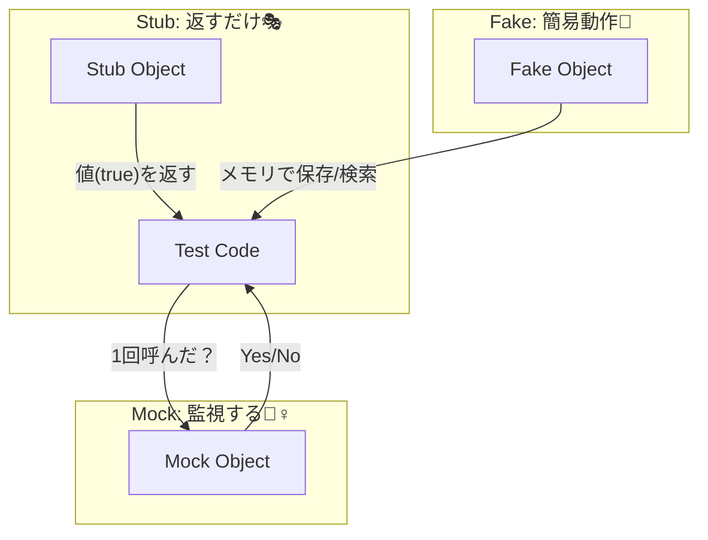

# 第26章：モック入門：呼ばれ方を確かめる（相互作用テスト）🕵️‍♀️

この章は「**結果（戻り値や状態）**じゃなくて、**“呼び出し方”を確かめたい**ときに使うテクニック」だよ〜！🌸
DIがあると、**本物の代わりにモックを差し込める**から、相性バツグン💉✨

---

## 1) モックってなに？（一言で）🧸


**モック =「呼ばれたかどうか（回数・引数・順番）を確認できるニセモノ」**だよ✅

たとえば…

* メール送信📧
* 通知プッシュ🔔
* 決済API💳
* 外部サービス連携🌐

みたいな「外に副作用が出るやつ」は、**本番の実物を呼びたくない**よね😖
そこでモックで「呼ぶべき時に呼んだ？」をテストするのが相互作用テスト（interaction test）🕵️‍♀️✨

---

## 2) 似た言葉の整理（ここ超大事）🧠✨


* **Stub（スタブ）**：テスト用に「戻り値を返す」係（例：常に `true` を返す）🎭
* **Fake（フェイク）**：簡易実装（メモリDBみたいに動く）🧪
* **Mock（モック）**：**呼び出しを検証**できる（回数・引数）🔍

👉 ざっくり言うと
「**値を返させたい**→Stub / Fake」
「**呼んだか確認したい**→Mock」
って覚えればOKだよ😊



---

## 3) いつモックを使う？（使いどころ3つ）🔔✅

モックが向いてるのは、だいたいこの3パターン👇

1. **副作用がある**（メール送信・外部API呼び出し）📧🌐
2. **“呼ぶ/呼ばない”が仕様の中心**（例：条件を満たした時だけ通知）📣
3. **失敗時の挙動**（例：送信失敗ならリトライ／ログだけ残す）💥📝

逆に、**純粋ロジック（計算とか）**は、モック少なめが気持ちいいよ🌿

---

## 4) 実践：通知サービスが「1回だけ呼ばれた」を検証しよう🔔🧪


題材：
「注文が確定したら、通知を1回送る」🛒➡️🔔

### 4-1) まずはインターフェースを用意🧷

```csharp
public interface INotifier
{
    Task SendAsync(string message, CancellationToken ct = default);
}
```

### 4-2) 対象クラス（ここがDIされる側）💉

```csharp
public sealed class OrderService
{
    private readonly INotifier _notifier;

    public OrderService(INotifier notifier)
    {
        _notifier = notifier;
    }

    public async Task PlaceOrderAsync(string itemName, CancellationToken ct = default)
    {
        // ここに本来は注文処理がある（省略）🛒✨
        await _notifier.SendAsync($"注文確定: {itemName}", ct);
    }
}
```

---

## 5) テストを書こう（NSubstitute版：読みやすい💕）

NSubstituteは「英語っぽく読める」感じで初心者にやさしいよ〜😊
（公式も “friendly substitute” って言ってる）([nsubstitute.github.io][1])

### 5-1) パッケージ追加（例）

* `NSubstitute` を追加（Visual Studioでも、dotnetでもOK）📦

### 5-2) xUnitでテスト🧪

※xUnitは今も定番で、v3系も進んでるよ〜([xUnit.net][2])

```csharp
using NSubstitute;
using Xunit;

public sealed class OrderServiceTests
{
    [Fact]
    public async Task PlaceOrderAsync_注文確定で通知が1回送られる()
    {
        // Arrange 🧸
        var notifier = Substitute.For<INotifier>();
        var sut = new OrderService(notifier);

        // Act ▶️
        await sut.PlaceOrderAsync("りんご");

        // Assert ✅（1回呼ばれた？ 引数は合ってる？）
        await notifier.Received(1).SendAsync("注文確定: りんご", Arg.Any<CancellationToken>());
    }
}
```

### 便利ワザ：部分一致で検証🔍

```csharp
await notifier.Received(1).SendAsync(
    Arg.Is<string>(s => s.StartsWith("注文確定:")),
    Arg.Any<CancellationToken>());
```

---

## 6) Moq版も見ておこう（“超有名”）🧰✨

Moqは今も超メジャーで、NuGetでも人気だよ（例：4.20.72）([NuGet][3])

ただし過去に **4.20.0 付近でプライバシー懸念（メール抽出の話）**が問題になった経緯があるので、**チーム方針に合わせて選んでね**🙏([GitHub][4])

```csharp
using Moq;
using Xunit;

public sealed class OrderServiceTests_Moq
{
    [Fact]
    public async Task PlaceOrderAsync_注文確定で通知が1回送られる()
    {
        // Arrange 🧸
        var mock = new Mock<INotifier>();
        var sut = new OrderService(mock.Object);

        // Act ▶️
        await sut.PlaceOrderAsync("りんご");

        // Assert ✅
        mock.Verify(x => x.SendAsync("注文確定: りんご", It.IsAny<CancellationToken>()), Times.Once);
    }
}
```

---

## 7) モック乱用しないコツ（超重要）🌿⚠️


モックは便利だけど、やりすぎるとテストが壊れやすい😵‍💫

### よくある地雷💣

* ✅ 「通知を送ったか」みたいな**仕様の核**を検証 → 良いモック
* ❌ 「内部でどの順番で何回メソッド呼んだか」まで細かすぎ → リファクタで即死💥

### 合言葉🪄

**“仕様”をテストして、“実装の都合”はテストしない**😊

---

## 8) ミニ演習（手を動かそ〜！）✍️🌸

### 演習1：呼ばれないことの検証🚫

「空文字の商品名なら通知しない」にして、テストを書いてみよう！

* NSubstitute：`DidNotReceive()`
* Moq：`Times.Never`

### 演習2：引数が正しいか検証🔎

メッセージに「注文ID」も入れるようにして、部分一致で検証してみよう✨

### 演習3：失敗時の仕様🧯

通知送信が失敗したら「例外を投げる」or「ログだけ」みたいに仕様を決めて、テストしてみよ〜🧪

---

## 9) AI拡張の使いどころ（ズルく賢く🤖✨）

おすすめの使い方👇

* 「この仕様だとテストケース何個いる？」って洗い出し🗂️
* 「モック検証が過剰になってない？」ってレビュー依頼🔍
* “Arrange-Act-Assert” の骨組みを作らせて、最後は自分で確認✅

※生成されたテストは**“仕様として正しいか”**だけは必ず自分で見るのがコツだよ👀✨

---

## 10) 章末まとめ（ここだけ覚えれば勝ち）🏁💖

* モックは **「呼ばれ方（回数・引数）を検証するニセモノ」**🕵️‍♀️
* **副作用がある依存**（通知・外部API）に強い🔔🌐
* **やりすぎ注意**：仕様の核だけを検証しよう🌿
* DIがあると、モック差し込みが超ラク💉✨

---

次の章（第27章）は、いよいよ「Service Locator」という“DIっぽいけど危ないやつ”に突入だよ〜🚫🧩
続けて作る？😊✨

[1]: https://nsubstitute.github.io/?utm_source=chatgpt.com "NSubstitute: A friendly substitute for .NET mocking libraries"
[2]: https://xunit.net/?utm_source=chatgpt.com "xUnit.net: Home"
[3]: https://www.nuget.org/packages/moq/?utm_source=chatgpt.com "Moq 4.20.72"
[4]: https://github.com/devlooped/moq/issues/1372?utm_source=chatgpt.com "Privacy issues with SponsorLink, starting from version 4.20"
