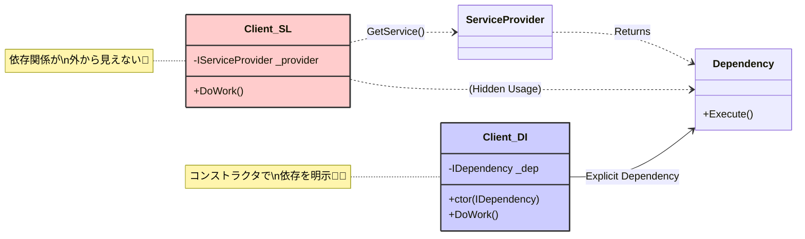

# 第27章：アンチパターン①：Service Locatorがダメな理由🚫

---

### この章のゴール🎯✨

この章を読み終わったら、次の3つができるようになります😊💡

* 「Service Locator（サービスロケーター）」が **DIっぽく見えてDIじゃない** と説明できる🌀
* 何が困るか（＝設計の“痛み”）を **自分の言葉**で言える😖➡️😊
* Service Locatorっぽいコードを **コンストラクタ注入に直して**、Composition Rootに寄せられる🔧📍

Microsoftの公式ガイドでも「Service Locatorパターンは避けよう」と明言されています。([Microsoft Learn][1])

---

## 1) Service Locatorってなに？🗺️👀


一言でいうと…

> 「必要な依存を、引数でもらわずに、**どこか（コンテナ）に取りに行く**」やり方

よくある形はこれ👇

* `IServiceProvider` をクラスが持っていて、必要なときに `GetService()` / `GetRequiredService()` で取ってくる🎣
* あるいは `static` な “ServiceLocator” から取ってくる🏪（グローバル変数の親戚…！）

これ、見た目は「DIコンテナ使ってるしDIでしょ？」ってなりがちなんだけど…
**依存が“見えなくなる”**ので、設計としては別物になっちゃうんだよね🙈💦




---

## 2) 何がダメ？困りごと3点セット😵‍💫💥

### ① 依存が見えない（読む人が詰む）🙈📦


コンストラクタに書かれてないから、

* このクラス、何が必要なの？
* どんな外部に触ってるの？

が **コードを追わないと分からない** 😭
レビューも保守もつらい…！

---

### ② テストがしにくい（差し替えが面倒）🧪🌀

DIの美味しさは「Fake差し替え」が簡単なことなのに、Service Locatorだと

* テスト側が `IServiceProvider` の中身を作らないといけない
* どの依存が必要かが隠れてるから、テスト実行して初めて不足に気づく

みたいな **“当て勘テスト”** になりがち😇💦

---

### ③ 実行時に壊れる（気づくのが遅い）💣🏃‍♀️


`GetService()` は「登録されてなければ `null`」になることが多いし、
`GetRequiredService()` は「無ければ例外」で落ちます💥([Microsoft Learn][2])

つまり…

* コンパイル時に気づけない
* 起動して、そのコードパスを通って、初めて爆発する

事故るタイミングが遅いのがイヤ〜〜〜！😭

---

## 3) ダメな例：Service Locator版（やりがち！）🚫🎣

「注文を確定するサービス」が、必要になるたび依存を取りに行く例👇

```csharp
using Microsoft.Extensions.DependencyInjection;

public sealed class OrderService
{
    private readonly IServiceProvider _provider;

    public OrderService(IServiceProvider provider)
    {
        _provider = provider;
    }

    public void PlaceOrder()
    {
        // 必要になったら取りに行く（＝依存が隠れる）
        var logger = _provider.GetRequiredService<ILogger>();
        var payment = _provider.GetRequiredService<IPaymentGateway>();

        logger.Log("place order!");
        payment.Pay(1000);
    }
}

public interface ILogger { void Log(string message); }
public interface IPaymentGateway { void Pay(int amount); }
```

**どこがイヤ？**😖

* `OrderService` のコンストラクタを見るだけだと、何が必要か分からない🙈
* テストしたいとき、`IServiceProvider` を用意して登録も必要で面倒🧪
* 登録漏れがあってもコンパイルでは分からず、実行時に落ちる💥

Microsoftの公式ガイドでも、この形（`GetService`で取得するService Locator）を避けるよう書かれています。([Microsoft Learn][1])

---

## 4) 正しい形：コンストラクタ注入に直す💉✨


「必要なものは最初に全部もらう」スタイルへ🔧

```csharp
public sealed class OrderService
{
    private readonly ILogger _logger;
    private readonly IPaymentGateway _payment;

    public OrderService(ILogger logger, IPaymentGateway payment)
    {
        _logger = logger;
        _payment = payment;
    }

    public void PlaceOrder()
    {
        _logger.Log("place order!");
        _payment.Pay(1000);
    }
}
```

**これの良いところ**🥰

* 依存がコンストラクタに “見える化” 👀✨
* テストでは `new OrderService(fakeLogger, fakePayment)` で終わり🧪💖
* 「登録漏れ」も Composition Root 側で気づきやすい📍

---

## 5) “取りに行く”のはどこならOK？📍✅（Composition Rootだけ！）

Service Providerから `GetRequiredService` するのが完全に禁止…というより、

* **アプリの外側（起動時の組み立て場所）だけでやる**
* **ドメイン/業務ロジックの中ではやらない**

が大事だよ〜😊

例：コンソールアプリの “組み立て係” が作って実行する👇

```csharp
using Microsoft.Extensions.DependencyInjection;

var services = new ServiceCollection();
services.AddSingleton<ILogger, ConsoleLogger>();
services.AddTransient<IPaymentGateway, DummyPaymentGateway>();
services.AddTransient<OrderService>();

using var provider = services.BuildServiceProvider();

// ここ（外側）で解決するのはOK
var app = provider.GetRequiredService<OrderService>();
app.PlaceOrder();

public sealed class ConsoleLogger : ILogger
{
    public void Log(string message) => Console.WriteLine(message);
}

public sealed class DummyPaymentGateway : IPaymentGateway
{
    public void Pay(int amount) => Console.WriteLine($"pay: {amount}");
}
```

`GetRequiredService` 自体は `IServiceProvider` の拡張として定義されています。([Microsoft Learn][2])
でも **“どこで使うか”** が超重要だよ〜📍✨

---

## 6) 例外：どうしても “取りに行く” が必要な場面もある🙆‍♀️🧰

「絶対ダメ！」じゃなくて、**フレームワーク境界**では例外があるよ〜🙂
代表例が **BackgroundService（常駐処理）** ！

Hosted Service は仕組み上 “スコープが自動で作られない”ので、
スコープサービスを使いたいときは `IServiceScopeFactory.CreateScope()` でスコープを作るのが公式推奨です。([Microsoft Learn][3])

ポイントはこれ👇

* アプリの中心ロジックで “取りに行く癖” を広げない🌿
* **境界の層**に押し込める（中に漏らさない）🧱✨

---

## 7) ミニ演習🔧🧪✨（Service Locator → DIへお直し）

### お題🎀

次の「Service Locator版」を、コンストラクタ注入に直してね！

**Before（直す前）**🚫

```csharp
using Microsoft.Extensions.DependencyInjection;

public sealed class ReportService
{
    private readonly IServiceProvider _provider;

    public ReportService(IServiceProvider provider)
    {
        _provider = provider;
    }

    public string Build()
    {
        var clock = _provider.GetRequiredService<IClock>();
        return $"Report at {clock.Now()}";
    }
}

public interface IClock { DateTime Now(); }
```

### ヒント💡

* `ReportService` が本当に必要なのは `IClock` だよね？👀
* じゃあ `IClock` をコンストラクタでもらえばOK！

### After（目標）✅

* `ReportService(IClock clock)` にする
* `Build()` 内で `GetRequiredService` を消す

---

## 8) 章末まとめ🌸✅（今日のルール）

* **ルール①**：依存は “引数で見せる” 👀💉
* **ルール②**：業務ロジックの中で `GetService` / `GetRequiredService` しない🚫🎣 ([Microsoft Learn][1])
* **ルール③**：どうしても必要なときは “境界の層” に閉じ込める🧱（例：BackgroundServiceはスコープを作る）([Microsoft Learn][3])

---

## 9) ミニクイズ🎯🧠✨

1. `OrderService` が `IServiceProvider` を持って `GetRequiredService` してたら、何が「見えなくなる」？🙈
2. Service Locatorだと、登録漏れに気づくのはいつになりがち？💣
3. “取りに行く”のが許されやすい場所はどこ？📍
4. `GetService()` と `GetRequiredService()` の違いは？（挙動の違い）🎣💥 ([Microsoft Learn][2])
5. BackgroundServiceでスコープサービスを使うとき、公式は何を使うって言ってる？🧺 ([Microsoft Learn][3])

---

## 10) AI活用（Copilot / Codex）🤖✨：この章で効く使い方

### ✅ リファクタ支援プロンプト例

* 「このクラスの依存を列挙して、コンストラクタ注入に直して」
* 「`IServiceProvider` を使ってる箇所を探して、Service Locatorになってる所を指摘して」
* 「Composition Root（起動時）に寄せる形で、`GetRequiredService` を外へ移動して」

### ✅ レビュー用プロンプト例

* 「この設計、依存が隠れていない？“引数で見えてるか”観点でレビューして」
* 「テストしやすさの観点で、改善点を3つ出して」

---

必要なら次の章（第28章：循環参照🌀）へ行く前に、いまの演習をもう1〜2問だけ増やして “Service Locator検出力” を鍛える問題も作れるよ💪😊💛

[1]: https://learn.microsoft.com/en-us/dotnet/core/extensions/dependency-injection-guidelines?utm_source=chatgpt.com "Dependency injection guidelines - .NET"
[2]: https://learn.microsoft.com/ja-jp/dotnet/api/microsoft.extensions.dependencyinjection.serviceproviderserviceextensions.getrequiredservice?view=net-8.0&utm_source=chatgpt.com "ServiceProviderServiceExtensions.GetRequiredService ..."
[3]: https://learn.microsoft.com/en-us/dotnet/core/extensions/scoped-service?utm_source=chatgpt.com "Use scoped services within a BackgroundService - .NET"
