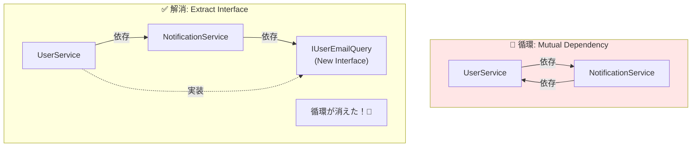

# 第28章：アンチパターン②：循環参照をほどくコツ🌀

## この章のゴール🎯✨

* 「循環参照って何が困るの？」を**自分の言葉で説明**できる😊
* 例外メッセージを見て「これ循環だ！」って**気づける**👀💥
* **ほどき方（直し方）を3〜5パターン**持って、落ち着いて直せる🛠️🌸

---

## 1) 循環参照ってなに？🤔🌀


**循環参照（circular dependency）**は、依存関係がぐるっと輪っかになる状態だよ〜😵‍💫

* 直球の例：`A → B → A`


* ちょい遠回り：`A → B → C → A`

DIコンテナは「必要な部品を順番に作って組み立てる」んだけど、輪っかになると
「A作るにはB必要、B作るにはA必要…え、どっち先！？😇」って詰むの💥

実際、.NETのDIでは循環があると例外で止まることが多くて、メッセージに **“A circular dependency was detected…”** みたいに出るよ🧯🚨 ([GitHub][1])

---

## 2) ありがちな“事故パターン”あるある🥺🧨

初心者さんがハマりやすいの、だいたいこの辺👇

### あるある①：相互に「手伝って〜」してる🤝🌀


* ユーザー作成サービスが通知サービスを呼ぶ
* 通知サービスが「メールアドレス欲しい」ってユーザーサービスを呼ぶ
  → はい輪っか〜🌀

### あるある②：責務が混ざって巨大化🍱💦


「便利だからここに全部入れよ〜」で、結果

* **AがBの仕事も持つ**
* BもAの仕事に手を出す
  → いつの間にか輪っか🌀

### あるある③：層の向きが逆走🚗💨↩️

たとえば「ドメイン（中心）」が「インフラ（外側）」を呼び、
インフラがまた中心を呼ぶ…みたいなやつ😵

---

## 3) まずは“見える化”しよう👀🗺️（ここ超大事！）

循環って、直す前に**どこが輪っかなのか**を見つけるのが9割だよ💪✨

### 見える化の手順（おすすめ）🧩

1. 例外メッセージから「登場人物（型名）」を抜き出す✍️
2. 「Aはコンストラクタで何を受け取ってる？」を辿る🔍
3. 紙でもメモでもいいから矢印で描く📝


   * `A → B`（AのコンストラクタにBがいる）
   * `B → A`（BのコンストラクタにAがいる）
4. 輪っかが見えたら勝ち🏆✨

> 💡DI関連の公式ドキュメントも「サービスはIServiceCollectionに登録して、必要な依存を解決して組み立てる」流れを前提に説明してるよ📚 ([Microsoft Learn][2])

---

## 4) 実例：わざと循環させてみる😈🌀（→直す）

### ❌ ダメな例（A→B→A）🙈

「ユーザー作る」→「ようこそメール送る」って流れは自然なんだけど…設計によっては輪っかになるよ💦

```csharp
public interface IUserService
{
    Task RegisterAsync(string email);
    Task<string> GetEmailAsync(int userId);
}

public interface INotificationService
{
    Task SendWelcomeAsync(int userId);
}

public class UserService : IUserService
{
    private readonly INotificationService _notification;

    public UserService(INotificationService notification)
        => _notification = notification;

    public async Task RegisterAsync(string email)
    {
        int userId = 123; // 例：保存した想定
        await _notification.SendWelcomeAsync(userId);
    }

    public Task<string> GetEmailAsync(int userId)
        => Task.FromResult("test@example.com");
}

public class NotificationService : INotificationService
{
    private readonly IUserService _users;

    public NotificationService(IUserService users)
        => _users = users;

    public async Task SendWelcomeAsync(int userId)
    {
        var email = await _users.GetEmailAsync(userId);
        Console.WriteLine($"Welcome mail to {email}");
    }
}
```

* `UserService` は `INotificationService` に依存
* `NotificationService` は `IUserService` に依存
  → **はい循環🌀**

この状態でDIが解決しようとすると、循環検出の例外が出がちだよ🚨 ([GitHub][1])

---

## 5) ほどき方🧶✨（超よく使う5パターン）

「魔法の1手」じゃなくて、状況で使い分ける感じだよ〜😊🌷

---

### パターン①：責務を分けて“共通の部品”を作る✂️🧩（最優先！）


上の例だと、通知側が欲しいのは「メールアドレス」だけだよね？📮
だったら `IUserService` まるごとじゃなくて、**必要最小限の読み取り用**を切り出す✨

✅ 例：メール取得専用の小さい口を作る

```csharp
public interface IUserEmailQuery
{
    Task<string> GetEmailAsync(int userId);
}

public class UserEmailQuery : IUserEmailQuery
{
    public Task<string> GetEmailAsync(int userId)
        => Task.FromResult("test@example.com");
}

public class NotificationService : INotificationService
{
    private readonly IUserEmailQuery _emailQuery;

    public NotificationService(IUserEmailQuery emailQuery)
        => _emailQuery = emailQuery;

    public async Task SendWelcomeAsync(int userId)
    {
        var email = await _emailQuery.GetEmailAsync(userId);
        Console.WriteLine($"Welcome mail to {email}");
    }
}
```

こうすると

* `UserService → NotificationService` は残る
* `NotificationService → UserService` が消える🎉
  → 輪っか解消🧹✨



---

### パターン②：向きを揃える（層のルールを守る）➡️🏗️

ざっくりルールはこれ👇

* **内側（中心）**は**外側（詳細）**を知らない
* 外側が内側に合わせる（アダプタで包む）🧷

もし「中心のサービス」が「外側の都合」で外側を呼び返してるなら、たぶん設計の向きが逆走してる可能性高いよ🚗💦

---

### パターン③：イベントで“直接呼び出し”をやめる📣✨（ゆるい非同期思考）


「ユーザー登録したら、ようこそメール送ってね」って **“お知らせ”** にすると循環が消えやすいよ😊

イメージ：

* UserService：「登録したよ〜📣」
* それを聞いた別クラスがメール送る📨

「呼び出す」じゃなくて「通知する」に変える感じ✨
（ここ、設計の世界ではよく効く🧠🌟）

---

### パターン④：Mediator（仲介役）を置く🤝🧑‍⚖️


AとBが直接話すから揉めるなら、**間に通訳（仲介役）**を置く作戦だよ🧑‍⚖️✨
「Aは仲介役に頼む」「Bも仲介役に頼む」→ AとBが直接依存しない👍

（言語は違うけど、循環をMediatorでほどく考え方の例としてはこういう記事があるよ🧠） ([DEV Community][3])

---

### パターン⑤：遅延生成（Lazy / Factory）で“作る瞬間”だけ外す⏳🧰（最終手段寄り）


「設計的には循環じゃないのに、生成タイミングだけが原因」みたいな時は
**遅延して必要になった瞬間に作る**と回避できることがあるよ⚠️

ただしこれ、使いどころを間違えると
「根本原因を放置してるだけ」になりがち😇

.NETのガイドラインでも、必要なら**Factoryパターン**や `ActivatorUtilities.CreateInstance` を使う方向が紹介されてるよ📚🧰 ([Microsoft Learn][4])
（遅延解決の考え方の解説として、こういう記事もあるよ） ([Thomas Levesque's .NET Blog][5])

---

## 6) やっちゃダメ寄りの“その場しのぎ”😵‍💫🚫

### 🚫 IServiceProvider を握って GetService しまくる

「とりあえず `IServiceProvider` 注入して、必要な時に `GetService` すればいいじゃん！」
…ってやると、依存が見えなくなって地獄化しやすいよ🕳️💦
（前章の Service Locator っぽくなるやつ！）

※完全否定じゃないけど、**基本は避けたい**スタイルだよ🙅‍♀️

---

## 7) ミニ演習コーナー🧪✨（手を動かすと最強）

### 演習1：矢印を書いて循環を見つけよう🗺️🖊️

* 自分のコード（orサンプル）で

  * 「このクラスのコンストラクタ引数」を全部書く
  * `A → B` を全部書く
* 輪っかがあるか探す🌀👀

### 演習2：パターン①で直してみよう✂️🧩

* Notification側が欲しい情報だけを `IUserEmailQuery` みたいに切り出す
* `NotificationService` が `IUserService` を参照しない形にする

### 演習3：イベント案を文章で設計してみよう📣📝

* 「ユーザー登録」→「メール送信」を

  * 直接呼ぶのではなく
  * “登録完了イベント”として通知する
    って文章で設計案を書いてみてね😊

---

## 8) AI（Copilot/Codex）活用テンプレ🤖✨

そのまま貼って使えるやつ用意したよ〜🌸

* **循環の特定**

  * 「この例外（A circular dependency…）が出ました。依存グラフを矢印で列挙して、循環ループを特定して」
* **責務分割の提案**

  * 「AとBが相互依存しています。`必要最小限のインターフェース抽出`でほどく案を3つ出して」
* **安全チェック**

  * 「提案された修正が Service Locator 化していないか、依存が“引数で見える”か観点でレビューして」

---

## 章末まとめ🍰✨

* 循環参照は「どっちが先に作られるの問題」でDIが詰む🌀
* 直し方の基本は **責務分割＋小さいインターフェース**✂️🧩
* イベント／仲介役（Mediator）／Factoryは状況に応じて✨
* その場しのぎで `IServiceProvider.GetService()` 連打は危険⚠️

次の章（第29章）は、今回の“根っこ”にもなりやすい
**「巨大コンストラクタはSOSサイン📣」**を扱うよ〜！つながってて気持ちいいはず😊💖

[1]: https://github.com/dotnet/runtime/issues/105900?utm_source=chatgpt.com "Circular DI causes endless loop instead of exception"
[2]: https://learn.microsoft.com/en-us/dotnet/core/extensions/dependency-injection-usage?utm_source=chatgpt.com "Tutorial: Use dependency injection in .NET"
[3]: https://dev.to/mikesplore/breaking-circular-dependencies-in-kotlin-with-the-mediator-pattern-136d?utm_source=chatgpt.com "Breaking Circular Dependencies in Kotlin with the Mediator ..."
[4]: https://learn.microsoft.com/en-us/dotnet/core/extensions/dependency-injection-guidelines?utm_source=chatgpt.com "Dependency injection guidelines - .NET"
[5]: https://thomaslevesque.com/2020/03/18/lazily-resolving-services-to-fix-circular-dependencies-in-net-core/?utm_source=chatgpt.com "Lazily resolving services to fix circular dependencies in .NET ..."
