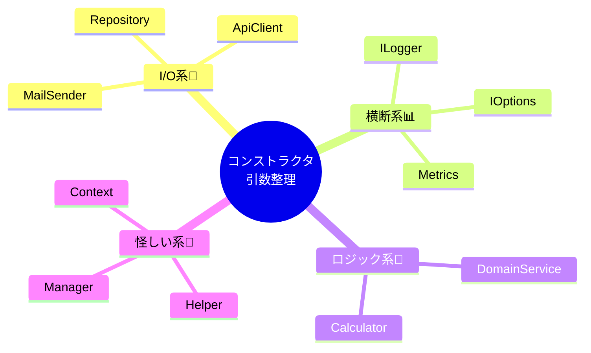

# 第29章：設計の健康診断：巨大コンストラクタはSOSサイン📣

この章では、**コンストラクタの引数が多すぎるクラス**を見つけて、**安全にスッキリ健康体へリファクタ**する練習をするよ〜😊💉
（いまの最新版の前提として、.NET 10（LTS）＋C# 14 の世界観で進めるね✨） ([Microsoft][1])

---

## 1) 今日のゴール🎯🌸

できるようになりたいことはこの3つだよ🫶

* **「引数が多い＝悪」じゃなくて、何のSOSかを説明できる**👀📣
* 引数が8個とかでも慌てずに、**原因を分類して“直し方の当たり”を引ける**🎯
* リファクタ後に、**依存が3個くらいに減って、テストもしやすくなる**🧪✨

---

## 2) まず結論💡 「巨大コンストラクタ」は“病名”じゃなくて“症状”😷➡️🩺


### ✅ よくある「症状」

* コンストラクタ引数が **6個以上**（とくに8〜10個以上）😵‍💫
* クラス名は「Service」「Manager」「Handler」みたいに万能っぽい🤹‍♀️
* 変更が入るたびに、そのクラスも巻き込まれる🌀

### ✅ ありがちな「原因（だいたいこれ！）」


1. **責務過多（SRP違反）**：いろんな仕事を1人で抱えすぎ🧳💦
2. **層の混線**：ドメイン処理なのにDB/HTTP/メールまで握ってる🍱⚡
3. **横断関心事の混入**：ログ・リトライ・メトリクス等が本体にベタ貼り📌
4. **“便利”のしわ寄せ**：とりあえず依存を足し続けた結果📈

> .NET のDIは、構成・ログ・Optionsとセットで“標準機能”として用意されてるから、DI自体は安心して使ってOKだよ😊 ([Microsoft Learn][2])

---

## 3) 健康診断のやり方🩺🔎（チェックリスト付き✅）

### ステップA：引数を「種類」で並べ替える🧠🧩


コンストラクタ引数を、ざっくり4箱に分けてみてね📦✨

* **入出力系（I/O）**：DB、HTTP、ファイル、メール、キュー📡🗄️
* **横断系**：ILogger、設定(Options)、メトリクス、トレース📊🧾
* **純粋ロジック系**：計算・判定・ドメインルール🧠✨
* **“なんか怪しい”系**：Mapper、Context、Provider、Helper…😇（要注意）

✅ ここで「I/Oが多い」なら、**境界が崩れてる可能性大**だよ〜📣



---

### ステップB：この質問をしてみる🙋‍♀️💭


* 「このクラスの**仕事を一言で**言うと？」🗣️

  * もし **“注文処理もして…通知もして…保存もして…”** みたいに増えたら、ほぼ責務過多！😵‍💫
* 「この依存、**いつも一緒に増える**やつある？」👯‍♀️

  * それ、**1つのサブ機能**になれるかも✨

---

## 4) 直し方の王道パターン🥇✨（まずはこの順でOK）

### パターン①：責務で分割（Extract Class）✂️📦


**依存の“まとまり”ごとに小さいサービスに切る**のが最強😊
例：

* 通知系（メール/SMS）➡️ `INotifier` にまとめる📨📱
* 支払い系（決済/検証）➡️ `IPaymentProcessor` にまとめる💳
* 在庫系（引当/戻し）➡️ `IInventoryManager` にまとめる📦

> 💡ポイント：**依存を袋に詰めるだけ（DependencyBag）**はダメだよ🙅‍♀️
> “見た目だけ減って、責務が減ってない”からね😇

---

### パターン②：I/Oを薄い層へ押し出す🍱➡️🚪

「本体ロジック」から、DB/HTTP/メールみたいなI/Oを離すと一気に健康体🌿
（DIはその分離を“簡単にする道具”だよ💉）

---

### パターン③：横断関心事は“仕組み側”へ🧾🧰


ログや計測は、できるだけ

* デコレータ
* ミドルウェア
* パイプライン
  みたいに**外側**でやれると、本体がスッキリするよ😊✨
  （ASP.NET CoreはDI前提で拡張する流れが強いよ〜） ([Microsoft Learn][3])

---

## 5) ハンズオン🛠️✨：引数10個のモンスターを、引数3個にする🧟‍♀️➡️🧚‍♀️

### 😵 Before：巨大コンストラクタ（例）

```csharp
public sealed class CheckoutService
{
    private readonly IOrderRepository _orders;
    private readonly ICustomerRepository _customers;
    private readonly IPaymentGateway _payment;
    private readonly IInventoryService _inventory;
    private readonly IEmailSender _email;
    private readonly ISmsSender _sms;
    private readonly ILogger<CheckoutService> _log;
    private readonly IClock _clock;
    private readonly IOptions<CheckoutOptions> _options;
    private readonly IUnitOfWork _uow;

    public CheckoutService(
        IOrderRepository orders,
        ICustomerRepository customers,
        IPaymentGateway payment,
        IInventoryService inventory,
        IEmailSender email,
        ISmsSender sms,
        ILogger<CheckoutService> log,
        IClock clock,
        IOptions<CheckoutOptions> options,
        IUnitOfWork uow)
    {
        _orders = orders;
        _customers = customers;
        _payment = payment;
        _inventory = inventory;
        _email = email;
        _sms = sms;
        _log = log;
        _clock = clock;
        _options = options;
        _uow = uow;
    }

    public async Task CheckoutAsync(Guid customerId, Guid[] productIds)
    {
        // 省略：顧客取得、在庫引当、決済、注文保存、メール通知、SMS通知、ログ、設定参照…
    }
}

public sealed class CheckoutOptions
{
    public bool SendSms { get; init; } = true;
}
```

✅ ここでの診断（さっきの箱分け📦）

* I/O：Repository、Payment、Inventory、Email、Sms、UnitOfWork → 多い！🗄️📡
* 横断：Logger、Clock、Options → OKだけど混ざりすぎかも🧾
* つまり… **CheckoutService が何でも屋になってる**😵‍💫

---

### ✨ After：責務で3つに分ける（例）


#### ① 通知をまとめる📨📱

```csharp
public interface ICheckoutNotifier
{
    Task NotifyAsync(CheckoutResult result);
}

public sealed class CheckoutNotifier : ICheckoutNotifier
{
    private readonly IEmailSender _email;
    private readonly ISmsSender _sms;
    private readonly IOptions<CheckoutOptions> _options;

    public CheckoutNotifier(IEmailSender email, ISmsSender sms, IOptions<CheckoutOptions> options)
    {
        _email = email;
        _sms = sms;
        _options = options;
    }

    public async Task NotifyAsync(CheckoutResult result)
    {
        await _email.SendAsync(result.CustomerEmail, "注文ありがとう！", "本文…");
        if (_options.Value.SendSms)
            await _sms.SendAsync(result.CustomerPhone, "注文ありがとう！");
    }
}
```

#### ② 決済をまとめる💳

```csharp
public interface IPaymentProcessor
{
    Task<PaymentResult> PayAsync(Customer customer, Money amount);
}

public sealed class PaymentProcessor : IPaymentProcessor
{
    private readonly IPaymentGateway _gateway;

    public PaymentProcessor(IPaymentGateway gateway) => _gateway = gateway;

    public Task<PaymentResult> PayAsync(Customer customer, Money amount)
        => _gateway.ChargeAsync(customer.PaymentToken, amount);
}
```

#### ③ “司令塔”は軽くする🧚‍♀️（依存3つくらい）

```csharp
public sealed class CheckoutService
{
    private readonly ICheckoutWorkflow _workflow;
    private readonly ICheckoutNotifier _notifier;
    private readonly ILogger<CheckoutService> _log;

    public CheckoutService(
        ICheckoutWorkflow workflow,
        ICheckoutNotifier notifier,
        ILogger<CheckoutService> log)
    {
        _workflow = workflow;
        _notifier = notifier;
        _log = log;
    }

    public async Task CheckoutAsync(Guid customerId, Guid[] productIds)
    {
        _log.LogInformation("Checkout start: {CustomerId}", customerId);

        var result = await _workflow.RunAsync(customerId, productIds);

        await _notifier.NotifyAsync(result);

        _log.LogInformation("Checkout done: {OrderId}", result.OrderId);
    }
}
```

> 司令塔は「流れ」だけ。重いI/Oの詳細は下に分ける🌿
> こうすると **テストがめちゃ楽**になるよ〜🧪✨

---

## 6) よくある落とし穴🕳️😇（ここ踏む人多い！）

* **依存を1つにまとめるだけ**（`CheckoutDependencies` みたいな袋）📦


  → 見た目だけ小さくなって、根本原因が残る🙅‍♀️
* **ServiceProvider を注入して中で Resolve**（Service Locator化）🎣
  → 依存が見えなくなって、さらに悪化🚫（第27章のやつ！）
* 分割したのに、結局「元クラス」が全部知ってる🤯
  → “知りすぎ”を減らすのが目的だよ🧠💦

---

## 7) ミニ演習🎓✨（手を動かそう！）

### 演習1：箱分け📦（3分）

あなたのプロジェクトで「引数が多いクラス」を1個選んで、

* I/O
* 横断
* 純粋ロジック
* 怪しい
  に分けてメモしてみてね📝👀

### 演習2：3分割✂️（10分）

引数の“まとまり”を見つけて、最低このどれかに分割してみよう😊

* 通知まとめ（Notifier）📨
* 決済まとめ（Payment）💳
* 永続化まとめ（Repository/Writer）🗄️

---

## 8) AI拡張の使い方🤖✨（この章向けテンプレ）

コピペで使えるやつ置いとくね💛

* 「このクラスのコンストラクタ引数を、責務ごとに3〜5グループに分類して。各グループ名も提案して」🧩
* 「分類したグループごとに Extract Class する手順を書いて。影響が少ない順に」🛠️
* 「分割後に、CheckoutService が“司令塔”だけになるように、public API を保ったままリファクタ案を出して」🧚‍♀️
* 「分割後の単体テストを1本だけ作って。Fakeで差し替えできる形に」🧪

---

## 9) 章末まとめ🎀🏁（覚え方はこれ！）

* **巨大コンストラクタ＝症状**。原因はだいたい「責務過多」か「層の混線」📣
* 直し方は **“依存を減らす”じゃなくて “責務を分ける”** ✂️✨
* 司令塔は軽く、I/Oは薄い層へ。これがDIの気持ちよさ💉🌿
* .NET（最新版）ではDIが標準で、Options/Loggingとセット運用が基本だよ😊 ([Microsoft Learn][2])

---

次の第30章は、いよいよ総合演習だね〜🎀🏁
第29章で分けた「健康体の構造」を、そのままミニアプリ完成まで持っていこう〜😊✨

[1]: https://dotnet.microsoft.com/en-US/download/dotnet/10.0?utm_source=chatgpt.com "Download .NET 10.0 (Linux, macOS, and Windows) | .NET"
[2]: https://learn.microsoft.com/en-us/dotnet/core/extensions/dependency-injection?utm_source=chatgpt.com "Dependency injection - .NET"
[3]: https://learn.microsoft.com/en-us/aspnet/core/fundamentals/dependency-injection?view=aspnetcore-10.0&utm_source=chatgpt.com "Dependency injection in ASP.NET Core"
