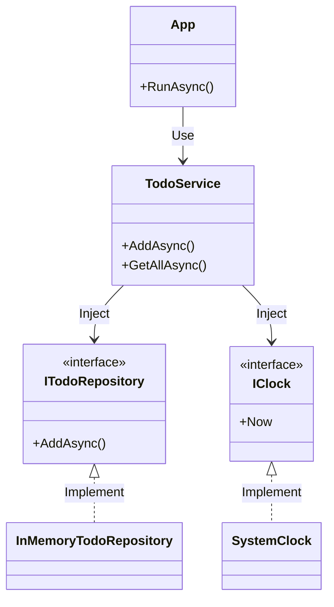

# 第30章：総合演習：ミニアプリをDIで仕上げる🎀🏁

この章は「DI/IoC、わかった気がする…！」を「**実際に作れる！**」に変える最終ステージだよ😊✨
今日は **ミニToDo（追加・一覧・完了）** を、**DIで“差し替え可能”に**しながら完成させるよ〜！✅🧩

ちなみに本日時点だと、.NET は **.NET 10 (LTS)** が最新ラインで、パッチは **10.0.2 (2026-01-13)** が出てるよ📌 ([Microsoft][1])
（C# も .NET 10 系で **C# 14** が対応だよ〜） ([Microsoft][2])

---

## 今日のゴール🎯✨


* `new` だらけの中心ロジックを卒業して、**外から注入**できるようにする💉
* **Composition Root（組み立て場所）** を `Program.cs` に作る📍
* テストで **Fake差し替え** を体験して「DIって気持ちいい…！」を味わう🧪💖
* （おまけ）保存先を **InMemory → JSONファイル** に差し替えられるようにする📦🔁

---

## 完成イメージ（動き）🖥️✨


起動するとこんな感じ👇

* 1: 追加 ➕
* 2: 一覧 📃
* 3: 完了 ✅
* 0: 終了 👋

---

## 設計の“骨格”だけ先に見る🦴🧩

ポイントはこれ👇

* UI（Console）は I/O だから、**テストしなくてOK**（やるなら後で）🙆‍♀️
* 中心ロジック（TodoService）は **I/Oに触れない**（Repository と Clock を抽象で受ける）💎
* 差し替えの口は `ITodoRepository` と `IClock` だよ🧷

依存関係はこう👇（矢印は「使う」）

* `App（UI）` → `TodoService`
* `TodoService` → `ITodoRepository`, `IClock`, `ILogger<TodoService>`
* `ITodoRepository` →（実装は後で差し替え：InMemory / JsonFile …）



---

## 手順1：プロジェクトを作る📦✨


### dotnet CLI で作る（手早い派）⚡

```powershell
mkdir DiTodo
cd DiTodo

dotnet new sln

dotnet new console -n TodoApp
dotnet new xunit  -n TodoApp.Tests

dotnet sln add .\TodoApp\TodoApp.csproj
dotnet sln add .\TodoApp.Tests\TodoApp.Tests.csproj

dotnet add .\TodoApp.Tests\TodoApp.Tests.csproj reference .\TodoApp\TodoApp.csproj
```

### 追加パッケージ（汎用ホスト＋Consoleログ）🧰

```powershell
dotnet add .\TodoApp\TodoApp.csproj package Microsoft.Extensions.Hosting
dotnet add .\TodoApp\TodoApp.csproj package Microsoft.Extensions.Logging.Console
dotnet add .\TodoApp.Tests\TodoApp.Tests.csproj package Microsoft.Extensions.Logging.Abstractions
```

※ .NET の DI / ホストは “汎用ホスト” がまとめて面倒を見てくれるのが便利なんだ〜🧸
（DI・ログ・構成・アプリのライフサイクル…など） ([Microsoft Learn][3])

---

## 手順2：アプリの“中身”を作る（コピペOK）✍️✨

以降、**ファイル名ごと**に置いていくよ〜！

---

### `TodoItem.cs`（ToDoのデータ）📌

```csharp
namespace TodoApp;

public sealed class TodoItem
{
    public Guid Id { get; }
    public string Title { get; }
    public DateTimeOffset CreatedAt { get; }
    public bool IsDone { get; private set; }
    public DateTimeOffset? DoneAt { get; private set; }

    public TodoItem(Guid id, string title, DateTimeOffset createdAt)
    {
        Id = id;
        Title = title;
        CreatedAt = createdAt;
    }

    public void MarkDone(DateTimeOffset doneAt)
    {
        IsDone = true;
        DoneAt = doneAt;
    }
}
```

---

### `IClock.cs`（時間の抽象）⏰

```csharp
namespace TodoApp;

public interface IClock
{
    DateTimeOffset Now { get; }
}
```

### `SystemClock.cs`（本物の時計）⌚

```csharp
namespace TodoApp;

public sealed class SystemClock : IClock
{
    public DateTimeOffset Now => DateTimeOffset.Now;
}
```

---

### `ITodoRepository.cs`（保存の抽象）📦

```csharp
namespace TodoApp;

public interface ITodoRepository
{
    Task AddAsync(TodoItem item, CancellationToken ct);
    Task<IReadOnlyList<TodoItem>> GetAllAsync(CancellationToken ct);
    Task<bool> MarkDoneAsync(Guid id, DateTimeOffset doneAt, CancellationToken ct);
}
```

---

### `InMemoryTodoRepository.cs`（まずはメモリ保存）🧠

```csharp
namespace TodoApp;

public sealed class InMemoryTodoRepository : ITodoRepository
{
    private readonly List<TodoItem> _items = new();
    private readonly object _lock = new();

    public Task AddAsync(TodoItem item, CancellationToken ct)
    {
        lock (_lock)
        {
            _items.Add(item);
        }
        return Task.CompletedTask;
    }

    public Task<IReadOnlyList<TodoItem>> GetAllAsync(CancellationToken ct)
    {
        lock (_lock)
        {
            // 外へ返すときはコピー（うっかり外部から壊されないように）🛡️
            return Task.FromResult<IReadOnlyList<TodoItem>>(_items.ToList());
        }
    }

    public Task<bool> MarkDoneAsync(Guid id, DateTimeOffset doneAt, CancellationToken ct)
    {
        lock (_lock)
        {
            var item = _items.FirstOrDefault(x => x.Id == id);
            if (item is null) return Task.FromResult(false);

            item.MarkDone(doneAt);
            return Task.FromResult(true);
        }
    }
}
```

---

### `TodoService.cs`（中心ロジック：I/Oしない💎）💉

```csharp
using Microsoft.Extensions.Logging;

namespace TodoApp;

public sealed class TodoService
{
    private readonly ITodoRepository _repo;
    private readonly IClock _clock;
    private readonly ILogger<TodoService> _logger;

    public TodoService(ITodoRepository repo, IClock clock, ILogger<TodoService> logger)
    {
        _repo = repo;
        _clock = clock;
        _logger = logger;
    }

    public async Task<Guid> AddAsync(string title, CancellationToken ct)
    {
        if (string.IsNullOrWhiteSpace(title))
            throw new ArgumentException("タイトルは空にできません🙅‍♀️", nameof(title));

        var id = Guid.NewGuid();
        var item = new TodoItem(id, title.Trim(), _clock.Now);

        await _repo.AddAsync(item, ct);

        _logger.LogInformation("Todo added: {Id} {Title}", id, item.Title);
        return id;
    }

    public Task<IReadOnlyList<TodoItem>> GetAllAsync(CancellationToken ct)
        => _repo.GetAllAsync(ct);

    public async Task<bool> MarkDoneAsync(Guid id, CancellationToken ct)
    {
        var ok = await _repo.MarkDoneAsync(id, _clock.Now, ct);

        if (ok) _logger.LogInformation("Todo done: {Id}", id);
        else _logger.LogWarning("Todo not found: {Id}", id);

        return ok;
    }
}
```

---

### `App.cs`（UI：Consoleと対話するだけ）🖥️🌸


```csharp
namespace TodoApp;

public sealed class App
{
    private readonly TodoService _service;

    public App(TodoService service)
    {
        _service = service;
    }

    public async Task RunAsync(CancellationToken ct = default)
    {
        while (!ct.IsCancellationRequested)
        {
            Console.WriteLine();
            Console.WriteLine("==== Mini ToDo ====");
            Console.WriteLine("1) Add  ➕");
            Console.WriteLine("2) List 📃");
            Console.WriteLine("3) Done ✅");
            Console.WriteLine("0) Exit 👋");
            Console.Write("Select: ");

            var input = Console.ReadLine()?.Trim();

            try
            {
                switch (input)
                {
                    case "1":
                        await AddAsync(ct);
                        break;
                    case "2":
                        await ListAsync(ct);
                        break;
                    case "3":
                        await DoneAsync(ct);
                        break;
                    case "0":
                        Console.WriteLine("Bye bye 👋");
                        return;
                    default:
                        Console.WriteLine("うーん、それは選べないかも😅（1/2/3/0だよ）");
                        break;
                }
            }
            catch (Exception ex)
            {
                Console.WriteLine($"エラー💥: {ex.Message}");
            }
        }
    }

    private async Task AddAsync(CancellationToken ct)
    {
        Console.Write("Title: ");
        var title = Console.ReadLine() ?? "";

        var id = await _service.AddAsync(title, ct);
        Console.WriteLine($"追加したよ〜！✅  id = {id}");
    }

    private async Task ListAsync(CancellationToken ct)
    {
        var items = await _service.GetAllAsync(ct);

        if (items.Count == 0)
        {
            Console.WriteLine("まだ何もないよ〜😴");
            return;
        }

        Console.WriteLine("-- List --");
        foreach (var x in items)
        {
            var done = x.IsDone ? $"✅ done at {x.DoneAt:yyyy-MM-dd HH:mm}" : "⏳";
            Console.WriteLine($"{x.Id} | {x.Title} | created {x.CreatedAt:yyyy-MM-dd HH:mm} | {done}");
        }
    }

    private async Task DoneAsync(CancellationToken ct)
    {
        Console.Write("id: ");
        var s = Console.ReadLine()?.Trim();

        if (!Guid.TryParse(s, out var id))
        {
            Console.WriteLine("GUIDの形式じゃないみたい😅（一覧からコピペが安心）");
            return;
        }

        var ok = await _service.MarkDoneAsync(id, ct);
        Console.WriteLine(ok ? "完了にしたよ〜！🎉" : "その id は見つからなかったよ🥲");
    }
}
```

---

### `Program.cs`（Composition Root：ここで組み立てる📍）🧩✨


```csharp
using Microsoft.Extensions.DependencyInjection;
using Microsoft.Extensions.Hosting;
using Microsoft.Extensions.Logging;
using TodoApp;

var builder = Host.CreateApplicationBuilder(args);

// Console にログ出したいので設定📣
builder.Logging.ClearProviders();
builder.Logging.AddSimpleConsole(o =>
{
    o.TimestampFormat = "HH:mm:ss ";
});

// ここが「登録」📝（依存関係のルールを書く）
builder.Services.AddSingleton<IClock, SystemClock>();
builder.Services.AddSingleton<ITodoRepository, InMemoryTodoRepository>();

builder.Services.AddTransient<TodoService>();
builder.Services.AddTransient<App>();

using var host = builder.Build();

// ここで「解決（Resolve）」して実行▶️
await host.Services.GetRequiredService<App>().RunAsync();
```

DI の「登録・有効期間」や、依存の表現は Microsoft の公式ガイドの考え方に沿ってるよ📚 ([Microsoft Learn][4])

---

## 手順3：動かしてみよ〜！▶️✨

```powershell
dotnet run --project .\TodoApp\TodoApp.csproj
```

ここまでで、もう **DIで動くミニアプリ** 完成！🎉

---

## 手順4：テストで“差し替え”を体験する🧪💖（ここが一番おいしい）

### `FakeClock.cs`（テスト用の時計）⏰🧪


`TodoApp.Tests` 側に追加してね！

```csharp
using TodoApp;

namespace TodoApp.Tests;

public sealed class FakeClock : IClock
{
    public DateTimeOffset Now { get; set; }
}
```

### `TodoServiceTests.cs`（中心ロジックだけテスト）✅

```csharp
using Microsoft.Extensions.Logging.Abstractions;
using TodoApp;
using Xunit;

namespace TodoApp.Tests;

public class TodoServiceTests
{
    [Fact]
    public async Task AddAsync_sets_created_time_from_clock()
    {
        var clock = new FakeClock { Now = new DateTimeOffset(2026, 1, 16, 12, 0, 0, TimeSpan.FromHours(9)) };
        var repo = new InMemoryTodoRepository();
        var logger = NullLogger<TodoService>.Instance;

        var sut = new TodoService(repo, clock, logger);

        var id = await sut.AddAsync("study DI", CancellationToken.None);

        var items = await sut.GetAllAsync(CancellationToken.None);
        var item = Assert.Single(items);

        Assert.Equal(id, item.Id);
        Assert.Equal("study DI", item.Title);
        Assert.Equal(clock.Now, item.CreatedAt);
        Assert.False(item.IsDone);
    }

    [Fact]
    public async Task MarkDoneAsync_marks_done_and_sets_done_time_from_clock()
    {
        var clock = new FakeClock { Now = new DateTimeOffset(2026, 1, 16, 12, 0, 0, TimeSpan.FromHours(9)) };
        var repo = new InMemoryTodoRepository();
        var logger = NullLogger<TodoService>.Instance;

        var sut = new TodoService(repo, clock, logger);

        var id = await sut.AddAsync("write tests", CancellationToken.None);

        clock.Now = new DateTimeOffset(2026, 1, 16, 13, 0, 0, TimeSpan.FromHours(9));
        var ok = await sut.MarkDoneAsync(id, CancellationToken.None);

        Assert.True(ok);

        var item = Assert.Single(await sut.GetAllAsync(CancellationToken.None));
        Assert.True(item.IsDone);
        Assert.Equal(clock.Now, item.DoneAt);
    }

    [Fact]
    public async Task MarkDoneAsync_returns_false_when_not_found()
    {
        var clock = new FakeClock { Now = DateTimeOffset.Now };
        var repo = new InMemoryTodoRepository();
        var logger = NullLogger<TodoService>.Instance;

        var sut = new TodoService(repo, clock, logger);

        var ok = await sut.MarkDoneAsync(Guid.NewGuid(), CancellationToken.None);

        Assert.False(ok);
    }
}
```

NullLogger は「何もしない logger」だからテストに便利だよ🧁 ([Microsoft Learn][5])

### テスト実行🧪✨

```powershell
dotnet test
```

---

## ここまでの“勝ちポイント”🎉💡


* `TodoService` は Console を知らない（I/Oから分離）🌿
* テストで `SystemClock` を `FakeClock` に差し替えできた（DIのごほうび）🍬
* `Program.cs` に組み立てが集まってる（Composition Root）📍
* 依存が引数で見える（あとから読む人に優しい）👀

---

## レベルアップ課題（おまけ）🍓✨：保存先を差し替える📦🔁


今は `InMemoryTodoRepository` だけど、**差し替え口（ITodoRepository）がある**から…

* `JsonFileTodoRepository` を作って
* `Program.cs` の登録を **1行変えるだけ**で切り替えできるよ🥰

（この続きも作ってほしければ、`JSON保存にしたい！`って言ってくれたら、そのまま動く版を出すね🧡）

---

## AI拡張の使いどころ（安全運転）🤖🛟✨

おすすめの投げ方👇

* 「この `ITodoRepository` を満たす `JsonFileTodoRepository` を作って。例外設計も一緒に」📦
* 「`TodoService` のテストケース、境界値も含めて追加して」🧪
* 「`Program.cs` の登録が妥当かチェックして。ライフタイムもコメントして」🧩
* 「Service Locator になってないか、怪しい箇所を指摘して」🚫

※ “生成されたものはそのまま信じないで”、**境界（I/O）と中心（ロジック）が混ざってないか**だけは最後に目視チェックすると強いよ👀✨

---

もし次の一歩として、
「ファイル保存版」📦 や「外部API（HttpClient）もDIで扱う版」🌐 をこのミニToDoに足すなら、どっちからやる？😊
（HttpClient は使い方を間違えるとポート枯渇みたいな罠があるので、基本は `IHttpClientFactory` が推奨だよ〜） ([Microsoft Learn][6])

[1]: https://dotnet.microsoft.com/en-us/download/dotnet?utm_source=chatgpt.com "Browse all .NET versions to download | .NET"
[2]: https://dotnet.microsoft.com/ja-JP/download/dotnet/10.0?utm_source=chatgpt.com ".NET 10.0 (Linux、macOS、Windows) のダウンロード | .NET"
[3]: https://learn.microsoft.com/ja-jp/dotnet/core/extensions/generic-host?utm_source=chatgpt.com "NET での汎用ホスト"
[4]: https://learn.microsoft.com/ja-jp/dotnet/core/extensions/dependency-injection?utm_source=chatgpt.com "NET での依存関係の挿入"
[5]: https://learn.microsoft.com/ja-jp/dotnet/api/microsoft.extensions.logging.abstractions.nulllogger-1?view=net-9.0-pp&utm_source=chatgpt.com "NullLogger<T> クラス (Microsoft.Extensions.Logging. ..."
[6]: https://learn.microsoft.com/en-us/dotnet/fundamentals/networking/http/httpclient-guidelines?utm_source=chatgpt.com "Guidelines for using HttpClient"
