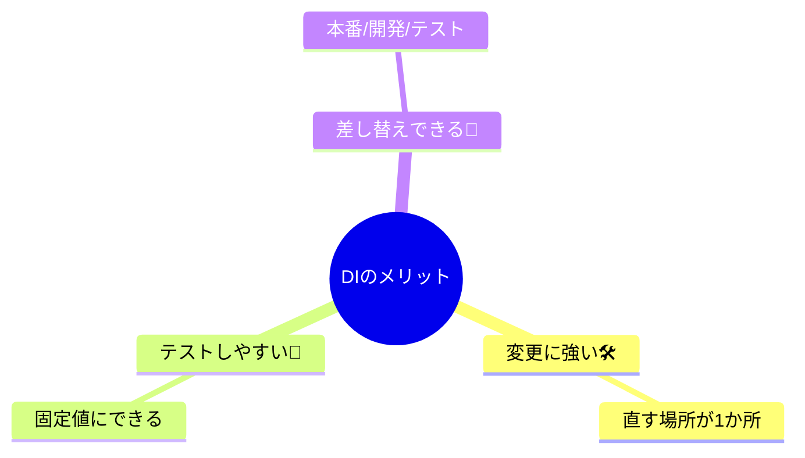

# 第01章：はじめに：DIで得することを先に知ろう🎁✨

この章は「DIって何？」の前に、**DIを使うと何が嬉しいのか**を先に“体感”する章だよ😊💉
（ここで「得する未来」が見えると、後の章がめっちゃ楽になる✨）

---

## この章のゴール🎯🌸


読み終わったら、こんなふうに言えたらOK🙆‍♀️✨

* DIのメリットを **3つ** 言える（変更に強い／テストしやすい／差し替えできる）🎁
* 「依存＝自分の外にある頼り先」って感覚がつかめる🔗
* “DIっぽい書き方”を、超ミニコードで1回やってみる💉🧩

---

## まず、DIって一言でいうと…💬✨


**「必要なもの（依存）を、外から渡してもらう」** それだけ！💉
自分の中で `new` したり、直接 `Date.now()` とか `Math.random()` を呼んでガチガチに固定しないで、**外から渡して差し替え可能にする**感じだよ🔄

---

## DIで得すること3つ🎁🎉



### ① 変更に強い（直す場所が少ない）🛠️✨


たとえば「ログ出したい」ってなったときに、あちこちで `console.log` 直書きしてると…
方針変更（ファイルに保存したい、外部サービスに送りたい）が来た瞬間、修正が地獄😵‍💫💥

DIだと「ログ係」を外から渡すので、**差し替え1か所**で済みやすい🙌✨

---

### ② テストしやすい（運ゲーが消える）🧪💖


`Date.now()` や `Math.random()` がコードに直書きだと、テストがこうなる👇

* 時間が毎回変わる⏰➡️結果が揺れる
* 乱数で当たり外れが出る🎲➡️たまに落ちる

DIで「時計」や「乱数」を外から渡せば、テストでは **固定の時計・固定の乱数** にできる✅✨
（この“テストが安定する気持ちよさ”がDIの最初のご褒美🎁）

---

### ③ 差し替えできる（本番／開発／テストで入れ替え）🔄🌈


たとえば `fetch`（通信）みたいな外部I/Oは、環境や事情で変わりがち🌐
最近のNodeでは `fetch` が安定扱いになった、みたいに“外側”は普通に変化する世界なんだよね📈 ([Node.js][1])

DIで外側を“部品化”しておくと、**本物 ↔ ダミー** の切り替えがスムーズになるよ😊✨

---

## ミニ体験：DIなし→DIあり を見比べよう👀💉

### ❌ DIなし：中で勝手に依存を使う（固定化）🧱


```ts
// coupon.ts
export function issueCoupon(userId: string) {
  const now = Date.now();          // 時間に依存⏰
  const r = Math.random();         // 乱数に依存🎲
  const code = `CP-${userId}-${Math.floor(r * 1000)}`;

  return { code, issuedAt: now };
}
```

これ、動くけど…
テストしようとすると「時間も乱数も毎回変わる」から、**期待値が書きにくい**😣🌀

---

### ✅ DIあり：依存を外から渡す（差し替えOK）🎁


```ts
// coupon.ts
export type CouponDeps = {
  now: () => number;
  random: () => number;
};

export function makeCouponService(deps: CouponDeps) {
  return {
    issueCoupon(userId: string) {
      const now = deps.now();
      const r = deps.random();
      const code = `CP-${userId}-${Math.floor(r * 1000)}`;
      return { code, issuedAt: now };
    },
  };
}
```

**ポイントはここ👇✨**

* 本番では `now: () => Date.now()` とかを渡す
* テストでは `now: () => 1234567890` みたいに固定できる✅

---

### 🧪 テスト用の“固定deps”のイメージ（超ミニ）💖

```ts
import { makeCouponService } from "./coupon";

const fixed = makeCouponService({
  now: () => 1700000000000,
  random: () => 0.123,

1. 「この関数の `Date.now()` と `Math.random()` をDIできる形にリファクタして。depsオブジェクトで注入したい」


2. 「テストしやすいように、時間・乱数・ログを外から渡す設計案を3つ出して」
3. 「“DIなし版”と“DIあり版”の差を初心者向けに、たとえ話で説明して」

---

## まとめ🎀🏁

* DIは「必要なものを外から渡す」💉
* 得するのはこの3つ：

  * **変更に強い**🛠️
  * **テストしやすい**🧪
  * **差し替えできる**🔄
* まずは “時間・乱数” みたいな小さい依存から外に出すと気持ちよさが分かるよ😊✨

---

## 次章予告📚🌸

次は「そもそも依存って何？」を、TypeScriptあるある（`Date.now` / `fetch` / `localStorage` など）でつかみに行くよ🔗✨

[1]: https://nodejs.org/en/blog/announcements/v21-release-announce?utm_source=chatgpt.com "Node.js 21 is now available!"
[2]: https://www.typescriptlang.org/docs/handbook/2/basic-types.html?utm_source=chatgpt.com "TypeScript: Documentation - The Basics"
[3]: https://devblogs.microsoft.com/typescript/announcing-typescript-5-9/?utm_source=chatgpt.com "Announcing TypeScript 5.9"
