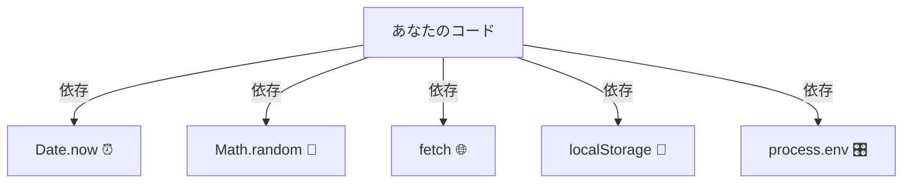

# 第02章：“依存”ってなに？TSの依存あるあるで理解🔗

この章は「DIの前に、まず“依存”って言葉を自分の言葉で説明できるようになる」がゴールだよ〜😊💕

---

## この章のゴール🎯💖

読み終わったら、これができるようになろう✨

* 「依存＝それがないと困る相手」って説明できる🗣️🔗
* 自分のコードから“依存っぽいところ”を3つ見つけられる🔎✨
* 依存を見つけたら「あとで差し替えたいかも？」って一瞬考えられる🧠💡

---

## 1) “依存”の超シンプル定義💡🔗


**依存（dependency）**ってね、

> **「これ（A）が動くために、あれ（B）が必要」**
> **「AがBに頼って仕事してる」**

ってこと☺️✨

たとえば…

* `Date.now()` がないと「今の時刻」が取れない⏰
* `fetch()` がないと「ネットからデータ」が取れない🌐
* `localStorage` がないと「ブラウザに保存」ができない💾

つまり、その機能が“外の何か”を使ってるなら、だいたい依存がいるよ〜🔗

---

## 2) TSの「依存あるある」6選（超よく出るやつ）📌✨



ロードマップに出てきた例を、**“なぜ依存なの？”**の視点で見ていくよ😊
（※説明は“よくある使い方”でOK。細かい差は後の章で詰めるね）

### 依存① `Date.now()`：時間依存⏰

* **何が起きる？** 「今この瞬間」が毎回変わる
* **困りがち** テストの結果が日によって変わる
  `Date.now()` は epoch（1970-01-01）からのミリ秒を返す仕様だよ📏 ([MDNウェブドキュメント][1])

### 依存② `Math.random()`：乱数依存🎲

* **何が起きる？** 毎回結果が変わる
* **困りがち** テストが安定しない（たまに落ちる😇）
  `Math.random()` は 0以上1未満の擬似乱数を返すよ🎲 ([MDNウェブドキュメント][2])

### 依存③ `fetch()`：ネットワーク依存🌐

* **何が起きる？** 通信先・ネット状態・応答速度で結果が変わる
* **困りがち** テストが遅い／不安定／オフラインで死ぬ🫠
  Fetch API 自体はWeb標準として定義されてるよ📚 ([fetch.spec.whatwg.org][3])
  Nodeでも `fetch` が“安定版”扱いになった流れがあり（Node 21でstable化が告知）、「ブラウザだけのもの」じゃなくなってきたよ〜🧩 ([Node.js][4])

### 依存④ `localStorage`：ブラウザ保存依存💾

* **何が起きる？** ブラウザの機能（Web Storage）に頼る
* **困りがち** Nodeでは基本そのまま使えない／プライベートモード等で挙動差がある
  `localStorage` は Web Storage の仕組みで、キー・値を保存できるよ🗝️ ([MDNウェブドキュメント][5])

### 依存⑤ `process.env`：環境変数依存🎛️

* **何が起きる？** 実行環境（PC/サーバ/CI）で値が変わる
* **困りがち** 手元では動くのに本番で死ぬ（設定が無い😱）
  Nodeでは `process.env` が環境変数の基本APIだよ🌱 ([Node.js][6])

### 依存⑥ `console`：ログ依存🗯️

* **何が起きる？** 実行環境ごとに“出方”が違うこともある
* **困りがち** テスト出力がうるさい／ログが仕様に混ざる
  `console` はデバッグコンソールへのアクセスを提供するよ🧰 ([MDNウェブドキュメント][7])

---

## 3) 依存があると何がイヤなの？（まだ怖がらなくてOK😌💗）

ここでは“ふわっと”でOKだよ〜！

依存が増えるほど👇みたいになりがち：

* **差し替えにくい**（本番だけ別の保存先にしたい…が難しい😵）
* **テストしにくい**（時間・乱数・ネットが絡むと不安定🧪💥）
* **変更が怖い**（あちこちで直叩きしてると修正が広がる🧨）

DIは、この“イヤ”を減らすための技だよ💉✨
でも今はまず「依存を見つけられる目」を育てよ〜🌱👀

---

## 4) まずは体感！依存てんこ盛りサンプル🍱✨

「これ、依存だらけだね！」って言えるようになれば勝ち😊

```ts
// fortune.ts
export async function drawFortune() {
  const now = Date.now();                // ⏰ 時間依存
  const r = Math.random();               // 🎲 乱数依存

  const res = await fetch("/api/fortune"); // 🌐 ネット依存
  const text = await res.text();

  localStorage.setItem("lastFortune", text); // 💾 保存依存
  console.log("fortune:", text, "at", now, "r=", r); // 🗯️ ログ依存

  return text;
}
```

✅ この関数は「外の世界」にめっちゃ頼ってるよね？
だから「それがないと困る相手（依存）」がいっぱいある、って感覚になるはず🥰

---

## 5) 依存を見つける“におい”チェックリスト🐶🔎✨

VS Codeでコードを見るとき、ここを見てみて〜！

* **グローバルっぽいもの**：`Date` / `Math` / `fetch` / `localStorage` / `process` / `console`
* **I/Oっぽいこと**：通信、保存、読み込み、ログ、時間
* **環境っぽいこと**：`process.env`、ブラウザAPI、OS依存
* **副作用っぽいこと**：状態を書き換える、保存する、外に送る

「値が毎回変わる」「外部に触る」ほど、依存の匂いが濃いよ〜😆💨

---

## ミニ課題📝✨「依存を3つ探そう」🔎🔗

### やること（10分）⏳

1. 自分のプロジェクトで、適当なTSファイルを1つ開く📂
2. 次の単語で検索してみる（VS Codeの検索でOK）🔍

   * `Date.` / `Math.random` / `fetch` / `localStorage` / `process.env` / `console.`
3. 見つけたら、その行にコメントで目印をつける🟥

例：

```ts
const token = process.env.API_TOKEN; // 🟥 依存：環境変数
```

### できたらボーナス🌟

見つけた依存に対して、こう自問してみて👇

* 「これ、テストで固定したい？」🧪
* 「本番と開発で切り替えたい？」🔄
* 「将来、別実装に差し替えたい？」🧩

YESが多いほど、DIが効いてくる可能性が高いよ💉✨

---

## AI（Copilot / Codex）活用プロンプト例🤖💬✨

そのまま貼ってOK系にしておくね！

* 「このファイルの“外部依存”を列挙して、理由も一言で説明して」
* 「`Date.now()` と `Math.random()` がテストを不安定にする例を作って」
* 「`fetch` を直接呼んでる場所を見つけて、一覧にして」
* 「依存っぽい行に `// DEP:` コメントを自動で入れる案を出して」

---

## 理解チェック✅ミニクイズ🎓✨

1. `Math.random()` はなぜ依存？🎲
2. `localStorage` はどんな“外”に頼ってる？💾
3. `process.env` はなぜ本番で事故りやすい？🎛️
4. `console.log` は依存って言っていい？🗯️
5. 依存が増えると、何がつらくなりがち？😣

**答え（かんたん）**

1. 毎回変わる“外部要因”だから（テスト不安定）🎲
2. ブラウザのWeb Storage機能に頼るから💾 ([MDNウェブドキュメント][5])
3. 環境ごとに値が違う／無いことがあるから🎛️ ([Node.js][6])
4. うん、実行環境のコンソールに頼るから依存扱いしてOK🗯️ ([MDNウェブドキュメント][7])
5. 差し替え・テスト・変更がつらくなる😣💥

---

## おまけ：いまのTypeScript“最新”どれ？🆕🧡

本日時点だと、npm上の TypeScript は **5.9.3** が “Latest” になってるよ📦✨ ([npm][8])
TypeScript 5.9 のリリース告知も出てるよ📣 ([Microsoft for Developers][9])
（あと、TypeScriptコンパイラをネイティブ化する “TypeScript 7” のプレビュー話も進んでる…！速度面が熱い🔥） ([Microsoft Developer][10])

---

## 次章予告👀✨（第3章へ）

次は **「直接import＆直叩きがつらい😣📦」** だよ！
今日見つけた依存たちが、どうして「差し替え不能」「テスト不能」につながるのかを、失敗例で体感していくよ〜💥🧪✨

[1]: https://developer.mozilla.org/ja/docs/Web/JavaScript/Reference/Global_Objects/Date/now?utm_source=chatgpt.com "Date.now() - JavaScript - MDN Web Docs - Mozilla"
[2]: https://developer.mozilla.org/ja/docs/Web/JavaScript/Reference/Global_Objects/Math/random?utm_source=chatgpt.com "Math.random() - JavaScript - MDN Web Docs"
[3]: https://fetch.spec.whatwg.org/?utm_source=chatgpt.com "Fetch Standard - WhatWG"
[4]: https://nodejs.org/en/blog/announcements/v21-release-announce?utm_source=chatgpt.com "Node.js 21 is now available!"
[5]: https://developer.mozilla.org/ja/docs/Web/API/Web_Storage_API?utm_source=chatgpt.com "ウェブストレージ API - MDN Web Docs"
[6]: https://nodejs.org/api/environment_variables.html?utm_source=chatgpt.com "Environment Variables | Node.js v25.3.0 Documentation"
[7]: https://developer.mozilla.org/ja/docs/Web/API/console?utm_source=chatgpt.com "console - Web API | MDN"
[8]: https://www.npmjs.com/package/typescript?utm_source=chatgpt.com "typescript"
[9]: https://devblogs.microsoft.com/typescript/announcing-typescript-5-9/?utm_source=chatgpt.com "Announcing TypeScript 5.9"
[10]: https://developer.microsoft.com/blog/typescript-7-native-preview-in-visual-studio-2026?utm_source=chatgpt.com "TypeScript 7 native preview in Visual Studio 2026"
