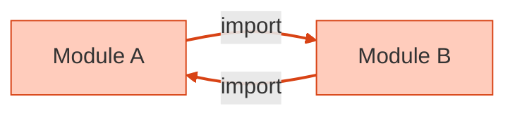

# 第03章：失敗例①：直接import＆直叩きがつらい😣📦

この章は「DIって必要なの？」の答えを、**わざとツラい例で体感する回**だよ〜💉✨
（次章以降で、ちゃんと“ラクにする方法”を作っていくから安心してね🥹🌸）

---

## この章のゴール🎯💖


* 「直接import＆直叩き」が、**なぜ差し替え不能**になるのか説明できる🗣️
* テストで起きる「え、モックできない…」の原因がわかる🧪💥
* 「困ったポイント」をコード上で発見して、印を付けられる🔎🟥

---

## 1) まず“つらい例”を見よう😣📦


たとえば「ユーザーにウェルカムメール送る」みたいな処理✉️✨
（※あえて“悪い書き方”）

```ts
// src/features/welcome/sendWelcome.ts
import { sendMail } from "../../infra/mailer";     // 直接import（固定）
import { getUserById } from "../../infra/db";      // 直接import（固定）
import { format } from "../../infra/dateFormat";   // 直接import（固定）

export async function sendWelcome(userId: string) {
  const user = await getUserById(userId);     // DB直叩き
  const body = `ようこそ！ ${format(new Date())}`; // 日付直叩き（間接的に環境依存）
  await sendMail(user.email, "Welcome!", body);    // メール送信直叩き
}
```

一見「普通に動く」んだけど…ここからが地獄の入口😇🔥

---

## 2) 何がつらいの？（壊れ方ベスト4）🧨


## つらい①：差し替えできない（本番固定）🔒


* `sendMail` が本物固定だと、**テストでメール送っちゃう**💌💥
* `getUserById` が本物固定だと、**テストでDBを触っちゃう**🗄️💥
* “外部I/O”が混ざると、テストが遅い・不安定・準備だるいの三重苦😵‍💫

---

## つらい②：テストでモックしにくい（特にESM）🧪⚠️


ES Modules（`import ... from`）は、**importが先に評価される**性質があるから、
「あとから差し替え（モック）したい」がやりにくいことがあるよ🥲

* Jestは、ESMでは `jest.mock` がそのまま効かないケースがあって、**dynamic import や別の手順が必要**って明記されてるよ📌 ([Jest][1])
* Vitestも、**static import は hoist される**（importが先に動く）前提があって、モックの書き方に制約が出ることがあるよ📌 ([Vitest][2])

つまり、「直接importで固定」が増えるほど、テストが“ツールのクセ勝負”になりがち😣🌀

---

## つらい③：環境差（Node/ブラウザ）で詰む🪤🌐


直接importで `fs` とか `localStorage` とかを握りしめると、環境が変わった瞬間に崩れる💥
さらに、TypeScriptの `moduleResolution` は **Nodeの解決ルール（ESM/CJS）に合わせた設定が重要**で、ここを甘く見ると「動くはずが動かない」が起きやすいよ⚙️😵 ([TypeScript][3])

---

## つらい④：循環import（circular dependency）で“undefined事故”🌀😱




「便利だから index.ts（barrel）経由でimportしよ〜」をやると、
**循環参照が混ざったときに runtime で undefined** になったりする😭

* `index.ts` 経由の自動importが循環参照を生みやすい、って話も出てるよ📌 ([GitHub][4])
* barrel（index.tsで再export）自体が循環の温床になりやすい、という注意喚起も多いよ📌 ([TkDodo][5])

“直接import多用”は、依存関係が絡まったときの爆発力が高いの…💣🌀

---

## 3) “ツラさ”を見える化するコツ🧠✨


次の3つを見つけたら、そこに **🟥 外部！** ってコメントを付けてね👇

* `fetch` / `localStorage` / `process.env` / `Date` / `Math.random` / `console` みたいな **環境依存**
* DB・メール・ファイル・ネットワークみたいな **I/O**
* 直接importしていて **差し替えたいのに差し替えられない**やつ

---

## 4) ミニ課題📝💖（10〜15分）

## ミニ課題A：🟥スタンプ付け職人になろう

さっきの“悪い例”に、コメントを足してみてね👇

```ts
// 🟥 外部！(DB)
// 🟥 外部！(メール)
// 🟥 外部！(時間/日付)
// 🟥 外部！(環境差の可能性)
```

---

## ミニ課題B：テスト視点で「困ること」を3つ書く🧪

例：

* 「メール送信を止めたい」
* 「DBアクセスをFakeにしたい」
* 「日付を固定したい」

---

## 5) AIにお願いするなら🤖✨（超使える！）

Copilot/Codexにこう投げると、次章につながるリファクタ案が出やすいよ🌸

* 「この関数の外部依存（DB/メール/日付）を列挙して、差し替え可能な形にしたい」
* 「直接importを減らして、依存を引数で受け取る形（deps注入）に分解して」
* 「テストが書きやすいように、I/Oと純粋ロジックを分離して」

---

## まとめ🎀🏁

* 直接import＆直叩きは、**動くけど差し替え不能**になりやすい😣📦
* ESMの性質（importが先に評価される）で、**モックが難しくなる**ことがある🧪⚠️ ([Jest][1])
* barrelや循環importで、**undefined事故**が起きやすい🌀😱 ([GitHub][4])

次の章（第4章）では、似た“固定化地獄”の代表 **「new直書き」** をやっつけるよ〜🧱🔨✨

[1]: https://jestjs.io/docs/ecmascript-modules?utm_source=chatgpt.com "ECMAScript Modules"
[2]: https://vitest.dev/api/vi.html?utm_source=chatgpt.com "Vitest"
[3]: https://www.typescriptlang.org/tsconfig/moduleResolution.html?utm_source=chatgpt.com "TSConfig Option: moduleResolution"
[4]: https://github.com/microsoft/TypeScript/issues/45953?utm_source=chatgpt.com "Auto-import prefers parent index.ts which leads to circular ..."
[5]: https://tkdodo.eu/blog/please-stop-using-barrel-files?utm_source=chatgpt.com "Please Stop Using Barrel Files"
