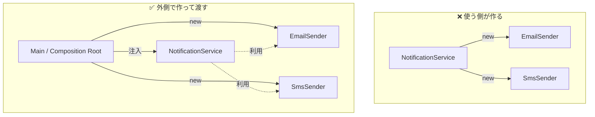

# 第04章：失敗例②：new直書きの“固定化”問題🧱

この章は「**new をあちこちに直書き**すると、あとで泣く😭」を体感する回だよ〜！
（次の章で“じゃあどうする？”をスッキリ解決するよ💉✨）

---

## 1) この章でできるようになること🎯✨

* 「**new が散らばると何が困るか**」を説明できる🗣️
* 自分のコードから「**危険な new**」を見つけられる🔎
* new を **1か所に集める作戦（案）**を考えられる📍🧠

---

## 2) まず結論：new が悪いんじゃない、“場所”が悪い🧱⚠️


`new` 自体は普通の道具だよ🛠️
でも、**使う側（ビジネスロジック側）**に `new` が散らばると、

* 「何を使ってるのか」固定される🔒
* 構成を変えたいだけなのに、あちこち修正になる💥
* テストで差し替えたいのに差し替えできない😵‍💫

…ってなるの。

DI の世界では、**“作る場所”と“使う場所”を分ける**のが大事で、作る場所をまとめた考え方が **Composition Root（組み立て場所）**だよ📍✨（アプリの入口で依存関係をまとめて組む、って定義されることが多いよ）([InfoQ][1])

---

## 3) 失敗例：new 直書きが散らばったコード😣📦


「通知を送る」超ありがち例でいくね💌✨

```ts
// src/notify/NotificationService.ts
import { EmailSender } from "./EmailSender";
import { SmsSender } from "./SmsSender";

export class NotificationService {
  async notify(message: string) {
    // ❌ ここで new しちゃう（使う側が作ってる）
    const email = new EmailSender();
    const sms = new SmsSender();

    await email.send(message);
    await sms.send(message);
  }
}
```

この時点で、NotificationService はこう言ってるのと同じ👇
「通知は **EmailSender と SmsSender を必ず使う**ね！変更しないでね！」🔒😇

---

## 4) “new散らばり”で起きる3大つらみ😭💥


### つらみ①：差し替え不能（実装が固定）🔒


例えば「SMSやめてLINEにしたい📱」「メールは SendGrid にしたい📧」
→ 変更箇所が NotificationService の中に入り込む😇

「クラスは“自分で必要物を作らず、外から受け取る”」がDIの基本、って説明されることが多いよ([Medium][2])

### つらみ②：構成変更が地獄（あちこち修正）🧟‍♀️🧟‍♂️

`new X()` が 30か所に増えたら…
「ログ追加したい」だけで 30か所修正とか起きる😭🔧

Composition Root は「**アプリの組み立て方（構成）を変える時だけ**変わればいい」みたいな整理ができるのが強いよ([Stack Overflow][3])

### つらみ③：テストがしんどい（Fakeにできない）🧪💔

テストでは「本物のSMS送信」なんてしたくないよね😱
でも `new SmsSender()` が中にあると、差し替えられない＝**テストが不安定or遅い**になりがち💥

（JS/TSでは関数で依存を注入してテストしやすくする考え方もよく語られるよ）([martinfowler.com][4])

---

## 5) どこからが“危険な new”なの？🕳️⚠️（見分け方）


全部の `new` を禁止！…じゃないよ🙅‍♀️

### ✅ 比較的OKな new（ローカルで完結）

* `new Date()`（ただし“今”依存の意味が出るなら注意⏰）
* `new Error()`
* 小さな値オブジェクト（例：`new Money(1000)` みたいなやつ）💰

### ⚠️ 危険になりやすい new（外部/I/O/実装固定）

* `new ApiClient()`（HTTP）🌐
* `new FileStorage()`（ファイル）📁
* `new ConsoleLogger()`（ログ先を変えたい）📝
* `new Random()`（テストがブレる）🎲

**見分けの合言葉**：
👉「それ、テストのとき本物で動かしたい？」
👉「あとで実装差し替える未来がある？」🔮

---

## 6) ミニ図解：new散らばりが“設計の自由”を奪う😵‍💫🧱


### ❌ 使う側が作る（固定化）

* NotificationService
  ↳ new EmailSender
  ↳ new SmsSender

「使う側」が「作る」まで担当しちゃうと、責務が肥大化🍔💦

### ✅ 作るのは外側（Composition Root）📍✨

* main/bootstrap（外側）で
  EmailSender / SmsSender を作って
  NotificationService に渡す

これで「NotificationService は通知に専念」できるようになる🎀
（Composition Root＝入口で依存関係を組み立てる、という考え方）([InfoQ][1])



---

## 7) ハンズオン：自分のコードで “newの散らばり” を発見しよう🔎✨


### 手順①：VS Codeで `new ` を検索🕵️‍♀️

1. `Ctrl + Shift + F`
2. 検索欄に `new `（newの後ろに半角スペース）
3. 結果をざっと眺める👀

### 手順②：色分けメモする🖍️

検索結果を見ながら、コメントやメモで分類👇

* 🟢「ローカル完結」
* 🟡「たぶん外部っぽい」
* 🔴「外部I/O or 差し替えたいのに固定されてる」

### 手順③：🔴だけ“集める候補”にする📍

この章のゴールはここ！
「🔴new を 1か所に寄せられそう」って当たりを付けるだけでOK😊✨

---

## 8) ミニ課題：newの場所を1か所に集める案を考える📍🧠


さっきの通知例なら、アイデアはこんな感じ👇

* `src/main.ts` に “組み立て係” を作る
* そこで `new EmailSender()` と `new SmsSender()` を作る
* `NotificationService` には「使うもの」を渡す（次章のDI💉）

今はまだ「渡し方」まで完璧じゃなくてOK🙆‍♀️
**“作るのは外側に寄せる”**って発想が持てたら勝ち〜！🏆✨

---

## 9) AI（Copilot/Codex）活用プロンプト例🤖💡

そのまま貼って使ってOKだよ〜！

* 「このプロジェクトで `new` が散らばっている箇所を見つけて、外部I/Oっぽいものを優先して列挙して」
* 「このクラスの責務が“生成”まで含んでいないかレビューして。生成を外に出す案を3つ」
* 「Composition Root を置くならどのファイルが自然？エントリポイントからの依存関係の流れも説明して」

---

## 10) まとめ🎀🏁（次章につながる！）

* `new` が散らばると、**実装が固定**されて変更やテストがつらくなる🔒🧪
* 解決の方向性は「**作る場所を外側に寄せる（Composition Root）**」📍✨([InfoQ][1])
* 次の章で、いよいよ **最小のDI＝“引数で渡すだけ”**をやるよ💉😊

---

## おまけ：1分チェッククイズ⏱️❓

1. `new ApiClient()` がサービス内に直書きされてる。将来、モックに差し替えたい。つらみはどれ？
   👉 A: 差し替え不能🔒 / B: 速度が遅い🐢 / C: 見た目がダサい😇

2. `new Error()` はだいたい安全？危険？
   👉 どっちが多いか、理由も一言で✍️

---

次は第5章に進めて「引数で渡すだけDI💉」を一緒に作ろ〜！🌸✨

[1]: https://www.infoq.com/articles/DI-Mark-Seemann/?utm_source=chatgpt.com "Dependency Injection with Mark Seemann"
[2]: https://medium.com/%40ro-zcn/dependency-injection-pattern-with-typescript-4c6d45bdd877?utm_source=chatgpt.com "Dependency Injection Pattern — with TypeScript | by Ro"
[3]: https://stackoverflow.com/questions/45660137/di-composition-root-decomposition?utm_source=chatgpt.com "dependency injection - DI: Composition root decomposition"
[4]: https://martinfowler.com/articles/dependency-composition.html?utm_source=chatgpt.com "Dependency Composition"
