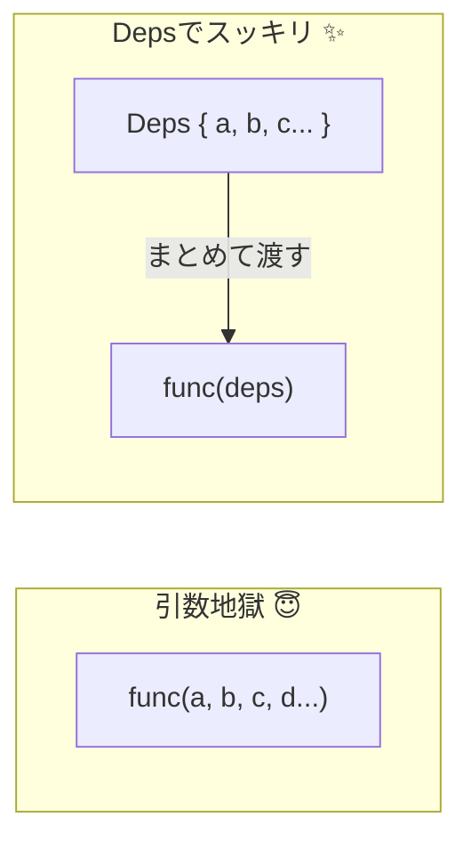

# 第05章：まず最小のDI：引数で渡すだけでDI💉

## この章のゴール🎯

* **DI＝「依存するものを、外から渡す」**って言えるようになる😊
* `Date.now()` みたいな **“時間依存”** を、**引数で注入**できるようになる⏰➡️💉
* **差し替え（本番／テスト／デモ）**が一瞬でできる感覚をつかむ🔄✨

---

## 1) 結論：DIの最小形は「引数にする」だけ💡🫶

たとえば、こんな依存ってあるよね👇

* 時間：`Date.now()` ⏰
* 乱数：`Math.random()` 🎲
* 通信：`fetch()` 🌐
* 保存：`localStorage` 🗄️

これらを**関数の中で直叩き**すると、あとで「差し替えたい…」ってなった瞬間つらい😣💦
だから最初の一歩はこれだけ👇

✅ **依存を“引数”にして外から渡す**（＝DI）💉✨

---

## 2) まずは“直叩き版”を見よう😵‍💫（変更しづらい）

例：学習ログに「作った時刻」を付ける関数📚📝

```ts
// ❌ 直叩き：関数が「時間」にベッタリ依存しちゃう
function createStudyLog(title: string) {
  return {
    title,
    createdAtMs: Date.now(), // ← ここが依存（外の世界）
  };
}

// 動かす
console.log(createStudyLog("DIを勉強した！"));
```

これだと…

* テストで「createdAtMs が固定であること」を確認できない（毎回変わる）😢
* デモで「この時刻を出したい！」ができない😢
* 将来、時間取得方法を変えたら影響が広がる😢

---

## 3) 最小DI：`clock` を作って引数で渡す💉⏰


## Step A：Clock（時計）という“依存”を用意する🕰️

```ts
type Clock = {
  now(): number;
};

const systemClock: Clock = {
  now: () => Date.now(),
};
```

## Step B：関数に `clock` を受け取らせる（これがDI！）💉✨

```ts
function createStudyLog(title: string, clock: Clock) {
  return {
    title,
    createdAtMs: clock.now(), // ✅ 直叩きやめた！
  };
}

// 呼び出し側で注入する（外から渡す！）
console.log(createStudyLog("DIを勉強した！", systemClock));
```

これだけで **「依存を外から渡せる」＝DIできた** 🎉🎉🎉

---

## 4) “差し替え”が一気にラクになる🔄💖（Fake Clock）

たとえば「時刻を固定」したいとき👇（テスト・デモで超便利✨）

```ts
function createFakeClock(fixedMs: number): Clock {
  return {
    now: () => fixedMs,
  };
}

const fakeClock = createFakeClock(1700000000000);

const log = createStudyLog("固定時刻で作るよ", fakeClock);
console.log(log);
// createdAtMs が 1700000000000 で固定される🎯
```

✅ **“本物”を注入**すれば本番動作
✅ **“偽物”を注入**すれば固定・再現可能

この「差し替え自由」が、DIの一番おいしいところ🍰💕

---

## 5) 引数が増えそう？じゃあ `deps` にまとめる👜✨



依存が増えると、引数がこうなりがち👇
`(title, clock, logger, storage, random, ...)` 😇

そこで **依存はまとめて1個にする**のが超定番だよ📦✨

```ts
type Deps = {
  clock: Clock;
};

function createStudyLog2(title: string, deps: Deps) {
  return {
    title,
    createdAtMs: deps.clock.now(),
  };
}

console.log(createStudyLog2("deps方式！", { clock: systemClock }));
```

これで **増える未来**に強い〜！💪💕

---

## 6) “すぐ動かす”メモ🪄（最近のNodeはTSをそのまま実行OK）

最近の Node は、**“erasable な TypeScript 構文”だけ**なら、トランスパイル無しで `.ts` をそのまま実行できるよ（型注釈を消して実行する方式）✨
`node example.ts` みたいに動く（v22.18.0 以降）([Node.js][1])

ただし注意点もあるよ👇

* **型チェックはしない**（消して実行するだけ）
* **`enum` や一部のTS構文はエラー**になり得る
* `tsconfig.json` は Node 実行には使われない（エディタ＆`tsc`の整合のために設定を合わせるのがおすすめ）([Node.js][2])
* 目安として TypeScript は **5.8+ 推奨**、TypeScript 5.9 はリリース済み([Node.js][2])

（ここは深追いしなくてOK👌 後の章で “import地雷” も含めてちゃんと扱うよ🧨）

---

## 7) よくあるつまずき集⚠️😺

## つまずき①「引数増えてだるい…」

👉 **depsオブジェクトにまとめる**（さっきの `Deps` 方式👜）

## つまずき②「clock作るの大げさでは？」

👉 最初は大げさに見えるけど、**“変わりうるもの”**は分けた方が未来がラク✨
（時間・乱数・I/O はだいたい変わる😇）

## つまずき③「DIしたのに、結局どこで渡すの？」

👉 いまは `main` とか呼び出し側で渡せばOK！
次の方針は **Composition Root（組み立て場所を1か所に）**で解決していくよ📍✨

---

## 8) ミニ課題🎀📝（この章のゴール確認）

## 課題A：`Date.now()` を `clock.now()` に置き換えよう⏰➡️💉

* `createMessage(text)` が `createdAtMs: Date.now()` を使ってる
* **Clock を注入**して、固定時刻でも動くようにしてね😊

## 課題B：Fake Clockで“固定ログ”を作ろう🎯

* `1700000000000` 固定でログを作って、出力が固定になるのを確認✨

---

## 9) AI（Copilot/Codex）活用プロンプト例🤖💬

コピペでどうぞ〜🌸

* 「この関数の `Date.now()` 依存をDIにしたい。`Clock` を導入して引数注入にリファクタして」
* 「依存が増える前提で `deps` オブジェクト方式に変えて。型も付けて」
* 「FakeClockを用意して、固定時刻で動くデモコードも作って」

---

## まとめ🎁✨

* DIの最小形は **“引数で渡す”** だけ💉
* `Date.now()` を `clock.now()` に変えると、**差し替え**が一気にラク🔄
* 依存が増える未来に備えて、**depsでまとめる**のが定番👜

次の章では、TypeScriptならではの超重要ポイント
**「型が実行時に消える👻」**が、DIのやり方にどう効いてくるかをやるよ〜！🧩✨

[1]: https://nodejs.org/en/learn/typescript/run-natively "Node.js — Running TypeScript Natively"
[2]: https://nodejs.org/api/typescript.html "Modules: TypeScript | Node.js v25.3.0 Documentation"
