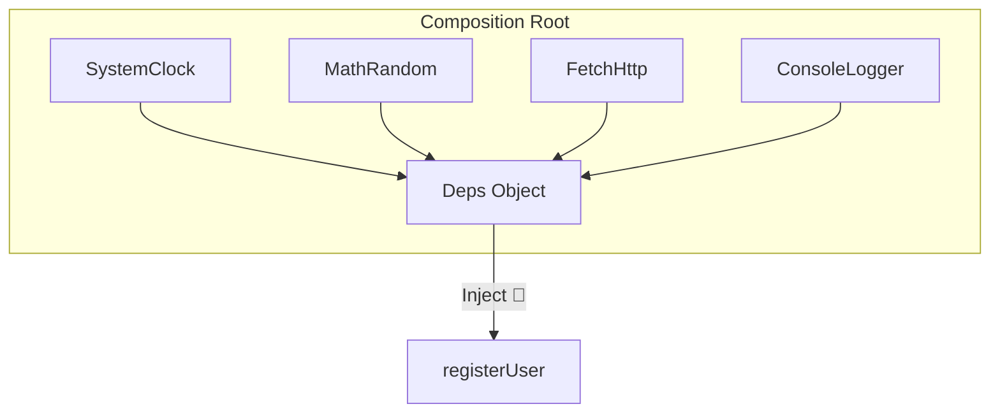

# 第07章：関数DI①：依存をまとめて渡す（deps注入）👜

この章は **「引数DIの進化版」＝ deps（依存まとめ）注入** をマスターする回だよ〜！🥳
TypeScriptは **型が実行時に消える** から、まずはこの「手動DIの基本フォーム」を持っておくと超強い💪👻

---

## 0) 本日時点の“前提になる最新メモ”🗒️✨

* TypeScript は **npm の最新が 5.9.3**（2025-09-30公開）だよ。([npm][1])
* TypeScript 5.9 の `tsc --init` は、`verbatimModuleSyntax` や `isolatedModules` など **モジュール周りを堅くする設定が最初から入りやすい** 方針に寄ってるよ。([Microsoft for Developers][2])
  → だからこそ、依存の受け渡し（DI）と相性いい😊📦
* `satisfies` は TypeScript 4.9 で入った便利機能（「型チェックはするけど推論は潰さない」）。deps型づけでめちゃ使う！([TypeScript][3])

（※Nodeやテストツールの最新もあるけど、この章では“deps注入の型づけ”が主役なので、必要なところだけ触れるね🫶）

---

## 1) この章のゴール🎯💖

できるようになったら勝ち！🥰

* ✅ 依存を **`deps` オブジェクトにまとめて** 関数へ注入できる
* ✅ 「引数地獄😵‍💫」を回避できる
* ✅ テストで `deps` を **Fake/Stub に差し替え** できる
* ✅ TypeScriptで **型が崩れない deps の型づけ** ができる（ここ大事！）

---

## 2) まず“引数地獄”を体験しよう😵‍💫🧨


たとえば「ユーザー登録」のロジックを書きたいとして…

```ts
export async function registerUser(
  email: string,
  now: () => number,
  randomInt: (max: number) => number,
  fetchJson: (url: string, init: RequestInit) => Promise<unknown>,
  logInfo: (msg: string) => void,
) {
  logInfo("start register");
  const userId = `u_${now()}_${randomInt(1000)}`;
  await fetchJson("/api/register", {
    method: "POST",
    body: JSON.stringify({ email, userId }),
  });
  return { userId };
}
```

……引数が増えた瞬間に「うっ…」ってなるやつ😇
依存が増えるほど、呼び出し側も読めなくなる📉

---

## 3) 解決：deps注入（依存まとめ）👜✨


### ✅ 発想はこれだけ！

* “依存”を1個ずつ渡すんじゃなくて
* **依存の束 `deps` を1個渡す** 🌸

```ts
export async function registerUser(
  deps: RegisterDeps,
  email: string,
) {
  // ...
}
```

### いいところ🎁✨

* 引数がスッキリ😍
* 依存が増えても `deps` の中身が増えるだけ
* テストでは `deps` を丸ごと差し替えできる🧪💕

---

## 4) 依存の“最小インターフェース”を作ろう✂️📜


ここがDIのコツだよ〜！
**でっかい依存（Dateやfetchそのまま）を渡すより、必要な形だけ渡す** のが読みやすい🧁

```ts
export type Clock = {
  nowMs(): number;
};

export type Random = {
  int(maxExclusive: number): number;
};

export type Http = {
  postJson(url: string, body: unknown): Promise<unknown>;
};

export type Logger = {
  info(message: string): void;
};
```

---

## 5) deps型（RegisterDeps）を作る👜🧩


depsは **Readonly** にしておくと、うっかり書き換え事故が減るよ🛡️✨

```ts
export type RegisterDeps = Readonly<{
  clock: Clock;
  random: Random;
  http: Http;
  logger: Logger;
}>;
```

---

## 6) 関数に deps を注入して書き直し💉✨

### パターンA：`deps` をそのまま使う（最初はこれでOK🙆‍♀️）

```ts
export async function registerUser(deps: RegisterDeps, email: string) {
  deps.logger.info("start register");

  const userId = `u_${deps.clock.nowMs()}_${deps.random.int(1000)}`;

  await deps.http.postJson("/api/register", { email, userId });

  return { userId };
}
```

### パターンB：分割代入で“見た目スッキリ”😍（よく使う）

```ts
export async function registerUser(
  { clock, random, http, logger }: RegisterDeps,
  email: string,
) {
  logger.info("start register");
  const userId = `u_${clock.nowMs()}_${random.int(1000)}`;
  await http.postJson("/api/register", { email, userId });
  return { userId };
}
```

---

## 7) 呼び出し側（Composition Rootっぽい所）で“本物deps”を組み立てる🏗️✨




ここが **IoCの入口** でもあるよ〜（組み立ては外側でやる）🌀

```ts
const systemClock: Clock = {
  nowMs: () => Date.now(),
};

const mathRandom: Random = {
  int: (maxExclusive) => Math.floor(Math.random() * maxExclusive),
};

const fetchHttp: Http = {
  async postJson(url, body) {
    const res = await fetch(url, {
      method: "POST",
      headers: { "content-type": "application/json" },
      body: JSON.stringify(body),
    });
    return res.json();
  },
};

const consoleLogger: Logger = {
  info: (message) => console.log(message),
};
```

### ✅ ここで `satisfies` を使うと気持ちいい💖（型安全＆推論も守る）

```ts
const registerDeps = {
  clock: systemClock,
  random: mathRandom,
  http: fetchHttp,
  logger: consoleLogger,
} satisfies RegisterDeps; // ←ここ！✨
```

`RegisterDeps` として成立してるかチェックしつつ、オブジェクトの“中身の型推論”は潰さないのが `satisfies` の良さだよ〜！([TypeScript][3])

---

## 8) テストで deps を差し替える（超うれしい瞬間）🧪💕


この章は“テスト回”じゃないけど、**deps注入のご褒美**を1回だけ味見しよ😋

```ts
// Fakeたち
const fakeClock: Clock = { nowMs: () => 1700000000000 };
const fakeRandom: Random = { int: () => 7 };

const spyLoggerMessages: string[] = [];
const spyLogger: Logger = {
  info: (m) => spyLoggerMessages.push(m),
};

const fakeHttp: Http = {
  async postJson() {
    return { ok: true };
  },
};

const testDeps: RegisterDeps = {
  clock: fakeClock,
  random: fakeRandom,
  http: fakeHttp,
  logger: spyLogger,
};

// 実行
const result = await registerUser(testDeps, "a@b.com");

// 結果は毎回同じになる✨
console.log(result.userId); // u_1700000000000_7
console.log(spyLoggerMessages); // ["start register"]
```

「時間」「乱数」「通信」が入ってるのに、**安定してテストできる**の最高〜！🥹💖

---

## 9) deps注入で“よくある地雷”⚠️😵‍💫


### 地雷①：depsを“巨大な万能袋”にしちゃう👜💣

* なんでもかんでも `deps` に入れると、結局読みづらい🥲
  ✅ **対策：機能ごとに deps 型を分ける**（`RegisterDeps` / `LoginDeps` みたいに）

---

### 地雷②：依存を渡してるのに、関数内でこっそり直叩き😈

* `deps` があるのに `Date.now()` や `fetch()` を直接呼び始めると、DIの意味が薄れる
  ✅ **対策：I/Oはdeps経由、ロジックはピュア寄り** を習慣に✨

---

### 地雷③：`Partial<Deps>` を雑に使って undefined事故🙈

「テストで一部だけ差し替えたい」→ `Partial` 使いたくなるよね。

✅ こういう“工場関数”を用意すると安全🛡️

```ts
const makeRegisterDeps = (overrides: Partial<RegisterDeps> = {}): RegisterDeps => {
  const base = registerDeps; // 本物deps
  return {
    clock: overrides.clock ?? base.clock,
    random: overrides.random ?? base.random,
    http: overrides.http ?? base.http,
    logger: overrides.logger ?? base.logger,
  };
};
```

---

## 10) ミニ課題（手を動かす💪✨）📝🌸

### 課題A：depsにまとめる練習👜

次の依存3つを `deps` にまとめてみて！

* `Date.now()`
* `Math.random()`
* `console.log()`

---

### 課題B：depsを“最小”に削る✂️

`RegisterDeps` の中から「registerUserに本当に必要なものだけ」にしてみて😊
（例えば logger いらない設計もあるよね？）

---

### 課題C：差し替えで安定化🧪

Fake clock を入れて、`userId` が毎回同じになるのを確認しよう⏰✅

---

## 11) AI（Copilot/Codex）活用プロンプト例🤖💞

* 「この関数の外部依存（I/O）を洗い出して、最小インターフェースにして」🔍
* 「deps注入にリファクタして。`satisfies` も使って型安全に」🛡️
* 「テスト用のFake depsを作って。clock/random/http/logger」🧪✨

---

## まとめ🎀🏁

* deps注入は **“引数DIの読みやすさ強化版”** 👜✨
* TypeScriptでは **型が実行時に消える** から、まずこの形が超安定💯
* `Readonly` ＋ `satisfies` で **型安全なdeps** を作ると気持ちいい💖([TypeScript][3])

次の第8章は、このdeps注入をさらに美味しくする **「カリー化DI（deps→入力→出力）」** に進むよ〜！🍛✨

[1]: https://www.npmjs.com/package/typescript?utm_source=chatgpt.com "typescript"
[2]: https://devblogs.microsoft.com/typescript/announcing-typescript-5-9/ "Announcing TypeScript 5.9 - TypeScript"
[3]: https://www.typescriptlang.org/docs/handbook/release-notes/typescript-4-9.html?utm_source=chatgpt.com "Documentation - TypeScript 4.9"
