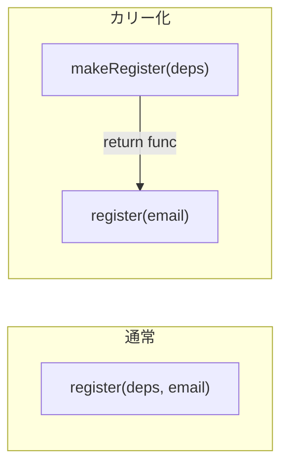

# 第08章：関数DI②：カリー化DI（deps→入力→出力）🍛✨

前の章で「依存を `deps` にまとめると、引数地獄を回避できて、テストでFake差し替えもしやすいよ〜👜」ってやったよね😊
（まさにこの発想：`deps` にまとめる／テストで丸ごと差し替え✨）

この章は、その **次の一手**！
`registerUser(deps, email)` みたいに「毎回 deps を渡す」のをやめて…

👉 **`makeRegisterUser(deps)(email)`** みたいに、**先に deps を固定して**、あとから入力だけ渡す形にするよ🍛💉✨
これが **カリー化DI（curry DI）** だよ〜！

---

## 0) 最新メモ🗒️✨（ざっくり把握でOK）

* TypeScript の最新安定版は **5.9.3**（2025-09-30）として公開されてるよ📌 ([GitHub][1])
* 公式ブログでは **TypeScript 6.0 は 5.9→7.0 への“橋渡し”**という位置づけで、6.1は作らない方針が明言されてるよ🧱🌉 ([Microsoft for Developers][2])
* Node の公式ドキュメントでは **TypeScriptファイルで CommonJS/ESM 両方の構文をサポート**、ただし **自動で相互変換はしない**って書かれてるよ（import地雷の理由がここ！）⚠️([Node.js][3])

（そして超大事な前提：**TSの型は実行時に消える👻** → だから “型から自動解決DI” より、まず手動DIの型安全フォームが強い💪）

---

## 1) この章のゴール🎯💖


できたら勝ち〜！🥰

* ✅ **カリー化DI** を「depsを先に固定して、入力だけ渡す形」と説明できる🗣️✨
* ✅ `makeX(deps)(input)` を自分で書ける✍️
* ✅ テストで `makeX(testDeps)` を作って、**安定テスト**できる🧪💕

---

## 2) まずは形を覚えよ〜🍛✨（ほんとこれだけ）




カリー化DIは、形で覚えるのが一番早い😊

### いつもの deps 注入（前章）

`X(deps, input)`
*呼ぶたびに deps を渡す*

### カリー化DI（今回）

`makeX(deps)(input)`
*最初に deps を固定 → あとは input だけで呼べる*

---

## 3) なんで嬉しいの？🎁✨（女子大生に教える版）


### 嬉しい①：呼び出し側がスッキリする😍

「入力だけの関数」になるから、UIやルーティングが読みやすい📖✨

### 嬉しい②：テストがさらに楽🧪💕

`makeX(testDeps)` でテスト用の関数を1回作って、入力だけ変えて何回でも試せる🎯

### 嬉しい③：依存が “外側” に寄る🧊

「依存を知る場所」を外側に寄せられる（IoCっぽさが出てくる🌀）

---

## 4) 実例：`registerUser(deps, email)` をカリー化しよう🛠️✨

前章の例は、こうだったよね👇
（引数地獄→ `deps` でまとめたやつ） 

ここから「カリー化DI」に変身させるよ🍛💉

---

### Step A：依存の型（最小インターフェース）を用意する✂️📜

前章でやった “必要な形だけ渡す” が超大事だったね😊

---

### Step B：`makeRegisterUser(deps)` を作る🍛✨


```ts
// types.ts
export type Clock = { nowMs(): number };
export type Random = { int(maxExclusive: number): number };
export type Http = { postJson(url: string, body: unknown): Promise<unknown> };
export type Logger = { info(message: string): void };

export type RegisterDeps = Readonly<{
  clock: Clock;
  random: Random;
  http: Http;
  logger: Logger;
}>;

export type RegisterResult = { userId: string };
```

```ts
// register-user.ts
import type { RegisterDeps, RegisterResult } from "./types";

export const makeRegisterUser =
  (deps: RegisterDeps) =>
  async (email: string): Promise<RegisterResult> => {
    deps.logger.info("start register");

    const userId = `u_${deps.clock.nowMs()}_${deps.random.int(1000)}`;

    await deps.http.postJson("/api/register", { email, userId });

    return { userId };
  };
```

ポイントはこれ👇✨

* `deps` を **外側の関数**で受け取る
* 返ってくるのは **入力だけの関数**（ここが最高に便利😍）

---

### Step C：組み立て側（呼び出し側）で deps を固定する📍✨

depsは `satisfies` を使うと「型安全＆推論も守る」感じで気持ちいいよ💖

```ts
// main.ts
import { makeRegisterUser } from "./register-user";
import type { RegisterDeps, Clock, Random, Http, Logger } from "./types";

const systemClock: Clock = { nowMs: () => Date.now() };
const mathRandom: Random = { int: (max) => Math.floor(Math.random() * max) };
const fetchHttp: Http = {
  async postJson(url, body) {
    const res = await fetch(url, {
      method: "POST",
      headers: { "content-type": "application/json" },
      body: JSON.stringify(body),
    });
    return res.json();
  },
};
const consoleLogger: Logger = { info: (m) => console.log(m) };

const registerDeps = {
  clock: systemClock,
  random: mathRandom,
  http: fetchHttp,
  logger: consoleLogger,
} satisfies RegisterDeps;

// ✅ deps を固定して「入力だけ」の関数にする🍛✨
const registerUser = makeRegisterUser(registerDeps);

// あとは input だけ！
const result = await registerUser("a@b.com");
console.log(result);
```

---

## 5) テストが “さらに” 気持ちよくなる🧪💖


前章のテスト例（Fake clock/random + spy logger）って、こんな感じだったよね😊
「時間・乱数・通信があるのに安定テストできる」やつ！

カリー化すると、ここがさらにスッキリするよ〜✨

```ts
import { makeRegisterUser } from "./register-user";
import type { RegisterDeps, Clock, Random, Http, Logger } from "./types";

const fakeClock: Clock = { nowMs: () => 1700000000000 };
const fakeRandom: Random = { int: () => 7 };

const spyMessages: string[] = [];
const spyLogger: Logger = { info: (m) => spyMessages.push(m) };

const fakeHttp: Http = { async postJson() { return { ok: true }; } };

const testDeps: RegisterDeps = {
  clock: fakeClock,
  random: fakeRandom,
  http: fakeHttp,
  logger: spyLogger,
};

// ✅ テスト用の関数を“1回”作る🍛✨
const registerUser = makeRegisterUser(testDeps);

// 入力だけ変えて何回でも試せる😍
const result = await registerUser("a@b.com");

console.log(result.userId);      // u_1700000000000_7
console.log(spyMessages);        // ["start register"]
```

---

## 6) カリー化DIの “ちょうどいい” 使い方ルール📏✨


### ✅ ルール1：カリーは “2段まで” が読みやすい🍛

`makeX(deps)(input)` くらいが最高😊
`makeX(deps)(a)(b)(c)` は急に読みにくいので、入力はまとめてOK🧺

### ✅ ルール2：deps は “不変っぽく” 扱う🧊

`Readonly` にしておくと「途中で書き換え事故」を防げる👍（今回の `RegisterDeps` でも使ったよ）

### ✅ ルール3：名前は `makeX` が分かりやすい🏷️

* `makeRegisterUser`（depsを焼き込む🍪）
* 出来上がりは `registerUser`（入力だけ🍓）

---

## 7) よくある地雷⚠️😵‍💫（先に避けよ）

### 地雷①：deps を “万能袋” にして巨大化👜💣

前章の注意と同じ！
機能ごとに `RegisterDeps / LoginDeps` みたいに分けるのが良いよ😊

### 地雷②：カリー化したのに、関数内で直叩き😈

`deps` があるのに `Date.now()` とか `fetch()` をこっそり使うと、意味が薄れる〜🥲

### 地雷③：importの向きで循環しがち🌀


NodeはTSで CommonJS/ESM 両方OKだけど “自動変換しない” から、混ぜると事故りやすい⚠️([Node.js][3])
（循環import回避は、`import type` も効くよ👍）

---

## 8) ミニ課題🎀📝（手を動かすやつ！）

### 課題A：第5章の `createStudyLog2(title, deps)` をカリー化🍛✨

第5章で「依存は引数で渡す」ってやったよね⏰➡️💉
さらに `deps` 版もあったよね👜✨

**やること**👇

* `createStudyLog2(title, deps)` を
  👉 `makeCreateStudyLog(deps)(title)` にしてみてね😊
* `FakeClock` で結果が固定になるのも確認🎯（第5章のFake例）

---

### 課題B：`registerUser(testDeps, email)` を `makeRegisterUser(testDeps)(email)` に置き換え🧪💖

前章のテストの “結果が毎回同じ” をそのまま再現してみてね✨

---

### 課題C：自分のプロジェクトで1個だけカリー化してみる🌱

おすすめはこれ👇（効果が分かりやすい😍）

* `makeGetNow(clock)`
* `makeGenerateId({ clock, random })`
* `makeSaveNote({ storage, logger })`

---

## 9) AI（Copilot/Codex）お願いテンプレ🤖💬（コピペOK）

* 「この `X(deps, input)` を `makeX(deps)(input)` にリファクタして。型は崩さず、`Readonly` と `satisfies` も使って」
* 「Fake/Spy を使った安定テスト例も一緒に作って（時間・乱数・HTTP・logger）」
* 「カリー化しすぎて読みにくくならないように、2段カリーで収めて」
* 「import循環が起きそうな依存の分け方（type-only import含む）も提案して」

---

## 10) まとめ🎀🏁


* `deps` 注入は「依存の束を渡す」👜✨（前章）
* カリー化DIは「依存を先に固定して、入力だけの関数にする」🍛✨
* テストは `makeX(testDeps)` を作れば、入力だけで何回でも回せて最高🧪💕

次の章（第9章）は、ここで作った「入力だけの関数」を中心にして、**PureロジックとI/Oを切り分ける🍱**をやると、さらに気持ちよくなるよ〜😊✨

[1]: https://github.com/microsoft/typescript/releases "Releases · microsoft/TypeScript · GitHub"
[2]: https://devblogs.microsoft.com/typescript/progress-on-typescript-7-december-2025/?utm_source=chatgpt.com "Progress on TypeScript 7 - December 2025"
[3]: https://nodejs.org/api/typescript.html "Modules: TypeScript | Node.js v25.3.0 Documentation"
