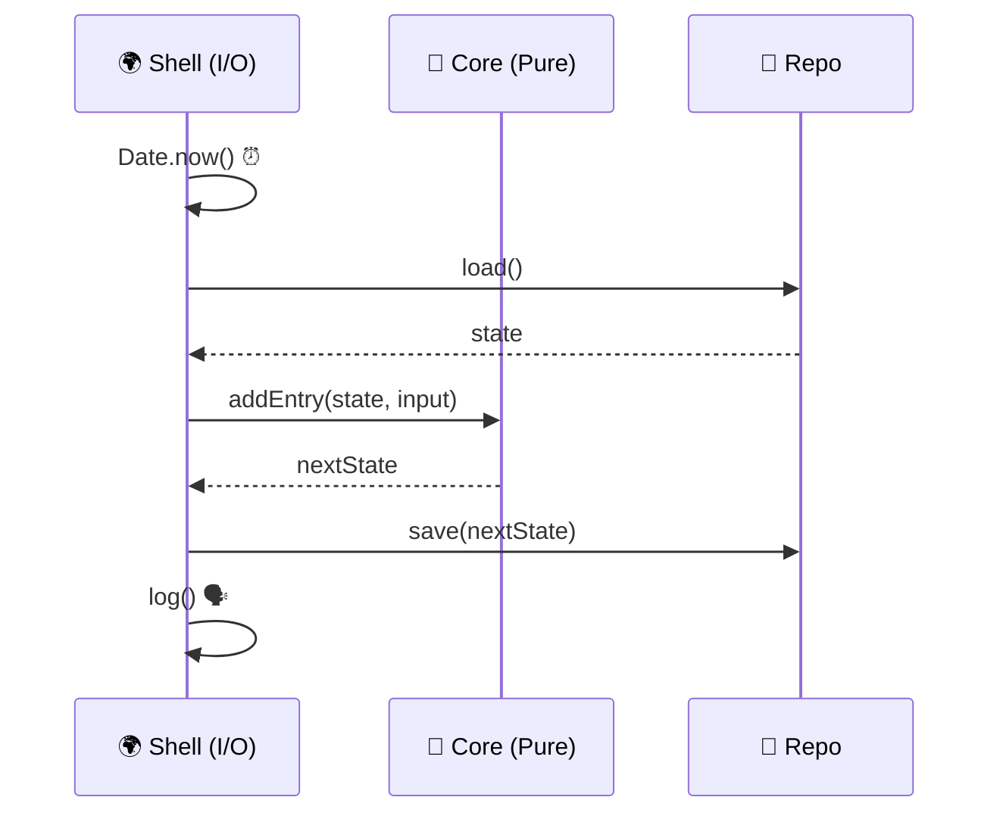

# 第09章：関数DI③：PureロジックとI/Oを切り分ける🍱

## 今日のゴール🎯

* 「I/O（外の世界とのやりとり）」と「Pure（純粋ロジック）」の違いがわかる😊
* “中心はPure、外側でI/O” の2層でコードを書ける🍩
* テストがラクになって「DIってこれか〜！」ってなる🧪💕

---

## 1) I/Oってなに？（外の世界）🌍📦


I/Oは、**アプリの外側**とつながる行為だよ〜！

たとえば👇

* 時間：`Date.now()` / `new Date()` ⏰
* 乱数：`Math.random()` 🎲
* 通信：`fetch()` / API呼び出し 🌐
* 保存：`localStorage` / ファイル / DB 💾
* 環境：`process.env` ⚙️
* ログ：`console.log()` 🗣️

I/Oは便利だけど、**テストを不安定にしがち**（時間や通信が毎回変わるから）😵‍💫

---

## 2) Pureロジックってなに？（内側の世界）🫧


Pure（純粋）な関数は、ざっくり言うと👇

* **同じ入力 → 同じ出力**（毎回同じ✨）
* **外部に触らない**（通信しない・保存しない・時間見ない）
* **副作用なし**（ログも本当は副作用だよ！）

だからPureは、テストが超簡単💖
「入力これね → 出力これね」を確認するだけでOK🧪

---

## 2) 目指す形：「ドーナツ構造」🍩✨


イメージはこれ👇

* 🍩 **中心（Functional Core）**：Pureロジック（判断・計算・ルール）
* 🍩 **外側（Imperative Shell）**：I/O（取得・保存・通信・ログ）

そして第9章のポイントはこれ💡

> I/Oは外側に追い出して、中心をPureにする✂️✨

---

## 4) まずは「分離できてない例」😣


学習記録を保存する関数、ありがちなやつ👇（※わざとゴチャゴチャ）

```ts
// 😣 I/Oが全部まざってる例
export async function recordStudy(subject: string, minutes: number) {
  const date = new Date().toISOString().slice(0, 10); // I/O(時間) ⏰
  const raw = localStorage.getItem("study") ?? '{"entries":[]}'; // I/O(保存) 💾
  const state = JSON.parse(raw);

  state.entries.push({ date, subject, minutes }); // ここはロジックっぽい🍱

  localStorage.setItem("study", JSON.stringify(state)); // I/O(保存) 💾
  console.log("saved!"); // I/O(ログ) 🗣️

  return state;
}
```

このままだとテストがつらい…

* `new Date()` が毎回変わる⏰
* `localStorage` をテストで用意しないといけない💾
* ログの検証も混ざる🗣️

---

## 5) 切り分けの手順（3ステップ）✂️✨


### ✅ ステップ1：I/O行に「I/O」って印をつける🟥

まずは目で見える化👀✨

### ✅ ステップ2：Pureだけを別関数に抜く🍱

「状態(state)に entry を追加する」みたいな**中心ルール**だけ残す！

### ✅ ステップ3：I/Oは外側に置いて deps で注入👜

外側が `clock` や `repo` を持って、中心に材料だけ渡す🥕🍳

---

## 6) 完成形サンプル：学習記録（CoreとShell）📚💕




### 🍱 (A) Pureロジック：core（触っていいのはデータだけ！）

```ts
// core/studyCore.ts
export type StudyEntry = {
  date: string;      // "2026-01-16" みたいなISO日付
  subject: string;
  minutes: number;
};

export type StudyState = {
  entries: StudyEntry[];
};

// ✅ Pure：state と entry だけで決める（I/O禁止）
export function addEntry(state: StudyState, entry: StudyEntry): StudyState {
  // ルール例：0分以下は追加しない（お好みでthrowでもOK）
  if (!entry.subject.trim()) return state;
  if (entry.minutes <= 0) return state;

  return {
    ...state,
    entries: [...state.entries, entry],
  };
}
```

### 🌍 (B) 外側：shell（I/O担当）＋ 関数DI（deps→input）

```ts
// app/recordStudy.ts
import { addEntry, type StudyState } from "../core/studyCore";

type Deps = {
  clock: { todayISO(): string }; // ⏰ 今日の日付を返す
  repo: {
    load(): Promise<StudyState>; // 💾 読む
    save(state: StudyState): Promise<void>; // 💾 書く
  };
  logger: { info(message: string): void; error(message: string, err?: unknown): void }; // 🗣️
};

// ✅ 関数DI：depsを先にもらって、あとからinput
export const makeRecordStudy =
  (deps: Deps) =>
  async (input: { subject: string; minutes: number }) => {
    try {
      // I/Oはここ（外側）に集める✨
      const date = deps.clock.todayISO(); // ⏰
      const state = await deps.repo.load(); // 💾

      // 🍱 中心はPureに任せる
      const next = addEntry(state, { date, ...input });

      await deps.repo.save(next); // 💾
      deps.logger.info(`saved: ${input.subject} ${input.minutes}min`); // 🗣️

      return next;
    } catch (err) {
      deps.logger.error("recordStudy failed", err);
      throw err; // ここは方針しだい（Result型で返すでもOK）
    }
  };
```

### 💾 (C) 例：localStorage repo（ブラウザ用のI/Oアダプタ）

```ts
// infra/localStorageStudyRepo.ts
import type { StudyState } from "../core/studyCore";

const KEY = "study";

export function createLocalStorageStudyRepo(): {
  load(): Promise<StudyState>;
  save(state: StudyState): Promise<void>;
} {
  return {
    async load() {
      const raw = localStorage.getItem(KEY) ?? '{"entries":[]}';
      return JSON.parse(raw) as StudyState;
    },
    async save(state) {
      localStorage.setItem(KEY, JSON.stringify(state));
    },
  };
}
```

---

## 7) テストがどうラクになるか🧪💖


### ✅ Pure（core）は「そのままテスト」できる！

```ts
// core/studyCore.test.ts
import { test, expect } from "vitest";
import { addEntry } from "./studyCore";

test("addEntry: 正常に1件追加される", () => {
  const state = { entries: [] as any[] };
  const next = addEntry(state, { date: "2026-01-16", subject: "DI", minutes: 30 });

  expect(next.entries).toHaveLength(1);
  expect(next.entries[0].subject).toBe("DI");
});

test("addEntry: 0分は追加されない", () => {
  const state = { entries: [] as any[] };
  const next = addEntry(state, { date: "2026-01-16", subject: "DI", minutes: 0 });

  expect(next.entries).toHaveLength(0);
});
```

Vitestは「Vite系の次世代テストフレームワーク」として案内されていて、ガイドも読みやすいよ🧪✨ ([Vitest][1])

### ✅ Shell（I/Oあり）は Fake / Spy で安定化

```ts
// app/recordStudy.test.ts
import { test, expect } from "vitest";
import { makeRecordStudy } from "./recordStudy";

test("makeRecordStudy: 保存される（I/OはFake）", async () => {
  const saved: any[] = [];

  const deps = {
    clock: { todayISO: () => "2026-01-16" },
    repo: {
      async load() { return { entries: [] }; },
      async save(state: any) { saved.push(state); },
    },
    logger: { info: (_: string) => {}, error: (_: string) => {} },
  };

  const record = makeRecordStudy(deps);
  const next = await record({ subject: "TypeScript", minutes: 25 });

  expect(next.entries).toHaveLength(1);
  expect(saved).toHaveLength(1);
});
```

---

## 8) よくあるミス集（ここ気をつけて〜！）⚠️😵‍💫

* ❌ Pure関数の中で `Date.now()` しちゃう（時間I/O混入）⏰
* ❌ Pure関数の中で `console.log()` しちゃう（ログも副作用）🗣️
* ❌ `deps` を巨大にしすぎる（何でも屋バッグ👜が重くなる）🧱
* ❌ Shellが太って、結局ロジックが戻ってくる（中心に寄せる意識！）🍩

---

## 9) ミニ課題📝✨（この章の練習！）

### 課題1️⃣：I/Oハイライトゲーム🟥

手元のコードで、I/O行にコメントで `// I/O` を付けてみてね👀

### 課題2️⃣：Pure抽出✂️🍱

I/Oを消した「判断だけの関数」を1つ作って、`core/` に移動！

### 課題3️⃣：テスト1本🧪

* core関数は「入力→出力」テスト
* shellはFake depsで「保存された？」だけテスト

---

## 10) AI活用（Copilot/Codexに頼むコツ）🤖💡

使いやすい指示テンプレ👇（コピペしてOK✨）

* 「この関数からI/O行を見つけて、Pure関数(core)とShell(app)に分割して」
* 「Pure関数のユニットテストをVitestで3本作って。境界ケースも入れて」
* 「depsを最小化したい。今のdepsから本当に必要なものだけに絞って提案して」

---

## 11) ちょい最新メモ（2026-01-16時点）🗓️✨

* TypeScript 5.9 のリリースノートでは、Node向けに挙動が安定した `--module node20` が紹介されていて、Node系プロジェクトの“環境依存のゆれ”を減らしやすい流れだよ🔧✨ ([TypeScript][2])
* Node.js は 2026-01-13 に 24.13.0 (LTS) のセキュリティリリースが出てるので、実運用は「更新大事！」って感じ🛡️ ([Node.js][3])
* Bun は 2026-01-13 に v1.3.6 が出てるよ⚡（Windowsの導入手順も載ってる） ([bun.com][4])

---

## まとめ🎀🏁

第9章の合言葉はこれっ💖

* **中心はPure（判断・計算）🍱**
* **外側でI/O（取得・保存・通信）🌍**
* **つなぎ目は関数DI（deps→input）👜✨**

次の章で「クラスDI（コンストラクタ注入）」に行く前に、この🍩感覚が入ってると超強いよ〜！💪🥰

[1]: https://vitest.dev/guide/?utm_source=chatgpt.com "Getting Started | Guide"
[2]: https://www.typescriptlang.org/docs/handbook/release-notes/typescript-5-9.html?utm_source=chatgpt.com "Documentation - TypeScript 5.9"
[3]: https://nodejs.org/en/blog/release/v24.13.0?utm_source=chatgpt.com "Node.js 24.13.0 (LTS)"
[4]: https://bun.com/blog/bun-v1.3.6?utm_source=chatgpt.com "Bun v1.3.6 | Bun Blog"
