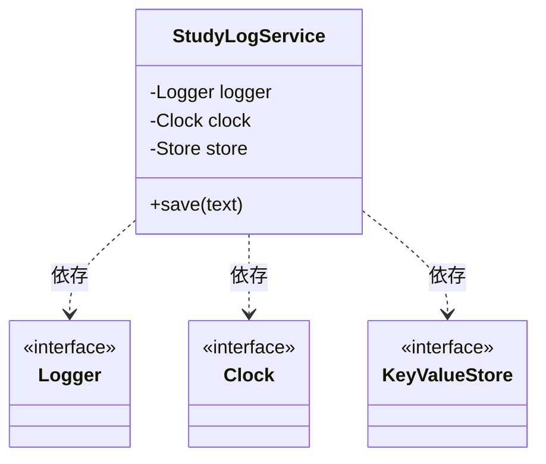

# 第10章：クラスDI①：コンストラクタ注入（TSでも王道）🏗️💉

この章は「クラスを書くならまずこれ！」ってくらい定番の **コンストラクタ注入** を、TypeScript流にやさしく固める回だよ〜😊✨
（ちなみに本日時点のTypeScriptは npm 上で **5.9.3** が最新として公開されてるよ📦([npm][1]) ）

---

## 1) この章のゴール🎯✨

読み終わったら、こんな状態になってるのが理想っ！

* 「依存（logger / clock / api など）」を **コンストラクタ引数で受け取れる** 💉
* 依存が「必須なのか/任意なのか」を **コード上でハッキリ表現できる** 📌
* テストで **Fake（偽物）を差し替え** できる🧪💕
* “newやimport直叩きでガチガチ” を **ほどよくほぐせる** 🧱➡️🧸

---

## 2) まず結論：必須の依存はコンストラクタで受け取ろう🏗️💉

**コンストラクタ注入**はこれだけ👇

* 依存を `constructor(...)` で受け取る
* `private readonly` で保持して、クラス内から使う
* **クラスの外側**で“本物”を組み立てて渡す（組み立て場所は後の章で「Composition Root」ね📍）

---

## 3) ありがちな「つらい形」😵‍💫（DIなし）

たとえば「学習記録を保存するサービス」を作るとして…
この形、最初は楽だけど後で泣きがち😭

```ts
// ❌ 依存がクラスの中にベッタリ
export class StudyLogService {
  async save(text: string) {
    console.log("saving...", text); // logger固定😣
    const now = new Date();          // clock固定😣
    localStorage.setItem(`log:${now.toISOString()}`, text); // storage固定😣
  }
}
```

何が困る？🥺

* テストで `Date` が毎回変わって結果が不安定⏰💥
* `localStorage` が使えない場所（Node側など）で即死🪦
* 「ログ出力をファイルにしたい」「保存先をDBにしたい」みたいな変更がつらい😣

---

## 4) 依存を“契約（型）”にして、コンストラクタで注入する🌸



まずは依存を「こういう機能が欲しい！」という **型（契約）** にするよ📜✨
（TypeScriptでは `interface` は実行時に消えるから、**DIは“値として渡す”** が基本だよ〜👻）

```ts
// ✅ 契約（Port）たち
export interface Logger {
  info(message: string): void;
  error(message: string, err?: unknown): void;
}

export interface Clock {
  now(): Date;
}

export interface KeyValueStore {
  set(key: string, value: string): void;
}
```

次に、サービス本体は **依存をコンストラクタで受け取る** 🏗️💉

```ts
export class StudyLogService {
  constructor(
    private readonly logger: Logger,
    private readonly clock: Clock,
    private readonly store: KeyValueStore,
  ) {}

  save(text: string) {
    this.logger.info(`saving... ${text}`);
    const now = this.clock.now();
    this.store.set(`log:${now.toISOString()}`, text);
  }
}
```

これで何が嬉しい？🥰

* 依存が「必要」ってことが **constructorで一目瞭然** 👀✨
* 差し替え可能（loggerだけ変える、とか）🔄
* テストが爆速で安定🧪💕

---

## 5) “本物”の実装を作って渡す（まずは手動でOK）🧰✨

ここではサクッと「本物」実装を用意して注入してみよ〜😊

```ts
// ✅ 本物（Adapter）たち
export class ConsoleLogger implements Logger {
  info(message: string) { console.log(message); }
  error(message: string, err?: unknown) { console.error(message, err); }
}

export class SystemClock implements Clock {
  now() { return new Date(); }
}

export class LocalStorageStore implements KeyValueStore {
  set(key: string, value: string) {
    localStorage.setItem(key, value);
  }
}
```

組み立てて使う👇（※この“組み立て役”を後で「Composition Root」に育てるよ📍）

```ts
const service = new StudyLogService(
  new ConsoleLogger(),
  new SystemClock(),
  new LocalStorageStore(),
);

service.save("DIわかった！🎉");
```

---

## 6) テストで“Fake差し替え”してみよう🧪💕

ここがDIのご褒美タイム😍

```ts
// ✅ Fakeたち
class FakeClock implements Clock {
  constructor(private readonly fixed: Date) {}
  now() { return this.fixed; }
}

class MemoryStore implements KeyValueStore {
  public data = new Map<string, string>();
  set(key: string, value: string) { this.data.set(key, value); }
}

class SpyLogger implements Logger {
  public infos: string[] = [];
  info(message: string) { this.infos.push(message); }
  error(message: string) {}
}

// ✅ テスト例（雰囲気）
const fixed = new Date("2026-01-16T12:00:00.000Z");
const logger = new SpyLogger();
const clock = new FakeClock(fixed);
const store = new MemoryStore();

const service = new StudyLogService(logger, clock, store);
service.save("hello");

console.log(store.data.get("log:2026-01-16T12:00:00.000Z")); // "hello"
console.log(logger.infos.length); // 1
```

ポイント💡

* **“時間”と“保存先”と“ログ”が自由に固定できる** → テストが安定する⏰✅
* 実環境（localStorage）に触れない → 速い＆壊れにくい🏎️💨

---

## 7) 依存が増えてきたら「depsオブジェクト注入」もアリ👜✨

コンストラクタ引数が増えすぎてつらくなったら、まとめてもOK👌

```ts
type StudyLogDeps = {
  logger: Logger;
  clock: Clock;
  store: KeyValueStore;
};

export class StudyLogService2 {
  constructor(private readonly deps: StudyLogDeps) {}

  save(text: string) {
    this.deps.logger.info(`saving... ${text}`);
    const now = this.deps.clock.now();
    this.deps.store.set(`log:${now.toISOString()}`, text);
  }
}
```

どっちが良い？🤔

* **依存が3個くらいまで** → 引数で並べるのが読みやすいこと多い✨
* **依存が増えがち** → `deps` で整理すると破綻しにくい👜

---

## 8) 事故りやすい注意点⚠️（ここだけ押さえよう！）

### 2) コンストラクタ注入ってなに？🏗️


### ✅ コンストラクタで副作用しない🙅‍♀️💥

「生成した瞬間にAPI呼ぶ」「勝手に保存する」みたいなのは避けよ〜
コンストラクタは **受け取って保持するだけ** が安全🧸

### ✅ “なんでも注入”しすぎない🍱

小さすぎる依存を無限に注入すると、逆に読みづらい😵‍💫
まずは「外部I/O系」からでOK（時間・乱数・ログ・HTTP・保存・設定など）🌐🗄️

### ✅ `undefined`前提の依存にしない（プロパティ注入の地雷）🕳️

必須なら constructor で固定！📌
（プロパティ注入は次章以降で“落とし穴”として出てくるやつ😇）

---

## 9) ミニ課題✍️🌸

**課題A（基本）**
今あるクラスを1つ選んで、依存を3つ探して🔎

* `Date` / `Math.random` / `localStorage` / `fetch` / `console` から優先でOK✨
  → それを **constructor注入** に直してみてね💉

**課題B（テスト）**

* `Clock` を Fake にして「固定日時で保存される」テストを書いてみよ⏰✅

---

## 10) AIに頼むと爆速になる聞き方🤖✨

そのままコピペで使えるやつ置いとくね💕

* 「このクラスの依存を洗い出して、constructor注入にリファクタして。副作用はconstructorに入れないで」
* 「`Clock / Logger / Store` を interface にして、Fake実装も一緒に作って」
* 「このテストを安定させたい。時間依存をDIにして、固定日時で通るテスト案を出して」

---

## まとめ🎀🏁

* **必須依存はコンストラクタ注入がいちばん安全** 🏗️💉
* TypeScriptは型が実行時に消えるから、**“値を渡すDI”が基本** 👻
* DIすると **テストが安定して速くなる** 🧪💖
* まずは「時間・乱数・保存・HTTP・ログ」みたいな外部I/Oから注入すると効果が出やすい🌐🗄️✨

ちなみに、TypeScriptは 6.x → 7.x に向けて「ネイティブ移行（高速化）」の流れが進んでるけど、こういう **設計パターン自体はそのまま強い** よ💪🔥([devblogs.microsoft.com][2])

[1]: https://www.npmjs.com/package/typescript?utm_source=chatgpt.com "typescript"
[2]: https://devblogs.microsoft.com/typescript/typescript-native-port/?utm_source=chatgpt.com "A 10x Faster TypeScript"
