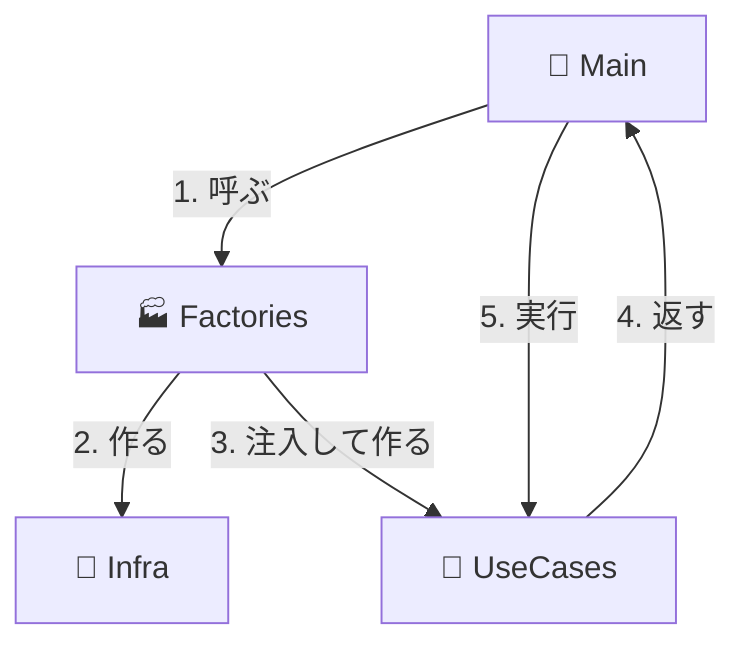
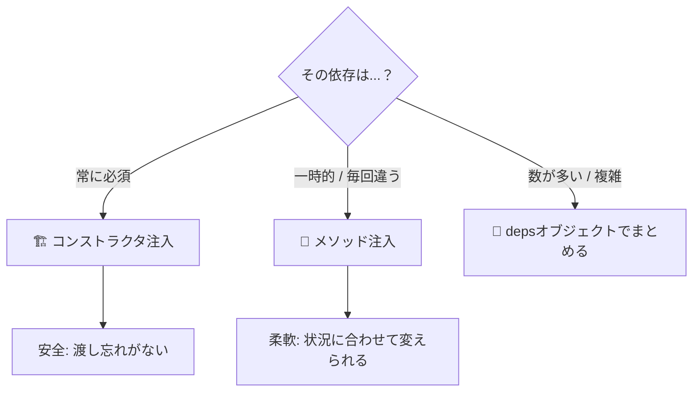

# 第11章：クラスDI②：メソッド注入（必要な時だけ）🧤

この章は「クラスは使いたい！でも依存は増やしすぎたくない！」って時の、**メソッド注入**をマスターする回だよ〜😊🌸
（ちなみに TypeScript は最新の 5.9 系のリリースノートが更新されてるよ📌([TypeScript][1])）

---

## 1) 今日のゴール🎯💖

読み終わったら、これができるようになるよ✨

* **「メソッド注入って何？」**を一言で説明できる🗣️💡
* **コンストラクタ注入（第10章）との使い分け**ができる⚖️✨
* 「この依存は **毎回違う** からメソッドで渡そう！」って判断できる🧠🔍
* テストで **差し替えしやすい書き方**ができる🧪✅

---

## 2) メソッド注入ってなに？🧤


**メソッド注入**＝「その処理に必要なものだけを、**そのメソッドの引数で受け取る**」ことだよ😊✨

たとえば…

* “エクスポートする時だけ”必要な `formatter` 🧾
* “この1回の処理だけ”必要な `progressCallback` 📈
* “ユーザーが選んだ形式”で変わる `writer`（CSV / JSON）📝🔁
* “リクエストごとに違う” `requestId` や `AbortSignal` 🆔🛑

こういう「毎回同じじゃない依存」を、コンストラクタに入れちゃうとゴチャつきやすいんだよね😵‍💫💦

---

## 3) いつメソッド注入が向いてる？✅❌


### 向いてるケース✅🧤✨（必要な時だけ変わる）

* **処理ごとに差し替えたい**（CSV/JSON、A社API/B社API など）🔁
* **一時的な道具**（formatter、validator、writer、progress通知）🧰
* **呼び出し側が決めるべきもの**（画面選択、設定、リクエスト文脈）🎛️

### 向いてないケース❌😣（いつも必要）

* そのクラスの機能が動くのに **常に必須**な依存
  → これは **コンストラクタ注入**のほうが安全だよ（渡し忘れ事故が減る）🔒✨

---

## 4) まずは基本形：引数でそのまま渡す🧤


例：ユーザー情報の取得（いつも必要）と、エクスポート（毎回変わる）を分けるよ😊

```ts
// 依存の「契約」(interface) を用意すると差し替えが楽になるよ✨
// main.ts     ← Composition Root（配線係📍）
```



```ts
export interface UserRepository {
  findById(id: string): Promise<{ id: string; name: string }>;
}

export interface Formatter {
  format(user: { id: string; name: string }): string;
}

export interface Writer {
  write(text: string): Promise<void>;
}

// いつも必要なもの：コンストラクタ注入（第10章の復習）
export class UserExportService {
  constructor(private readonly repo: UserRepository) {}

  // 必要な時だけ変わるもの：メソッド注入🧤
  async exportUser(userId: string, formatter: Formatter, writer: Writer) {
    const user = await this.repo.findById(userId);
    const text = formatter.format(user);
    await writer.write(text);
  }
}
```

ポイントはここ👇✨

* `repo` は「このクラスの核」だから **コンストラクタ**へ🏗️
* `formatter / writer` は「エクスポートするやり方」だから **メソッド**へ🧤

---

## 5) 引数が増えてきたら…「depsオブジェクト」でまとめる👜✨


メソッド注入って便利なんだけど、依存が増えるとこうなる😇💦
`exportUser(id, formatter, writer, logger, clock, ...)`

そんな時は、**メソッド側でも deps まとめ**が超おすすめ👜💖

```ts
export type ExportDeps = {
  formatter: Formatter;
  writer: Writer;
  // 増えたらここに足す（でも増えすぎたら設計見直し合図だよ⚠️）
};

export class UserExportService {
  constructor(private readonly repo: UserRepository) {}

  async exportUser(userId: string, deps: ExportDeps) {
    const user = await this.repo.findById(userId);
    const text = deps.formatter.format(user);
    await deps.writer.write(text);
  }
}
```

---

## 6) 使い分けのコツ（迷ったらこれ！）🧭💕


判断ルールを“雑に”決めると強いよ✨

* **「いつも必要」** → コンストラクタ注入🏗️
* **「その時だけ必要 / 呼び出し側が選ぶ」** → メソッド注入🧤
* **「毎回依存を渡すなら、そもそもクラスである必要ある？」** → 関数DIに戻すのもアリ🍱✨

（TSは型が実行時に消えるから、**手動DIや関数DIが強い**流れもあるよ👻💡）



---

## 7) よくある落とし穴🕳️⚠️（ここ注意！）

### 落とし穴①：メソッド注入が“常に必要”になってる😵‍💫


毎回 `deps` を渡すなら、**クラスの責務が重い**かも💦
→ 分割するか、関数DI寄りにするとスッキリするよ✨

### 落とし穴②：`any` で逃げる😇


「formatterっぽい何か」で済ませると、差し替え時に壊れる💥
→ `interface` を小さく作って守ろう📜✨

### 落とし穴③：引数が巨大になって、呼び出し側が地獄🥲

→ deps をまとめる👜
→ それでも多いなら「そのメソッド、やりすぎ」サイン🚨

---

## 8) ミニ課題（手を動かすやつ🧪✨）

### 課題A：2種類のフォーマッタを作ろう🧾

* `CsvFormatter`
* `JsonFormatter`

### 課題B：Writerを差し替えよう✍️


* `ConsoleWriter`（コンソールに出す）
* `MemoryWriter`（配列に貯める：テスト用）

### 課題C：テストで差し替え体験🧪💖

`MemoryWriter` を使って「出力された文字列が期待通りか」を確認✅

---

## 9) AIに手伝ってもらうプロンプト例🤖✨

コピペで使ってOKだよ〜😊🌸

* 「この `exportUser` の設計、メソッド注入にするべき依存とコンストラクタ注入にするべき依存を分類して理由も書いて」🧠
* 「引数が増えすぎないように `deps` 型を設計して、命名と責務も整えて」👜
* 「MemoryWriter を使った簡単なテストコードを作って（副作用を最小に）」🧪

---

## 10) この章のまとめ🎀🏁

* メソッド注入は **“必要な時だけ渡す”** のが得意🧤✨
* **いつも必要な依存はコンストラクタへ**、毎回変わるならメソッドへ⚖️
* 引数が増えたら **depsまとめ**👜
* 増えすぎたら **責務が重いサイン**🚨（分割 or 関数DIも検討🍱）

---

次の第12章は「プロパティ注入の落とし穴🕳️⚠️」に進むと、**“やっちゃダメDI”**も見えるようになって一気に安定するよ〜😊✨

[1]: https://www.typescriptlang.org/docs/handbook/release-notes/typescript-5-9.html?utm_source=chatgpt.com "Documentation - TypeScript 5.9"
