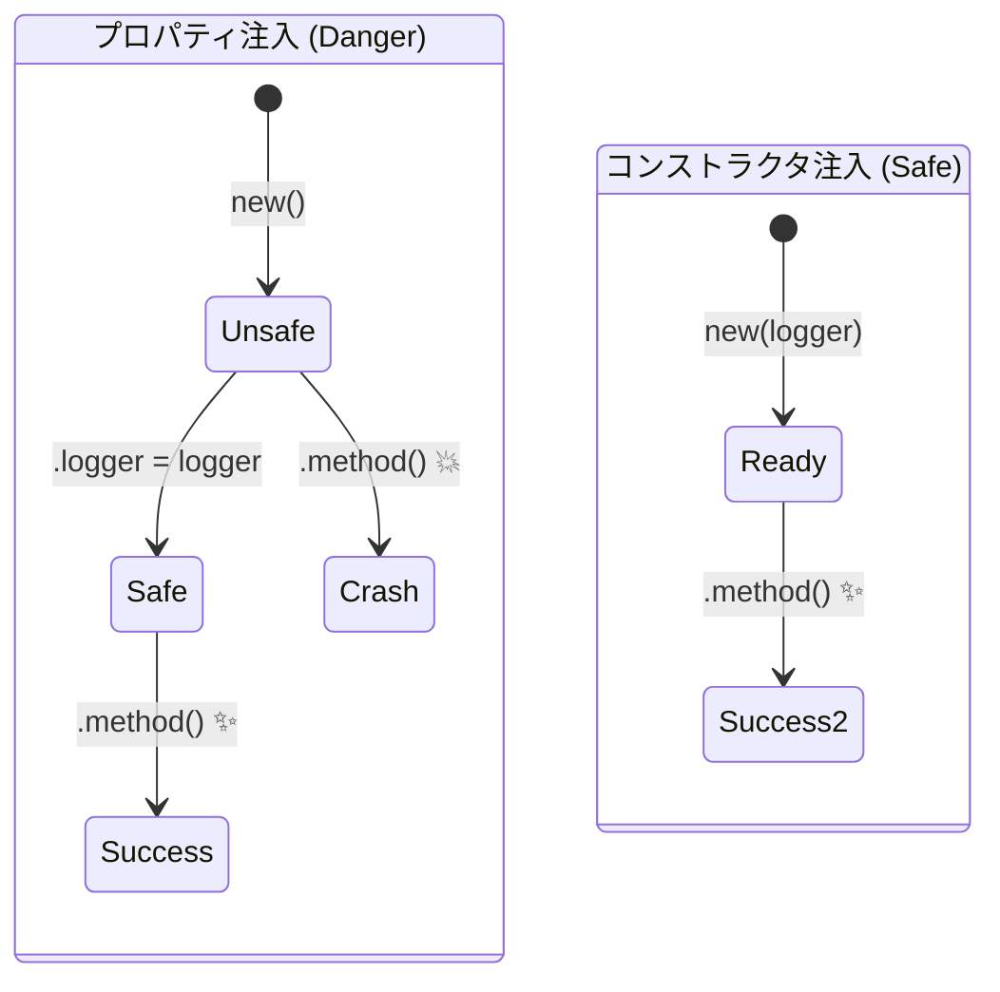

# 第12章：クラスDI③：プロパティ注入の落とし穴🕳️⚠️

この章は「**プロパティ注入って便利そうに見えるけど、実は事故りやすい**」を体で覚える回だよ〜😇💥
（※2026年1月時点：npmのTypeScript最新は 5.9.3 だよ📦✨） ([npm][1])

---

## 1) 今日のゴール🎯✨

* プロパティ注入（property injection）が **なぜ危険になりがち**か説明できる🙆‍♀️
* 「必須依存」は **コンストラクタ注入に戻す判断**ができる💉
* どうしても使う場合の **安全柵（ガード）**を付けられる🛡️

---

## 2) プロパティ注入のがっかりポイント😞

「依存を constructor 引数で渡す」のではなく、**あとからプロパティに差し込む**やり方だよ👇

```ts
interface Logger {
  info(message: string): void;
}

class ConsoleLogger implements Logger {
  info(message: string) {
    console.log("[info]", message);
  }
}

class UserService {
  // 😇「あとで入るはず！」と思ってしまうやつ
  logger!: Logger;

  createUser(name: string) {
    // 💥 もし logger が入ってなかったら…？
    this.logger.info(`create user: ${name}`);
    return { name };
  }
}

const svc = new UserService();
// svc.logger = new ConsoleLogger(); // ← これを忘れると…
svc.createUser("Mika"); // 💥 実行時に落ちる
```

この `logger!`（ビックリマーク）は **「あとで入るから大丈夫！」ってTypeScriptに言い張る記号**。
便利なんだけど、**コンパイルの安全装置を自分で外してる**のとほぼ同じだよ😵‍💫🧨 ([TypeScript][2])

---

## 3) 落とし穴が多い理由トップ5🕳️⚠️

### 落とし穴①：必須依存が“必須に見えない”🙈

コンストラクタ注入なら「これがないと動かない」が一目で分かるよね？
でもプロパティ注入だと、`new UserService()` が **普通にできちゃう**。これが事故の入口🚪💥

### 落とし穴②：`undefined`事故が“実行時”まで潜る🐟💣

TypeScriptは本来「プロパティ初期化してね」ってチェックしてくれる（`strictPropertyInitialization`）。
でも `!` を付けた瞬間、そのチェックをスルーできちゃうの😇 ([TypeScript][2])

### 落とし穴③：初期化順序・タイミング問題（特に継承）🧬⚡

JavaScriptのクラス初期化順序は決まってて、**親→子の順**で進むよ。
「親のconstructor内」で依存を使うと、子側の準備が終わってなくて事故ることがある🥶 ([TypeScript][3])

### 落とし穴④：テストがつらい🧪😵

テストで `new UserService()` してメソッド呼ぶだけで落ちる、みたいな **地雷ユニット**になりがち。
「テスト用に全部注入し忘れずにね」ゲームが始まる🎮💥

### 落とし穴⑤：リファクタ時に壊れやすい🔧💔

依存が増えても constructor に現れないから、いつの間にか
* 「このクラス、何に依存してるの？」がブラックボックス化しやすい😶‍🌫️



---

## 4) 「でも、フレームワークで見たよ？」への答え🧠✨

たとえば NestJS は「特定の状況ではプロパティ注入が便利」と書いてるよ。
例として「継承してると `super()` に依存を渡し続けるのが面倒だから、プロパティ注入が役立つことがある」みたいな話が出てくる👀 ([docs.nestjs.com][4])

でも同時に、別のDIライブラリ（Inversify）系のドキュメントでは **“できるけど基本は避けて、コンストラクタ注入を優先してね”** とハッキリ言ってる。
つまり「使える＝安全」じゃないってことだね😇⚠️ ([doc.inversify.cloud][5])

---

## 5) じゃあどう直す？🛠️✨（結論：必須はコンストラクタへ💉）

### ✅ 正解パターン：コンストラクタ注入（必須依存）

```ts
interface Logger {
  info(message: string): void;
}

class UserService {
  constructor(private readonly logger: Logger) {}

  createUser(name: string) {
    this.logger.info(`create user: ${name}`);
    return { name };
  }
}

// 組み立て側（Composition Root）
const svc = new UserService({ info: console.log });
svc.createUser("Mika");
```

**この形の強み**👇

* `new UserService(...)` の時点で「logger必須」が強制される✅
* テストも `new UserService(fakeLogger)` で一発✅
* 依存が増えたら constructor に増える＝気づける✅

---

## 6) 「どうしてもプロパティ注入」になったら守るルール🧷🛡️

どうしても事情があるなら、せめてこれだけは守ろ〜！🌸

### ルールA：constructor では依存を使わない🚫🏗️

プロパティ注入は「注入が後」になりがちだから、constructor内で使うと危険ゾーン😵‍💫

### ルールB：`!` で黙らせない（できれば）🙅‍♀️💥

`logger!: Logger` は、事故の発見を遅らせやすい。
可能なら「任意」扱いにしてガードを書く👇

```ts
class UserService {
  logger?: Logger;

  createUser(name: string) {
    if (!this.logger) throw new Error("Logger is not injected");
    this.logger.info(`create user: ${name}`);
    return { name };
  }
}
```

### ルールC：“注入されてないと困る”なら、結局 constructor に戻す🔁💉

必須依存をプロパティに置くのは、だいたい将来の自分を殴るやつ👊😭

---

## 7) ミニ課題（わざと事故→修理）🧪🔧✨

**Step1💥**：最初のダメ例（`logger!`）で、注入せずに呼んで落としてみよ〜
**Step2🔧**：それを **コンストラクタ注入**に直す
**Step3🧪**：テストで `fakeLogger` を渡して「呼ばれた？」を確認（SpyでもOK🕵️‍♀️）

---

## 8) AI（Copilot/Codex）に頼むと超はかどるプロンプト🤖✨

* 「このクラスの `property injection` を、必須依存は `constructor injection` に直して。変更点をdiffっぽく説明して」
* 「`logger!` が使われている箇所を探して、`strictPropertyInitialization` 前提で安全に書き換えて」
* 「`UserService` の unit test を作って。fake/spies を使って logger 呼び出しを検証して」

---

## 9) まとめ🎀🏁

* プロパティ注入は **“注入忘れで実行時クラッシュ”** が起きやすい💥
* TypeScriptの安全装置（初期化チェック）を `!` で外すと、事故が潜る😇🧨 ([TypeScript][2])
* 基本は **必須＝コンストラクタ注入**、一時的＝メソッド注入、どうしても＝ガード付きプロパティ注入🛡️
* フレームワークが例示してても「便利な場面がある」だけで、**多用は非推奨寄り**な空気が強いよ📌 ([docs.nestjs.com][4])

---

次の第13章は「IoC入門：組み立ての主導権を外へ🌀」だね！
ここまでで“注入の形”が揃ったから、次は **“どこで組み立てるの？”** をスッキリさせに行こ〜😆📍✨

[1]: https://www.npmjs.com/package/typescript?activeTab=versions&utm_source=chatgpt.com "typescript"
[2]: https://www.typescriptlang.org/docs/handbook/release-notes/typescript-2-7.html?utm_source=chatgpt.com "Documentation - TypeScript 2.7"
[3]: https://www.typescriptlang.org/docs/handbook/2/classes.html?utm_source=chatgpt.com "Documentation - Classes"
[4]: https://docs.nestjs.com/providers?utm_source=chatgpt.com "Providers | NestJS - A progressive Node.js framework"
[5]: https://doc.inversify.cloud/en/property_injection?utm_source=chatgpt.com "Property injection - InversifyJS 中文文档"
