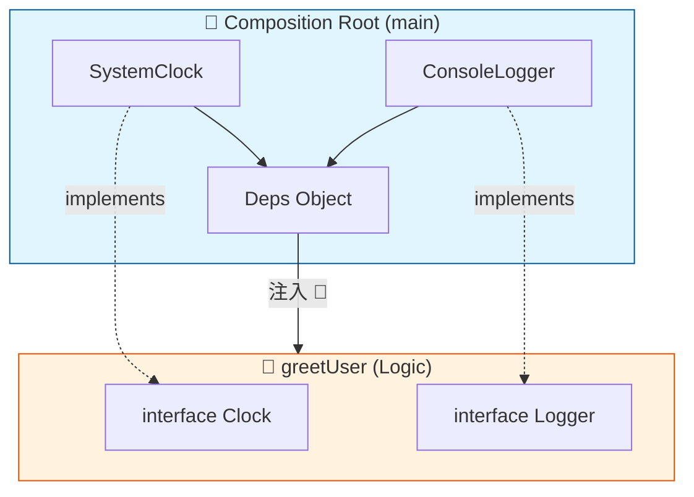

# 第13章：IoC入門：組み立ての主導権を外へ🌀

## この章でできるようになること（ゴール）🎯✨

* **IoC（Inversion of Control）**を「ひとことで」説明できる😊
* 「**作る場所**（組み立て）」と「**使う場所**（実行ロジック）」を分けられる💉
* “どこに `new` や `import` を寄せるべきか”の感覚がつかめる📍

---

## 1) IoCってなに？めちゃ簡単に言うと…🍱➡️🌀


**IoC =「主導権（コントロール）を、コードの内側から外側へひっくり返す」**って考え方だよ🌀✨

たとえば…

* ❌ **内側のコードが全部決める**：
  「私はログも時計も自分で作る！自分で選ぶ！自分で呼ぶ！」😤
* ✅ **外側が決めて、内側は使うだけ**：
  「ログと時計は外で用意して〜。私は受け取って使うだけ😊」💕

この **“外側が組み立てる”** が IoC の中心だよ📦✨

---

## 2) DIとIoCの関係：混ざりやすいので整理しよ🧠💡


* **DI（依存性注入）**：テクニック💉
  → 依存（LoggerとかClockとか）を **外から渡す** 方法
* **IoC（制御の反転）**：設計の考え方🌀
  → 「組み立て・選択・流れの主導権」を **外側に置く** 方針

つまりよくある関係はこんな感じ👇
**IoC（方針）を実現する手段として DI（注入）を使う**ことが多いよ😊💕

---

## 3) まず“誰が作るの？”問題を見つけよう🔎🧱


IoCの入口はここ！

> 「その `new`、その `import`、**どこが責任持つの？**」

## ありがちな困りごと😣

* ロジックの中に `new` が散らばる🧱
* 本番用の実装に固定されて差し替えできない🔒
* テストで置き換えできずに詰む🧪💥

ここを直すのが、IoCの一歩だよ👣✨

---

## 4) 体感コード：IoC “前” と “後” を比べる🧪💖

## ❌ IoC前：使う側が勝手に作ってる（主導権が内側）😵‍💫


```ts
// greetUser.ts
class SystemClock {
  now(): Date {
    return new Date();
  }
}

class ConsoleLogger {
  info(message: string) {
    console.log(message);
  }
}

export function greetUser(name: string): string {
  // 👇 ここで勝手に「作る」までやってる
  const clock = new SystemClock();
  const logger = new ConsoleLogger();

  const hour = clock.now().getHours();
  const greeting = hour < 12 ? "おはよ〜" : "やっほ〜";
  logger.info(`greetUser called for ${name}`);

  return `${greeting} ${name} さん🌸`;
}
```

この `greetUser` は「挨拶を作る」だけじゃなくて、
**時計とログの選定＆生成まで担当してる**よね😣💦
→ 責務が混ざりやすい！

---

## ✅ IoC後：組み立ては外、ロジックは受け取って使うだけ😊💉


```ts
// ports.ts（「こういう機能が欲しい」という契約）
export interface Clock {
  now(): Date;
}

export interface Logger {
  info(message: string): void;
}
```

```ts
// greetUser.ts（使う側：ロジック担当）
import type { Clock, Logger } from "./ports";

export type Deps = {
  clock: Clock;
  logger: Logger;
};

export function greetUser(deps: Deps, name: string): string {
  const hour = deps.clock.now().getHours();
  const greeting = hour < 12 ? "おはよ〜" : "やっほ〜";

  deps.logger.info(`greetUser called for ${name}`);
  return `${greeting} ${name} さん🌸`;
}
```

```ts
// main.ts（外側：組み立て担当 📍 ここが主導権！）
import { greetUser } from "./greetUser";
import type { Clock, Logger } from "./ports";

class SystemClock implements Clock {
  now(): Date {
    return new Date();
  }
}

class ConsoleLogger implements Logger {
  info(message: string) {
    console.log(message);
  }
}

const deps = {
  clock: new SystemClock(),
  logger: new ConsoleLogger(),
};

console.log(greetUser(deps, "こみやんま"));
```

ポイントはこれ👇✨

* `greetUser` は **「何をするか」だけ**に集中🍱
* `main.ts` が **「何を使うか（どの実装にするか）」**を決める📍
  → 主導権が外に移った＝IoC🌀🎉

---

## 5) 図にすると一発でわかる📦➡️📦✨

```text
（組み立て担当）main
   ├─ new SystemClock()
   ├─ new ConsoleLogger()
   └─ deps を注入 💉
          ↓
（ロジック担当）greetUser
   ├─ Clock（契約）を使う
   └─ Logger（契約）を使う
```



「ロジック側は契約（型）だけ見てる」って状態が作れると、
あとで差し替えがめっちゃラクになるよ〜😊🔄

---

## 6) “ここがIoCっぽい！”あるある例👀✨


実はみんな、もうIoC体験してること多いよ😆

* イベント：クリックしたら **ブラウザが**呼ぶ🖱️
* ルーティング：URL来たら **フレームワークが**呼ぶ🌐
* テスト：テストランナーが **テスト関数を**呼ぶ🧪

「自分が呼ぶ」んじゃなくて「呼ばれる」側になるのも IoCっぽさの1つ🌀

---

## 7) ミニ課題（15〜25分）📝💪✨

## 課題A：`new` を “外へ” 追い出そう🏃‍♀️💨

1. いまのコードから「依存っぽいもの」を2つ選ぶ（例：logger / clock）🔎
2. `ports.ts` に interface を作る📜
3. ロジック関数（またはクラス）に `deps` を引数で渡す💉
4. `main.ts` に `new` を寄せる📍
5. 動くことを確認🎉

## 課題B：差し替え妄想ゲーム🔄💭

「ConsoleLogger を、あとで FileLogger に変えたくなったら？」
→ 変える場所が **main.ts だけ**になるようにできたら勝ち🏆✨

---

## 8) よくある落とし穴（この章で先に回避！）🕳️⚠️

## 🚫 落とし穴1：なんでも `deps` に突っ込んで巨大バッグ化👜💥

* 依存を増やしすぎると「何してる関数なの？」ってなる
  → **本当に必要な最小限**にしよ😊✨

## 🚫 落とし穴2：内側でこっそり実装を選び始める🙈


* `if (prod) new RealApi()` とかをロジック側に書くと、IoCが崩れる😣
  → **選ぶのは外側**の役目📍

## 🚫 落とし穴3：型の話（TS特有👻）

TypeScriptは「型」が実行時にそのまま残らないから、**“型だけで自動的に組み立てる”**系は工夫が必要になりがちだよ👻（デコレータDIとかは次の方で扱う感じ）
→ デコレータやメタデータ前提のDIコンテナ（例：TSyringe/Inversify）を使う場合は、その仕組みも理解してからが安心😊🧰 ([GitHub][1])

---

## 9) AIに手伝ってもらうなら（おすすめ指示）🤖✨

* 「この関数から `new` を消して、`deps` 注入にリファクタして」🔧
* 「依存を `ports.ts` に切り出して interface 設計して」📜
* 「main.ts に組み立てを集約する構成案を3つ出して」📍
* 「責務が混ざってる箇所を指摘して、分離案を提案して」🧠💡

“組み立て担当”と“ロジック担当”の線引きを、AIにレビューさせるのめっちゃ相性いいよ😊💕

---

## 10) まとめ🎀✨（次章へのつなぎ）

* **IoCは方針**：「組み立ての主導権を外へ」🌀
* **DIは手段**：「外から渡して差し替え可能に」💉
* まずは **`new` と `import` の置き場**を意識すると一気に分かる📍

次の第14章では、この「組み立てを置く場所」を **Composition Root**として、さらにキレイに整理していくよ〜📦🧹✨

---

## ちょいメモ（最新版の空気感）☕✨

いまのTypeScriptは 5.9 系の情報が整備されていて、ドキュメントも更新が続いてるよ📘 ([TypeScript][2])
Node.js側も LTS がちゃんと動いていて、セキュリティ更新も継続的に出てるから、依存の“外だし（IoC）”で環境差分を吸収する価値がますます上がってるよ🔐✨ ([Node.js][3])

[1]: https://github.com/microsoft/tsyringe?utm_source=chatgpt.com "microsoft/tsyringe: Lightweight dependency injection ..."
[2]: https://www.typescriptlang.org/docs/handbook/release-notes/typescript-5-9.html?utm_source=chatgpt.com "Documentation - TypeScript 5.9"
[3]: https://nodejs.org/en/about/previous-releases?utm_source=chatgpt.com "Node.js Releases"
