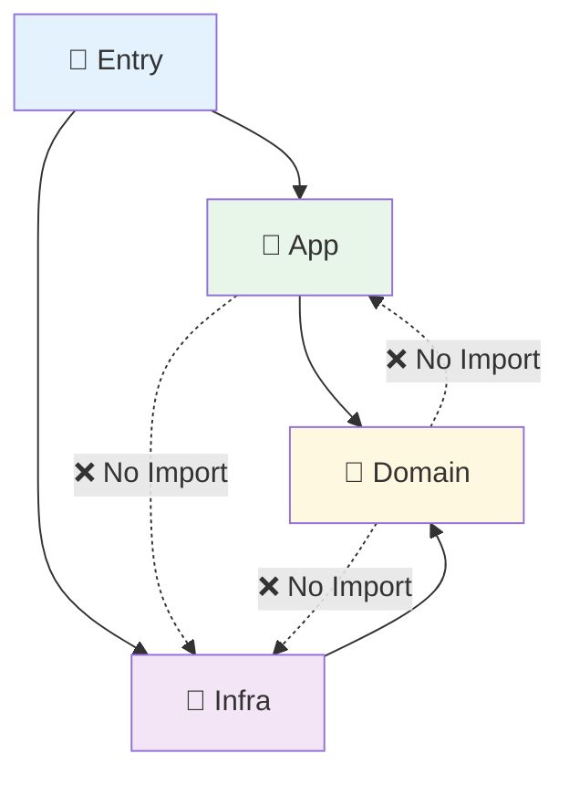

# 第14章：Composition Root：newとimportの集中管理📍🧹

## 今日のゴール🎯✨

* 「Composition Rootって何？」を自分の言葉で説明できる😊
* `new` と「環境依存import（browser / node）」を**1か所に寄せる**理由がわかる📦
* **依存の向きルール**（domain/app → infra をimportしない）を守れる🚫➡️

---

## 1) Composition Rootってなに？🧩


**アプリの“組み立て工場”**だよ🏭✨
「どの実装を使う？」「どの順で作る？」「どこに注入する？」を、**起動点（main/entry）でぜんぶ決める場所**。

TypeScriptは型が実行時に消えるから、C#みたいに「型だけで自動解決〜！」がやりにくい場面が多いよね👻
だからこそ、**手で組み立てる場所（Composition Root）を綺麗に作る**のが超大事💎

※2026年1月時点で TypeScript は 5.9.3 が最新安定版として配布されてるよ📌 ([GitHub][1])

---

## 2) なんで「new と import を1か所」に集めるの？🤔💡

## ✅ うれしいこと 3つ🎁

1. **変更がラク**🔄
   　保存先を `localStorage` → `API` に変えても、直すのは“組み立て側”だけになりやすい✨

2. **テストがラク**🧪
   　本番は `SystemClock`、テストは `FakeClock` みたいに差し替え簡単⏰

3. **import地雷を踏みにくい**💥
   　ブラウザ専用 / Node専用の import を混ぜると壊れがち😵
   　だから **環境依存importは entry に閉じ込める**のが安全！

（ちなみに Node.js は 2026/1 時点で v24 が Active LTS、v22 が Maintenance LTS などの扱いだよ📌 ([Node.js][2])）

---

## 3) まずは“依存の向き”ルールを1本だけ決めよう📏✨


ここだけ守ると、世界が平和になる🕊️💕

* `domain`（コアロジック）と `app`（ユースケース）は、**infraをimportしない**🚫
* `infra` は外部I/O（storage / fetch / fs / env）担当🌐🗄️
* `entry`（Composition Root）だけが **infraもappもimportしてOK**🙆‍♀️



---

## 4) ミニ例：Todoを追加する（Clock/Logger/Repo をDI）📝💉

## フォルダ構成（おすすめの最小形）🗂️✨


```text
src/
  domain/
    todo.ts
    ports.ts
  app/
    addTodo.ts
  infra/
    systemClock.ts
    consoleLogger.ts
    localStorageTodoRepo.ts
    memoryTodoRepo.ts
  entry/
    webMain.ts        ← Composition Root（ブラウザ用）
    testMain.ts       ← （任意）結合テスト用の組み立て
```

---

## 5) コードで作ってみよう💻🌸

## (A) domain：契約（Port）を定義📜

```ts
// src/domain/ports.ts
export type Todo = {
  id: string;
  title: string;
  createdAt: Date;
};

export interface Clock {
  now(): Date;
}

export interface Logger {
  info(message: string): void;
}

export interface TodoRepo {
  add(todo: Todo): Promise<void>;
}
```

---

## (B) app：ユースケース（外から渡された依存だけ使う）🎯

```ts
// src/app/addTodo.ts
import { Clock, Logger, Todo, TodoRepo } from "../domain/ports";

export class AddTodo {
  constructor(
    private readonly repo: TodoRepo,
    private readonly clock: Clock,
    private readonly logger: Logger,
  ) {}

  async execute(title: string): Promise<Todo> {
    const todo: Todo = {
      id: crypto.randomUUID(),
      title,
      createdAt: this.clock.now(),
    };

    await this.repo.add(todo);
    this.logger.info(`Todo added: ${todo.id}`);

    return todo;
  }
}
```

> ポイント💡：`AddTodo` は `localStorage` も `console` も `fetch` も知らない🙈
> ただ「契約（interface）」だけを見る🧡（ここがDIの美味しいところ！）

---

## (C) infra：実装たち（外部I/Oの世界）🌐🗄️

```ts
// src/infra/systemClock.ts
import { Clock } from "../domain/ports";

export class SystemClock implements Clock {
  now(): Date {
    return new Date();
  }
}
```

```ts
// src/infra/consoleLogger.ts
import { Logger } from "../domain/ports";

export class ConsoleLogger implements Logger {
  info(message: string): void {
    console.log(message);
  }
}
```

```ts
// src/infra/localStorageTodoRepo.ts
import { Todo, TodoRepo } from "../domain/ports";

export class LocalStorageTodoRepo implements TodoRepo {
  constructor(private readonly storage: Storage) {}

  async add(todo: Todo): Promise<void> {
    const key = "todos";
    const raw = this.storage.getItem(key);
    const list: any[] = raw ? JSON.parse(raw) : [];
    list.push({ ...todo, createdAt: todo.createdAt.toISOString() });
    this.storage.setItem(key, JSON.stringify(list));
  }
}
```

テスト用のメモリ実装もあると超便利🧸

```ts
// src/infra/memoryTodoRepo.ts
import { Todo, TodoRepo } from "../domain/ports";

export class MemoryTodoRepo implements TodoRepo {
  public readonly items: Todo[] = [];

  async add(todo: Todo): Promise<void> {
    this.items.push(todo);
  }
}
```

---

## 6) ここが本題！Composition Root（組み立て）📍✨


## (D) entry：ブラウザ用 main（new と import の集中）🪟🚀

```ts
// src/entry/webMain.ts
import { AddTodo } from "../app/addTodo";
import { ConsoleLogger } from "../infra/consoleLogger";
import { SystemClock } from "../infra/systemClock";
import { LocalStorageTodoRepo } from "../infra/localStorageTodoRepo";

export function bootstrap() {
  // ✅ ここが Composition Root：new を集約
  const repo = new LocalStorageTodoRepo(window.localStorage);
  const clock = new SystemClock();
  const logger = new ConsoleLogger();

  const addTodo = new AddTodo(repo, clock, logger);

  return { addTodo };
}
```

使う側（UI）は “組み立て” を知らないでOK😊

```ts
// 例：どこかのUI側
import { bootstrap } from "./entry/webMain";

const { addTodo } = bootstrap();
await addTodo.execute("レポート提出する📄✨");
```

---

## 7) Composition Rootがデカくなってきたら？🐘💦（太りすぎ対策）


## ✅ 合言葉：「new は entry、でも entry は“薄く”」🍃

おすすめの分割パターン👇

**(1) “機能ごとのwire”に分ける**

* `wireTodo.ts`（Todo関連の組み立てだけ）
* `wireAuth.ts`（認証関連だけ）
  最後に `bootstrap()` で合体🤝

**(2) Factoryで読みやすくする🏭**

```ts
// src/entry/factories/createTodoUsecases.ts
import { AddTodo } from "../../app/addTodo";
import { TodoRepo, Clock, Logger } from "../../domain/ports";

export function createTodoUsecases(deps: { repo: TodoRepo; clock: Clock; logger: Logger }) {
  return {
    addTodo: new AddTodo(deps.repo, deps.clock, deps.logger),
  };
}
```

`bootstrap()` はこうなる💎

```ts
import { createTodoUsecases } from "./factories/createTodoUsecases";
// ...repo/clock/logger を作る...
const todo = createTodoUsecases({ repo, clock, logger });
return { ...todo };
```

---

## 8) import地雷の避け方💣🧯（TSなら特に大事！）


## ✅ ルール3つだけ🧷

1. **環境依存の import は entry に寄せる**
   　例：`node:fs` は Node用entryに、`window` は Web用entryに🪟

2. **barrel（index.tsでまとめexport）を乱用しない**📦⚠️
   　便利だけど循環importの温床になりやすい😵

3. tsconfigのモジュール解決は、プロジェクト種別に合わせる
   　`moduleResolution` は挙動が変わる大事ポイントだよ（公式リファレンスあり）📚 ([TypeScript][3])

---

## 9) テストでは Composition Root をどうする？🧪💖


## ✅ 基本：ユニットテストは“自分で組み立てる”

```ts
import { AddTodo } from "../src/app/addTodo";
import { MemoryTodoRepo } from "../src/infra/memoryTodoRepo";

test("AddTodo adds an item", async () => {
  const repo = new MemoryTodoRepo();
  const clock = { now: () => new Date("2026-01-16T00:00:00Z") };
  const logger = { info: (_: string) => {} };

  const addTodo = new AddTodo(repo, clock, logger);

  const todo = await addTodo.execute("テスト書く🧪✨");
  expect(repo.items[0].id).toBe(todo.id);
});
```

> テストは **“その場で必要な依存を作って注入”** がいちばん分かりやすいよ😊
> （本番のComposition Rootに引っ張られないのがコツ！）

---

## 10) ミニ課題（やってみよ〜！）🎀✍️

## 課題A：new を探して1か所に集める🔎🧹

* `new` を検索して、**entry/bootstrap に寄せられるもの**を2つ移動してみよう✨

## 課題B：環境依存importを隔離する🪟🧊

* `window` を触ってる場所が app/domain にあったら、infraに移して、entryで注入！

## 課題C：組み立て図を描く📦➡️📦

* `UI → UseCase → Ports → Infra` の矢印を紙に描く📝
  （絵が下手でもOK！矢印が勝ち🏆）

---

## 11) AI活用コーナー🤖✨（超おすすめプロンプト）

* 「このプロジェクトの `new` を Composition Root に集めたい。移動候補を列挙して、移動後のファイル案も出して」
* 「循環importが起きそうな箇所を疑って、怪しい依存関係を説明して」
* 「entry/bootstrap が肥大化してきた。wireごとの分割案を3パターン出して」

---

## まとめ🏁💖

* Composition Rootは **“組み立て専用の場所”**🏭
* `new` と **環境依存import** をそこに集めると、変更・テスト・安全性が一気に良くなる🎁
* 次の章（Factory）で、Composition Root を“太らせずに保つ”テクをもっと磨いていこうね🏃‍♀️💨✨

[1]: https://github.com/microsoft/typescript/releases "Releases · microsoft/TypeScript · GitHub"
[2]: https://nodejs.org/en/about/previous-releases?utm_source=chatgpt.com "Node.js Releases"
[3]: https://www.typescriptlang.org/tsconfig/moduleResolution.html?utm_source=chatgpt.com "TSConfig Option: moduleResolution"
