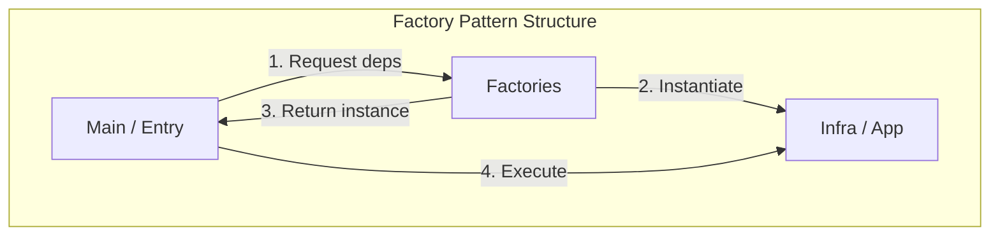
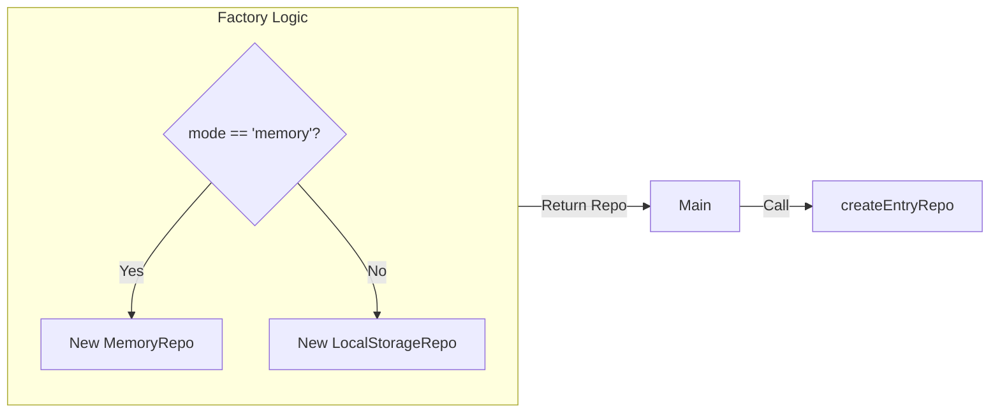

# 第15章：Factoryパターン：TSの現実解🏭✨

## この章でできるようになること（ゴール）🎯

* Factory（生成担当）を使って、Composition Root（起動・組み立て）をスッキリさせられる🧹✨
* 「new が増えて地獄😵‍💫」を、段階的に“読める配線”へ直せる🔧
* Factoryを“依存として注入”する形（必要なときだけ作る）も分かる🪄

> ちなみに本日時点（2026-01-16）、npmの安定版 TypeScript の最新は **5.9.3** だよ📌 ([npm][1])
> Node は **v24 がActive LTS**、直近のLTSセキュリティリリースは **24.13.0（2026-01-13）** などが出てるよ🔐 ([Node.js][2])
> （TypeScript 7 “Project Corsa” は進捗が公開されてて、プレビューも動く段階に来てるみたい！🚀） ([Microsoft for Developers][3])

---

## 2) Factory（工場）ってなに？🏭
🧁✨（DI文脈の超かんたん定義）

Factoryはひとことで言うと…

**「オブジェクト（や関数）を作る手順を、ひとまとめにした“生成係”」** 🏭

DIの話だと、Factoryの役目はこれ👇

* `new` や初期化のゴチャつきを、1か所（または少数）に閉じ込める📦
* 生成のルール（どの実装を使うか、設定をどう読むか）を、読みやすく保つ📚
* テストで差し替えやすくする🔄🧪

---

## 2) なぜTSはFactoryが“現実解”になりやすいの？👻🧩

TypeScriptは型（interface）が実行時に消えるから、**「型だけで自動解決」**は難しくなりがちだよね👻
なので、**手動DIをキレイに保つ工夫＝Factory** がめちゃ効く！🏋️‍♀️✨

さらにTS 5.9 では `import defer` みたいな「モジュールの実行タイミングを遅らせる」方向の機能も出てて、**副作用（勝手に動く初期化）をコントロールしたい**って流れとも相性がいいよ🧯 ([TypeScript][4])

---

## 3) Factoryは3種類だけ覚えればOK😊🫶


### A. シンプルFactory（まずはこれ！）🍙

* `createX(deps)` みたいに「必要な依存を渡すと、完成品が返る」

### B. 設定つきFactory（環境・設定で分岐）🎛️

* `createStorage({ mode })` で `localStorage` / `memory` を切り替える、みたいなやつ🔄

### C. Factoryを“依存として注入”（必要なときだけ作る）🪄

* 「実行のたびに、入力に応じて作りたい」時に使う✨
  例：`idGenerator.create()`、`clientFactory.forTenant(tenantId)` とか🧵

---

## 4) まず“地獄のComposition Root”を見よう😵‍💫➡️✨

### 😵‍💫 悪い例：main.ts が配線でパンパン


```ts
// main.ts（悪い例：読めない…）
import { ConsoleLogger } from "./infra/ConsoleLogger";
import { LocalStorageEntryRepo } from "./infra/LocalStorageEntryRepo";
import { RealClock } from "./infra/RealClock";
import { AddEntryUseCase } from "./app/AddEntryUseCase";
import { ListEntriesUseCase } from "./app/ListEntriesUseCase";

const logger = new ConsoleLogger();
const clock = new RealClock();
const repo = new LocalStorageEntryRepo("study-log");

const addEntry = new AddEntryUseCase(repo, clock, logger);
const listEntries = new ListEntriesUseCase(repo, logger);

// ここからUIやHTTPハンドラへ…（さらに増える）
```

**問題点**😵‍💫

* `new` が増えるほど「読む気が失せる」📉
* “何が何に依存してるか”が、毎回 main.ts を追わないと分からない🔍
* 差し替え（repoをmemoryに）したいだけで、配線がぐちゃぐちゃ🧶

---

## 5) Factoryで“生成”を分割して、配線を読み物にする📚✨


### ✅ ゴールの形（イメージ）🗺️

* `main.ts` は「大きい部品を組み立てるだけ」
* 生成の細かい手順は `factories/` に寄せる

```
src/
  app/        ← ユースケース（使う側）
  domain/     ← 純粋ロジック
  infra/      ← 外部I/O実装
  factories/  ← 生成係🏭✨（今回の主役）
  main.ts     ← Composition Root（配線係📍）
```



---

## 6) ハンズオン：学習記録ミニアプリでFactory🏫📝✨

### 6-1) まず「依存の型（契約）」を作る📜

```ts
// app/ports.ts
export interface Logger {
  info(message: string): void;
  error(message: string, err?: unknown): void;
}

export interface Clock {
  nowIso(): string;
}

export type Entry = { at: string; text: string };

export interface EntryRepo {
  add(entry: Entry): Promise<void>;
  list(): Promise<Entry[]>;
}
```

### 6-2) ユースケース（使う側）は“契約”だけ見る👀✨

```ts
// app/AddEntryUseCase.ts
import type { Clock, EntryRepo, Logger } from "./ports";

export class AddEntryUseCase {
  constructor(
    private readonly repo: EntryRepo,
    private readonly clock: Clock,
    private readonly logger: Logger
  ) {}

  async execute(text: string): Promise<void> {
    const trimmed = text.trim();
    if (!trimmed) {
      this.logger.info("空文字はスキップしたよ🙂");
      return;
    }

    await this.repo.add({ at: this.clock.nowIso(), text: trimmed });
    this.logger.info("追加したよ✅");
  }
}
```

```ts
// app/ListEntriesUseCase.ts
import type { EntryRepo, Logger, Entry } from "./ports";

export class ListEntriesUseCase {
  constructor(
    private readonly repo: EntryRepo,
    private readonly logger: Logger
  ) {}

  async execute(): Promise<Entry[]> {
    const list = await this.repo.list();
    this.logger.info(`件数: ${list.length}件📚`);
    return list;
  }
}
```

### 6-3) infra（外部実装）は自由にやってOK🧰

```ts
// infra/ConsoleLogger.ts
import type { Logger } from "../app/ports";

export class ConsoleLogger implements Logger {
  info(message: string): void {
    console.log(`ℹ️ ${message}`);
  }
  error(message: string, err?: unknown): void {
    console.error(`🔥 ${message}`, err);
  }
}
```

```ts
// infra/RealClock.ts
import type { Clock } from "../app/ports";

export class RealClock implements Clock {
  nowIso(): string {
    return new Date().toISOString();
  }
}
```

```ts
// infra/LocalStorageEntryRepo.ts
import type { EntryRepo, Entry } from "../app/ports";

export class LocalStorageEntryRepo implements EntryRepo {
  constructor(private readonly key: string) {}

  async add(entry: Entry): Promise<void> {
    const list = await this.list();
    list.unshift(entry);
    localStorage.setItem(this.key, JSON.stringify(list));
  }

  async list(): Promise<Entry[]> {
    const raw = localStorage.getItem(this.key);
    if (!raw) return [];
    try {
      return JSON.parse(raw) as Entry[];
    } catch {
      return [];
    }
  }
}
```

---

## 7) ここからが本題：Factoryを作る🏭✨

### 7-1) Factoryの素材：Deps（依存の束）👜

```ts
// factories/types.ts
import type { Logger, Clock, EntryRepo } from "../app/ports";

export type AppDeps = {
  logger: Logger;
  clock: Clock;
  entryRepo: EntryRepo;
};
```

### 7-2) infra生成Factory（小さく分ける）🧩

```ts
// factories/createInfra.ts
import { ConsoleLogger } from "../infra/ConsoleLogger";
import { RealClock } from "../infra/RealClock";
import { LocalStorageEntryRepo } from "../infra/LocalStorageEntryRepo";
import type { AppDeps } from "./types";

export function createInfra(): AppDeps {
  const logger = new ConsoleLogger();
  const clock = new RealClock();
  const entryRepo = new LocalStorageEntryRepo("study-log");

  return { logger, clock, entryRepo };
}
```

### 7-3) ユースケース生成Factory（“大きい部品”を作る）🏗️

```ts
// factories/createUseCases.ts
import { AddEntryUseCase } from "../app/AddEntryUseCase";
import { ListEntriesUseCase } from "../app/ListEntriesUseCase";
import type { AppDeps } from "./types";

export function createUseCases(deps: AppDeps) {
  return {
    addEntry: new AddEntryUseCase(deps.entryRepo, deps.clock, deps.logger),
    listEntries: new ListEntriesUseCase(deps.entryRepo, deps.logger),
  };
}
```

### 7-4) main.ts（Composition Root）は“読むだけ”に近づく📍✨

```ts
// main.ts（良い例：読みやすい！）
import { createInfra } from "./factories/createInfra";
import { createUseCases } from "./factories/createUseCases";

const deps = createInfra();
const useCases = createUseCases(deps);

// ここからUI/ハンドラへ渡すだけ😊
useCases.addEntry.execute("DIのFactoryわかった！🏭✨");
```

**ここが最高ポイント**🥳

* `main.ts` が「何を組み立ててるか」だけ読めばいい📖
* 生成の詳細はFactoryの中に隠せる（でも隠しすぎない）🙈✨
* repo差し替え（memory ↔ localStorage）もFactory側だけ直せばOK🔄

---

## 8) “設定つきFactory”で、差し替えをもっと楽に🔄🎛️


たとえば開発中だけメモリ保存にしたい…みたいな時ね😊

```ts
// infra/MemoryEntryRepo.ts
import type { EntryRepo, Entry } from "../app/ports";

export class MemoryEntryRepo implements EntryRepo {
  private listData: Entry[] = [];

  async add(entry: Entry): Promise<void> {
    this.listData.unshift(entry);
  }
  async list(): Promise<Entry[]> {
    return [...this.listData];
  }
}
```

```ts
// factories/createEntryRepo.ts
import type { EntryRepo } from "../app/ports";
import { LocalStorageEntryRepo } from "../infra/LocalStorageEntryRepo";
import { MemoryEntryRepo } from "../infra/MemoryEntryRepo";

export type RepoMode = "localStorage" | "memory";

export function createEntryRepo(mode: RepoMode): EntryRepo {
  return mode === "memory"
    ? new MemoryEntryRepo()
    : new LocalStorageEntryRepo("study-log");
}
```



```ts
// factories/createInfra.ts（差し替え対応版）
import { ConsoleLogger } from "../infra/ConsoleLogger";
import { RealClock } from "../infra/RealClock";
import { createEntryRepo, type RepoMode } from "./createEntryRepo";
import type { AppDeps } from "./types";

export function createInfra(mode: RepoMode): AppDeps {
  return {
    logger: new ConsoleLogger(),
    clock: new RealClock(),
    entryRepo: createEntryRepo(mode),
  };
}
```

---

## 9) Factoryを“依存として注入”するパターン🪄（地味に強い）


「毎回 new する相手」や「入力で作り分ける相手」は、Factory自体を依存にしちゃうとキレイ✨

例：ID生成をユースケース側で使いたい（でもランダムはテスト困る🎲）

```ts
// app/IdFactory.ts
export type IdFactory = {
  create(): string;
};
```

```ts
// infra/RandomIdFactory.ts
import type { IdFactory } from "../app/IdFactory";

export class RandomIdFactory implements IdFactory {
  create(): string {
    return crypto.randomUUID();
  }
}
```

これを `deps` に入れて、ユースケースで使うと…

* 本番：`RandomIdFactory`
* テスト：`FixedIdFactory("id-123")`
  みたいに差し替えが超ラクになるよ🧪💖

---

## 10) Factoryでやりがちな地雷3つ🕳️⚠️（ここ超大事！）

### 地雷①：Factoryの中で“勝手にI/O”する😱


* 例：Factory内でネットワークアクセス、ファイル読み込み、DB接続を即実行…
  → **作っただけで副作用**が起きると、デバッグがつらい😭
  ✅ コツ：Factoryは「組み立て」中心。重い接続は遅延（必要なとき）も検討🕰️

### 地雷②：Factoryが肥大化して“神ファクトリ”になる👑

* 何でもcreateして500行…みたいな😵
  ✅ コツ：**“層で分ける”**（infra生成 / usecase生成 / handler生成）📦📦📦

### 地雷③：Containerを渡してしまい、Service Locator化する🌀

* `useCase(container)` みたいにすると「どこで何使ってるか不明」🙈
  ✅ コツ：Factoryの引数は **必要なdepsだけ** にする🫶

---

## 11) 章末ミニ課題📝✨（ぜんぶ小さくてOK！）

1. `createInfra()` を分割して、`createLogger()` / `createClock()` / `createRepo()` にしてみてね🧩
2. `RepoMode` を追加して、`memory` と `localStorage` を切り替えできるようにしてみよう🔄
3. “差し替えしやすさ”を感じたら、1行で感想を書いてみて🥰📝

---

## 12) AI（Copilot/Codex等）に頼ると超はかどるプロンプト例🤖✨

* 「main.ts の new を factories に移して、責務が分かるファイル分割案を出して」🧹
* 「Factoryの引数が肥大化しそう。depsを整理する型設計を提案して」👜
* 「このFactory構成でService Locatorっぽくなってないかレビューして」🕵️‍♀️

---

## まとめ🎀

* Factoryは **手動DIを“読める配線”に保つための最強テク**🏭✨
* Composition Rootは「組み立てるだけ」、Factoryは「作り方を知ってるだけ」📍
* 差し替え・テスト・環境分岐が、びっくりするほど楽になるよ🧪🔄💖

次の章（第16章）は、Factoryで整えた上で「DIP（契約に依存する）」をちゃんと腹落ちさせると、さらに一段ラクになるよ〜！📜✨

[1]: https://www.npmjs.com/package/typescript?activeTab=versions&utm_source=chatgpt.com "typescript"
[2]: https://nodejs.org/en/about/previous-releases?utm_source=chatgpt.com "Node.js Releases"
[3]: https://devblogs.microsoft.com/typescript/progress-on-typescript-7-december-2025/?utm_source=chatgpt.com "Progress on TypeScript 7 - December 2025"
[4]: https://www.typescriptlang.org/docs/handbook/release-notes/typescript-5-9.html?utm_source=chatgpt.com "Documentation - TypeScript 5.9"
