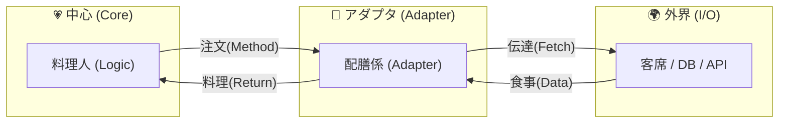
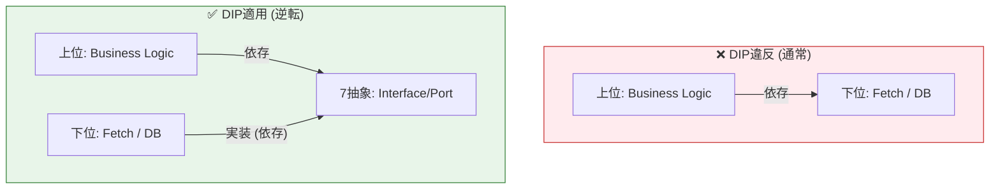

# 第16章：DIP入門：上位が下位に引きずられない設計🔁

（2026/01/16時点メモ🗓️：TypeScriptは **5.9系が安定版**として配布されていて、Node.jsは **v24がActive LTS**・v25がCurrentだよ〜🧡） ([GitHub][1])
（テストはVitestの4系料理人が客席まで行って注文取ったり会計したりすると大混乱だよね😂💦



 ([Vitest][2])

---

## この章のゴール🎯✨

この章が終わったら、あなたはこうなれるよ🫶

* **DI** と **DIP** をゴチャ混ぜにせず説明できる💡
* 「上位（ビジネス）」が「下位（fetchやDB）」に引っ張られない構造を作れる🧩
* **ApiClient型（契約）** を作って、**本物/ダミー**を差し替えられる🔄
* テストが「ラクで安定」するのを体感できる🧪💕

---

## 1) まず整理！DIとDIPは“別モノ”だよ⚠️

混同しやすいので、最初にスッキリさせよ〜😊🌸

## DI（依存性注入）💉

* 依存（必要なもの）を **外から渡す** テクニック
* 例：`new` を中で作らず、引数で `apiClient` を渡す、みたいな感じ✨

## DIP（依存性逆転の原則）🔁

* **依存の向きを逆にする** 設計ルール
* “上位（重要なルール）”が“下位（細かい実装）”に依存しないようにする📌

> ざっくり言うと…
> **DI = 渡し方の技**💉
> **DIP = 依存の向きのルール**🧭

---

## 2) DIPの核心💎「契約（抽象）に依存しよ」


DIPの大事な言い方はこれ👇（覚え方つき😆）

* 上位モジュールは下位モジュールに依存してはいけない🙅‍♀️
* **どっちも“抽象（契約）”に依存すべき**📜
* 抽象は詳細に依存しない／**詳細が抽象に依存する**🧷



TypeScriptでいう「抽象（契約）」は、だいたいこう👇

* `interface` / `type`（＝形の約束）
* 関数のシグネチャ（`(x) => y`）
* “こう振る舞ってね”という **型の約束**✨

⚠️ただしTSは「型が実行時に消える」から👻、**実行時の自動解決（C#みたいな感じ）**には工夫が必要。
でも！DIPは**設計の考え方**だから、TSでも超効くよ💪💕

---

## 3) ありがちなDIP違反😵‍💫（上位がfetchに依存）

まずは「ダメな例」を見て、“何がつらいか”を体で理解しよ〜🫠

```ts
// ❌ 上位ロジックが fetch という下位の詳細に依存しちゃってる例
export async function getGreeting(userId: string) {
  const res = await fetch(`https://example.com/users/${userId}`);
  const user = await res.json() as { name: string; isPremium: boolean };

  // 上位のルール（挨拶）なのに、通信の都合に引っ張られる😣
  return user.isPremium ? `🌟ようこそ ${user.name} さん！` : `こんにちは ${user.name} さん`;
}
```

## これ、何が困るの？😣💥

* テストでネットワークに左右される（落ちる/遅い/不安定）🌀
* API仕様変更が直撃する（上位の大事なロジックが壊れる）💔
* 例外処理・リトライ・認証…が混ざって読みにくい🧯

---

## 4) DIP適用✅：上位は「ApiClientという契約」にだけ依存する💞

ここからが本番だよ〜！いくよっ💨💕

## Step A：契約（Port）を作る📜✨

上位が欲しいのは「fetch」じゃなくて「データを取れること」だよね？
だから **ApiClient型**を用意するよ🧩

```ts
// ✅ 上位が依存する“契約”
export type ApiClient = {
  getJson<T>(url: string): Promise<T>;
};
```

## Step B：上位（ビジネス）を書く👑（下位を知らない）

```ts
import type { ApiClient } from "./apiClient";

type UserDto = { name: string; isPremium: boolean };

export async function getGreeting(
  api: ApiClient,
  userId: string,
) {
  const user = await api.getJson<UserDto>(`/users/${userId}`);

  // ✅ ここは「挨拶ルール」だけに集中できる💖
  return user.isPremium
    ? `🌟ようこそ ${user.name} さん！`
    : `こんにちは ${user.name} さん`;
}
```

ポイント🌸

* 上位は **fetchを知らない** 🙈
* 上位は **ApiClientという契約だけ知ってる** 📜
* これがDIPの気持ちよさだよ〜🫶

---

## 5) 下位（詳細）は契約を満たして実装する🔧（Real / Fake）

## Step C：本物（infra）実装🌐

```ts
import type { ApiClient } from "../app/apiClient";

export function createFetchApiClient(baseUrl: string): ApiClient {
  return {
    async getJson<T>(url: string): Promise<T> {
      const res = await fetch(new URL(url, baseUrl));
      if (!res.ok) throw new Error(`HTTP ${res.status}`);
      return await res.json() as T;
    },
  };
}
```

## Step D：ダミー（Fake）実装🧸（テスト用）

```ts
import type { ApiClient } from "../app/apiClient";

export function createFakeApiClient(data: Record<string, unknown>): ApiClient {
  return {
    async getJson<T>(url: string): Promise<T> {
      if (!(url in data)) throw new Error(`Not found: ${url}`);
      return data[url] as T;
    },
  };
}
```

---

## 6) Composition Root（組み立て係）で“本物”を渡す🎀

上位は「契約しか知らない」ので、最後に外側で組み立てるよ📍✨

```ts
import { getGreeting } from "./app/getGreeting";
import { createFetchApiClient } from "./infra/fetchApiClient";

async function main() {
  const api = createFetchApiClient("https://example.com"); // 本物🧡
  const message = await getGreeting(api, "42");
  console.log(message);
}

main().catch(console.error);
```

---

## 7) テストが爆速で安定する🧪💖（DIPのご褒美）

Vitestでサクッと体験しよ〜🥰
（Vitest 4系が出てるよ🧪✨） ([Vitest][2])

```ts
import { describe, it, expect } from "vitest";
import { getGreeting } from "./getGreeting";
import { createFakeApiClient } from "../test/fakeApiClient";

describe("getGreeting", () => {
  it("premiumなら特別な挨拶🌟", async () => {
    const api = createFakeApiClient({
      "/users/1": { name: "Aiko", isPremium: true },
    });

    const msg = await getGreeting(api, "1");
    expect(msg).toContain("🌟");
  });

  it("通常なら普通の挨拶🙂", async () => {
    const api = createFakeApiClient({
      "/users/2": { name: "Mina", isPremium: false },
    });

    const msg = await getGreeting(api, "2");
    expect(msg).toContain("こんにちは");
  });
});
```

**ネット不要**✅
**速い**⚡
**落ちない**🧡
最高〜〜〜！🥳🎉

---

## 8) よくある勘違い＆地雷🕳️⚠️

## 地雷①：上位が「具体クラス名」を型に書いちゃう😵

* DIPは「上位が下位の都合に振り回されない」ための設計ルール🔁
* TSでは「契約＝type/interface」で表現して、**本物/ダミーを差し替える**のが超王道💉
* テストが安定して、変更にも強くなる🧪💖

次の章（SoC強化）に進むと、「外部I/Oを端っこに押し出す」感覚がもっとハッキリするよ🚚✨

[1]: https://github.com/microsoft/typescript/releases?utm_source=chatgpt.com "Releases · microsoft/TypeScript"
[2]: https://vitest.dev/blog/vitest-4?utm_source=chatgpt.com "Vitest 4.0 is out!"
[3]: https://www.typescriptlang.org/docs/handbook/release-notes/typescript-5-9.html?utm_source=chatgpt.com "Documentation - TypeScript 5.9"
[4]: https://nodejs.org/en/about/previous-releases?utm_source=chatgpt.com "Node.js Releases"
