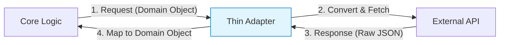

# 第17章：SoC強化：I/Oアダプタを薄くする🚚✨

この章はひとことで言うと…
**「`fetch` とか `localStorage` とか “外の世界” を、アプリの端っこに追い出して、中心（ロジック）をスッキリさせよう」**って話だよ😊🌸

---

## 1) この章のゴール🎯✨

読み終わったら、こうなってほしい！

* 「これI/Oだ！」ってコードから見つけられる🔎⚡
* I/Oを **アダプタ（adapter）** に包んで、ロジックから分離できる✂️🧩
* アダプタを **薄く** 保つルールがわかる📏✨
* DIで差し替えて、テストがラクになるのを体感できる🧪💖

---

## 2) そもそも “I/O” が混ざると何がつらいの？😵‍💫

I/O（外の世界）って、たとえばこんなやつ👇

* ネットワーク：`fetch` 🌐
* ブラウザ保存：`localStorage` 🗄️
* 時刻：`Date.now()` ⏰
* 乱数：`Math.random()` 🎲
* ログ：`console.log` 🪵

これらがロジックの真ん中に混ざると…

* テストが不安定（通信・時間・乱数でブレる）😣
* 本番だけ動いて、手元で再現しにくい🌀
* 変更が怖い（ロジック修正のつもりが通信周りも壊す）💥

---

## 3) SoCってなに？（超ざっくり）🍱✨

**SoC = Separation of Concerns（関心ごとの分離）**
つまり、役割をごちゃ混ぜにしないこと😊

* 💗中心（Core / Domain / UseCase）：**判断・計算・ルール（ビジネスロジック）**
* 🧱端っこ（Infra / Adapter）：**通信・保存・時刻などのI/O**

イメージはこんな感じ👇

* ロジック：料理人👩‍🍳（味を決める）
* アダプタ：配膳さん🧑‍🍽️（キッチンと客席のつなぎ役）

料理人が客席まで行って注文取ったり会計したりすると大混乱だよね😂💦

---

## 4) “薄いアダプタ”ってどういう意味？📏✨


アダプタは **「変換・橋渡し」だけ** して、余計なことをしないのが理想😍

✅ 薄いアダプタがやること



* 形式変換（JSON → ドメインで扱いやすい形）🔁
* API呼び出しの実行（fetchする）🌐
* 例外やエラーを “境界用の型” に寄せる（必要最小限）🧯

❌ やらないこと（太る原因）

* **ビジネスルール**（「VIPなら割引」とか）を入れる💀
* 画面文言やUI都合を入れる🎨
* いろんなユースケースの都合で条件分岐しまくる🌪️

---

## 5) 実践：`fetch`直叩き → `HttpClient`アダプタにする🌐➡️🚚

### 5-1) ありがちな “混ざってる” 例😣

```ts
// ❌ ロジックの真ん中で fetch してる例（つらい）
export async function getGreeting(userId: string): Promise<string> {
  const res = await fetch(`https://api.example.com/users/${userId}`);
  if (!res.ok) throw new Error("ユーザー取得失敗");

  const user = await res.json() as { name: string };
  return `こんにちは、${user.name}さん！`;
}
```

これだとテストが「ネットワーク頼み」になってつらい〜😭

---

### 5-2) ポート（契約）を作る🧩📜

ロジック側は「こういうことができる相手が欲しい」だけ言う✨

```ts
// ✅ ポート（interface）＝ ロジックが欲しい“能力”
export interface HttpClient {
  getJson<T>(url: string): Promise<T>;
}
```

---

### 5-3) アダプタ（実装）を作る🚚✨

```ts
// ✅ fetch を包む “薄い” アダプタ
export class FetchHttpClient implements HttpClient {
  async getJson<T>(url: string): Promise<T> {
    const res = await fetch(url);

    if (!res.ok) {
      // ここは “境界の例外” として最小限にとどめるのがコツ
      throw new Error(`HTTP error: ${res.status}`);
    }
    return (await res.json()) as T;
  }
}
```

※ Node でも `fetch` が組み込みになってきていて、Node 21 では stable 扱いになったよ（歴史的には Node 18 から利用可能で、安定化が進んだ感じ）📌 ([Node.js][1])
（`fetch` 自体は WHATWG の標準仕様だよ〜📜） ([Fetch Standard][2])

---

### 5-4) ロジック（UseCase）からI/Oを追い出す✂️💖

```ts
export async function getGreeting(
  userId: string,
  deps: { http: HttpClient }
): Promise<string> {
  const user = await deps.http.getJson<{ name: string }>(
    `https://api.example.com/users/${userId}`
  );

  return `こんにちは、${user.name}さん！`;
}
```

**ポイント💡**

* ロジックは `fetch` を知らない🙈
* 「HTTPで取ってくる」は `HttpClient` の仕事🌐✨

---

## 6) テストが一気にラクになる🧪💖（FakeでOK）

```ts
class FakeHttpClient implements HttpClient {
  constructor(private data: Record<string, unknown>) {}

  async getJson<T>(url: string): Promise<T> {
    if (!(url in this.data)) throw new Error("not found in fake");
    return this.data[url] as T;
  }
}

async function test() {
  const fake = new FakeHttpClient({
    "https://api.example.com/users/42": { name: "さくら" },
  });

  const msg = await getGreeting("42", { http: fake });
  console.assert(msg === "こんにちは、さくらさん！");
}
```

ネット不要！速い！安定！最高〜🥳✨

---

## 7) “薄いアダプタ” チェックリスト✅📏

アダプタ書いたら、これ見て自己採点してみてね☺️

* [ ] if/else がユースケース都合で増えてない？🌪️
* [ ] 「割引」「判定」「条件」みたいな **ルール** を入れてない？💀
* [ ] 変換（mapping）と通信（fetch）だけになってる？🔁🌐
* [ ] ロジック層が `fetch` / `localStorage` / `Date` を直接触ってない？🙈
* [ ] Fakeで簡単に置き換えられる？🧪✨

---

## 8) よくある落とし穴3つ🕳️⚠️

### 落とし穴①：アダプタが“便利屋”になって太る🐷💦

「ここでもあれも…」で条件が増えると、結局そこが地獄になる😇
➡️ **アダプタは“橋渡し”だけ**！

### 落とし穴②：エラーが生のまま飛び出してくる💥

`fetch` の失敗や `res.ok` をロジックが毎回書くのはつらい
➡️ **境界で最小限まとめる**（でもルールは入れない）

### 落とし穴③：型がごちゃる🌀

外のJSON型をそのままロジックで使い続けると、変更に弱い😣
➡️ **アダプタで“形を整える”**（必要最小限のmapping）

---

## 9) ミニ課題（手を動かすやつ）✍️✨

### 課題A：fetch直叩きを見つけて、`HttpClient`に置き換え🔁🌐

* 自分のコード（or サンプル）から `fetch(` を検索🔎
* `HttpClient` に寄せる
* テストは Fake で書く🧪

### 課題B：`localStorage` を `Storage` アダプタにする🗄️🚚

* `getItem/setItem` をポートに
* 本物とFakeを作る
* ロジックはStorageを注入して使う✨

---

## 10) AIの使いどころ🤖💡（めちゃ効く！）

コピペで使える指示セット置いとくね💖

* 「このファイルのI/O（外部依存）行を全部リストアップして」🔎
* 「SoC的に分けるなら、どこを port/interface にする？」🧩
* 「このアダプタ、太ってる？太ってたら削る案ちょうだい」📏
* 「Fake実装を最小コードで作って。テスト例も」🧪✨

---

## おまけ：TypeScriptの“今”メモ📝✨

TypeScript は npm 上だと 2025年秋時点で **5.9.3** が “Latest” 表示だったよ（この章の内容自体はバージョンで崩れにくい基礎だけど、最新追うならここを見ると安心）📌 ([npm][3])

---

## まとめ🏁💖

* I/O（`fetch`/`storage`/`time`）は **端っこへ** 🚚✨
* ロジックは **ポート（interface）だけ知る** 🧩
* アダプタは **薄く**：橋渡しだけ📏
* DIで差し替えるとテストが天国🧪🌸

次の章（第18章）では、この分離が **環境差（ブラウザ/Nodeなど）** を吸収する武器になるよ〜🪟🌐✨

[1]: https://nodejs.org/en/blog/announcements/v21-release-announce?utm_source=chatgpt.com "Node.js 21 is now available!"
[2]: https://fetch.spec.whatwg.org/?utm_source=chatgpt.com "Fetch Standard - WhatWG"
[3]: https://www.npmjs.com/package//typescript?activeTab=versions&utm_source=chatgpt.com "typescript"
