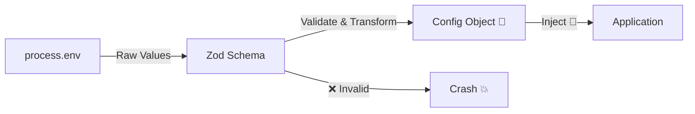
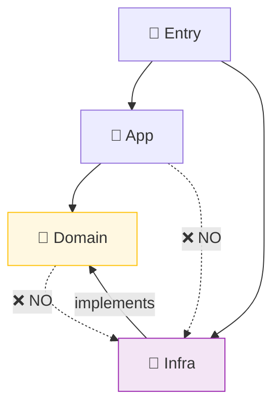

# 第19章：環境依存②：設定（env）をDIで安全に扱う🎛️

## この章でできるようになること🎯✨

* `process.env`（や `import.meta.env`）をコードのあちこちで直読みしない設計にできる🙅‍♀️
* “設定は **Configオブジェクト** にまとめて、必要なところへ注入（DI）” ができる💉
* 「値が無い」「数値のはずが文字列」みたいな事故を **起動時に発見** できる✅
  ※Nodeは環境変数を全部文字列として扱う（`true` も `"true"`）ので、変換＆検証が超大事だよ〜👀 ([nodejs.org][1])

---

## 1) まず“事故あるある”😇💥

### ❌ 事故パターンA：散らばる直読み

* いろんなファイルで `process.env.API_URL` とかを直接読む
  → どこで何を使ってるか追えない、テストで差し替えにくい、設定の追加/変更が怖い😵‍💫

### ❌ 事故パターンB：`undefined` 地雷

* 本番だけ設定漏れで `undefined`
  → 途中で落ちる、エラーが分かりにくい🙈

### ❌ 事故パターンC：型が全部“文字列”

* `PORT="3000"` を数値だと思って計算してバグる
  Nodeでは基本ぜんぶ文字列として入ってくるよ〜🧵 ([nodejs.org][1])

---

## 2) 解決の合言葉：「設定（env）は依存」🔌💉

つまり…

* **設定を読む行為** ＝ 外部に依存してる
* だから **外から渡す（DI）** が相性バツグン✨

この章の基本方針はコレ👇

1. **envを読むのは1か所だけ**（Composition Root か、その近く）📍
2. **起動時にまとめて検証**（足りない/型違いを即エラー）🧯
3. 使う側は **Configを注入してもらう**（直読み禁止）🚫

---

## 3) ハンズオン：Configを“1回だけ作って”注入する🛠️✨

### 3-1) `.env` を読む：最近のNodeは標準機能があるよ📦

Nodeは `.env` を `--env-file` で `process.env` に読み込める（存在しないとエラーになる版もある）よ〜！ ([nodejs.org][2])
さらに「無かったら無視してね」も用意されてる（`--env-file-if-exists`）のが便利🙆‍♀️ ([nodejs.org][1])

`package.json` の例👇

```json
{
  "scripts": {
    "dev": "node --env-file-if-exists=.env --watch src/main.ts",
    "start": "node --env-file-if-exists=.env dist/main.js"
  }
}
```

> もちろん dotenv も今でも定番（.env→process.env）だよ〜（既存案件でよく使う）📦 ([npm][3])

---

### 3-2) 依存を“読む側”を分離：EnvSourceを作る🧩

「どこからenvが来るか」を差し替えできるように、まず“読み口”を抽象化するよ😊

```ts
// src/config/env-source.ts
export type EnvSource = {
  get(key: string): string | undefined;
};

// Node用（process.env）
export const processEnvSource: EnvSource = {
  get: (key) => process.env[key],
};
```

---

### 3-3) 起動時に“まとめて検証”：ZodでConfig生成🎛️✅


Zodで「必要なキー」「型」「変換」をまとめてチェックするのが気持ちいい✨
`process.env` を `parse` して、足りなければ即エラーで止める流れが定番だよ〜🧪 ([DEV Community][4])



```ts
// src/config/config.ts
import { z } from "zod";
import type { EnvSource } from "./env-source.js";

const ConfigSchema = z.object({
  APP_NAME: z.string().default("my-app"),
  API_BASE_URL: z.string().url(),
  PORT: z.coerce.number().int().min(1).max(65535).default(3000),
  LOG_LEVEL: z.enum(["debug", "info", "warn", "error"]).default("info"),
});

export type Config = Readonly<z.infer<typeof ConfigSchema>>;

export function createConfig(env: EnvSource): Config {
  // EnvSource → plain object にして Zod に渡す
  const raw = {
    APP_NAME: env.get("APP_NAME"),
    API_BASE_URL: env.get("API_BASE_URL"),
    PORT: env.get("PORT"),
    LOG_LEVEL: env.get("LOG_LEVEL"),
  };

  const parsed = ConfigSchema.parse(raw); // ここで不足/型違いなら即例外✅
  return Object.freeze(parsed);
}
```

ポイント🌸

* `z.coerce.number()` で `"3000"` → `3000` に変換できるのが最高👏
* `Object.freeze` で “途中で書き換え不可” にして事故を減らす🧊

---

### 3-4) Configを注入して使う💉（直読み卒業🎓）

例として「外部APIを叩くクライアント」を作るね🌐

```ts
// src/app/api-client.ts
import type { Config } from "../config/config.js";

export class ApiClient {
  constructor(private readonly config: Config) {}

  async getHealth(): Promise<unknown> {
    const url = new URL("/health", this.config.API_BASE_URL);
    const res = await fetch(url);
    return await res.json();
  }
}
```

**ここが大事！**
`ApiClient` は `process.env` を一切知らない🙅‍♀️
知ってるのは「Configという依存がある」だけ💉

---

### 3-5) Composition Root（起動地点）で組み立て📍✨

```ts
// src/main.ts
import { createConfig } from "./config/config.js";
import { processEnvSource } from "./config/env-source.js";
import { ApiClient } from "./app/api-client.js";

const config = createConfig(processEnvSource); // env読むのはここだけ🎯
const api = new ApiClient(config);

console.log(await api.getHealth());
```

---

## 4) テストが一気にラクになる🧪💖

「テスト用のConfig」を簡単に差し込めるのがDIのご褒美🎁

```ts
// src/app/api-client.test.ts
import { ApiClient } from "./api-client.js";

const testConfig = Object.freeze({
  APP_NAME: "test",
  API_BASE_URL: "https://example.com",
  PORT: 3000,
  LOG_LEVEL: "error",
} as const);

test("health endpoint", async () => {
  const api = new ApiClient(testConfig as any);
  // 本当は fetch を差し替える設計にして、ここでFakeにするのが王道だよ🧪
  expect(api).toBeDefined();
});
```

> ここでは軽く雰囲気だけ！本格的には「HTTPの依存（fetch）も注入」するとテストがもっと綺麗になるよ🌷（第17章/第22章あたりと相性◎）

---

## 5) フロント系の注意：`process.env` じゃない世界もある👀🌐

### Vite：`import.meta.env` を使う（`VITE_` だけ公開）🌱

Viteは `import.meta.env` に値が入り、ビルド時に置換されるよ🧩 ([vitejs][5])
ユーザー定義の環境変数は基本 `VITE_` で始まるものが対象になる（公開される範囲の目印）だよ〜🚥 ([vitejs][6])

→ だから “フロントで使う設定” も、同じ発想で `EnvSource` を `import.meta.env` 版に差し替えればOK🙆‍♀️

### Next.js：`NEXT_PUBLIC_` はブラウザにバンドルされる⚠️

Next.js は `.env` を読み込めて、`NEXT_PUBLIC_` が付いたものはクライアントへ渡るよ📦 ([Next.js][7])
**秘密情報は `NEXT_PUBLIC_` 付けない**（公開されちゃうから）って覚えようね🔒 ([Next.js][7])

---

## 6) よくある落とし穴まとめ🕳️⚠️

* **設定は途中で書き換えない**：不具合の温床なので `freeze` 推奨🧊
* **起動時に検証して落とす**：実行途中で爆発より100倍マシ🧯（Zod / envalid / t3-env など）

  * envalid：envの検証・サニタイズ用の小さめライブラリ🧼 ([GitHub][8])
  * t3-env：サーバー/クライアント分離＋型安全を強く支援してくれる系🦾 ([Env][9])
* **ランタイムによっては `process.env` が空っぽ/無い** こともある（例：Workers系）
  → “直読みしない” は移植性も上がるよ🛫 ([Cloudflare Docs][10])

---

## 7) ミニ課題🎒✨（この章のゴール確認）

### 課題A：直読みを撲滅🚫

* プロジェクト内の `process.env.` を検索して

  1. `createConfig()` に集約
  2. 使う側は `Config` 注入に置き換え
     までやってみてね🔎🧹

### 課題B：Configに“1個だけ”追加🎛️

* `FEATURE_X_ENABLED` を追加して、boolean化して使ってみよ〜（`"true"`/`"false"` の扱い注意！）🧪

### 課題C：テストで差し替え✅

* 本番Configじゃなく `testConfig` を渡しても動くことを確認🌸

---

## 8) AI活用プロンプト例🤖✨

* 「Zodで env を検証する `ConfigSchema` を作って。必須とデフォルトも入れて」
* 「`process.env` の直読みを禁止して、Config注入にリファクタする差分を提案して」
* 「Configの項目が増えても辛くないディレクトリ構成案を3つ出して」📁

---

## まとめ🎀

* envは“外部依存”だから、**Configにまとめて注入（DI）** が最強だよ💉
* Nodeのenvは **全部文字列** → 変換＆検証を **起動時に一括** が安心🧯 ([nodejs.org][1])
* Vite/Nextみたいに “公開されるenv” のルールがある世界でも、`EnvSource` 差し替え発想で整理できるよ🌿 ([vitejs][11])

次の第20章は、いよいよ **infra がそれを実装**する（逆転！）🔁✨



境界ルール）だよ〜📦🚫✨

[1]: https://nodejs.org/api/environment_variables.html?utm_source=chatgpt.com "Environment Variables | Node.js v25.3.0 Documentation"
[2]: https://nodejs.org/api/cli.html?utm_source=chatgpt.com "Command-line API | Node.js v25.3.0 Documentation"
[3]: https://www.npmjs.com/package/dotenv?utm_source=chatgpt.com "Dotenv"
[4]: https://dev.to/schead/ensuring-environment-variable-integrity-with-zod-in-typescript-3di5?utm_source=chatgpt.com "Ensuring Environment Variable Integrity with Zod in ..."
[5]: https://vite.dev/guide/env-and-mode?utm_source=chatgpt.com "Env Variables and Modes"
[6]: https://ja.vite.dev/guide/env-and-mode?utm_source=chatgpt.com "環境変数とモード"
[7]: https://nextjs.org/docs/pages/guides/environment-variables?utm_source=chatgpt.com "Guides: Environment Variables"
[8]: https://github.com/af/envalid?utm_source=chatgpt.com "af/envalid: Environment variable validation for Node, Bun, ..."
[9]: https://env.t3.gg/docs/introduction?utm_source=chatgpt.com "Introduction ⋅ T3 Env"
[10]: https://developers.cloudflare.com/workers/runtime-apis/nodejs/process/?utm_source=chatgpt.com "process · Cloudflare Workers docs"
[11]: https://vite.dev/config/?utm_source=chatgpt.com "Configuring Vite"
