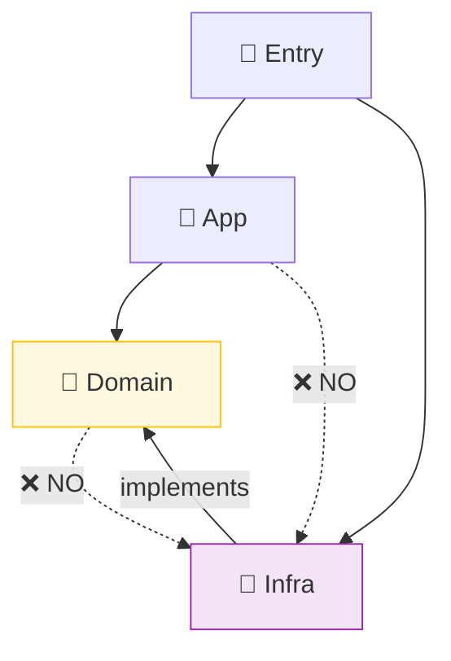

# 第20章：import地獄対策①：境界ルールを1つ決める📦🚫

この章のゴールはシンプルだよ💡
**「import（依存）の向き」の“たった1個のルール”を決めて、守れる仕組みまで作る**こと😊🧩

> ちなみに本日時点だと TypeScript の最新は **5.9系（5.9.3）** だよ🆕✨（公式DLページでも “currently 5.9” 表記） ([TypeScript][1])
> TS 5.9 では Node向けの安定オプション（`node20`）や `import defer` みたいな “モジュール周り” にも動きがあるので、**import設計の重要度がさらに上がってる**感じ🧠⚙️ ([TypeScript][2])

---

## 1) 「import地獄」ってどんな状態？😵‍💫🌀


よくある症状はこれ👇

* **どこからでもどこへでも import できちゃう**（無法地帯）🏜️
* Domainっぽいところが **fetch / DB / localStorage** を直叩きしはじめる🌐🗄️
* ちょっと直すと、別ファイルが雪崩れる☃️💥
* テストが「準備だらけ」になって、やる気が消える🧪😇
* **循環 import** が出て、謎のバグ＆謎の初期化順になる🌀👻

ここで大事なのは、解決策が **「頑張って気をつける」じゃなくて**
**「ルール＋自動チェック（lint）」** になってることだよ🛡️✨

---

## 2) まずは境界ルールを“1個だけ”決めよう🎯📏


おすすめの最初の1個はこれ👇（超王道で強い💪）

### ✅ ルール：**domain は infra を import しない**🚫📦

* domain：**純粋ロジック中心**（ルール・計算・判断）🧠✨
* infra：**外部I/O**（HTTP/DB/Storage/OS/Envなど）🌐🗄️⚙️
* だから domain は infra を知らない（知らなくていい）🙈✨

これを決めるだけで、DI/IoCが一気にキレイになるよ💉🧩
（「差し替え」できる形が自然にできる）

---

## 3) 具体例：フォルダ境界を作る🗂️✨


例として、こう分ける👇（名前は好みでOKだけど、まず固定しよ😊）

* `domain/`（中心）🧠
* `infra/`（外側のI/O）🌐
* `app/`（ユースケース組み立て）🧩
* `entry/`（起動、Composition Root）🚀

イメージはこんな感じ👇

```text
entry  ─────────────▶ infra
  │                     ▲
  │                     │ implements
  ▼                     │
 app  ───────────────▶ domain
            uses        ▲
                        │ defines "ports" (interfaces/types)
```

ポイントはこれ💡
**domain が「こういう機能が欲しい」を“型（契約）”として定義**して、


**infra がそれを実装**する（逆転！）🔁✨



---

## 4) 小さなサンプル（DIが自然にキレイになる）💉🌸

### domain（欲しい能力＝ポートを定義）📜

```ts
// domain/ports/Clock.ts
export interface Clock {
  now(): Date;
}
```

```ts
// domain/usecases/isExpired.ts
import type { Clock } from "../ports/Clock";

export function makeIsExpired(clock: Clock) {
  return (expiresAt: Date) => clock.now().getTime() > expiresAt.getTime();
}
```

### infra（外側が実装する）🧰

```ts
// infra/SystemClock.ts
import type { Clock } from "../domain/ports/Clock";

export class SystemClock implements Clock {
  now(): Date {
    return new Date();
  }
}
```

### entry（組み立て：Composition Root）📍🚀

```ts
// entry/main.ts
import { SystemClock } from "../infra/SystemClock";
import { makeIsExpired } from "../domain/usecases/isExpired";

const clock = new SystemClock();
const isExpired = makeIsExpired(clock);

console.log(isExpired(new Date(Date.now() - 1000)));
```

🌟この形のいいところ

* domain は infra を一切知らない🙌
* 差し替えが簡単（FakeClockでテストし放題）🧪💖
* 「どこで組み立てるか」が明確（entryだけ）📍✨

---

## 5) ルールを“守らせる”仕組み（ESLint）🛡️✅


### 5-1. いちばん簡単：`no-restricted-imports`（ESLint標準）🚫📥

ESLintには「この import 禁止！」を指定できるルールがあるよ✅ ([ESLint][3])
そして ESLint v9 では **flat config（eslint.config.js）が標準**になってる🧩 ([ESLint][4])

例：**domain 配下から infra を import したらアウト**にする👇

```js
// eslint.config.js
export default [
  {
    files: ["src/domain/**/*.{ts,tsx}"],
    rules: {
      "no-restricted-imports": [
        "error",
        {
          patterns: [
            {
              group: ["../infra/*", "../../infra/*", "**/infra/**"],
              message: "domain から infra を import しないでね🙅‍♀️（境界ルール）",
            },
          ],
        },
      ],
    },
  },
];
```

> パスはプロジェクトの構成で変わるから、最初は **“ゆるめに patterns”** でもOKだよ😊✨
> 「まず守れる」を優先しよ〜🌸

---

### 5-2. もう少し強く：`import/no-restricted-paths`（eslint-plugin-import）🧱✨

「どのフォルダから、どのフォルダを禁止」みたいに **ゾーン指定**できるやつだよ📦🚧 ([GitHub][5])

（例の考え方：**target側（domain）では from側（infra）を禁止**）

---

### 5-3. さらに本格派：Boundaries（eslint-plugin-boundaries / JS Boundaries）🧠🏗️

**“アーキテクチャ境界”をルール化**して守らせる系✨
中心ルール `boundaries/element-types` で、要素タイプの行き来を制御できるよ🧩 ([jsboundaries.dev][6])

---

### 5-4. モノレポなら：Nx の “module boundaries” も強い💪📚

Nx には境界を強制するルール（`@nx/enforce-module-boundaries`）があるよ🧱 ([Nx][7])

---

## 6) ありがちな違反パターンと直し方🔧😺

### ❌ domain が infra を直接呼ぶ

```ts
// domain/... にこんなのがある
import { fetchJson } from "../infra/http/fetchJson";
```

### ✅ 直し方（ポートを作る）

* domain：`HttpClient` みたいな **interface（契約）** を定義📜
* infra：`FetchHttpClient` が実装🌐
* entry：注入して組み立て📍

「欲しい形は domain が言う」「実現は infra がやる」🧠➡️🧰✨

---

## 7) ミニ課題（手を動かす）📝💪✨

### 課題A：ルール1個を“文章にする”📜

* 「domain は infra を import しない」
* これを **1行で** README に書く✍️✨

### 課題B：違反を1個だけ直す✂️

* `src/domain` から `infra` を import してる箇所を1つ見つける🔎
* “ポート化”して entry で組み立てに移動📍

### 課題C：lintで強制する🛡️

* ESLintにルール追加
* わざと違反importを書いて、ちゃんと怒られるのを確認😈✅

---

## 8) AI（Copilot/Codex）に頼むと爆速になるお願いテンプレ🤖✨

そのままコピペで使えるよ🫶

* 「このファイルの import が境界ルール（domain→infra禁止）に違反してないか確認して、違反があれば最小の修正案を出して」🔍🧩
* 「domain に必要な ‘ポート(interface)’ を提案して。命名もお願い」📜✨
* 「entry（Composition Root）に寄せる形で、依存の組み立てコードを書き直して」📍🚀
* 「ESLint flat config で domain→infra import を禁止する設定例を出して」🛡️

---

## まとめ🎀🏁

* import地獄の特効薬は **“境界ルールを1つ決める”** こと🎯✨
* まずは **domain は infra を import しない** から始めるのが強い💪📦
* ルールは **ESLintで自動強制** して、気合いに頼らない🛡️😊 ([ESLint][3])
* これができると、DI/IoCが「自然に」キレイになる💉🧩💖

次の章（第21章）では、この境界ルールが守りやすくなるように **フォルダを3層で整理**して、迷子ゼロ構成にしていくよ🗂️🌸

[1]: https://www.typescriptlang.org/download/?utm_source=chatgpt.com "How to set up TypeScript"
[2]: https://www.typescriptlang.org/docs/handbook/release-notes/typescript-5-9.html?utm_source=chatgpt.com "Documentation - TypeScript 5.9"
[3]: https://eslint.org/docs/latest/rules/no-restricted-imports?utm_source=chatgpt.com "no-restricted-imports - ESLint - Pluggable JavaScript Linter"
[4]: https://eslint.org/blog/2024/04/eslint-v9.0.0-released/?utm_source=chatgpt.com "ESLint v9.0.0 released - ESLint - Pluggable JavaScript Linter"
[5]: https://github.com/import-js/eslint-plugin-import/blob/main/docs/rules/no-restricted-paths.md?utm_source=chatgpt.com "eslint-plugin-import/docs/rules/no-restricted-paths.md at main"
[6]: https://www.jsboundaries.dev/docs/rules/?utm_source=chatgpt.com "Rules Overview - JS Boundaries"
[7]: https://nx.dev/docs/technologies/eslint/eslint-plugin/guides/enforce-module-boundaries?utm_source=chatgpt.com "Enforce Module Boundaries ESLint Rule"
