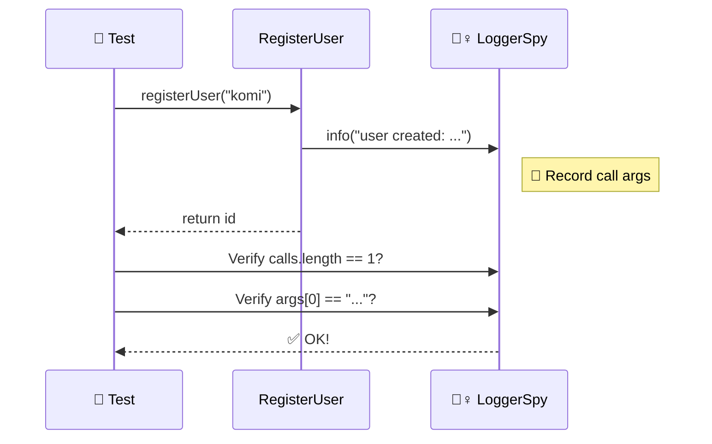
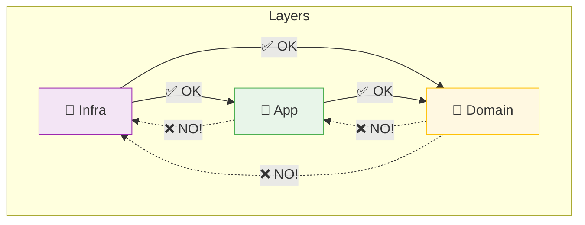

# 第21章：import地獄対策②：フォルダを3層で整理🗂️

## この章でできるようになること🎯

* 「どのファイルをどこに置くか」を迷わない🧭
* `../../../../` みたいな相対パス地獄を減らす🧹
* importの向きが自然に整って、差し替え（DI）がやりやすくなる💉🔄

---

## 1) まず“import地獄”って何がつらいの？😵‍💫📦


よくある症状はこれ👇

* 似たようなフォルダが増えて「どこに何があるの？」状態🙈
* 依存の向きがぐちゃぐちゃで、変更すると別の場所が壊れる💥
* 循環import（AがBを、BがAをimport…）で沼る🌀
* 相対パスが伸び続けて読みづらい＆移動に弱い🚚💦

ここで効くのが「3層フォルダ」整理術だよ〜！🧩💖

---

## 2) 3層フォルダの基本形🧁（domain / app / infra）


**最小で強い**定番がこれ👇

* **domain**：ルール（業務ロジック）中心🍱
* **app**：ユースケース（やりたいことの手順）🧭
* **infra**：外部I/O（DB/HTTP/Storage/Clockなど）🌐💾⏰

そして、組み立て（Composition Root）は **src/main.ts** みたいな「入口」に寄せるのが相性いいよ📍✨（第14章と連携！）



---

## 3) “何をどこに置く？”早見表🔍✨


## domain（いちばんピュア💎）

置くもの例👇

* Entity / ValueObject / ドメインサービス
* ルール（例：ポイント計算、割引、状態遷移）
* `interface`（契約）… **「こういう機能が必要」だけを書く**📜

置かないもの🚫

* `fetch` / DB / ファイル / localStorage / env 直読み
* ライブラリ都合の実装（SDK直叩き）

## app（段取り係👩‍🍳）

置くもの例👇

* ユースケース（例：`registerUser`, `addTodo`, `purchase`）
* domainを呼んで、必要ならinfraを“契約経由で”使う（DI前提）💉

置かないもの🚫

* 低レベルI/Oの詳細（SDKの設定、DBの具体）

## infra（外部とつなぐ係🔌）

置くもの例👇

* `HttpClient`の実装、`Storage`の実装、Repository実装
* 「domain/appが決めたinterface」を満たすクラス・関数

---

## 4) “importの向き”をフォルダで自然にする➡️✨

一番シンプルなルールはこれ👇

* **domain は誰も import しない（上流）**👑
* **app は domain を import してOK**🙂
* **infra は domain/app を import してOK（実装だから）**🔧
* **domain から infra は絶対 import しない**🚫

フォルダを切るだけで、これが守りやすくなるのが最高ポイントだよ〜！💖



---

## 5) 例：フォルダ構成テンプレ（コピペOK）📁✨

```txt
src/
  domain/
    todo/
      Todo.ts
      TodoId.ts
      TodoRepository.ts       # interface（契約）
  app/
    todo/
      addTodo.ts              # usecase
      listTodos.ts
  infra/
    todo/
      InMemoryTodoRepository.ts
      LocalStorageTodoRepository.ts
    clock/
      SystemClock.ts
  main.ts                     # 依存を組み立てる入口（Composition Root）
```

イメージとしては
**domain＝芯、app＝段取り、infra＝外部接続、main＝組み立て** 🧩✨

---

## 6) 移行手順（既存プロジェクトを3層へお引っ越し🚚）


いきなり全部やると疲れるので、順番が大事〜！🥺💦

## Step 1：ファイルにラベルを貼る🏷️

AIにこう聞くと速いよ🤖💨

* 「このファイルは domain/app/infra のどれ？理由もつけて」
* 「外部I/Oがある行だけ抜き出して」

## Step 2：まず“infraっぽいもの”を端に寄せる🔌

`fetch` / `localStorage` / `Date.now()` / `Math.random()` / SDK 直叩き
…こういうのは **先にinfraへ移動**しやすい！🧹✨

## Step 3：domainを“ピュア化”する💎

* 外部I/Oを消す（interfaceにする）
* ルールだけ残す

## Step 4：appに“段取り”を集める🧭

* 「何をどういう順で呼ぶか」だけ
* 条件分岐や手順はここに寄せやすい

## Step 5：main.ts に“組み立て”を集める📍

new や実装の選択は入口に寄せると、DIが気持ちいい💉✨

---

## 7) 相対パスを短くしたい！→ pathsエイリアス🎀


フォルダが整うと、次は import を読みやすくしたくなるよね😊

## 7-1) tsconfig の基本（baseUrl / paths）🛠️

`baseUrl` は「どこを基準にimport解決するか」を決められるよ📌 ([TypeScript][1])
`paths` はimportを別名で解決できる（でも **tscがimport文を書き換えるわけじゃない**点が超重要！） ([TypeScript][2])

```json
{
  "compilerOptions": {
    "baseUrl": ".",
    "paths": {
      "@domain/*": ["src/domain/*"],
      "@app/*": ["src/app/*"],
      "@infra/*": ["src/infra/*"]
    }
  }
}
```

✅ こう書けるようになる👇

```ts
import { addTodo } from "@app/todo/addTodo";
import type { TodoRepository } from "@domain/todo/TodoRepository";
```

⚠️ 注意：`paths` は TypeScript の解決を助けるだけで、実行時は別途対応が必要なことがあるよ（バンドラ/テスト設定など） ([TypeScript][2])

## 7-2) “モジュール解決”の今どき注意点（地雷回避💣）

TypeScriptの `moduleResolution` には `node16/nodenext/bundler` があって、用途が違うよ🧠 ([TypeScript][3])

* バンドラ前提なら `bundler` は「相対importで拡張子必須にならない」挙動が特徴✨ ([TypeScript][3])
* NodeのESM実行は相対importに拡張子が必須（これはNode仕様）📌 ([Node.js][4])

---

## 8) ルールを“人力”にしない！ESLintで柵を作る🧱✨

フォルダを整えても、誰かがうっかり壊すことがあるの😭
だから **ルールは機械に見張らせる**のが勝ち🏆

## 8-1) まずはESLint標準の no-restricted-imports 🧯

特定のimportを禁止できるルールだよ🚫 ([ESLint][5])
例：domainからinfraを読ませない、みたいな柵を作れる✨

## 8-2) もっと本格派：境界プラグイン（選択肢）🛡️

フォルダ境界をルール化するプラグインもあるよ（大きいPJほど効く）🧩

* eslint-plugin-boundaries（代表例） ([GitHub][6])

---

## 9) ミニ演習🎓✨（今日やると超伸びる）

## 演習A：仕分けゲーム🗂️

手元のプロジェクトから **10ファイル**選んで👇

* domain/app/infra のどれかに分類
* 「そう思う理由」を1行で書く✍️
  （AIに理由チェックしてもらうと学びが早い🤖💖）

## 演習B：1ユースケースだけ3層にする🍰

おすすめ：影響が小さい機能から

* `app/xxx/usecase.ts` を1つ作る
* 外部I/Oを `infra` に押し出す
* domainはルールだけにする

## 演習C：importを3本だけキレイにする🧼

* `../../` が長いところを3箇所だけ直す
* 直したら「ファイル移動しても壊れにくい？」を確認✅

---

## 10) よくある落とし穴🕳️⚠️

* domainに “便利だから” といって `fetch` を入れちゃう🌐🚫
* index.ts（まとめexport）を雑に作って循環import🌀
* appが太りすぎて「なんでも屋」になる🍱→🧟‍♀️
  → 迷ったら「ユースケース単位でフォルダ」がおすすめだよ📦✨

---

## 章末チェック✅🎀

* 「domain/app/infra それぞれ何を置く？」説明できる？🙂
* domainがinfraをimportしてない？🚫
* newや実装選択が入口（main）に寄ってる？📍
* 相対パス地獄が少しでも減った？🧹✨

---

次の章では、この構成を前提に「テストがラクになる感覚🧪💖」をガッツリ体験できるようにしていくね！

[1]: https://www.typescriptlang.org/tsconfig/baseUrl.html?utm_source=chatgpt.com "TSConfig Option: baseUrl"
[2]: https://www.typescriptlang.org/tsconfig/paths.html "TypeScript: TSConfig Option: paths"
[3]: https://www.typescriptlang.org/tsconfig/moduleResolution.html "TypeScript: TSConfig Option: moduleResolution"
[4]: https://nodejs.org/api/esm.html?utm_source=chatgpt.com "ECMAScript modules | Node.js v25.3.0 Documentation"
[5]: https://eslint.org/docs/latest/rules/no-restricted-imports?utm_source=chatgpt.com "no-restricted-imports - ESLint - Pluggable JavaScript Linter"
[6]: https://github.com/javierbrea/eslint-plugin-boundaries?utm_source=chatgpt.com "javierbrea/eslint-plugin-boundaries"
