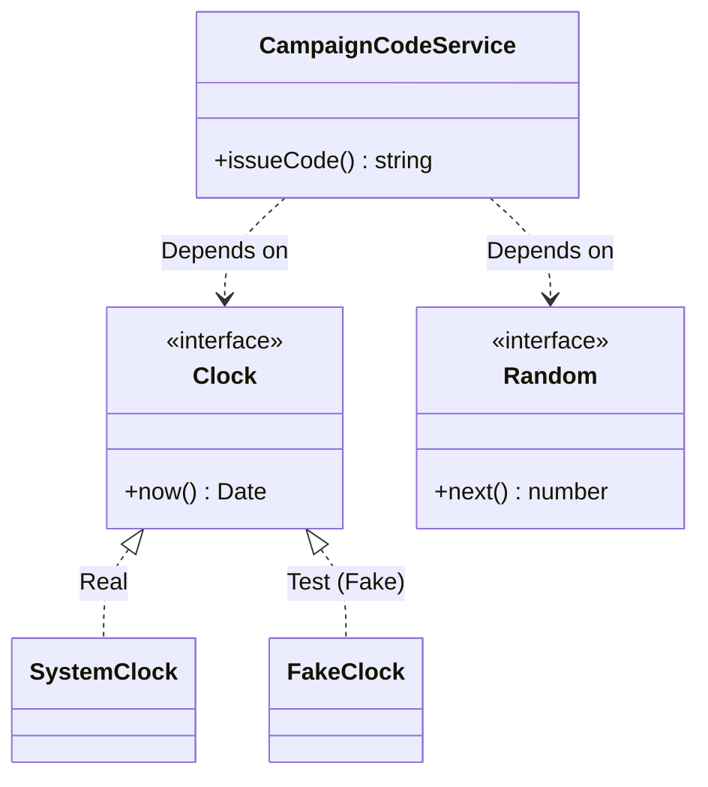

# 第22章：テスト①：Fakeで“安定テスト”を作る🧪💖

この章が終わるころには…🎀

* 「Fakeってなに？Mockとどう違うの？」が言える🙆‍♀️
* 時間（Date）や乱数（Math.random）に振り回されないテストが書ける⏰🎲
* DIの「テストが楽になる！」をちゃんと体感できる✨

---

## 1) まず結論：テストが不安定になる“2大原因”😵‍💫


### ✅ 原因A：時間

* `new Date()` / `Date.now()` がテストのたびに変わる⏰

### ✅ 原因B：乱数

* `Math.random()` が毎回違う🎲

こういう「毎回変わるもの」をそのまま使うと、テストが **たまに落ちる（フレイキー）** になりがち💥

---

## 2) Fakeってなに？（超やさしく）🧸✨


* **Fake**：本物っぽく動く “代用品” を自分で作るもの（簡易版の実装）🧩
* **Mock/Spy**：呼ばれた回数とか引数をチェックする“監視役”🕵️‍♀️
* **Stub**：戻り値だけ固定して返す“返事係”📦

第22章は **Fake** が主役だよ〜🧪💕

---

## 3) 今日のゴール：Clock と Random をDIできる形にする💉✨

ポイントはこれ👇

> 「変わりやすいもの（時間・乱数）」は、直接呼ばずに **外から渡す**！

---

## 4) 例題：キャンペーンコードを発行する🎫✨（時間＋乱数）

仕様はシンプルに👇

* コード形式：`YYYYMMDD-XXXX`
* `YYYYMMDD` は “今日”
* `XXXX` は乱数で作る 0000〜9999

---

## 5) 実装：本番コード（DIできる形）🧩

```ts
// src/deps.ts
export interface Clock {
  now(): Date
}

export class SystemClock implements Clock {
  now(): Date {
    return new Date()
  }
}

export interface Random {
  next(): number // 0 <= x < 1
}

export class SystemRandom implements Random {
  next(): number {
    return Math.random()
  }
}
```

```ts
// src/campaignCodeService.ts
import type { Clock, Random } from "./deps.js"

export type CampaignDeps = {
  clock: Clock
  random: Random
}

function pad4(n: number): string {
  return String(n).padStart(4, "0")
}

function formatYYYYMMDD(d: Date): string {
  // タイムゾーンで事故りやすいので、ここではUTCで固定しちゃうのが安全🙆‍♀️
  const y = d.getUTCFullYear()
  const m = String(d.getUTCMonth() + 1).padStart(2, "0")
  const day = String(d.getUTCDate()).padStart(2, "0")
  return `${y}${m}${day}`
}

export function makeCampaignCodeService(deps: CampaignDeps) {
  return {
    issueCode(): string {
      const today = deps.clock.now()
      const datePart = formatYYYYMMDD(today)

      const n = Math.floor(deps.random.next() * 10000) // 0..9999
      const randPart = pad4(n)

      return `${datePart}-${randPart}`
    },
  }
}
```

ここまでで、`new Date()` と `Math.random()` は **本番側（SystemClock/SystemRandom）に隔離**できたよ💮
サービス本体は “依存を外からもらう” だけ💉✨

---



## 6) テスト：Fakeを作って“固定”する🧪💖


2026年1月時点だと、Vitest 4系が普通に使いやすいよ〜（4.0系が出てて、Fake TimersやsetSystemTimeも揃ってる）🧰✨ ([vitest.dev][1])

### 6-1) FakeClock / FakeRandom を用意

```ts
// test/fakes.ts
import type { Clock, Random } from "../src/deps.js"

export class FakeClock implements Clock {
  constructor(private current: Date) {}
  now(): Date {
    return this.current
  }
  set(date: Date) {
    this.current = date
  }
}

export class FakeRandom implements Random {
  private i = 0
  constructor(private values: number[]) {}
  next(): number {
    const v = this.values[this.i] ?? this.values[this.values.length - 1] ?? 0
    this.i++
    return v
  }
}
```

### 6-2) テスト本体（安定テスト完成！）🎉

```ts
// test/campaignCodeService.test.ts
import { describe, it, expect } from "vitest"
import { makeCampaignCodeService } from "../src/campaignCodeService.js"
import { FakeClock, FakeRandom } from "./fakes.js"

describe("CampaignCodeService", () => {
  it("今日の日付と乱数から、決まった形式のコードを返す🎫", () => {
    const clock = new FakeClock(new Date("2026-01-17T00:00:00Z"))
    const random = new FakeRandom([0.1234]) // -> 1234

    const svc = makeCampaignCodeService({ clock, random })

    expect(svc.issueCode()).toBe("20260117-1234")
  })
})
```


```ts
describe("CampaignCodeService (Random)", () => {
  it("乱数の並びを与えると、出力もその通りに並ぶ🎲", () => {
    const clock = new FakeClock(new Date("2026-01-17T00:00:00Z"))
    const random = new FakeRandom([0.0, 0.0001, 0.9999]) // -> 0000, 0001, 9999

    const svc = makeCampaignCodeService({ clock, random })

    expect(svc.issueCode()).toBe("20260117-0000")
    expect(svc.issueCode()).toBe("20260117-0001")
    expect(svc.issueCode()).toBe("20260117-9999")
  })
})
```

✨これ、めっちゃ大事な感覚なんだけど…
テストが **「時間待ちゼロ」**、**「ランダム要素ゼロ」** になるから、爆速＆安定になるよ🧪💕

---

## 7) 「Fake Timers」はいつ使う？⏱️（おまけ）

Fake（Clock注入）で済むなら、それが一番安全〜💖
でも、どうしても `setTimeout` とか “タイマーそのもの” を扱うなら、Vitestの Fake Timers を使うこともあるよ🧰 ([vitest.dev][2])

```ts
import { vi, it, expect } from "vitest"

it("タイマーを進めて結果を確認する⏱️", () => {
  vi.useFakeTimers()
  const fn = vi.fn()

  setTimeout(fn, 1000)

  vi.advanceTimersByTime(1000)
  expect(fn).toHaveBeenCalledTimes(1)

  vi.useRealTimers()
})
```

でもね、**第22章の主役は Fake（依存を差し替える）**だよ🎀
Fake Timers は「どうにもならない時の必殺技」くらいの立ち位置がちょうどいい😊

---

## 8) よくある事故ポイント3つ⚠️😵‍💫

1. **タイムゾーン事故**🌍


* `new Date("2026-01-17")` とか、環境でズレることある
* テストは `...Z`（UTC）で固定しちゃうのが安心💡

2. **Fakeが“賢すぎて”本番と違う**🤖

* Fakeはあくまで簡易版
* 本番依存の挙動（例：DSTやlocale）をFakeで再現しようとしすぎない🙅‍♀️

3. **Dateを直接モックし始める（地獄入口）**🕳️

* まず Clock 注入で解決できないか考える！💉✨

---

## 9) ミニ課題（手を動かすやつ）📝💖

### 課題A：有効期限チェックを安定テストしよ⏰✅

* `isExpired(expiresAt: Date, clock: Clock): boolean` を作る
* FakeClockで「期限前」「期限後」をテストする

### 課題B：抽選（乱数）を安定テストしよ🎲✅

* `pickOne(items, random)` を作る
* FakeRandomで「必ずこの要素が選ばれる」テストを書く

---

## 10) AI活用（この章での使いどころ）🤖✨

* 「FakeClock/FakeRandomの雛形つくって」
* 「テストケースを“期限前/期限後/境界（ちょうど）”で網羅して」
* 「UTC固定にする理由を、初心者向けに例え話で説明して」

ただし、**テストの期待値（最終判断）は人間が握る**のが安全だよ🫶

---

## まとめ🎀🏁

* Fakeは「ちゃんと動く簡易実装」🧩
* DIで Clock/Random を外から渡せると、テストが **速い＆安定**🧪💖
* “時間・乱数”みたいな揺れる依存は、まずFakeで固定しよ⏰🎲
* どうしてもタイマーを触るなら、Vitestの Fake Timers も使えるよ⏱️ ([vitest.dev][2])

次の第23章は、Fakeとは別の方向で「呼ばれ方を確認する」Spyの世界に入るよ〜🕵️‍♀️📞💖

[1]: https://vitest.dev/blog/vitest-4?utm_source=chatgpt.com "Vitest 4.0 is out!"
[2]: https://vitest.dev/api/vi.html?utm_source=chatgpt.com "Vitest"
