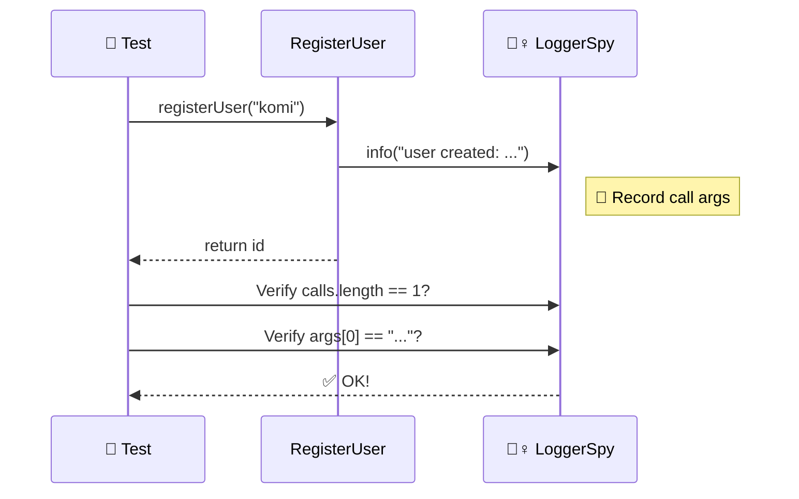

# 第23章：テスト②：Spyで“呼ばれ方”を確認する🕵️‍♀️📞

「結果（return値）だけじゃなくて、**“何が何回・どんな引数で呼ばれたか”**も確認したい…！」
そんな時に使うのが **Spy（スパイ）** だよ〜🕵️‍♀️💕

---

## この章のゴール🎯🌸

* ✅ 「Spyってなに？」を、友達に説明できる
* ✅ logger / api みたいな **外部とのやりとり**の呼ばれ方をテストできる
* ✅ Spyを使いすぎてテストが壊れやすくなるのを避けられる🚧

---

## 1) Spy（スパイ）ってなに？🕵️‍♀️
✨（ざっくり超イメージ）

Spyは「関数の呼び出しをのぞき見して、メモる子」だよ📒👀

* 何回呼ばれた？（回数）
* どんな引数で呼ばれた？（中身）
* どの順番で呼ばれた？（順序）

Jestのドキュメントでも、モック関数は “spies” として扱えるよ〜って説明されてるよ。([Jest][1])

---

## 2) Spy / Mock / Fake / Stub の違い（迷子防止🧭）

| 名前       | 役割イメージ                   | 例                           |
| -------- | ------------------------ | --------------------------- |
| **Fake** | それっぽく動く「代用品」             | InMemory DB、FakeClock⏰      |
| **Stub** | 決まった値だけ返す「置物」            | `getRate()` が常に `110` を返す💴 |
| **Spy**  | 呼ばれ方を記録する「監視員」           | loggerが何回呼ばれたか📞            |
| **Mock** | 期待する呼ばれ方を決めて検証する（Spy＋期待） | 「1回だけ呼べ！」みたいな🎯             |

この章は **Spy（監視して記録）** が主役だよ🕵️‍♀️💕

---

## 3) まずは “ライブラリ無し” でSpyを作って理解しよ🧠✨

「仕組みがわかる」と、Vitest/Jest使う時も怖くなくなる😊

## ✅ 自作Spy（最小）

```ts
export type SpyFn<Args extends any[] = any[], Ret = any> = ((...args: Args) => Ret) & {
  calls: Args[];
};

export function createSpy<Args extends any[] = any[], Ret = any>(
  impl?: (...args: Args) => Ret
): SpyFn<Args, Ret> {
  const fn = ((...args: Args) => {
    fn.calls.push(args);
    return impl?.(...args) as Ret;
  }) as SpyFn<Args, Ret>;

  fn.calls = [];
  return fn;
}
```

---

## 4) DIと相性バツグンな題材：loggerの呼ばれ方をテスト📣✨

## 実装（依存は外から渡す）💉

```ts
export type Logger = {
  info: (message: string) => void;
  warn: (message: string) => void;
};

export type UserRepo = {
  save: (name: string) => Promise<{ id: string }>;
};

export function makeRegisterUser(deps: { repo: UserRepo; logger: Logger }) {
  return async function registerUser(name: string) {
    const saved = await deps.repo.save(name);

    deps.logger.info(`user created: ${saved.id}`); // ←ここをSpyで見たい🕵️‍♀️

    return saved.id;
  };
}
```

## テスト（自作Spyで確認🕵️‍♀️）

```ts
import { createSpy } from "./spy";
import { makeRegisterUser } from "./registerUser";

test("logger.info が正しい文字列で1回呼ばれる", async () => {
  const repo = {
    save: async () => ({ id: "U-001" }),
  };

  const infoSpy = createSpy<[string], void>();
  const logger = {
    info: infoSpy,
    warn: createSpy<[string], void>(),
  };

  const registerUser = makeRegisterUser({ repo, logger });
  await registerUser("komi");

  expect(infoSpy.calls.length).toBe(1);
  expect(infoSpy.calls[0][0]).toBe("user created: U-001");
});
```

👉 これで「loggerが呼ばれたこと」を **結果じゃなく “やりとり”** として検証できたね📞✨



---

## 5) 実戦：VitestでSpy（いちばんよく見る形🧪⚡）

Vitestは `vi.fn` や `vi.spyOn` を用意してて、モック/スパイ周りのガイドもあるよ。([vitest.dev][2])

## 5-1) `vi.fn()`：Spyとして使う（超定番）🕵️‍♀️

```ts
import { describe, test, expect, vi } from "vitest";
import { makeRegisterUser } from "./registerUser";

describe("registerUser", () => {
  test("logger.info が正しく呼ばれる", async () => {
    const repo = { save: async () => ({ id: "U-001" }) };

    const logger = {
      info: vi.fn(),
      warn: vi.fn(),
    };

    const registerUser = makeRegisterUser({ repo, logger });
    await registerUser("komi");

    expect(logger.info).toHaveBeenCalledTimes(1);
    expect(logger.info).toHaveBeenCalledWith("user created: U-001");
  });
});
```

## 5-2) `vi.spyOn()`：既存メソッドを“のぞき見”する👀

「本物の実装はそのまま、呼ばれ方だけ見たい」時に便利だよ。([Zenn][3])

```ts
import { test, expect, vi } from "vitest";

test("spyOnでconsole.logの呼ばれ方を見る", () => {
  const spy = vi.spyOn(console, "log");

  console.log("hello");

  expect(spy).toHaveBeenCalledWith("hello");

  spy.mockRestore(); // 元に戻すの大事⚠️
});
```

## ✅ 片付け（超大事🧹）

Spyは「のぞき見状態」が残ると次のテストに悪影響💥
Vitestは **restore/clear/reset** 系を用意していて、spyOnしたものを元に戻す `vi.restoreAllMocks()` もあるよ。([vitest.dev][4])

---

## 6) Jestでも同じ考え方でOK🧪🟩

Jestも `jest.fn()` / `jest.spyOn()` が基本セットだよ。([Jest][5])

```ts
import { test, expect, jest } from "@jest/globals";
import { makeRegisterUser } from "./registerUser";

test("logger.info が呼ばれる（Jest）", async () => {
  const repo = { save: async () => ({ id: "U-001" }) };
  const logger = { info: jest.fn(), warn: jest.fn() };

  const registerUser = makeRegisterUser({ repo, logger });
  await registerUser("komi");

  expect(logger.info).toHaveBeenCalledWith("user created: U-001");
});
```

---

## 7) Node標準の `node:test` でもSpyできるよ🧪🟦

Nodeの `node:test` は `mock` で spy 的なことができる（公式ドキュメントに例があるよ）📚✨ ([Node.js][6])

---

## 8) Spyテストの「使いどころ」3ルール📏💗（壊れにくさ重視）

1. ✅ **外部境界**だけ見る（logger / http / db / storage など）🚪
2. ✅ まずは「結果」でテストできないか考える（結果で足りるならSpy不要）🍀
3. ✅ 期待が細かすぎると壊れやすい（ログ文言の完全一致地獄⚠️）

---

## 9) ミニ課題🧩✨（今日の手を動かすコーナー）

## 課題A：回数テスト📞

* logger.info が **1回だけ** 呼ばれることをテストしよう✅

## 課題B：引数テスト📝

* `"user created: <id>"` の `<id>` が正しいことを確認しよう✅

## 課題C：順序テスト（余裕あれば）🧠

* `repo.save()` のあとに `logger.info()` が呼ばれてる、を確認してみよう✨
  （順序は壊れやすいから“本当に必要な時だけ”でOK🥺）

---

## 10) AIに手伝ってもらうプロンプト例🤖💬

* 「この関数のテストで、Spyで確認すべき呼び出しはどこ？理由もつけて」
* 「Vitestで `toHaveBeenCalledWith` を使ったテストを書いて。壊れにくい期待にして」
* 「ログ文言を完全一致じゃなくて “重要部分だけ” 検証する案を3つ出して」

---

次の章（第24章）では、「どれをMock/Spyにして、どれをFakeにするのが健全か」っていう**境界のテスト方針🎯**に入っていくよ〜！🧪🌿

[1]: https://jestjs.io/docs/mock-function-api?utm_source=chatgpt.com "Mock Functions"
[2]: https://vitest.dev/guide/mocking?utm_source=chatgpt.com "Mocking | Guide"
[3]: https://zenn.dev/rh820/articles/25d26253d99bd9?utm_source=chatgpt.com "Vitest + TypeScriptでテストを書こう（スパイ＆モック編）"
[4]: https://vitest.dev/api/vi.html?utm_source=chatgpt.com "Vitest"
[5]: https://jestjs.io/docs/jest-object?utm_source=chatgpt.com "The Jest Object"
[6]: https://nodejs.org/api/test.html?utm_source=chatgpt.com "Test runner | Node.js v25.3.0 Documentation"
